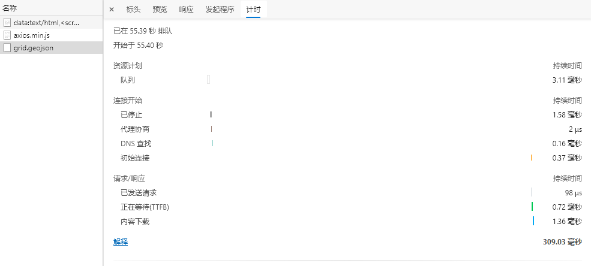

# 仅启用gzip on

默认启用 `gzip on;` ，什么参数都不添加：




很显然没有启用gzip：

``` 
HTTP/1.1 200 OK
Server: openresty/1.17.8.2
Date: Wed, 28 Oct 2020 07:14:19 GMT
Content-Type: application/octet-stream
Content-Length: 12153
Last-Modified: Wed, 28 Oct 2020 03:13:36 GMT
Connection: keep-alive
ETag: "5f98e1e0-2f79"
Access-Control-Allow-Origin: *
Access-Control-Allow-Credentials: true
Access-Control-Allow-Methods: GET,POST,OPTIONS
Accept-Ranges: bytes
```


# 添加gzip配置参数

``` yaml
gzip  on;

# gzip 阈值，超过1kb才压缩
gzip_min_length 16k; 

gzip_buffers 16 8k;

gzip_http_version 1.1;

gzip_comp_level 6;

# nginx 做前端代理时启用该选项，表示无论后端服务器的headers头返回什么信息，都无条件启用压缩
gzip_proxied any;

gzip_types 
text/html text/css application/json text/xml application/xml
text/plain image/jpeg image/png image/gif
application/octet-stream
;

gzip_static on; # 检查同名的gz文件是否存在
```

清除缓存后，然后再次请求（目录下已经有同名gz文件）：

``` 
HTTP/1.1 200 OK
Server: openresty/1.17.8.2
Date: Wed, 28 Oct 2020 07:20:23 GMT
Content-Type: application/octet-stream
Content-Length: 4282
Last-Modified: Wed, 28 Oct 2020 03:13:36 GMT
Connection: keep-alive
ETag: "5f98e1e0-10ba"
Content-Encoding: gzip
Access-Control-Allow-Origin: *
Access-Control-Allow-Credentials: true
Access-Control-Allow-Methods: GET,POST,OPTIONS
```


文件体积大幅度下降！