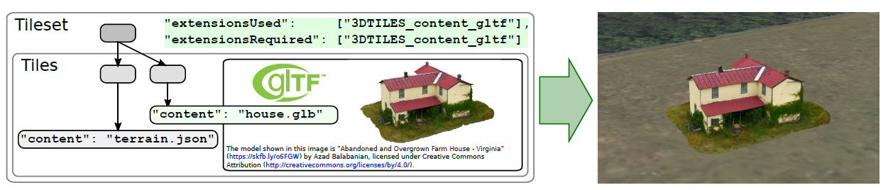

3DTILES_content_gltf

---

# 依赖于

3D Tiles 1.0


# 可选与必需

如果用到了 glTF 作为瓦片内容文件，那么它必须同时出现在 `extensionsUsed` 和 `extensionsRequired` 数组中，即“必需的”。


# 1. 简介



上图中有一个瓦片引用了 `house.glb`，而这个 `house.glb` 的模型就是一个房子，可以直接被 3D Tiles 的瓦片引用。此处 `"content": "house.glb"` 是简略写法。

这个扩展允许 3D Tiles 在瓦片文件上直接使用 glTF 2.0 模型文件。同时支持 JSON 格式的 gltf 文件和二进制的 glb 文件。

使用这个扩展可以简化数据的生产，主要就是利用好 glTF 的工具链。大多数时候，1.0 的瓦片数据可以轻易地转为 glTF 格式。

参考 [迁移指南](./0X-conversion-for-1.0-tile-formats.md)。


# 2. 示例 JSON

具体的 JSON 模式定义在文末。

运行时引擎（通常是 CesiumJS）必须在加载瓦片内容之前，确定兼容性问题。

比如，某些 glTF 模型文件用到了一些 glTF 扩展，那么这些额外的 glTF 扩展就必须写在 Tileset 的顶级属性 `extensions` 中的 `3DTILES_content_gltf` 对象中。

举例：

``` json
{
  "asset": {
    "version": "1.0"
  },
  "extensionsUsed": ["3DTILES_content_gltf"],
  "extensionsRequired": ["3DTILES_content_gltf"],
  "extensions": {
    "3DTILES_content_gltf": {
      "extensionsUsed": ["EXT_mesh_gpu_instancing"],
      "extensionsRequired": ["EXT_mesh_gpu_instancing"]
    }
  },
  "geometricError": 240,
  "root": {
    "boundingVolume": {
      "region": [
        -1.3197209591796106,
        0.6988424218,
        -1.3196390408203893,
        0.6989055782,
        0,
        88
      ]
    },
    "geometricError": 0,
    "refine": "ADD",
    "content": {
      "uri": "trees.gltf"
    }
  }
}
```

可以看到，这份入口文件的 `extensions` 属性，下有一个 `3DTILES_content_gltf` 对象，其下又有两个与 Tileset 类似的 `extensionsUsed` 和 `extensionsRequired` 数组。

含义是类似的，`extensionsUsed` 数组表示 glTF 用到了哪些扩展，`extensionsRequired` 数组表示必需有这些扩展才可以正常使用。

上面这份数据就表示，root 瓦片的内容文件 `trees.gltf` 模型，用到了 glTF 规范中的 `EXT_mesh_gpu_instancing` 扩展，而且必需要用到这个扩展。


# 附 3DTILES_content_gltf 模式定义

``` json
{
  "$schema": "https://json-schema.org/draft/2020-12/schema",
  "$id": "tileset.3DTILES_content_gltf.schema.json",
  "title": "3DTILES_content_gltf extension",
  "type": "object",
  "description": "3D Tiles extension that allows a tileset to use glTF models directly as tile content.",
  "allOf": [
    {
      "$ref": "tilesetProperty.schema.json"
    }
  ],
  "properties": {
    "extensionsUsed": {
      "type": "array",
      "description": "An array of glTF extensions used by glTF content in the tileset.",
      "items": {
        "type": "string"
      },
      "minItems": 1
    },
    "extensionsRequired": {
      "type": "array",
      "description": "An array of glTF extensions required by glTF content in the tileset.",
      "items": {
        "type": "string"
      },
      "minItems": 1
    },
    "extensions": {},
    "extras": {}
  }
}
```

