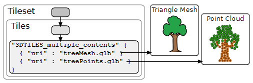
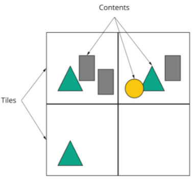
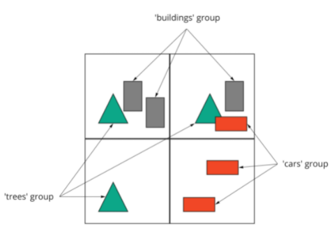
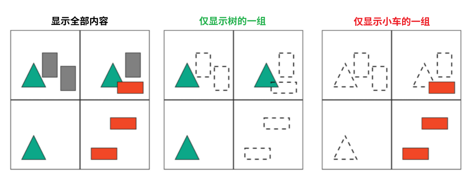

3DTILES_multiple_content

---

# 依赖于

3D Tiles 1.0；

本说明文档还用到了隐式瓦片分割扩展和元数据扩展，详见 [3DTILES_implicit_tiling](./03-3DTILES_implicit_tiling.md)、[3DTILES_metadata](./3DTILES_metadata.md)


# 可选与必需

如果在瓦片中引用了多个数据文件作为内容，那么这项扩展必须同时出现在 `extensionsUsed` 和 `extensionsRequired` 数组中，即“必需的”。


# 1. 概述



这项扩展对单个瓦片提供了引用多个数据文件的支持。这多个数据文件，可以是 b3dm、pnts 或者 1.0 中瓦片格式中的任意类型。



上图表示瓦片与内容（数据文件）的关系。

多数据文件（即多内容）让 Tileset 的结构更加灵活。例如，某个瓦片可以引用 b3dm 和 pnts 两种瓦片，都表示同一个建筑物的表面，而运行时则可以选择性地只加载点云的数据。

当此扩展与 3DTILES_metadata 扩展一起使用时，可以把内容（数据文件）打组，每个组可以共享同一份自己的元数据，如下图所示：



上图有三组，红色组分布在左边两个瓦片，代表小车；绿色分布在上面和左下三个瓦片中，代表树木；灰色以此类推。



分组的好处见上图：过滤不想显示的内容，减少带宽使用。

多内容扩展可以与 3DTILES_implicit_tiling 一起使用，是兼容的。见下文。


# 2. 概念

3DTILES_multiple_contents 扩展作用于 Tile 对象。模式定义见文末。

举例：

```json
{
  "root": {
    "refine": "ADD",
    "geometricError": 0.0,
    "boundingVolume": {
      "region": [-1.707, 0.543, -1.706, 0.544, 203.895, 253.113]
    },
    "extensions": {
      "3DTILES_multiple_contents": {
        "content": [
          {
            "uri": "buildings.b3dm"
          },
          {
            "uri": "trees.i3dm"
          }
        ]
      }
    }
  }
}
```

在 root 瓦片的 extensions 属性内，记录了一个 `3DTILES_multiple_content` 对象，这个对象就记录了两个 `content`（作为数组）。可以看到这里的多个数据文件组合了 b3dm 和 i3dm，意味这块瓦片的区域内，有建筑模型，也有树木模型。

注意，若启用此扩展，Tile 对象的 `tile` 属性将不再使用。

而且，`content` 数组中任意一个 content，将不能指向外部 Tileset。


## 2.1. 元数据组

本扩展项可以与 3DTILES_metadata 组合使用，将具体的元数据绑定至对应的瓦片数据文件上。

``` json
{
  "extensions": {
    "3DTILES_metadata": {
      "schema": {
        "classes": {
          "layer": {
            "properties": {
              "color": {
                "type": "ARRAY",
                "componentType": "UINT8",
                "componentCount": 3
              },
              "order": {
                "componentType": "INT32"
              }
            }
          }
        }
      },
      "groups": {
        "buildings": {
          "class": "layer",
          "properties": {
            "color": [128, 128, 128],
            "order": 0
          }
        },
        "trees": {
          "class": "layer",
          "properties": {
            "color": [10, 240, 30],
            "order": 1
          }
        }
      }
    }
  },
  "root": {
    "refine": "ADD",
    "geometricError": 32768.0,
    "boundingVolume": {
      "region": [-1.707, 0.543, -1.706, 0.544, -10.3, 253.113]
    },
    "extensions": {
      "3DTILES_multiple_contents": {
        "content": [
          {
            "uri": "buildings.b3dm",
            "extensions": {
              "3DTILES_metadata": {
                "group": "buildings"
              }
            }
          },
          {
            "uri": "trees.i3dm",
            "extensions": {
              "3DTILES_metadata": {
                "group": "trees"
              }
            }
          }
        ]
      }
    }
  }
}
```

观察得知，root 瓦片使用了 3DTILES_multiple_contents 扩展，故这里有两个 content，一个指向 `buildings.b3dm` 文件，一个指向 `trees.i3dm` 文件。

对于 `buildings.b3dm` 这个 content，使用 3DTILES_metadata 扩展，绑定“buildings”元数据组；

对于 `trees.i3dm` 这个 content，使用 3DTILES_metadata 扩展，绑定“trees”元数据组。

往上看 tileset 中的 extensions.3DTILES_metadata 对象，在 `schema` 中定义了一个 class，`layer`，每个 `layer` 元数据包括 color、order 两个属性。

而在 `group` 中，就刚好对应上面两个 content 所用到的元数据组，“building”元数据组和“trees”元数据组。


## 2.2. 瓦片隐式分割

本扩展项可以与 3DTILES_implicit_tiling 扩展组合使用，为 tileset.extensions.3DTILES_multiple_content.content 这个数组下的每一个 content 提供 `contentAvailability` 属性以判断瓦片内容的可用性。

注意，这两个属性搭配使用时，顶层的 contentAvailability 需要忽略。

```json
{
  "root": {
    "refine": "ADD",
    "geometricError": 16384.0,
    "boundingVolume": {
      "region": [-1.707, 0.543, -1.706, 0.544, 203.895, 253.113]
    },
    "extensions": {
      "3DTILES_multiple_contents": {
        "content": [
          {
            "uri": "buildings/{level}/{x}/{y}.b3dm",
          },
          {
            "uri": "trees/{level}/{x}/{y}.i3dm",
          }
        ]    
      },
      "3DTILES_implicit_tiling": {
        "subdivisionScheme": "QUADTREE",
        "subtreeLevels": 10,
        "maximumLevel": 16,
        "subtrees": {
          "uri": "subtrees/{level}/{x}/{y}.subtree"
        }
      }
    }
  }
}
```

如上图所示，3DTILES_implicit_tiling 与 3DTILES_multiple_contents 组合使用。

3DTILES_multiple_contents 中 content 的 uri 是模板，而 3DTILES_implicit_tiling 指定瓦片的空间分割结构是 QUADTREE（四叉树），对应瓦片的 subtree 文件的 uri 模板写在 subtrees.uri 属性。

取一份 subtree 文件的 JSON 如下所示：

```json
{
  "buffers": [
    {
      "byteLength": 262160
    }
  ],
  "bufferViews": [
    {
      "buffer": 0,
      "byteLength": 43691,
      "byteOffset": 0
    },
    {
      "buffer": 0,
      "byteLength": 131072,
      "byteOffset": 43696
    },
    {
      "buffer": 0,
      "byteLength": 43691,
      "byteOffset": 174768
    },
    {
      "buffer": 0,
      "byteLength": 43691,
      "byteOffset": 218464
    }
  ],
  "tileAvailability": {
    "bufferView": 0
  },
  "childSubtreeAvailability": {
    "bufferView": 1
  },
  "extensions": {
    "3DTILES_multiple_contents": {
      "contentAvailability": [
        {
          "bufferView": 2
        },
        {
          "bufferView": 3
        }
      ]
    }
  }
}
```

在其 extensions.3DTILES_multiple_contents 对象中，`contentAvailability` 数组就记录了对应 content 的可用性信息（存储在 bufferView 对应的 buffer，详见 subtree 文件的规定与隐式瓦片分割的相关扩展项）。


## 2.3. 在隐式分割的瓦片中的元数据组

如果同时使用 3DTILES_implicit_tiling 和 3DTILES_metadata 扩展，那么可以向模板 URI 给到一个元数据组。

``` json
{
  "extensions": {
    "3DTILES_metadata": {
      "schema": {
        "classes": {
          "layer": {
            "properties": {
              "color": {
                "type": "ARRAY",
                "componentType": "UINT8",
                "componentCount": 3
              },
              "order": {
                "componentType": "INT32"
              }
            }
          }
        }
      },
      "groups": {
        "buildings": {
          "class": "layer",
          "properties": {
            "color": [128, 128, 128],
            "order": 0
          }
        },
        "trees": {
          "class": "layer",
          "properties": {
            "color": [10, 240, 30],
            "order": 1
          }
        }
      }
    }
  },
  "root": {
    "refine": "ADD",
    "geometricError": 16384.0,
    "boundingVolume": {
      "region": [-1.707, 0.543, -1.706, 0.544, 203.895, 253.113]
    },
    "extensions": {
      "3DTILES_multiple_contents": {
        "content": [
          {
            "uri": "buildings/{level}/{x}/{y}.b3dm",
            "extensions": {
              "3DTILES_metadata": {
                "group": "buildings"
              }
            }
          },
          {
            "uri": "trees/{level}/{x}/{y}.i3dm",
            "extensions": {
              "3DTILES_metadata": {
                "group": "trees"
              }
            }
          }
        ]    
      },
      "3DTILES_implicit_tiling": {
        "subdivisionScheme": "QUADTREE",
        "subtreeLevels": 10,
        "maximumLevel": 16,
        "subtrees": {
          "uri": "subtrees/{level}/{x}/{y}.subtree"
        }
      }
    }
  }
}
```

本例将 2.1 和 2.2 组合在一起：

- 3DTILES_implicit_tiling 负责组织瓦片空间结构
- 3DTILES_multiple_content 则负责在瓦片的空间范围内组织三维数据
- 3DTILES_metadata 则负责在瓦片组级别组织元数据


# 附 模式定义

## 3DTILES_multiple_content 模式定义

``` json
{
  "$schema": "https://json-schema.org/draft/2020-12/schema",
  "$id": "tile.3DTILES_multiple_contents.schema.json",
  "title": "3DTILES_multiple_contents tile extension",
  "type": "object",
  "description": "Extends a tile to have multiple contents. When this extension is used the tile's `content` property must be omitted.",
  "allOf": [
    {
      "$ref": "tilesetProperty.schema.json"
    }
  ],
  "properties": {
    "content": {
      "type": "array",
      "description": "An array of contents.",
      "items": {
        "$ref": "content.schema.json"
      },
      "minItems": 1
    },
    "extensions": {},
    "extras": {}
  },
  "required": [
    "content"
  ]
}
```


## subtree 文件中的 3DTILES_multiple_content 模式定义

``` json
{
  "$schema": "https://json-schema.org/draft/2020-12/schema",
  "$id": "subtree.3DTILES_multiple_contents.schema.json",
  "title": "3DTILES_multiple_contents extension for 3DTILES_implicit_tiling subtree",
  "type": "object",
  "description": "Content availability for the `3DTILES_multiple_contents` extension.",
  "allOf": [
    {
      "$ref": "tilesetProperty.schema.json"
    }
  ],
  "properties": {
    "contentAvailability": {
      "type": "array",
      "description": "An array of content availability objects with a one-to-one mapping to the `content` array in the tile's `3DTILES_multiple_contents` extension object.",
      "items": {
        "$ref": "availability.schema.json"
      },
      "minItems": 1
    },
    "extensions": {},
    "extras": {}
  },
  "required": [
    "contentAvailability"
  ]
}
```

