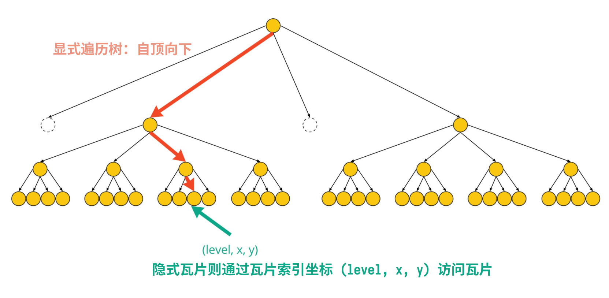
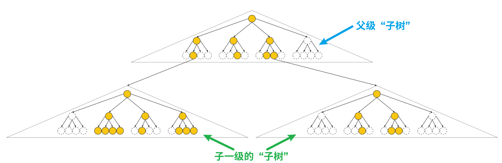
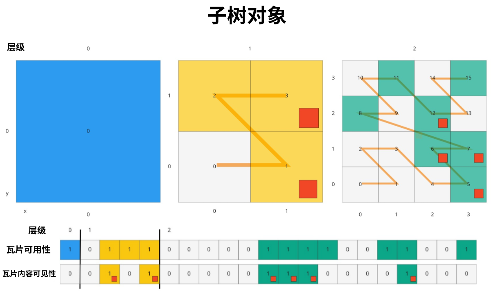
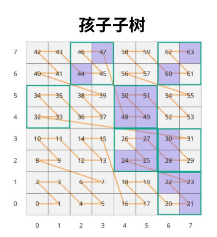
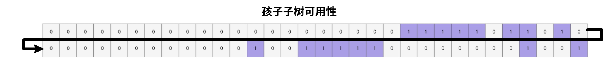

3DTILES_implicit_tiling

---

[TOC]

---

# 依赖于

3D Tiles 1.0


# 可选与必需

如果瓦片在空间索引规则上用到了隐式分割，那么这项扩展必须同时出现在 `extensionsUsed` 和 `extensionsRequired` 数组中，即“必需的”。

# 1. 概述

Implicit tiling，译作 **隐式瓦片分割**，是一种 3D Tileset 的新的空间分割方式，它允许运行时快速、随机访问瓦片，而且使用了新的遍历算法。

隐式瓦片分割的空间数据结构一律使用四叉树或者八叉树。这两种常见的结构让瓦片的组织更紧凑，也能让 tileset.json 文件更小。

扩展项 `3DTILES_implicit_tiling` 可以作用于任意一个 Tile，它定义的信息主要是瓦片的空间分割情况以及对应的文件资源信息。

有一些数据，并不是所有瓦片都能满填充的，这种叫 **稀疏数据集**，需要一个叫 `availability（可用性）` 数据来确定哪些瓦片存在，哪些不存在。这个可用性数据被存储在固定格式的、紧凑的二进制文件中，后缀名是 `.subtree`。

隐式瓦片分割允许通过瓦片的索引坐标直接访问瓦片。当树结构使用的是 quadtrees（四叉树）时，瓦片坐标有三个：level、x、y，而 octrees（八叉树）则是 level、x、y、z，有了瓦片的索引坐标，就可以省去遍历整个瓦片数据集的过程。




> 关于上述出现的名词，解释会放到文末。


# 2. Tile 对象中的扩展项写法

本扩展项作用于 tileset.json 中任意一个 Tile 对象。被作用的瓦片被称为“隐式分割根瓦片”，此瓦片必须忽略 `children` 属性。

下面是一个例子：

``` json
{
  "asset": {
    "version": "1.0"
  },
  "geometricError": 10000,
  "extensionsUsed": [
    "3DTILES_implicit_tiling"
  ],
  "extensionsRequired": [
    "3DTILES_implicit_tiling"
  ],
  "root": {
    "boundingVolume": {
      "region": [-1.318, 0.697, -1.319, 0.698, 0, 20]
    },
    "refine": "REPLACE",
    "geometricError": 5000,
    "content": {
      "uri": "content/{level}/{x}/{y}.b3dm"
    },
    "extensions": {
      "3DTILES_implicit_tiling": {
        "subdivisionScheme": "QUADTREE",
        "maximumLevel": 20,
        "subtrees": {
          "uri": "subtrees/{level}/{x}/{y}.subtree"
        },
        "subtreeLevels": 7
      }
    }
  }
}
```

理论上来说，有隐式分割扩展的瓦片对象不需要，也没必要存在 `boundingVolume`（空间范围长方体）属性，是因为隐式瓦片的分割规则已经可以通过瓦片索引坐标计算出这个属性。这里的 root 瓦片之所以存在这个属性是因为 [3DTILES_metadata](./04-3DTILES_metadata.md) 扩展某些元数据定义需要用到这个属性，例如 [CONTENT_BOUNDING_BOX]() 之类的。

另外，隐式分割瓦片的 `content.uri` 属性不可以引用 [External Tileset]()（扩展瓦片集）。

Tile.extension.3DTILES_implicit_tiling 对象，其属性规定如下：

| 属性                | 描述                                                         |
| ------------------- | ------------------------------------------------------------ |
| `subdivisionScheme` | 只能是 `QUADTREE` 或 `OCTREE`，参考 [3. 空间分割方式](#3. 空间分割方式) |
| `maximumLevel`      | 叶子瓦片的级别                                               |
| `subtrees`          | 记录 `.subtree` 文件的模板 URI，参考 [5. 子树](#5. 子树)     |
| `subtreeLevels`     | 每个 subtree 有多少层                                        |

模板 URI 用来指向瓦片文件，例如上面例子中的 `"uri": "content/{level}/{x}/{y}.b3dm"`


# 3. 空间分割方式

空间分割方式，是一种对空间的递归分割方式，它将某个空间范围长方体分割成等体积的若干个子空间。

具体来说，可以根据维度来均匀分割，例如对 x 和 y 轴的维度进行分割，那么就能分出 4 块子空间，这种分割叫四叉树分割；同理，对 x、y、z 三轴分割空间，得到 8 个子空间，则叫做八叉树分割。

对分割出来的子空间依旧遵循上一级的分割方式，继续分割。

对于 `region` 型的空间范围长方体，其 x、y、z 维度分别代表经度方向、纬度方向、高度方向。

**四叉树（quadtree）分割**只分割 x 和 y 维度，每个方向取原空间范围的一半长作为子空间的大小。四叉树分割中的 z 维度是不变的，如下图所示（平面示意）：


**八叉树（octree）分割** 则分割三个维度，与四叉树类似，每个维度取原空间范围的一半长度作为子空间的大小，一块空间被分割后有 8 个大小一致，但是三个维度大小均为原空间一半的子空间：


下面图例详细说明了 3D Tiles 中受支持的几种空间范围长方体的分割方式：

- `box` 类型

| 原 box                                                       | 四叉树分割后                                                 | 八叉树分割后                                                 |
| ------------------------------------------------------------ | ------------------------------------------------------------ | ------------------------------------------------------------ |
|  |  |  |

- `region` 类型

| 原 region                                                    | 四叉树分割后                                                 | 八叉树分割后                                                 |
| ------------------------------------------------------------ | ------------------------------------------------------------ | ------------------------------------------------------------ |
|  |  |  |

`sphere` 类型不支持，因为它不能做递归四叉树或者八叉树分割。


## 分割规则

使用隐式分割扩展的瓦片，只需在根瓦片定义其 `subdivisionScheme`（分割方式）、`refine`（细化策略）、`boundingVolume`（空间范围长方体）、`geometricError`（几何误差）即可，子瓦片均可根据瓦片的索引坐标计算得到自己的这些值，遵循如下计算规则：

| 属性                | 规则                                                         |
| ------------------- | ------------------------------------------------------------ |
| `subdivisionScheme` | 与根瓦片一致                                                 |
| `refine`            | 与根瓦片一致                                                 |
| `boundingVolume`    | 如果 `subdivisionScheme` 是 `QUADTREE`，那么父瓦片对应的空间范围长方体在 x、 y 方向上一分为四即子瓦片此属性的值；是 `QUADTREE` 则一分为八 |
| `geometricError`    | 每个子瓦片的这个值是父瓦片的值的一半                         |

至于 `boundingVolume` 和 `geometricError` 的计算是可以忽略的，因为 [3DTILES_metadata](./04-3DTILES_metadata.md) 扩展中有一种将元数据与隐式瓦片关联在一起的预设，即 [TILE_BOUNDING_BOX]() 和 [TILE_GEOMETRIC_ERROR]()，会直接作为隐式瓦片的 boundingVolume 和 geometricError。


## 代码实现注意事项

为了在分割空间的过程中保持浮点数值的稳定性，不应该算完子瓦片后再算孙子瓦片这样“子依赖父”地计算，而是应该根据具体等级瓦片等级的次幂，直接用根瓦片的对应值除以该次幂得到结果。

不妨举例：

令根瓦片的空间范围体某一个维度（譬如 x 轴），值域落在 [$min$, $max$]；

对于某等级为 $level$ 的瓦片，其在这个维度上应该被分成 $2^{level}$ 段；

显然，这个等级的瓦片在该维度上的长度 $size = (max - min) / 2^{level}$；

而在这个级别上的某个子瓦片的空间范围体，在这个维度上的最大最小值，可直接得到：
$$
(min + size × i, min + size × (i + 1))
$$
其中，i是该子瓦片的索引（第几个, $0 < i < level$，i 是正整数）。


# 4. 瓦片的索引坐标（Tile Coordinates）

瓦片的索引坐标是用来唯一标识瓦片的一个整数元组，四叉树分割的隐式瓦片使用 `(level, x, y)`，八叉树则用 `(level, x, y, z)`，所有的瓦片索引坐标均从 0 开始。

`level` 是 0 时代表隐式根瓦片，1 则是第 1 级子瓦片，以此类推；

`x`、`y` 和 `z` 索引坐标则精准定位了该级别的瓦片。

## 4.1. 对于 box 类型的空间范围

| 坐标 | 正方向                  |
| ---- | ----------------------- |
| x    | 空间范围体的 x 轴正方向 |
| y    | 空间范围体的 y 轴正方向 |
| z    | 空间范围体的 z 轴正方向 |

如下图所示：


（右手坐标系）

如上图所示，`(0,0,0,0)` 表示根瓦片，`(2,2,0,0)` 代表分割等级为 2 时，x轴第 2、y轴第 0、z 轴第 0 个子瓦片。


## 4.2. 对于 region 类型的空间范围

| 坐标 | 正方向                       |
| ---- | ---------------------------- |
| x    | 自东向西方向（经度增长方向） |
| y    | 自南向北方向（纬度增长方向） |
| z    | 自下向上方向（高度增长方向） |

如下图所示：


红框即根瓦片，索引坐标是 `(0,0,0,0)`，其他同上类似。


# 5. 模板 URI

模板 URI 是一种使用瓦片的索引坐标来定位具体瓦片文件的字符串模板。四叉树分割的模板必须包括 `{level}`、`{x}` 和 `{y}`，八叉树分割的模板 URI 还要额外再加上 `{z}`；当具体到某个瓦片的时候，瓦片的索引坐标就将上述变量替换为具体值。

举例说明：

## 5.1. 对于四叉树

模板 URI：`"content/{level}/{x}/{y}.pnts"`

有效的文件名：

```
content/0/0/0.pnts
content/1/1/0.pnts
content/3/2/2.pnts
```

## 5.2. 对于八叉树

模板 URI：`"content/{level}/{x}/{y}/{z}.b3dm"`

有效的文件名：

```
content/0/0/0/0.b3dm
content/1/1/1/1.b3dm
content/3/2/1/0.b3dm
```

---

除非特别说明，否则这些路径是相对于 `tileset.json` 文件的。


# 6. 子树（Subtree）

在概述中已经提到“稀疏数据集”的概念，需要增加额外的数据来表示瓦片的存在与否，这种数据叫做“可用性（availability）”。

官方专门设计了一种 **子树（Subtree）**对象来存储这些可用性信息。

数据集分割成子树后，每个子树的“可用性信息”大小是固定的，来优化网络传输。`subtreeLevels` 属性定义了这个子树有多深，而 `subdivisionSchema` 则定义了该子树上某个瓦片应分割成多少个子空间作子瓦片，四叉树为4，八叉树为8。

如下图所示：


上图是一个“子树”，注意到在第 1 级上，第 0（第一）和第 3（最后）个瓦片是不存在的，而且即使是第 1、2个瓦片的子瓦片（也即第 2 级）上也不是全满的，符合稀疏数据集的特征。

接下来再举一个例子，在父级子树的第 2 级上再向下扩展“孩子子树”，即还要子一级的子树。

> 译者注
>
> 子树是一个便于管理的聚合单位，而不是指瓦片数据集的分割方式是“树结构”。清楚这一定义后，下面这个图能再加深理解。



> 译者注2
>
> 通过子树来小范围地收拢一块空间的瓦片，即合理定义 subtreeLevels 的大小后，确实能很好地组织稀疏数据集，只要高层级“子树”把“不可用的瓦片”，即那块子空间中不存在数据的瓦片标记出来，往下分“子一级的子树”时就直接省去那块空间了。


## 6.1. 可用性（Availability）

每个子树包含了瓦片的可用性（Tile Availability）、瓦片内容的可见性（Content Availability）和孩子子树的可用性（Child Subtree Availability）。

- 瓦片可用性，记录该子树中哪些瓦片是存在的
- 瓦片内容可用性，记录该子树中哪些瓦片有引用数据内容文件（注意：空瓦片不存在数据内容文件）
- 孩子子树可用性，记录该子树如何再向下索引孩子一级的子树对象

官方使用了一种新的二进制编码方式来记录上述三种可用性信息。使用这么一个一维数组，每个数组元素的数值是二进制值，代表瓦片的可用性数据，其中数值 `1` 代表可用，`0` 代表不可用。为了节约空间，如果这个数组的所有元素是一样的，那么可以简略地用一个二进制数字代替。

约定瓦片的索引顺序使用如下规则：

- 在子树的每一层，使用莫顿Z序编码（[Morton z order]()）来对瓦片的顺序进行排列
- 所有层级的一维数组首尾相连，形成一段二进制数据

如下图，一个四叉树分割的三层子树：


这个图中，彩色的格子（蓝、黄、绿）代表二进制的 1，即该瓦片可用；白灰色代表二进制的 0，即该瓦片不可用。

使用莫顿Z序编码来编码瓦片的顺序有如下优点：

- 创建索引快 - 瓦片的莫顿索引码是由交错二进制位在固定时间内计算完成的
- 遍历速度快 - 使用二进制位运算即可完成子瓦片或者父瓦片的索引取值
- 位置上有参考 - 编码彼此相邻的瓦片在空间中也是相邻的
- 便于压缩

有关使用莫顿Z序索引和可用性信息二进制编码的细则，参考 [附录A 可用性的索引](#附录A 可用性的索引)

> 译者注
>
> 四叉树的“四”和八叉树的“八”，刚好对应二进制值 0100 和 1000，不得不说设计的很巧、很妙。


## 6.2. 瓦片可用性（Tile Availability）

瓦片可用性数据用来确定子树中存在哪些瓦片，遵守如下规则：

- 父受子掣，即子瓦片若可用（即子瓦片是存在的，可用性数值是1），那么父瓦片必可用（即父瓦片也必须存在，可用性数值是1）；
- 子树必须有一个可用的瓦片（一个都没有那这个子树则删除）


## 6.3. 瓦片内容可用性（Content Availability）

瓦片内容可用性数据，用来指示瓦片是否有数据内容文件（即是不是非空瓦片）。`content.uri` 属性使用 [模板 URI](#5. 模板 URI) 来定位具体瓦片文件。

瓦片内容可用性数据遵守如下规则：

- 瓦片内容可用性数值若为 1，那么瓦片可用性数据数值也必为 1。否则就会出现没被挂接在瓦片上的瓦片数据文件了。
- 瓦片内容可用性数值若为 0，而且所在瓦片的瓦片可用性数据数值为 1，那么称这个瓦片为空瓦片；
- 当前子树对象有一个或以上的非空瓦片时，就需要瓦片内容可用性数据；否则，子树对象中若不存在任何非空瓦片的话，也就是只存在空瓦片，那就不需要瓦片内容可用性数据。


上图中 **Tile Availability** 是“瓦片可用性”，**Content Availability** 即“瓦片内容可用性”。在右下角有红色小方块的瓦片，是“非空瓦片”，其瓦片内容可用性的数值为 1。


## 6.4. 孩子子树可用性（Child Subtree Availability）

孩子子树可用性数据指示了当前子树对象的最深层瓦片是否存在下一级子树的信息。这样，上层子树对象与这些“孩子子树”连在一起，以形成完整的 Tileset（瓦片数据集）。

与瓦片可用性数据、瓦片内容可用性数据不一样，这俩存储了每一层级的每个瓦片的可用性数据，**孩子子树可用性** 数据只存储一层节点（也即瓦片）的可用性数据。这些节点比当前子树对象的最深层还要再向下一层，代表着当前子树相邻子树的根节点。这样有助于在即将发起网络请求之前，确定哪些子树是“可用的”，不可用就不请求。

这么说有点抽象，看下图：



这是一个三层深度的子树对象，包括其瓦片可用性、瓦片内容可用性信息。从上图可知，在第 2 层级上，有 16 个瓦片，其中 5、6、7、8、11、12、15 这几个是可用的，5、6、7、12 则是有对应的瓦片数据文件的（b3dm等），所以 8、11、15 这三个瓦片是空瓦片（瓦片可用，但是瓦片内容不可用）。

此时，再向下一层，就有 8×8 即 64 个瓦片了。**孩子子树可用性数据，关心的就是这 64 个瓦片谁存在，谁就是孩子瓦片的第 0 层级瓦片。**

这里说的向下一层的 64 个瓦片如图：



其中，绿外边框的大格子代表上一层瓦片中的“可用瓦片”，紫色的小格子代表孩子子树的第 0 层瓦片，即 21、22、23、24、25、27、28、30、44、47、48、49、50、51、60、63 这 16 个瓦片，是上一层子树对象拖出来的 16 个孩子子树对象的 **第 0 层瓦片**，也即上一层子树对象有 16 个孩子子树。使用 64 位二进制编码可得：




# 7. subtree 文件格式

子树文件是一个二进制文件，包含了一个子树对象的可用性信息。它由两部分组成：

- 子树 JSON 块，描述了可用性数据是如何存储的；
- 二进制块，存储真正的可用性数据。

子树文件使用小端序编码，它由一个24字节的文件头、一个 子树JSON 块以及一个不固定长度的数据本体构成：


JSON 块和二进制块必须使用字符零值、二进制零值填充至 8 字节的倍数以对齐。文件头的这 4 个字段的意义如下：

| 字节范围 | 字段               | 数值类型 | 描述                                                         |
| -------- | ------------------ | -------- | ------------------------------------------------------------ |
| 0~3      | Magic              | UINT32   | 标记文件类型的字符，总是十六进制的 `0x74627573`，即 4 字节长度的 `"subt"` 字符串编码（小端序）。 |
| 4~7      | Version            | UINT32   | 版本，当前规范下，总是 1.                                    |
| 8~15     | JSON byte length   | UINT64   | 子树 JSON 块的字节长度（包括了尾部填充的字符零值）           |
| 16~23    | Binary byte length | UINT64   | 二进制块的字节长度（包括了尾部填充二进制零值，若为0，则不存在二进制块） |

所谓必须使用字符零值、二进制零值来填充尾部以达到 8 的倍数，这两种零值分别是：

- 字符零值是空格，即 ASCII 码的 `' '`，即 0x20
- 二进制零值是 `\x00`，即 0x00


## 7.1. buffer 与 bufferView

buffer 就是一块二进制大对象。一个 buffer 可以是 subtree 文件中的一块，也可以讲额外的 buffer 存储到外部文件中，用 `buffer.uri` 属性引用。

buffer 除了存储子树对象的可用性数据外，还可以存储 [3DTILES_metadata](./04-3DTILES_metadata.md) 中与 3DTILES_implicit_tiling 有关的元数据。

每个位于子树文件中 JSON 块的 buffer 对象都有一个 byteLength 属性，即 buffer 的大小（包括尾部填充的零值）。

**bufferView**，是 buffer 的某一部分，它的 `buffer` 属性指的是当前 bufferView 索引的是哪块 buffer；byteOffset 和 byteLength 即字节码的起始位置和该 bufferView 的长度。

为了 CPU 更高效率地访问 buffer，bufferView 的 byteOffset 要是 8 的倍数。

举例，某一个 `.subtree` 文件的 JSON 如下所示：

``` json
{
  "buffers": [
    {
      "name": "Internal Buffer",
      "byteLength": 16
    },
    {
      "name": "External Buffer",
      "uri": "external.bin",
      "byteLength": 32
    }
  ],
  "bufferViews": [
    {
      "buffer": 0,
      "byteOffset": 0,
      "byteLength": 11
    },
    {
      "buffer": 1,
      "byteOffset": 0,
      "byteLength": 32
    }
  ],
  "tileAvailability": {
    "constant": 1,
  },
  "contentAvailability": {
    "bufferView": 0
  },
  "childSubtreeAvailability": {
    "bufferView": 1
  }
}
```

注意到，`tileAvailability` 有一个 `constant` 属性，是 1，意味着所有瓦片均可用，即瓦片可用性数据全为 1，这样就不需要用二进制比特数据来记录这一项可用性数据了。

若某项可用性数据在每个瓦片上的数值不是完全一样的，那就需要用二进制数据来存储了，比如这里的 `contentAvailability` 和 `childSubtreeAvailability`，它们的 `bufferView` 属性就指明了数据存储在哪个 bufferView 上。

对于 contentAvailability，它用的是 0 号 bufferView，而 0 号 bufferView 用的是 0 号 buffer，且此 bufferView 长度是 11（即数据从 0 字节到 10 字节，一共 11 个）。对于 0 号 buffer，它的长度是 16，与 8 字节对齐了。

对于 childSubtreeAvailability，它用的是 1 号 bufferView，而 1 号 bufferView 用的是 1 号 buffer。对于 1 号 buffer，它的本体是外部文件 `external.bin`，长度为 32 byte.


## 7.2. 可用性数据的封装方式

参考 [三维元数据规范（3D Metadata Specification）](https://github.com/CesiumGS/3d-tiles/tree/main/specification/Metadata) 中 Boolean 的格式说明。


# 术语

- availability（可用性） - 在某个子树中，瓦片/瓦片数据文件（内容）/孩子子树是否存在
- bounding volume（空间范围长方体） - 包裹着瓦片或者瓦片数据的空间范围
- child subtree（孩子子树）- 从某个子树最深层级的可用瓦片再向下延申的子树
- content（内容）- 瓦片的数据内容，一般指 b3dm文件、pnts 文件等
- implicit tiling（隐式瓦片分割）- 瓦片集对递归式分割的一种描述【译者注：约定式的一种对空间分割的方式，可不显式记录每个瓦片的空间范围，即隐式】
- implicit root tile（隐式分割的根瓦片） - 某个具备 `3DTILES_implicit_tiling` 扩展的瓦片
- subtree（子树）- 包含可用性信息的一个对象，用具有固定层深的树结构组织起隐式瓦片分割的瓦片
- subtree file（子树文件） - 存储了某个子树的可用性信息的二进制文件，后缀名是 `.subtree`
- tile（瓦片）- 一块空间范围
- tileset（瓦片集） - 瓦片的集合


# 附录A 可用性的索引

## 用瓦片的索引坐标计算莫顿码

莫顿码（Morton z order code）是用坐标值的二进制格式交错排列而成的。

```
quadtreeMortonIndex = interleaveBits(x, y)
octreeMortonIndex = interleaveBits(x, y, z)
```

举例：

```
/* -- 四叉树 -- */
interleaveBits(0b11, 0b00) = 0b0101
interleaveBits(0b1010, 0b0011) = 0b01001110
interleaveBits(0b0110, 0b0101) = 0b00110110

/* -- 八叉树 -- */
interleaveBits(0b001, 0b010, 0b100) = 0b100010001
interleaveBits(0b111, 0b000, 0b111) = 0b101101101
```

以 `interleaveBits(0b001, 0b010, 0b100) = 0b100010001` 为例，此瓦片索引坐标是 `(0b001, 0b010, 0b100)`，对应十进制形式就是 (1, 2, 4)，按 xyz 来排列，而且是从低位往高位取，即 100、010、001，即这个瓦片索引坐标的莫顿码是 `0b100 010 001`

关于莫顿码的细节，参考 [莫顿编码](./0X-MortonZ.md)


## 可用性数据的数据长度

| 可用类型       | 长度                          | 描述                                                         |
| -------------- | ----------------------------- | ------------------------------------------------------------ |
| 瓦片可用性     | (N^subtreeLevels - 1)/(N - 1) | 子树中节点（瓦片）的数量，有多少个，数据就有多少 **比特**    |
| 瓦片内容可用性 | (N^subtreeLevels - 1)/(N - 1) | 由于每个瓦片最多有一个数据内容，所以与瓦片可用性的长度是一样的 |
| 孩子子树可用性 | N^subtreeLevels               | 比子树最深一层的瓦片还要向下一层的节点（瓦片）个数           |

其中，N 表示某种分割方式下子瓦片的个数，四叉树是 4，八叉树是 8.

这些长度的单位均为字节，而上述长度的单位是比特，众所周知 1byte 有 8bit，所以换算公式如下：

``` js
lengthBytes = ceil(lengthBits / 8)
```


## 访问可用性位数据

对于瓦片可用性和瓦片内容可用性这两项，某个瓦片的莫顿索引码只能确定它在该子树中自己所在层级的顺序，但是可用性数据又是所有层级都存储的一维数组，所以需要计算层级偏移量，来确定该瓦片可用性数据的索引号。

给定一个瓦片相对于子树对象中根瓦片的两个参数：level（等级）、mortonIndex（莫顿索引码），若想知道它某个可用性数据数据在可用性数据中是第几个，那么可以用下列公式计算：

| 数值                  | 公式                      | 描述                     |
| --------------------- | ------------------------- | ------------------------ |
| levelOffset           | (N^level - 1) / (N - 1)   | 层级偏移量               |
| tileAvailabilityIndex | levelOffset + mortonIndex | 可用性数据数组中的索引号 |

其中，N 表示某种分割方式下子瓦片的个数，四叉树是 4，八叉树是 8.

由于孩子子树可用性这一项只存储单层的数据，所以不需要 `levelOffset`，即 `childSubtreeAvailabilityIndex = mortonIndex`，其中 mortonIndex 即目标孩子子树相对于当前子树对象的莫顿索引码。

### 举例说明

以四叉树分割为例，则 N = 4，设 level 为 2，那么 `levelOffset = (4^2 - 1) / (4 - 1) = 5 = 0b0101`

以第 2 层的第 6 个瓦片为例，它的莫顿码是 `0b0110`，那么该瓦片的可用性数据的索引号应为：

`tileAvailabilityIndex = levelOffset + 0b0110 = 0b0101 + 0b0110 = 6 + 5 = 11 = 0b1011`。

孩子子树的索引值可类推。

### 译者注

这一部分就是教你如何用瓦片所在子树对象的 **层级** 和 **莫顿码** 来算出在可用性数据数组中的 **索引号** 的。

因为可用性数据数组是一维的，所有层级的瓦片的可用性数据顺序排列在此，但是莫顿码又只能指示瓦片在本层级的顺序，想要知道瓦片在整个数组中的顺序，还得把上面所有层级的瓦片数量加上，这个数量就叫做 `levelOffset`，即层级偏移量。对于分割类型是四叉树的只有 3 层的子树结构来说，根据上述举例，第 2 层（0开始）第 6 个（0开始）瓦片，实际上就是这个子树从根瓦片一直往下数第 1 + 4 + 7 = 12 个，由于是从 0 开始索引，所以说 `tileAvailabilityIndex` 就是 11。


## 全局瓦片索引坐标、局部瓦片索引坐标

使用瓦片的索引坐标主要还是要考虑是相对谁的，因为用到“子树”来组织瓦片集，所以主要有两种类型的瓦片索引坐标：

- 全局瓦片索引坐标 - 相对于瓦片集中隐式根瓦片的坐标
- 局部瓦片索引坐标 - 相对于某个子树的根瓦片的坐标

全局的用于定位整个 Tileset 中任意一个瓦片。例如，模板 URI 使用全局瓦片索引坐标来定位瓦片文件和子树文件；局部的用于在单个子树中定位具体的数据（文件）。

瓦片的全局莫顿索引码，是指从 Tileset 中的隐式根瓦片到该瓦片的完整路径，可以把这个瓦片所在子树的根瓦片的全局莫顿索引码，拼上这个瓦片所在子树的局部莫顿索引码，即可构成。

公式：

```
tile.globalMortonIndex = concatBits(
  subtreeRoot.globalMortonIndex, tile.localMortonIndex
)
```

图示如下：


三角形代表一个子树，红色的是该瓦片在子树中的局部莫顿索引码 `0110`，而这个子树的根瓦片的全局莫顿索引码是 `10100010`，所以，这个瓦片在全局的莫顿索引码是 `10100010 0110`。

同理，瓦片的全局级别也可以类似计算。瓦片的全局级别，就等于它所在的子树根瓦片全局级别，加上它所在的子树局部级别。

```
tile.globalLevel = subtreeRoot.globalLevel + tile.localLevel
```


x、y、z 三轴的坐标值算，和莫顿索引码是类似的，唯一的区别是三轴分量的计算方式是二进制位拼接。

``` 
tile.globalX = concatBits(subtreeRoot.globalX, tile.localX)
tile.globalY = concatBits(subtreeRoot.globalY, tile.localY)

// 对于八叉树，还得计算全局 Z 坐标
tile.globalZ = concatBits(subtreeRoot.globalZ, tile.localZ)
```

### 坐标值计算举例说明

有一瓦片集用了四叉树隐式分割，设某个子树的根瓦片在整个瓦片集的全局坐标是（4, 8），二进制形式即 `(0100, 1000)`，这个子树的层深是 2，取它第 2 层第 6 个（均为0开始）瓦片，由莫顿顺序，不难得知这个瓦片在子树中的局部坐标是（2, 1），二进制形式即 `(10, 01)`，那么这个瓦片在全局的坐标即：

```
globalX = 0100 10
globalY = 1000 01
```

就是这么简单。


## 寻找父级瓦片与子瓦片

父瓦片或者子瓦片的索引坐标是可以通过莫顿码的位运算得到的。下列公式既可以用在全局瓦片索引，也可以用在局部瓦片索引。

```
// 对于等级
childTile.level = parentTile.level + 1
// 对于莫顿索引码
childTile.mortonIndex = concatBits(parentTile.mortonIndex, childIndex)

// 对于索引坐标值
childTile.x = concatBits(parentTile.x, childX)
childTile.y = concatBits(parentTile.y, childY)

// 对于八叉树分割，还有
childTile.z = concatBits(parentTile.z, childZ)
```

其中，

- `childIndex` 是 [0, N] 的一个数（二进制形式），表示子瓦片相对于父瓦片的位置
- `childX/Y/Z` 是二进制形式格式的标记码，表示子瓦片在各自的轴上相对于父瓦片的位置

如下图举例说明（以四叉树为例）


对于父瓦片 `10`，十进制是 2，它有四个子瓦片 `1000`、`1001`、`1010`、`1011`。

父瓦片的莫顿码是 `10`；

对于它的子瓦片 `1011`，其中前两位 `10` 是父瓦片的莫顿码，而后两位 `11` 是该子瓦片相对父瓦片的位置，如上图最右侧的方位彩色箭头指向，11 是绿色，代表右上方向的区域。

所以

```
1011 = concat(10, 11)

其中
  childIndex = 11
  parentTile.mortonIndex = 10
  childTile.mortonIndex = 1011
```

而对于 `childX/Y/Z`，则需要理解莫顿码的顺序构成。

这里 `childTile.x` 从第二个图可以得知是 `01`，它是由 `parentTile.x` 也即 0，和 `childX` 也即 1 拼在一起得来。childX 是 1，表示该子瓦片在 X 轴上相对于父瓦片在正方向一侧，0 代表在负方向一侧，Y、Z 同理。


# 译者注

隐式瓦片扩展提出使用标准四叉树或者八叉树来“潜规则式”分割空间区域，并顺便创建空间瓦片的索引树。

为了支持稀疏数据集，还特意提出了“子树”这个概念来聚合某些层级上的瓦片。

子树中的数据结构仍然是四叉树或者八叉树，只不过它只关心少数的几层，对于超大规模的数据来说，配合它与它附带的可用性信息，可以极大优化加载过程、索引性能，做到使用类似 WMTS 一样的瓦片索引坐标进行瓦片随机访问，也便于瓦片空间信息的 RESTful 化。