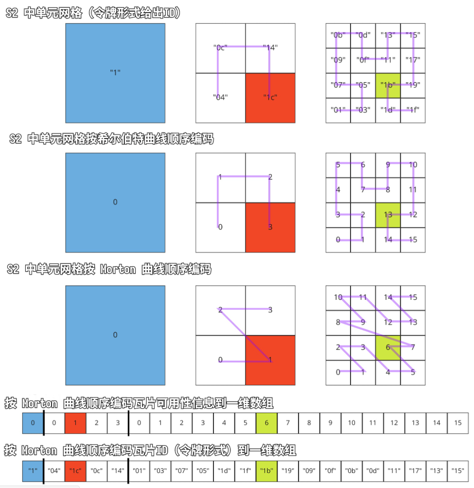

[3DTILES_implicit_tiling](https://github.com/CesiumGS/3d-tiles/tree/main/extensions/3DTILES_bounding_volume_S2)

---


[TOC]

---

# 依赖于

3D Tiles 1.0

# 可选与必需

必须同时出现在 `extensionsUsed` 和 `extensionsRequired` 数组中，即“必需的”。

# 1. 概述

[S2](https://s2geometry.io/) 是一个用于定义单位球体表面的网格框架的程序库，一个网格单元（又叫单元格，Cell）将会横竖各取一半来分成 4 个子单元格，单元格的四个边界线均为测地线（即沿着地面的“直线”）。

S2 所定义的这套地表的网格层次结构，有 6 个根单元格。每个根单元格是由单位立方体投影到球面上获得的。

> 译者注，单位立方体投影到球面这个描述其实不准确，严格来说是单位立方体各个面与球心连接而成的四棱锥,与球面相交得到的那 6 个测地四边形。见本文下面的图。

通常，传统的 GIS 会把地球椭球体投影到某个平面或可展成平面的曲面（圆锥、圆柱）上。例如，墨卡托投影就是投影到圆柱体上。墨卡托有一个众所周知的问题，那就是离极点越近，形变越大。

S2 这种投射方式就改善了墨卡托的问题，并还有其它的好处，它把地表面分割成没有奇怪端点、形变较小、瓦片相对来说几乎相等的瓦片。

基于上述特征，使用 S2 定义的这套瓦片层次结构的 3D Tiles Next 扩展就特别合适跨越全球范围的瓦片数据集。


# 2. 层级

S2 层级结构中，每个根网格测地四边形（称作“单元格”）能细分到 30 级。下图展示第 "1" 个单元格及其 4 个子单元格的图例：

| 第 0 级（根 Cell）                                       | 第 1 级（根 Cell 的子级 Cell）                             |
| -------------------------------------------------------- | ---------------------------------------------------------- |
|          |          |
|  |  |

第一行是地球立方体的第 "1" 个 Cell 及其子 Cell，第二行则是椭球面上的第 "1" 个 Cell 及其 4 个子 Cell，其中子 Cell 上的编号“0c”、“14”等暂且不管，编号会在下文“单元格ID”小节中详细解释。

S2 使用改版希尔伯特曲线来编码一维顺序的网格编号，给每一级别任意单元格提供了64位的ID，最高层级的单元格可以精确到厘米级空间范围。

观察 S2 希尔伯特曲线如下：

| 在地球立方体表面上             | 在地球椭球面上                     |
| ------------------------------ | ---------------------------------- |
|  |  |


# 3. 单元格ID

单元格ID 使用 64 位宽度的二进制比特位来编码，从左到右的比特位的规则：

- 第 0~3 位，用来编码属于哪个根单元格，取值范围 0~5（6 个，二进制表示为 000b 到 110b，刚好）
- 从第 4 位开始到 63 位，为第 1 级~第 30 级别这 29 个级别的单元格编码，从左到右每 2 个位表示一级，因为同一级别只有 4 个兄弟单元格，两位比特位刚好表示 4 个单元格的编码；
- 基于上面两条规则，后面再补一个 1 来表示结束
- 再往右，对于没有用到的位数，使用 0 来填充。譬如第 8 级单元格只需要用到 8×2 + 3 + 1 = 20 个比特位

举例（下列第 i 个的起始均为 第 0 个，即以 0 为索引起点数）：

```
001 1 000000000...000   第 1 个根单元格
001 01 10000000...000   第 1 个根单元格的第 1 个子单元格
001 01 11 100000...000   第 1 个根单元格的第 1 个子单元格的第 3 个子单元格
001 01 11 00 1000...000   第 1 个根单元格的第 1 个子单元格的第 3 个子单元格的第 0 个子单元格
```

上述数字用十进制表示即

```
3458764513820540928
3170534137668829184
3386706919782612992
3332663724254167040
```


# 4. 令牌（Token）

为了更简便地表达单元格ID，以及更好指示其级别，先将二进制的单元格ID 转换为十六进制，并去掉尾部所有的 0，这样就得到了单元的令牌。

对于第 3 节中的例子，按上述规则生成令牌即：

```
3
2c
2f
2e4
```

> 译者注 转成十六进制后，其字符长度刚好就是单元的等级（仍然是 0 为索引起点）


# 5. 空间范围长方体

S2 的单元（Cell）描述了地球椭球面上的一块四边形区域，记录四边形的四个角点。为了形成空间范围长方体，这四个角点要沿着它在椭球面的法线方向（通常就是垂直地表向上）拉伸。

此时，用 `minimumHeight` 表示空间范围立方体的底面高度，用 `maximumHeight` 表示顶面高度，注意，这两个高度的 0 值为地球椭球面，单位均为米。

当本文描述的这个扩展来表示瓦片对象的 boundingVolume（空间范围长方体）时，瓦片对象的 transform 属性将被忽略。

若使用 3DTILES_bounding_volume_S2 扩展，那么必须保证瓦片必须在空间上是连续紧挨的。

此扩展可以作用于瓦片对象的 boundingVolume 或者瓦片对象的内容属性的 boundingVolume 属性。

> 将地球椭球体映射到地球立方体时，S2 库提供三种投影，即线性、二次方投影、切线形式，3DTILES_bounding_volume_S2 使用二次方投影，因为准确且有效。

下面是一个例子，它的单元格ID 令牌形式为 "89c6c7"：


它的大概位置位于美国费城中心城区，最小高度 minimumHeight 被设为 0，最大高度 maximumHeight 被设为了 1000 米。

具体 JSON 中的对象表示如下：

``` json
"boundingVolume": {
  "extensions": {
    "3DTILES_bounding_volume_S2": {
      "token": "89c6c7",
      "minimumHeight": 0,
      "maximumHeight": 1000
    }
  }
}
```

再举一例：

``` json
{
  "asset": {
    "version": "1.0"
  },
  "geometricError": 1000000,
  "extensionsUsed": [
    "3DTILES_bounding_volume_S2"
  ],
  "extensionsRequired": [
    "3DTILES_bounding_volume_S2"
  ],
  "root": {
    "boundingVolume": {
      "extensions": {
        "3DTILES_bounding_volume_S2": {
          "token": "3",
          "minimumHeight": 0,
          "maximumHeight": 1000000
        }
      }
    },
    "refine": "REPLACE",
    "geometricError": 50000,
    "children": [
      {
        "boundingVolume": {
          "extensions": {
            "3DTILES_bounding_volume_S2": {
              "token": "2c",
              "minimumHeight": 0,
              "maximumHeight": 500000
            }
          }
        },
        "refine": "REPLACE",
        "geometricError": 500000,
        "children": [
          {
            "boundingVolume": {
              "extensions": {
                "3DTILES_bounding_volume_S2": {
                  "token": "2f",
                  "minimumHeight": 0,
                  "maximumHeight": 250000
                }
              }
            },
            "refine": "REPLACE",
            "geometricError": 250000,
            "children": [
              {
                "boundingVolume": {
                  "extensions": {
                    "3DTILES_bounding_volume_S2": {
                      "token": "2ec",
                      "minimumHeight": 0,
                      "maximumHeight": 125000
                    }
                  }
                },
                "refine": "REPLACE",
                "geometricError": 125000
              }
            ]
          }
        ]
      }
    ]
  }
}
```


# 6. 与隐式瓦片扩展一起使用

当此扩展与 3DTILES_implicit_tiling 扩展一起使用时，尤其是后者使用四叉树来组织瓦片索引时，那么瓦片的空间范围体就遵循 S2 所定义的空间层次范围规则。

当 3DTILES_implicit_tiling 扩展使用的是八叉树组织瓦片的索引时，那么空间范围长方体的分割也可以遵循S2 的方案，只不过在四叉树的基础上，在垂直方向的分割将位于 minimumHeight 和 maximumHeight 的中间点。（请细细品味这一点，在横竖方向上八叉树的空间范围长方体的最大最小值和四叉树的一样，垂直高度则取中间分两半）

如下图所示

| Token 格式的 ID 为 "04" 的单元格       | 四叉树分割后                                               | 八叉树分割后                                            |
| -------------------------------------- | ---------------------------------------------------------- | ------------------------------------------------------- |
|  |  |  |

为了保证 S2 用到的希尔伯特曲线的连贯性，地球立方体的 6 个投影平面按如下图示方向旋转。


> 上面有第 4 个和第 1 个根单元的图，读者可以比对看看。

要十分注意这一点，在配合隐式瓦片分割方案时，奇数面的遍历顺序和偶数面的遍历顺序是相反的。

例如，第 1 个根单元是逆时针编号四个子单元格（隐式子瓦片），第 4 个根单元则是顺时针编号。


## 可用性信息编码

当此扩展与 3DTILES_implicit_tiling 一起使用时，其 subtree 文件内记录的瓦片可用性数据的编码顺序，必须按 Morton 索引顺序一致，如下图：



## 例子①

以下为 3DTILES_bounding_volume_S2 与 3DTILES_implicit_tiling 搭配使用的 JSON 例子：

``` json
{
  "asset": {
    "version": "1.0"
  },
  "geometricError": 10000,
  "extensionsUsed": [
    "3DTILES_implicit_tiling",
    "3DTILES_bounding_volume_S2"
  ],
  "extensionsRequired": [
    "3DTILES_implicit_tiling",
    "3DTILES_bounding_volume_S2"
  ],
  "root": {
    "boundingVolume": {
      "extensions": {
        "3DTILES_bounding_volume_S2": {
          "token": "04",
          "minimumHeight": 0,
          "maximumHeight": 500000
        }
      }
    },
    "refine": "REPLACE",
    "geometricError": 5000,
    "content": {
      "uri": "content/{level}/{x}/{y}.glb"
    },
    "extensions": {
      "3DTILES_implicit_tiling": {
        "subdivisionScheme": "QUADTREE",
        "subtreeLevels": 4,
        "maximumLevel": 7,
        "subtrees": {
          "uri": "subtrees/{level}/{x}/{y}.subtree"
        }
      }
    }
  }
}
```

## 例子②

以下例子为 3DTILES_bounding_volume_S2 表达 S2 的 6 个根单元网格，可以很明显看出它能均匀覆盖全球：


其 JSON 为

``` json
{
  "asset": {
    "version": "1.0"
  },
  "geometricError": 10000,
  "extensionsUsed": [
    "3DTILES_implicit_tiling",
    "3DTILES_bounding_volume_S2"
  ],
  "extensionsRequired": [
    "3DTILES_implicit_tiling",
    "3DTILES_bounding_volume_S2"
  ],
  "root": {
    "boundingVolume": {
      "region": [
        -3.141592653589793,
        -1.5707963267948966,
        3.141592653589793,
        1.5707963267948966,
        0,
        250000
      ]
    },
    "refine": "REPLACE",
    "geometricError": 10000,
    "children": [
      {
        "boundingVolume": {
          "extensions": {
            "3DTILES_bounding_volume_S2": {
              "token": "1",
              "minimumHeight": 0,
              "maximumHeight": 1000000
            }
          }
        },
        "refine": "REPLACE",
        "geometricError": 5000,
      },
      {
        "boundingVolume": {
          "extensions": {
            "3DTILES_bounding_volume_S2": {
              "token": "3",
              "minimumHeight": 0,
              "maximumHeight": 1000000
            }
          }
        },
        "refine": "REPLACE",
        "geometricError": 5000,
      },
      {
        "boundingVolume": {
          "extensions": {
            "3DTILES_bounding_volume_S2": {
              "token": "5",
              "minimumHeight": 0,
              "maximumHeight": 1000000
            }
          }
        },
        "refine": "REPLACE",
        "geometricError": 5000,
      },
      {
        "boundingVolume": {
          "extensions": {
            "3DTILES_bounding_volume_S2": {
              "token": "7",
              "minimumHeight": 0,
              "maximumHeight": 1000000
            }
          }
        },
        "refine": "REPLACE",
        "geometricError": 5000,
      },
      {
        "boundingVolume": {
          "extensions": {
            "3DTILES_bounding_volume_S2": {
              "token": "9",
              "minimumHeight": 0,
              "maximumHeight": 1000000
            }
          }
        },
        "refine": "REPLACE",
        "geometricError": 5000,
      },
      {
        "boundingVolume": {
          "extensions": {
            "3DTILES_bounding_volume_S2": {
              "token": "b",
              "minimumHeight": 0,
              "maximumHeight": 1000000
            }
          }
        },
        "refine": "REPLACE",
        "geometricError": 5000,
      }
    ]
  }
}
```

# JSON 模式规范

- [boundingVolume.3DTILES_bounding_volume_S2.schema.json](https://github.com/CesiumGS/3d-tiles/blob/main/extensions/3DTILES_bounding_volume_S2/schema/boundingVolume.3DTILES_bounding_volume_S2.schema.json)

# 代码库实现相关案例

- [S2Geometry C++实现](https://github.com/google/s2geometry/tree/master/src/s2)
- [S2Geometry Java 实现](https://github.com/google/s2-geometry-library-java/tree/master/src/com/google/common/geometry)
- [CesiumJS 中的 S2Cell 实现](https://github.com/CesiumGS/cesium/blob/master/Source/Core/S2Cell.js)

