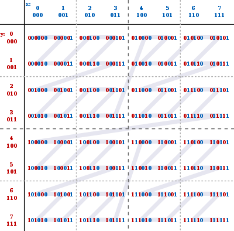

莫顿Z序编码

假设有一个二维的 8×8 的网格，x 方向索引号 0~7，y 方向亦然。

那么，使用3位二进制码可以完成编码：

x：0b000, 0b001, 0b010, 0b011, 0b100, 0b101, 0b110, 0b111

y：0b000, 0b001, 0b010, 0b011, 0b100, 0b101, 0b110, 0b111

| y↓\x→ | 0    | 1    | 2    | 3    | 4    | 5    | 6    | 7    |
| ----- | ---- | ---- | ---- | ---- | ---- | ---- | ---- | ---- |
| 0     |      |      |      |      |      |      |      |      |
| 1     |      |      |      |      |      |      |      |      |
| 2     |      |      |      |      |      |      |      |      |
| 3     |      |      |      |      |      |      |      |      |
| 4     |      |      |      |      |      |      |      |      |
| 5     |      |      |      |      |      |      |      |      |
| 6     |      |      |      |      |      |      |      |      |
| 7     |      |      |      |      |      |      |      |      |

莫顿编码，可以用一种类似“Z”字的曲线完成这64个格子的顺序排列：

譬如，对 x=3 & y=5 的格子，它的莫顿编码很容易由 011 和 101 先后交错排列二进制码得来：

x   0   |1   |1

y   1   |0   |1

m  10 |01 |11

先摆y，再摆x

优点显而易见，对于下一个格子，即 100111+000001=101000，即 x=0 & y =6 的格子，只需对莫顿编码加二进制的1即可获取到；而且知道莫顿码，可以轻而易举还原 x 和 y 的索引号，即一维和二维高效率转换。

莫顿编码呈现的Z曲线在局部有极高的相似性，上图中4个格子是连续访问的；

由于二进制的特征，通过两位两位可以快速定位，例如 00xxxx 必定是左上角 4x4区域的，10xxxx必定是左下角4x4区域的；

而对于 xx01xx，必定是某个大 4x4 中的右上角的小 4x4 区域的。

