# 下一代的 3D Tiles 前瞻

原文：[Introducing 3D Tiles Next, Streaming Geospatial to the Metaverse](https://cesium.com/blog/2021/11/10/introducing-3d-tiles-next/)

原文发布时间：2021年11月10日

> 阅读本文前，需要有足够的 3D Tiles 1.0 基础、glTF 规范基础、CesiumJS 基础。

## 译者概述

3D Tiles Next 自官方有想法以来，我就一直在跟踪，无奈年关将至，业务繁忙，现在才着手阅读和学习。

3D Tiles Next 下文会简称 `Next`，而现行的 3D Tiles 1.0 则简称 `1.0`，因为官方暂时没把下一代正式称为 `2.0`.

从组织方式来说，Next 在 Tileset 和 瓦片文件层级均做了优化，Tileset 新建了多项扩展，瓦片文件则直接使用 glTF 格式，不再使用旧的 b3dm、i3dm、pnts、cmpt.

从性能考量来说，Next 引入新的空间索引规则，叫做 Implicit Tilling，即隐式瓦片分割，并介绍了一种空间分割算法：S2。

从领域需求来说，Next 强化了元数据、属性数据的组织，创建了 3D Metadata Specification（三维元数据规范）及相关的扩展。

此次更新不小，除了 Cesium 原班人马外，还有一个三维大佬 [Don McCurdy](https://github.com/donmccurdy) 在后期添砖加瓦。

除了数据规范本身的更新，前端运行时 CesiumJS 在 1.87.1 版本终于公测了 Next，并提供了新的 glTF 数据加载架构 —— `ModelExperimental`，以及更友好的自定义着色器 API —— `CustomShader`。

# 1. 综述

`3D Tiles Next`，指的是一组 3D Tiles 扩展项。这些扩展项主要体现在三个方面的增强：

- 结构化的元数据
- 空间索引性能
- glTF 生态集成

> 官方关于元数据的限定词是 `semantic`，即语义化的，我觉得“结构化”可能更好一些。

如下图所示：

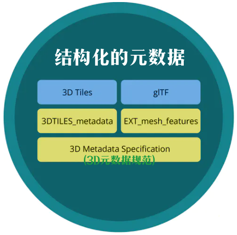

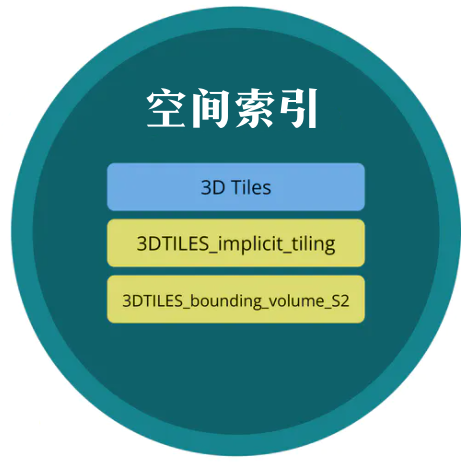

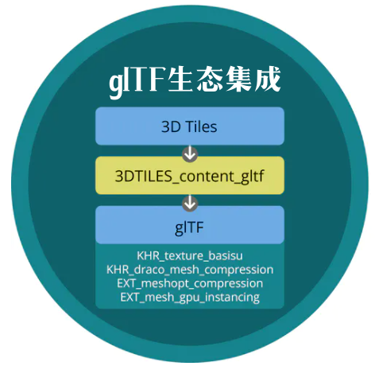

# 2. 元数据的增强

鉴于需求的急剧扩张，3D Tiles 扩充了元数据方面的功能。在 3D Tiles Next 中，引入一些元数据方面的扩展项。主要特点有：

- 元数据的编码方式更友好，可以用二进制，也可以写入 JSON；
- 层级扩充，可以是每纹理单元级别的元数据，也可以是每个瓦片级别的；
- 规范了元数据的格式。

与 1.0 规范使用 Batchtable（批次表）来存储元数据的目的一致，Next 的元数据扩展依旧遵循了性能优势：批量处理。

许多逻辑层面的三维要素（例如某个建筑）及其元数据，在前端运行时（可以简单认为是 CesiumJS）预先被成组成批处理，以减小 CPU 的开销。

元数据方面的扩展，分三个方面：

- 类型系统；
- 编码方式；
- 领域相关的语义化规范，领域是指 BIM、CAD 等；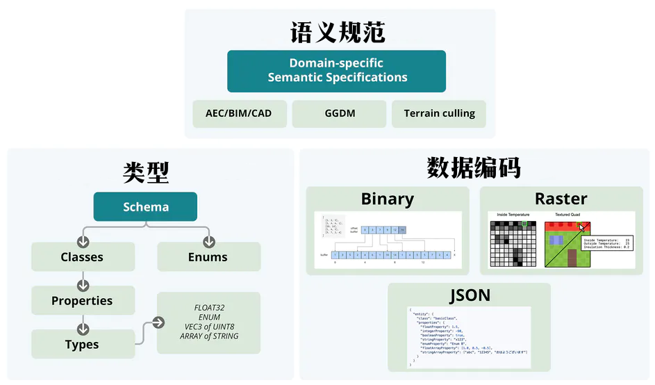

## 2.1. 元数据的类型系统

[3D 元数据规范](https://github.com/CesiumGS/3d-tiles/tree/main/specification/Metadata) 定义了一套类型规范与数据的编码方式。

3D Tiles 1.0 依赖于 JSON 本身有限制的基础类型，而 Next 具备更丰富的类型支持，包括类、向量、矩阵等。

元数据的编码方式可以有：

- 二进制格式；
- JSON 格式；
- 栅格格式。

具体细节要看规范。

## 2.2. 不同层级的元数据（像素级别样式化渲染）

配合使用 [3DTILES_metadata]() 和 [EXT_mesh_features]() 两个扩展项，下一代的 3D Tiles 可以在各个层级存储元数据。这些层级可以是：

- Tileset（瓦片集）层级
- Tile / Tile ContentGroup（瓦片或瓦片组）层级
- Feature（三维要素）层级
- GPU 绘制实例层级
- Vertex（顶点）层级
- Texel（纹素）层级

如下图所示：

纹素级别是最细的层级，允许元数据在如此细的粒度上变化。

例如，两个三角形构成一个四边形，作为一个建筑物的一侧墙面，但是此时它仅仅是“两个三角形”，在真实世界中墙面还可能会有窗的玻璃、砖的石头的区别，在拾取识别时，就可以例用“纹素级别”的元数据来辨别什么颜色是什么物体。

下面是一个例子，对倾斜摄影数据使用纹素级别的元数据：

此处有分屏，左侧的颜色就可以很明显地区分出墙、窗户、空调、屋顶等“实际物体”，而数据的三角面组织却可以不用在意这些“实际物体”。

在右侧，利用纹素级别的元数据，就可以完成窗户单体的半透明处理。

## 2.3. 语义规范

除了层次足够细致，还要知道数据的含义，这就是所谓的“元数据的语义”，以便程序代码知道怎么进行交互编程。

例如，水泥地和草地的摩擦系数可以作为元数据，影响车辆的行驶速度等。

各领域的专家可以根据有关扩展项来定制自己专业所需的元数据，譬如在土方施工中，将材料库存、各项参数写入元数据，方便代码计算体积和面积。

# 3. 空间索引增强：隐式瓦片分割

3D Tiles Next 在空间分割上做了优化，光线追踪、近邻搜索这些空间分析、模拟功能从此受益。

在 1.0 中，空间分割体现在 tileset.json 文件中的每个 Tile 的定义，这些定义包括 BoundingVolume（空间范围体）、瓦片文件的模型以及其下一级的子瓦片等。

据官方介绍，3D Tiles 1.0 的空间分割方式可以自由搭配选择，不用局限于传统 2D 地图的四叉树分割。需要注意，子瓦片的空间范围要小于父瓦片的空间范围。

下面是 1.0 中介绍的三种空间分割树结构，依次为 KD树、松散四叉树、八叉树：

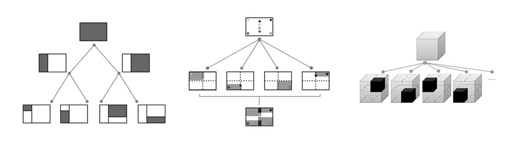

3D Tiles Next 引入了一个新的扩展：[3DTILES_implicit_tiling](https://github.com/CesiumGS/3d-tiles/tree/main/extensions/3DTILES_implicit_tiling)，它主要的作用是引入一种预先知晓规则的空间分割规则，使得无需显式记录瓦片的空间范围体。这样，就可以随机访问单个或任意多个瓦片了，这样有益于：

- 单服务器或跨服务器的大规模模拟计算，尤其是 K-最近邻 和范围查询；
- 基于光追，或者说，基于射线的计算，因为统一的索引结构可以提高空间索引的性能；
- 局部数据更新，例如某块区域的建筑需要更新

城市级别的流式数据、建筑区域中随时间更新的数字孪生变化、飞行器的变化等，这些例子都将受益于上述所说的瓦片随机访问机制，而无需走原来的自顶向下的 LOD 层级访问机制。

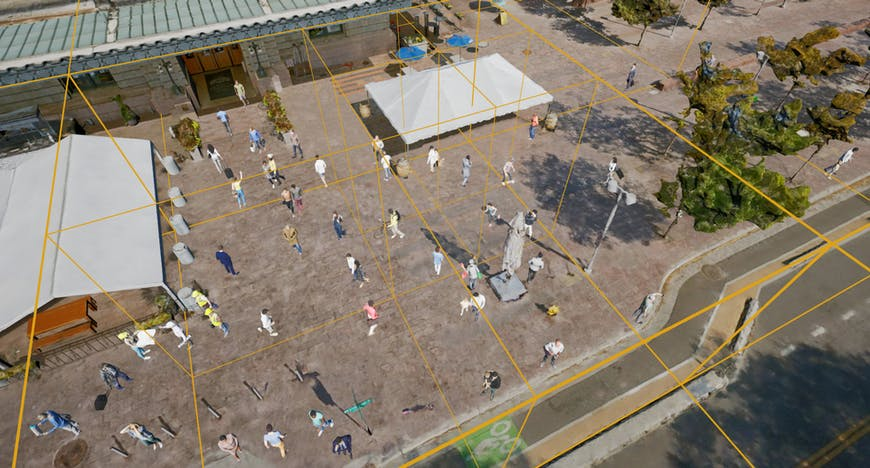

上图表明，城市中的人群大规模模拟得以实现，主要是因为隐式空间索引机制，可以高效率地进行邻近瓦片的空间查询。

隐式瓦片分割机制，可以简洁地呈现 Tileset（瓦片集）的空间数据结构，包括：

- 四叉树或八叉树；
- RootTile（根瓦片）的几何误差（geometricError）和空间范围体（BoundingVolume），以支持全局或局部的 Tileset；
- 瓦片的可见性，这样可视化引擎（CesiumJS）只需请求存在的瓦片，减轻网络压力；
- 莫顿 z 序曲线（Morton z-order curve）存储了瓦片的其他信息；
- 模板式 URI，这样可以根据 URI 的规律，快速随机访问想要的瓦片而不需要再次自顶向下遍历整个 Tileset

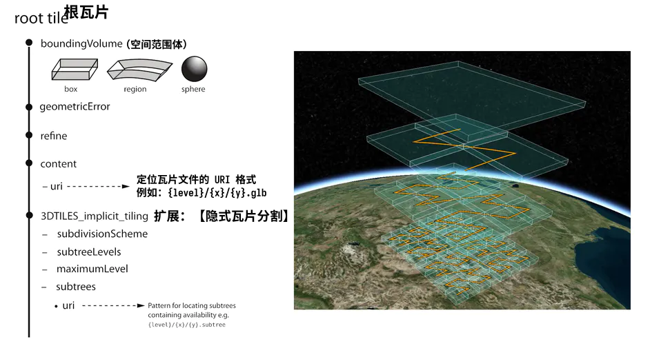

上面这张图，左边是 tileset.json 的大致示意，右边则是四级空间分割及其莫顿 Z 序曲线的显示效果。

与 1.0 中显式指定空间分割的瓦片相比，隐式分割还可以减小 tileset.json 的体积，降低网络压力。

但是与网络压力相比较，隐式瓦片分割的真正威力在于运行时可以随机访问瓦片，而且这些瓦片的空间分割规则是统一的。

除了空间检索性能上的考量，隐式瓦片分割还有一个意图，就是希望与传统 2D GIS 的 CDB、WMTS、TMS 等规范集成实现。

## 空间分割算法：S2

3D Tiles Next 引入一项 [3DTILES_bounding_volume_S2](https://github.com/CesiumGS/3d-tiles/tree/main/extensions/3DTILES_bounding_volume_S2) 扩展，它能与隐式瓦片、显式瓦片一起使用，定义新的空间范围体。

S2 分割是一种比四叉树更好的空间分割，这种分割方式基于一个立方体，它在北极、南极附近的瓦片会比较“薄”，失真较小。同一级别的瓦片的尺寸是接近的。

> 笔者注：这个算法不太了解，需要阅读更多资料。

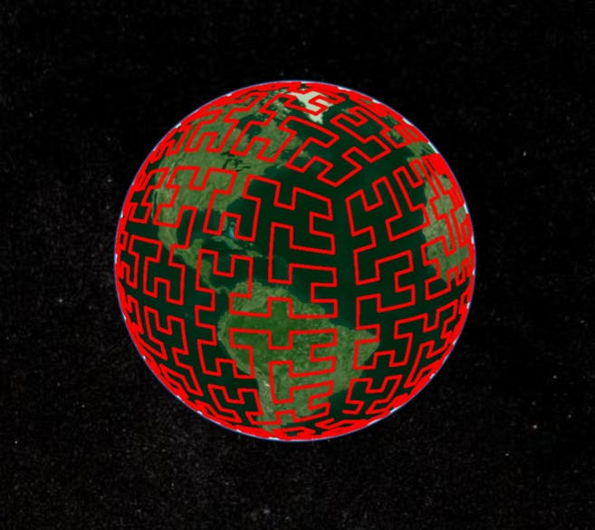

上图为 WGS84 椭球面上的 S2 Hilbert（希尔伯特）曲线。

# 4. 在三维“图层”中使用复合内容 

传统 2DGIS 会把同类数据放进同一个容器中，这个容器叫做“图层”，比如高速公路图层、POI图层、建筑图层等，这样可以统一样式设置。

使用 [3DTILES_multiple_contents](https://github.com/CesiumGS/3d-tiles/tree/main/extensions/3DTILES_multiple_contents) 扩展可以在一组 Tile 中定义“三维图层元数据”，然后将对应的三维数据绑定至这个组来实现“三维图层”、“数据与元数据的连接”。

# 5. 与 glTF 技术生态集成

在 3D Tiles 中使用 [3DTILES_content_gltf](https://github.com/CesiumGS/3d-tiles/tree/main/extensions/3DTILES_content_gltf) 扩展，Tile 对象可以直接引用 `.gltf` 或 `.glb` 文件，而不是使用旧的 `b3dm`、`i3dm` 瓦片文件。

这样 3D Tiles 就可以直接利用 glTF 社区的成果，例如验证工具、转换工具等。

3D Tiles Next 利用到 glTF 的地方有：

- 3D Tiles 在瓦片层级直接使用 glTF 作为三维数据；
- 将 glTF 直接用于点云格式；
- 更好利用了 glTF 的扩展项。

## 5.1. 直接使用 glTF（b3dm 与 i3dm 升级）

有阅读 3D Tiles 1.0 规范的朋友知道，`b3dm` 和 `i3dm` 瓦片文件是内嵌了 glTF 的二进制格式数据的。

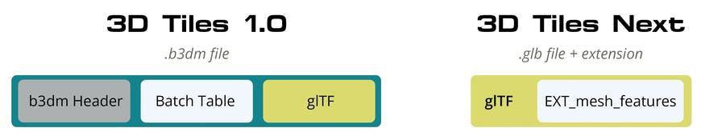

上图展示了 1.0 和 Next 的瓦片文件设计区别，1.0 中最具代表性的 `b3dm` 瓦片文件由头部元数据（b3dm Header）、批次表（BatchTable）和具体模型数据（glTF）块构成，而 Next 则直接使用 `glb` 文件，且使用了 glTF 的 `EXT_mesh_features` 扩展来替代批次表。

使用 [3DTILES_content_gltf](https://github.com/CesiumGS/3d-tiles/tree/main/extensions/3DTILES_content_gltf) 这个 3D Tiles 扩展，瓦片就可以直接引用 gltf 或 glb 文件。如果瓦片中存在逻辑要素信息，则可以在 gltf/glb 中启用 glTF 的扩展：EXT_mesh_features.

但是如果是 `i3dm`，比如一个树模型要绘制多次（即实例绘制的方式），那么就使用 glTF 扩展 [EXT_mesh_gpu_instancing](https://github.com/KhronosGroup/glTF/blob/main/extensions/2.0/Vendor/EXT_mesh_gpu_instancing/README.md) 来实现，以替代 i3dm 瓦片。EXT_mesh_features 也可以跟这个扩展一起使用，来记录每个被绘制后的实例的属性数据，如下图所示：

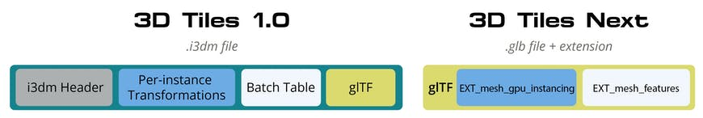

官方希望直接使用 glTF 的意图是可以更好地与其他行业的数据进行合作，以提高 3D Tiles 的模型兼容性。

## 5.2. 点云与 glTF（pnts 升级）

上图是某个城市的 100 亿个点的点云数据。

在 1.0 中，点云数据是使用 `pnts` 格式的文件存储的，包括 FeatureTable（要素表）、Batch Table（批次表），并可以带 draco 压缩。

在 Next 中，点云也可以使用 glTF 格式的文件，使用 glTF 中的 [EXT_meshopt_compression]() 扩展即可实现一些运行时（CesiumJS）方面的样式化、过滤，甚至是点云的元数据等。总的来说，Next 对点云这种格式的数据：

- 将点云的几何数据存储在 glTF 本身
- 元数据（属性数据）通过 EXT_mesh_features 实现
- 顶点和法线数据的压缩通过 EXT_meshopt_compression 来实现。

如下图所示。

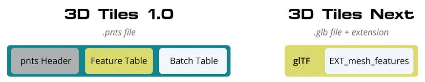

在最终敲定 Next 规范之前，官方还希望使用不同的压缩方式来补充 EXT_meshopt_compression 这个扩展如何进行点云压缩，包括 [Esri LEPCC](https://github.com/Esri/lepcc) 和 [Google Draco](https://github.com/google/draco) 等方式。

## 5.3. 继承 glTF 的扩展项（纹理压缩）

由于 Next 对瓦片文件的更新替换，不再使用 b3dm、i3dm、pnts 瓦片文件，因此功能上的更新基本上都是 glTF 的扩展。

3D Tiles Next 依旧会使用 glTF 的 [KTX 2.0](https://www.khronos.org/news/press/khronos-ktx-2-0-textures-enable-compact-visually-rich-gltf-3d-assets) 和 [下一代 PBR](https://www.khronos.org/news/press/khronos-releases-wave-of-new-gltf-pbr-3d-material-capabilities) 材质等扩展。

KTX 2.0 是用来支持纹理数据的跨 GPU 传输、运行时压缩，减少内存、带宽等，以提升硬件效能，毕竟通过无人机或者卫星获取的图像的体积可不小。

下一代 PBR 召集了世界 PBR 专家来集思广益，将 glTF 的材质表现提升到一个新的高度。

# 6. 后续进度

从发文时间起，之后的几个月将完成规范的设计。

目前的进度有：

- 起草了 3D Tiles 与 glTF 相关的扩展项：
  - [3D 元数据规范](https://github.com/CesiumGS/3d-tiles/tree/main/specification/Metadata)
  - [3D Tiles 扩展：3DTILES_metadata](https://github.com/CesiumGS/3d-tiles/tree/main/extensions/3DTILES_metadata)
  - [glTF 扩展：EXT_mesh_features](https://github.com/KhronosGroup/glTF/pull/2082)
  - [3D Tiles 扩展：3DTILES_implicit_tiling](https://github.com/CesiumGS/3d-tiles/tree/main/extensions/3DTILES_implicit_tiling)
  - [3D Tiles 扩展：3DTILES_bounding_volume_S2](https://github.com/CesiumGS/3d-tiles/tree/main/extensions/3DTILES_bounding_volume_S2)
  - [3D Tiles 扩展：3DTILES_multipie_contents](https://github.com/CesiumGS/3d-tiles/tree/main/extensions/3DTILES_multiple_contents)
  - [3D Tiles 扩展：3DTILES_content_gltf](https://github.com/CesiumGS/3d-tiles/tree/main/extensions/3DTILES_content_gltf)
- 开发者相关的资源，pdf、示例数据、博客等；
- 在 CesiumJS@1.87.1 以上的例子实现
- ...

# 7. 译者注

下一代的 3D Tiles 目前没有定名为 3D Tiles 2.0，而是暂时以扩展项的方式推进。

它解决了一部分 1.0 中的问题，例如把元数据从旧的瓦片文件中的 BatchTable、FeatureTable 拆分出来，便于数据库实现；拆出来元数据后，剩下的三维数据可以直接利用 glTF 格式，而 glTF 格式本身又是可以把纹理、几何分开存储的。总之，新设计的灵活性非常强。

除了数据方面的问题，还提出了新的空间切分算法 —— 隐式瓦片，这个扩展旨在提高前端瓦片剔除和渲染的性能。

总之，现在的状态就是“请洒潘江，各倾陆海云尔”。