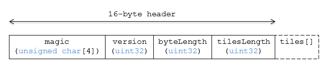

cmpt允许将不同的瓦片塞成一个瓦片，意味着3dtiles规范允许灵活地组织异构数据。

比如说，建筑物和树木分别存在b3dm和i3dm瓦片中，也可以同时存在cmpt瓦片中。

是塞进一个瓦片做成cmpt还是分开不同瓦片，就看转换工具的设计了，与请求量、指定类型细分方式、图层显示隐藏等有关系。

cmpt是小端二进制存储。

# 数据布局

虚线意味着可选，也就是说，cmpt瓦片可以是空瓦片。

## 填充

数据头占16byte，后面的瓦片也必须是8byte的倍数起、倍数止，与8byte对齐。

# 头部

16byte头部如下：

|    字段名     |    数据类型     | 描述                                   |
| :-----------: | :-------------: | :------------------------------------- |
|    `magic`    | `char[]`, 4byte | 常量`"cmpt"`. 用来指示文件是cmpt瓦片。 |
|   `version`   | `uint32`, 4byte | cmpt的版本。目前是`1`。                |
| `byteLength`  | `uint32`, 4byte | 整个瓦片文件的体积，byte为单位。       |
| `tilesLength` | `uint32`, 4byte | cmpt中融合的瓦片数量。                 |

# 内置瓦片

以下信息描述了cmpt内融合的瓦片的一般特征：

- 每个瓦片均含4byte的`magic`字段
- 每个瓦片的`version`均为1
- 每个瓦片均有一个4byte（uint32）的`byteLength`字段

请注意，cmpt是可以继续嵌套cmpt的（无限套娃）。

注意到pnts、i3dm、b3dm的头均有7、8个数据，只有这三个数据是共同的（好像ft、bt那些length也有共同的？），读取到magic数据后，才能继续往下读取。

# 文件扩展名和MIME

文件扩展名：`*.cmpt`

MIME： `application/octet-stream` 

扩展名不是必须的，因为`magic`字段会指示瓦片是什么。

> 译者注
>
> 挖坑给别人跳啊，原则上来说可以无限套娃的cmpt。
>
> cmpt除了自己的16byte头信息之外，后面拼接的就是一个完整的b3dm，一个完整的i3dm，一个完整的pnts...