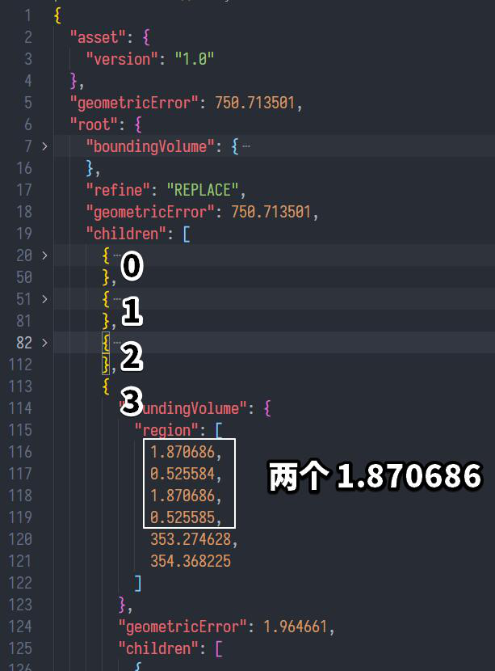

有群友提问，一份 3dTiles 无报错，也不显示。

经观察其数据，是在入口 tileset.json 中，其子 tile 继续引用了扩展 3dTiles 的组织形式。

起初怀疑是这个扩展 3dTiles 的问题，后来想想不对，遂开始调试源代码。

后来发现，在入口 tileset.json 的第3个（0开始）tile创建过程中，会引发非 Cesium.js 自己抛的异常。这第3个 tile 的信息如下：

``` JSON
{
  "boundingVolume": {
    "region": [
      1.870686,
      0.525584,
      1.870686,
      0.525585,
      353.274628,
      354.368225
    ]
  },
  "geometricError": 1.964661,
  "children": [
    {
      "boundingVolume": {
        "region": [
          1.870686,
          0.525584,
          1.870686,
          0.525585,
          353.274628,
          354.368225
        ]
      },
      "geometricError": 1.377864,
      "content": {
        "uri": "./Tile_Object004/Tile_Object004.json"
      }
    }
  ]
}
```

乍一看没什么问题，于是继续调试源码，发现在 Cesium3DTile.js 这个模块对 Cesium3DTile 类的创建时，报错在创建 boundingVolume：

``` JS
contentBoundingVolume = this.createBoundingVolume(
  contentHeader.boundingVolume,
  computedTransform
);
```

继续跟进，在原型链的 createBoundingVolume 方法上，跟踪到是创建的 region：

``` JS
return createRegion(
  boundingVolumeHeader.region,
  transform,
  this._initialTransform,
  result
);
```

继续跳转，定位到 TileBoundingRegion.js 中 TileBoundingRegion 类的构造函数：

``` JS
// ...
computeBox(this, options.rectangle, ellipsoid);
// ...
```

继续跳

``` JS
// TileBoundingRegion.js >> computeBox() 
function computeBox(/*参数列表*/) {
  // ...
  Cartesian3.normalize(westNormal, tileBB.westNormal);
  // ...
}
```

就在这一句报错，最终，在这一个三维笛卡尔向量的 normalize 工具函数里发现了异常：


回到最开头的 tile 的 boundingVolume 信息，发现第0个数字和第2个数都是 1.870686，故推断这就是罪魁祸首：



# 结论

tile 的包裹范围需要格外小心，精度不够可能会导致数据异常。

# 后话

在 cesium lab 是可以看到这份有问题的3dtiles的，猜测是他们使用了 cesium 的发行版，会屏蔽错误和调试信息，或者他们自己内部做了优化。