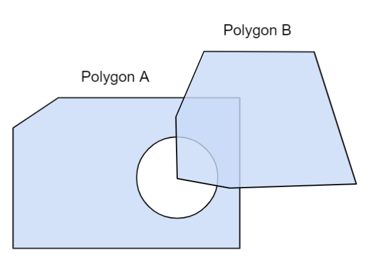
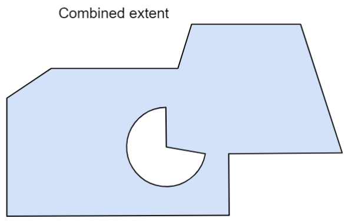

# 1. 简介

此扩展允许用户使用二维十进制度的坐标数组来给定 3dTiles 的范围。


# 2. 定义边界


## 2.1. 外部文件定义法

`tileset.json`

``` JSON
{
  "asset": {
    "version": "1.0"
  },
  "extensionsUsed": [
    "3DTILES_extent"
  ],
  "extensions": {
    "3DTILES_extent": {
      "uri": "extent.json"
    }
  },
  "geometricError": 100.0,
  "root": {}
}
```

`extent.json`

``` JSON
{
  "polygons": [
    {
      "coordinates": [
        [-116.61512629247555, 32.511166344475825],
        [-116.61385130521423, 32.514456825587125],
        [-116.61829305963617, 32.515638616140173],
        [-116.61944030086889, 32.513154268152434]
      ]
    }
  ]
}
```

## 2.2. 嵌入定义法

`tileset.json`

``` JSON
{
  "asset": {
    "version": "1.0"
  },
  "extensionsUsed": [
    "3DTILES_extent"
  ],
  "extensions": {
    "3DTILES_extent": {
      "extent": {
        "polygons": [
          {
            "coordinates": [
              [-116.61512629247555, 32.511166344475825],
              [-116.61385130521423, 32.514456825587125],
              [-116.61829305963617, 32.515638616140173],
              [-116.61944030086889, 32.513154268152434]
            ]
          }
        ]
      }
    }
  },
  "geometricError": 100.0,
  "root": {}
}
```


# 3. 支持有洞的边界

使用 `holes` 属性即可：

``` JSON
"extensions": {
  "3DTILES_extent": {
    "extent": {
      "polygons": [
        {
          "coordinates": [
            [-116.61512629247555, 32.511166344475825],
            [-116.61385130521423, 32.514456825587125],
            [-116.61829305963617, 32.515638616140173],
            [-116.61944030086889, 32.513154268152434]
          ],
          "holes": [
            [
              [-116.615216292478261, 32.512032301338385],
              [-116.613232083209821, 32.513482030238328],
              [-116.614830243800763, 32.517382033280321]
            ]
          ]
        }
      ]
    }
  }
}
```


孔的点应为逆时针排列，至少提供3个坐标。孔不能自相交也不能自重叠，还不能超出 extent 的范围。

# 4. 弧段类型

3D中是直线，但是在二维投影坐标系下可能会看起来像弯曲的。

# 5. 坐标系统

坐标以 经纬度 提供，基于 WGS84 椭球。

# 6. 举例

两个多边形，一个带孔，一个不带。最终，它们的合并运算即结果范围。



