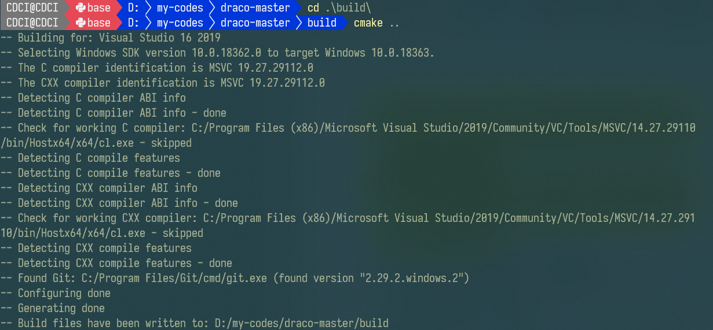

# pre. 先决条件

- 下载源代码压缩包
- 安装源代码根目录下 `CMakeLists.txt` 所需要的 CMake 版本，最好配置好环境变量以便控制台访问 cmake 程序
- 安装 VS2019 及其 C++ 扩展，一定要勾选 Windows SDK，尽量使用最新版。

以上三者缺一不可。最好把 git 一并安装。

# 1. 创建 VS 工程

> 额外唠叨一句，在跨平台复杂工程的源代码管理中，C++/C 不如其他语言，C#有nuget，nodejs 有 npm 包机制，python 有 conda 和虚拟环境，go、deno天生就有包（模块）管理。
>
> CMake 就是这么一个工具，让杂乱无章的 c/cpp/cc/cxx/hpp/h 等 C语言族源代码文件，按照不同的开发工具的规则生成编译说明书。
>
> 这个编译说明书，在 Linux 上叫 makefile，在 Windows 上叫 Visual Studio 解决方案。
>
> 在 Linux 上，make 程序 调用 makefile，一个又一个指令去编译一个又一个独立的文件，然后连接成可执行程序。
>
> 在 Windows 上，虽然也有 gcc/g++/make 编译版，但是微软有其更强大的工具：VisualStudio，和 make 对标的是 msbuild。

## 1.1. 好习惯：创建 build 目录

定位到源代码解压的根目录下，创建 build 目录，然后进去。

在命令行（或者 powershell）下，执行 cmake

``` SHELL
cmake ..
```

`..` 的意思就是告诉 cmake，你要的 `CMakeLists.txt` 文件在上一级目录下。

随后，在当前目录就会生成 VS 解决方案。



生成效果图：


# 2. `draco_encoder` 项目和 `draco_decoder` 项目

这两个项目就是可执行程序中的 draco 编码器 和 draco 解码器。

打开解决方案，将任意一个设为启动项目。然后右键项目 → 生成，就生成了！

生成效果图：


然后，你就可以开心地拿着这俩可执行程序，根据官方的命令行参数去编码解码 ply 或 obj 格式的数据了。