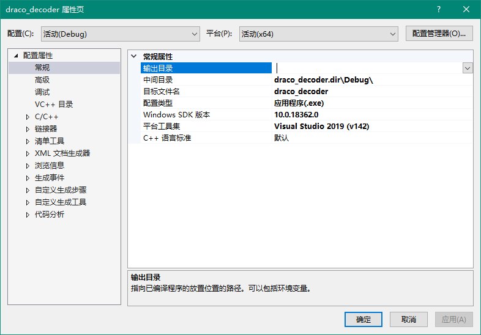

# pre. 项目信息 `draco_decoder`



# 1. 主入口文件

主入口文件是 `Source Files/draco_decoder.cc` 文件，它包含了主函数。

## 1.1. 结构

``` c++
#include <cinttypes>

#include "draco/compression/decode.h"
#include "draco/core/cycle_timer.h"
#include "draco/io/file_utils.h"
#include "draco/io/obj_encoder.h"
#include "draco/io/parser_utils.h"
#include "draco/io/ply_encoder.h"

namespace { // ...
}

int main(int argc, char **argv) {
  // ...
}
```

这是一个非常标准的 C++ 控制台程序结构。

首先是一堆头文件引入，包括系统的 `cinttypes`，和用于压缩的核心算法头文件、用于文件输入输出的头文件。

随后是一个匿名命名空间，定义了一些不希望被引入的代码污染的结构体、函数，在主函数会用到。

最后是主函数，传入表示命令行参数个数的参数 argc，以及传入的参数本体（字符串数组 char **argv）。

> 题外话
>
> 我的 C++ 舍弃多年，印象中 char* 是指向某个字符的指针，既然可以指向任意字符，又因为字符串可以由任意多个字符构成，所以 char* 可以用来指向字符串字面量。
>
> 可以这么理解：
>
> char** eq. string\*
>
> 在 C++ 里，指针和数组很相似，所以 string* 实际上就可以简单认为是 string[]

## 1.2. 匿名命名空间内容

### ① 结构体 `Options` 及其构造函数 `Options::Options()`

这个结构体定义了两个字符串，一个 input，一个 output。

它的构造函数在下面一行。

> 起初这让我很困惑，`Options();` 这一行像极了函数执行，实际上它只是结构体的构造函数定义。

### ② 打印帮助信息的函数 `Usage()`

没什么用处。

### ③ 返回错误信息的函数 `ReturnError(const draco::Status &status)`

传入一个常量引用，类型是 draco 命名空间下的 Status 类。

打印状态信息并返回 -1.

> draco 命名空间很大，这个 Status 类的定义在 `status.h` 头文件中，这个文件在外部依赖项里能找到。位于 ..\src\draco\core\status.h，即我本地的 D:\my-codes\draco-master\src\draco\core\status.h

# 2. 主函数结构及内容

## pre. 一个常用的字符串函数 `strcmp()`

参数：`int strcmp(const char *s1, const char *s2)`

规则：

- 两个字符串自左向右逐个字符比较 ASCII 大小，直到出现不同或遇到  `\0`
- s1 < s2，返回负数
- s1 = s2，返回0
- s1 > s2，返回正数

注意，没规定返回 -1 或 +1.

## 2.1. 