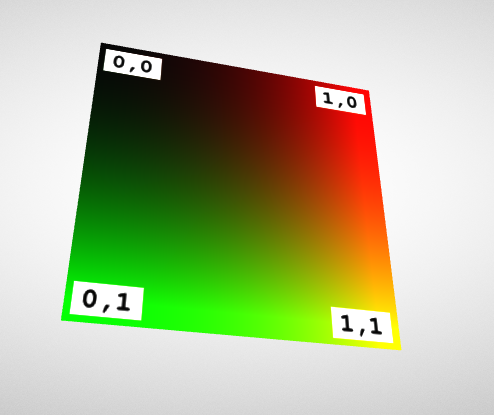

gltf的材料属性（material）包含了不同的参数，影响了gltf材料的颜色与外观。

这些属性，既可以是单值，也可以是纹理对象（texture）。

单值，可以是整个primitive的颜色、粗糙度等。

纹理对象，则映射到primitive表面上。

下面一个gltf文件就定义了一个简单的纹理：

```json
{
    "scenes" : [ {
        "nodes" : [ 0 ]
    } ],
    "nodes" : [ {
        "mesh" : 0
    } ],
    "meshes" : [ {
        "primitives" : [ {
            "attributes" : {
                "POSITION" : 1, // accessors索引
                "TEXCOORD_0" : 2 // accessors的索引
            },
            "indices" : 0, // accessors索引
            "material" : 0 // materials索引
        } ]
    } ],

    "materials" : [ {
        "pbrMetallicRoughness" : {
            "baseColorTexture" : {
                "index" : 0 // textures索引
            },
            "metallicFactor" : 0.0,
            "roughnessFactor" : 1.0
        }
    } ],

    "textures" : [ {
        "sampler" : 0, // sampler索引
        "source" : 0 // images索引
    } ],
    "images" : [ {
        "uri" : "testTexture.png"
    } ],
    "samplers" : [ {
        "magFilter" : 9729,
        "minFilter" : 9987,
        "wrapS" : 33648,
        "wrapT" : 33648
    } ],

    "buffers" : [ {
        "uri" : "data:application/gltf-buffer;base64,AAABAAIAAQADAAIAAAAAAAAAAAAAAAAAAACAPwAAAAAAAAAAAAAAAAAAgD8AAAAAAACAPwAAgD8AAAAAAAAAAAAAgD8AAAAAAACAPwAAgD8AAAAAAAAAAAAAAAAAAAAAAACAPwAAAAAAAAAA",
        "byteLength" : 108
    } ],
    "bufferViews" : [ {
        "buffer" : 0, // buffers索引
        "byteOffset" : 0,
        "byteLength" : 12,
        "target" : 34963
    }, {
        "buffer" : 0,
        "byteOffset" : 12,
        "byteLength" : 96,
        "byteStride" : 12,
        "target" : 34962
    } ],
    "accessors" : [ {
        "bufferView" : 0,
        "byteOffset" : 0,
        "componentType" : 5123,
        "count" : 6,
        "type" : "SCALAR",
        "max" : [ 3 ],
        "min" : [ 0 ]
    }, {
        "bufferView" : 1,
        "byteOffset" : 0,
        "componentType" : 5126,
        "count" : 4,
        "type" : "VEC3",
        "max" : [ 1.0, 1.0, 0.0 ],
        "min" : [ 0.0, 0.0, 0.0 ]
    }, {
        "bufferView" : 1,
        "byteOffset" : 48,
        "componentType" : 5126,
        "count" : 4,
        "type" : "VEC2",
        "max" : [ 1.0, 1.0 ],
        "min" : [ 0.0, 0.0 ]
    } ],

    "asset" : {
        "version" : "2.0"
    }
}
```

纹理实际上引用了一张名为`testTexture.png`的图片文件：


渲染出来是这样的：



# 纹理材质的定义

这里的材料定义与011节“简单材质例子”的简单材料不同。“简单材质例子”种的材质对象只定义了一个颜色，但是这里的材质对象引用了纹理图片：

```json
"materials" : [ {
    "pbrMetallicRoughness" : {
        "baseColorTexture" : {
            "index" : 0
        },
        "metallicFactor" : 0.0,
        "roughnessFactor" : 1.0
    }
} ]
```

`baseColorTexture`是纹理数组（`textures`）的索引号，金属因子（`metallicFactor`）和粗糙度（`roughnessFactor`）仍然是个数字。

> 更复杂的例子下篇给出。

为了将纹理映射到mesh、primitive上，必须把纹理坐标与顶点坐标关联起来。

**`纹理坐标`**，定义在mesh.primitive中：

``` JSON
"meshes" : [ {
    "primitives" : [ {
        "attributes" : {
            "POSITION" : 1,
            "TEXCOORD_0" : 2
        },
        "indices" : 0,
        "material" : 0
    } ]
} ],
```

gltf使用默认的名称`TEXCOORD_0`。（只有一组）

如果mesh.primitive.attribute中存在多组纹理坐标，则需要在"materials"中设置`texCoord`属性，来选择使用哪个纹理坐标：

```json
"baseColorTexture" : {
  "index" : 0, // textures数组的索引号
  "texCoord": 2  // primitive.attribute中的纹理坐标索引
},
```

这里`texCoord`是2，说明这个材质会使用mesh.primitive中名为`TEXCOORD_2`的纹理坐标。