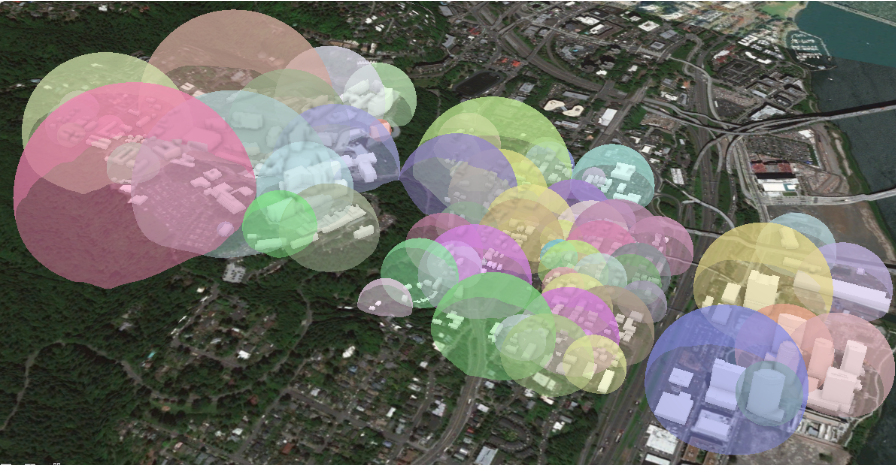
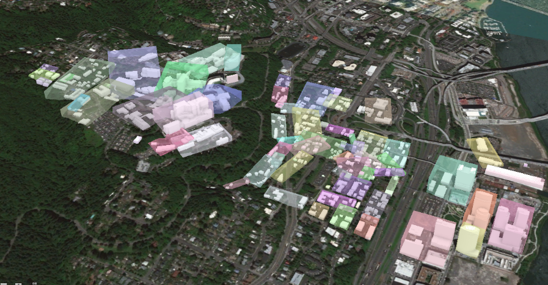

[TOC]

防走丢：[https://github.com/Esri/i3s-spec/blob/master/format/Indexed%203d%20Scene%20Layer%20Format%20Specification.md](https://github.com/Esri/i3s-spec/blob/master/format/Indexed 3d Scene Layer Format Specification.md)


# 1 简介

i3s 用于显示大量三维地理空间数据。

当前，i3s 有如下几种类型：

- 三维模型（3D Object）：例如，三维精细模型
- 集成格网（Integrated Mesh）：例如，倾斜摄影模型
- 点（Point）：例如，路灯和树
- 点云（Point Cloud）：点云数据，las等
- 建筑（Building）：BIM数据而来

i3s 标准仍然在演进，可以在官方仓库中获取 `i3s converter` 程序对版本进行管理。i3s 的历史：[Version History of I3S](https://github.com/Esri/i3s-spec/blob/master/README.md)

i3s 数据被树结构切分成 `节点(Node)`，节点的树状结构信息保存在 `节点索引页(Node Page)` 中。

节点包含所有它包括的要素的描述信息，例如几何、纹理、属性等。

节点索引页包括 空间范围框、子节点引用、计数、LOD等级等信息。

对 i3s 数据的访问，既可以使用 i3s 服务，使用 RESTful API进行访问每一个节点，也可以使用 slpk 单文件进行传递分发。

# 2 i3s的结构

## 2.1 树结构

为了实现高性能的3d渲染，数据要被分组成`节点(Node)`。

分组的过程，就是递归创建树解构。四叉树、R树都支持。

一个节点的空间范围框，是由它的所有子节点构成的，这样就有了层级结构。

`空间范围框(Bounding Volume, 意译)`，有两种定义法：`Minimum Bounding Sphere, MBS(最小范围球体)`、`Oriented Bounding Box, OBB(定向范围长方体)`。





官方推荐 `OBB` 来实现每个节点的边界框。点云格式仅支持OBB.

为了实现原始数据的可伸缩性，也即LOD，父级节点包含了子节点的简化形式。


### 2.1.1 节点（Nodes）

i3s把数据按树解构拆分，每一份叫一个节点。每个节点的所有资源都在其空间范围框内。

每个节点都有一个id，使得客户端能有效定位、加载节点资源。

#### ① 要素（Feature）

`要素(Feature)`，表示一个真实世界的对象，它位于节点中，节点是要素的容器。例如，点云类型的i3s中的点，3D对象类型的i3s中的建筑物。

要素有一个`object-ID`（笔者注：和gdb里的二维要素差不多）。

一个要素可以包括的数据有：几何二进制数据、属性数据等。如果一个要素因为LOD的需要，而出现在多个节点中，那么每个节点都会得到一份独立的属性数据。这种冗余式属性存储允许节点之间独立渲染。

5种i3s类型中，支持要素的情况如下表：

| 类型 | Integrated Mesh | 3D Object | Points | Point Clouds | Building Scene Layer |
| ---- | --------------- | --------- | ------ | ------------ | -------------------- |
| 支持 |                 | √         | √      |              | √                    |

#### ② 节点资源（Node resources）

除了空间范围框，节点还引用了资源。原始数据和i3s类型决定了节点资源的类型。

前端（或者程序）必须使用节点的id来访问资源。

虽然节点的id和资源的id可以相匹配，但是i3s规范没有这么要求。

| 节点资源   | Integrated Mesh | 3D Object | Points | Point Clouds | Building Scene Layer |
| ---------- | --------------- | --------- | ------ | ------------ | -------------------- |
| 几何二进制 | √               | √         |        | √            | √                    |
| 属性数据   |                 | √         | √      | √            | √                    |
| 纹理贴图   | √               | √         |        |              | √                    |

有一些节点资源是为了向1.6版本兼容的（当前版本是1.7）：

| 节点资源                        | Integrated Mesh | 3D Object | Building Scene Layer |
| ------------------------------- | --------------- | --------- | -------------------- |
| 共享资源（sharedResources）     | √               | √         | √                    |
| 节点文档（3dNodeIndexDocument） | √               | √         | √                    |

##### A 几何数据

几何数据是根据i3s图层类型不同而有不同的属性的，例如，`Integrated Mesh` 类型的几何数据包括：顶点属性、要素计数、Mesh分段。

在1.7版本中，`3D Objects` 和  `Integrated Mesh` 类型的几何数据，均使用 Google Draco 压缩算法来压缩数据量。在1.6以及更早版本中，`3D Objects` 和 `Integrated Mesh` 类型的几何数据定义在 [defaultGeometrySchema](https://github.com/Esri/i3s-spec/blob/master/docs/1.6/defaultGeometrySchema.cmn.md) 中定义。

在所有的几何数据中，三角形/表面的顺序是逆时针方向。

`Point` 和 `Point Cloud` 类型的几何数据就是点，前者的几何数据定义在 [featureData](https://github.com/Esri/i3s-spec/blob/master/docs/1.6/defaultGeometrySchema.cmn.md) 中，后者的几何数据是二进制的，压缩算法是 `kepcc-xyz`.

##### B 属性数据

节点中要素的属性数据是独立的，每个字段被称为属性。属性用于要素的可视化、查询。

例如，假如有一列属性是土地利用代码，那么可以给不同的土地利用代码赋予颜色，以便在图层可视化时看到不同类型的土地利用。

属性数据的数量和图层中的字段数量对应。

每个要素的属性值的顺序，和要素的几何部分在几何二进制数据中的顺序是一致的。（有点拗口）这样，程序就能高效地渲染每个节点，以数组的形式访问数据而不是用 `object-id` 来检索属性。

属性数据的元数据可通过 scene layer 访问到。当图层中存在属性时，`fields` 数组和 `attributeStorageInfo` 数组中其他的信息会更详细地描述每个属性。见帮助文档：[fields](https://github.com/Esri/i3s-spec/blob/master/docs/1.7/field.cmn.md) 、[attributeStorageInfo](https://github.com/Esri/i3s-spec/blob/master/docs/1.7/attributeStorageInfo.cmn.md)

点图层使用 [attributeInfo](https://github.com/Esri/i3s-spec/blob/master/docs/2.0/attributeInfo.pcsl.md) 。

##### C 纹理

纹理资源（数据）包括图像文件。纹理将作为二进制资源存储。所有的纹理数据汇总成为一个纹理集合（即一张图就包括了所有小纹理图像）。

渲染程序处理uv坐标的能力不同，所以得使用纹理坐标。

然而，并不会直接把纹理集合的纹理坐标拿来使用，渲染程序更希望使用小纹理图像的数据值及其纹理坐标，来处理纹理集合中的重复纹理。（这段翻译得很费解，原文不大看得懂）

更多细节查阅文档：[texture](https://github.com/Esri/i3s-spec/blob/master/docs/1.7/texture.cmn.md) ，[textureSetDefinition](https://github.com/Esri/i3s-spec/blob/master/docs/1.7/textureSetDefinition.cmn.md)

##### 补充：1.6以及更早版本的节点资源

为了兼容1.6以及更早版本的i3s，1.7版本的i3s标准中，节点资源仍需要包括 `3dNodeIndexDocument` 和`shareResources` 资源，其中后者包括节点的材料定义。

### 2.1.2 节点索引页（Node Page）

在1.6以及更早的版本中，每个节点的元数据都存储在 `3dNodeIndexDocument` 资源中（即每个节点下的一个同名压缩文件）。这样一旦小文件的请求变多，遍历节点树结构的性能将受到影响。

1.7版本的i3s把每个节点的 `3dNodeIndexDocument` 资源打包集中到一个 `Node Pages` 资源中，树结构将变成一维数组。


开发者可以自由编排节点在一维数组中的顺序，例如深度优先或广度优先等。在1.7版本的i3s中，节点的id是一个整数，表示该一维数组中节点的索引号。上图是广度优先。

## 2.2 统计信息

统计信息文档：[statistics](https://github.com/Esri/i3s-spec/blob/master/docs/1.7/stats.cmn.md)

可以利用统计信息来符号化，这样能避免读取所有数据再进行统计。（类似于ArcGIS中对栅格数据的统计）

例如，如果要做唯一值符号化，则可以使用统计信息中的唯一值情况来符号化。

除了用于符号化，统计信息还用于过滤数据。

## 2.3 坐标系统

i3s 标准中的坐标系统信息支持 WKT 格式，WKT 格式的定义可在 OGC 简单要素 规范中找到。不仅如此，还支持上述 WKT 格式的升级版，标准号为 *CRS/ISO 19162:2015* . 前者被记作 WKT1，后者被记作WKT2.

两种都可以，官方更推荐使用 WKT2 格式。

WKT1 格式不支持明确指定坐标轴的顺序，所以在数据实现时要额外注意这一点。注意并不是所有的ArcGIS产品都支持WKT2 格式。

选择坐标系时应考虑如下因素：

- 尽可能减少重投影计算
- 在地理坐标系和投影坐标系中进行渲染
- 数据的范围应支持到全球
- 支持高精度的局部或全局数据

i3s 规范支持两种坐标模式：全局和局部。

全局，即全球范围，仅支持 `EPSG:4326` 和 `EPSG:4490` 两个全球地理坐标系统。

局部，即局部范围，支持其他坐标系，包括投影坐标系统。

在这两种模式下，节点的索引和顶点坐标都必须使用同一个坐标系。

注意：**为了压缩数据量，顶点位置坐标都是相对于当前节点空间范围框的中心的。**空间范围框见上文。

所有顶点坐标都使用测地坐标系统（包括空间直角坐标系），其中xyz三轴坐标的单位都是一样的。

坐标轴顺序：如果坐标系的 WKT 信息包含轴顺序，那么就用它。如果不包含则使用如下顺序：

```
正东、正北、高度
```

高度轴始终指向天空，即从地球球心射出。

因此，i3s 数据要使用全局模式，即全球范围，必须满足以下要求：

首先，使用 `EPSG:4326` 或 `EPSG:4490` 地理坐标系，数据也要是这俩坐标系下的：

- 顶点坐标中的x和y值、范围的x和y分量均使用十进制度为单位
- 高程值使用米作为单位（顶点坐标中的z值）
- 空间范围框的半径（如果是MBS）或 `halfSize(半长)`（对于OBB）单位为米

i3s 数据要使用局部模式，必须满足以下要求：

所有顶点位置均使用测地坐标系统，均由 EPSG 代号指定。如果 EPSG 代号不是 4326 或 4490，那么都被视作局部模式。

- 顶点坐标的三个分量xyz值，以及空间范围框的半径（如果是MBS）或半长（如果是OBB）单位都是一样的

坐标系的详细定义见文档： [spatial reference](https://github.com/Esri/i3s-spec/blob/master/docs/1.7/spatialReference.cmn.md) 

## 2.4 高程模型

i3s 标准支持基于椭球（基于椭球面）或基于重力有关（基于大地水准面）的高程坐标系。

1.5版本，i3s 加入了对高程坐标系的支持。现在，使用 WKT 来指定高程坐标系统。

在坐标系属性中，包括了坐标系的 WKID 和一个 高程坐标系的 WKID（VcsWKID）。

使用者可使用 `3dSceneLayerInfo` 资源中的 `heightModelInfo` 属性来指定 i3s 数据的高度模型是正交的，还是与重力相关的（不太明白，总之可以自由指定，以适应不同的领域）。

# 3 i3s服务和数据文件

## 3.1 i3s服务

i3s 服务遵循 RESTful API 访问。

## 3.2 数据文件——slpk

i3s 数据最终可以打包为一个后缀名为 `slpk` 的文件，该文件是一个zip格式的压缩包，但是，该压缩包的压缩级别是 "未压缩"。如果使用 7-zip程序进行压缩，则压缩级别为 "STORE（仅存储）"。

对于每个节点的资源，例如几何二进制数据，则使用 gzip 压缩。jpg和png文件除外（笔者猜测可能是因为png和jpg已经有压缩了，再 gzip 压缩没有什么提高）。

压缩包可以是 32 位的，也可以是 64 位的，如果数据量大于 2GB，则需要用 64 位的。

**注意：必须使用"STORE (仅存储)"压缩整个 slpk，不要使用其他压缩模式。**

### ① 文件扩展名

slpk 文件需要扩展名来辨别文件类型。

例如：

- .jpg
- .png
- .bin.dds
- .json

### ② 哈希校验

在 1.7 版本的 i3s 中，使用 MD5 哈希来缩短加载时间。

哈希值写在 slpk 根目录的最后一个文件的文件名上，格式是 `@XXXXXXX@`。

### ③ 社区版本1.7的slpk结构

```
.\example_17.slpk
	+--nodePages
	|  +--0.json.gz
	|  +-- (...)
	+--nodes
	|  +--root
	|  |  +--3dNodeIndexDocument.json.gz
	|  +--0
	|  |  +--attributes
	|  |  |  +--f_0
	|  |  |  |  +--0.bin.gz
	|  |  |  +--(...)
	|  |  +--features
	|  |  |  +-- 0.json.gz
	|  |  |  +--(...)
	|  |  +--geometries
	|  |  |  +-- 0.bin.gz
	|  |  |  +--(...)
	|  |  +--textures
	|  |  |  +--0.jpg
	|  |  |  +--0_0_1.bin.dds.gz
	|  |  |  +--(...)
	|  |  +--shared 
	|  |  |  +--sharedResource.json.gz
	|  |  + 3dNodeIndexDocument.json.gz
	|  +--(...)
	+--statistics
	|  +--f_1
	|  |  +--0.json.gz
	|  +--(...)
	+--3dSceneLayer.json.gz
	+--@specialIndexFileHASH128@
```

物理路径和RESTful API路径的对比：

| 资源名称             | 物理路径                               | RESTful URL             |
| -------------------- | -------------------------------------- | ----------------------- |
| 场景图层文档         | 3dSceneLayer.json.gz                   | layers/0                |
| 旧版本的节点描述文档 | /nodes/4/3dNodeIndexDocument.json.gz   | layers/0/nodes/4        |
| 旧版本的共享资源     | /nodes/4/shared/sharedResource.json.gz | layers/0/nodes/4/shared |

### ④ 社区版本1.6的slpk结构

```
.\example_16.slpk
	+--nodes
	|  +--root
	|  |  +--3dNodeIndexDocument.json.gz
	|  +--0
	|  |  +--attributes
	|  |  |  +--f_0
	|  |  |  |  +--0.bin.gz
	|  |  |  +--(...)
	|  |  +--features
	|  |  |  +--0.json.gz
	|  |  |  +--(...)
	|  |  +--geometries
	|  |  |  +--0.bin.gz
	|  |  |  +--(...)
	|  |  +--textures
	|  |  |  +--0.jpg
	|  |  |  +--0_0_1.bin.dds.gz
	|  |  |  +--(...)
	|  |  +--shared 
	|  |  |  +--sharedResource.json.gz
	|  |  +--3dNodeIndexDocument.json.gz
	|  +--0-0
	|  |  +--(...)
	|  +--0-0-0
	|  |  +--(...)
	|  +--1 
	|  |  +--(...)
	|  +--1-0
	|  |  +--(...)
	|  +--1-0-0
	|  |  +--(...)
	|  +--(...)
	+--statistics
	|  +--f_1
	|  |  +--0.json.gz
	|  +-- (...)
	+--3dSceneLayer.json.gz
	+--metadata.json
```