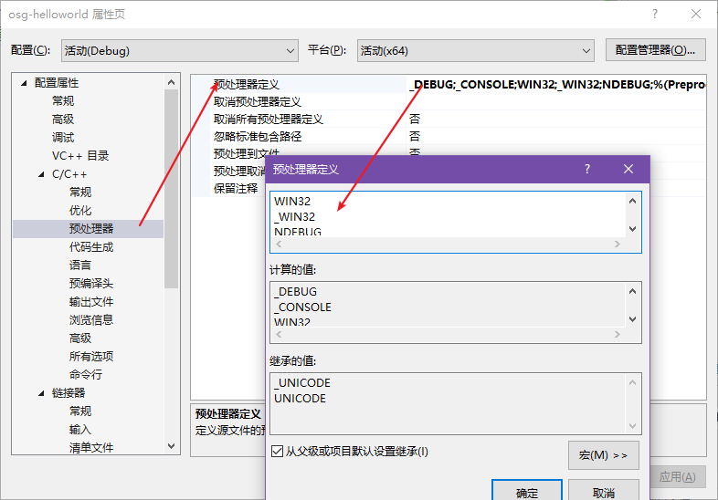
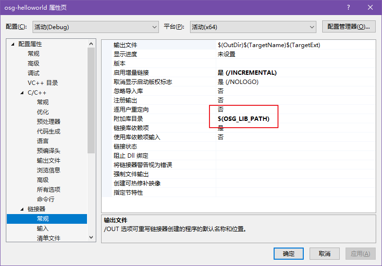
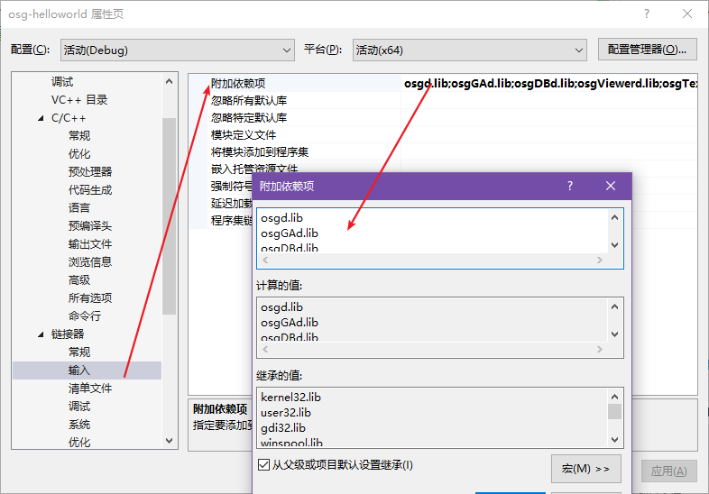

# OSG

## 1. 下载安装

选择稳定版

http://www.openscenegraph.org/index.php/download-section/stable-releases

找到 `Binaries` 连接，下载官方编译版（如果你愿意，下载 GitHub 上的源代码自己编译也可以）

官方编译版下载地址：https://objexx.com/OpenSceneGraph.html

有 Debug 和 Release 两个版本供下载，下载 Debug 版本，3.6.5版本约为 97MB.

### 配置环境变量

| 变量名           | 值                                               |
| ---------------- | ------------------------------------------------ |
| OSG_ROOT         | C:\SDKs\osg\OpenSceneGraph-3.6.5-VC2019-64-Debug |
| OSG_BIN_PATH     | %OSG_ROOT%\bin                                   |
| OSG_INCLUDE_PATH | %OSG_ROOT%\include                               |
| OSG_LIB_PATH     | %OSG_ROOT%\lib                                   |
| OSG_SAMPLES_PATH | 此项可选                                         |
| OSG_FILE_PATH    | 此项可选，设置为你存放 osg 文件的地方即可        |

然后添加环境变量到 Path 变量中：

- %OSG_BIN_PATH%
- %OSG_SAMPLES_PATH%

此后，在命令行输入

``` BASH
# debug版本后面要多个d字母
osgversiond 
# release不需要
osgversion
```

若能输出版本信息，则安装成功

## 2. 创建程序

### ① 创建vc++项目

菜单`文件` → `新建` → `项目`，选择Visual C++的空项目，确定。

工具栏中选择`Debug`、`x64`。

新建源文件`main.cpp`，写一个空的main函数，运行一下。

更改项目属性：

- C/C++ - 常规 - 附加包含目录：`$(OSG_INCLUDE_PATH)`
- C/C++ - 预处理器 - 预处理器定义：`WIN32`、`_WIN32`、`NDEBUG`（回车符分隔）
- 链接器 - 常规 - 附加库目录：`$(OSG_LIB_PATH)`
- 链接器 - 输入 - 附加依赖项：`osgd.lib`、`osgGAd.lib`、`osgDBd.lib`、`osgViewerd.lib`、`osgTextd.lib`、`osgUtild.lib`、`OpenThreadsd.lib`（回车符分隔）

### ② 编写代码

main.cpp内容：

``` cpp
#include <osgViewer/Viewer>
#include <osgDB/ReadFile>

int main() {
	osg::ref_ptr<osgViewer::Viewer> viewer = new osgViewer::Viewer; //创建查看器
	osg::ref_ptr<osg::Node> node = osgDB::readNodeFile("../Tile_+000_+000.osgt"); //读取模型文件，赋值给节点指针
	viewer->setSceneData(node.get()); //查看器中添加该节点
	return viewer->run(); //运行查看器
}
```

或者你只想简单的读取数据

``` CPP
#include <osgDB/ReadFile>

int main() {
	osg::ref_ptr<osg::Node> node = osgDB::readNodeFile("../Tile_+000_+000.osgt"); //读取模型文件，赋值给节点指针
	return 0;
}
```

# 文件指南

## osgt

文本文件，osg单节点的文本存储格式


## osgb

二进制文件，osg单节点的二进制存储格式


## osg::Node

这个类代表上述文件的对象实现，使用 `osgDB::readNodeFile()` 函数即可读取。

# 示例vc项目截图






