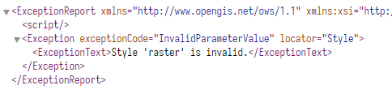

# 1 参数讲解

代码举例

```js
viewer.imageryLayers.addImageryProvider(new Cesium.WebMapTileServiceImageryProvider({
  url: "http://IP:PORT/geoserver/gwc/service/wmts/rest/<workspaceName>:<layerName>/{style}/{TileMatrixSet}/{TileMatrix}/{TileRow}/{TileCol}?format=image/png",
  layer: "<workspaceName>:<layerName>",
  style: "",
  format: "image/png",
  tileMatrixSetID: "EPSG:900913",
  maximumLevel: 19,
  rectangle: Cesium.Rectangle.fromDegrees(113.50936889628237, 22.09581971749892, 113.61167907681623, 22.227454797804754)
}))

viewer.camera.flyTo({
  destination: Cesium.Cartesian3.fromDegrees(113.55, 22.11, 25000.0)
})
```

## 前提知识：WMTS 的功能描述接口

``` 
http://IP:PORT/geoserver/gwc/service/wmts?REQUEST=GetCapabilities
```

返回的是一个 XML，描述了当前 geoserver 服务器提供的 WMTS 的所有功能、资源。

## ① url

url 在 WMTS 的功能描述接口中的 `<ResourceURL>` 标签获取，层级为：

``` xml
<Capabilities>
  <Contents>
    <Layer>
      <ResourceURL ...></ResourceURL>
    </Layer>
  </Contents>
</Capabilities>
```

在 2.19 版本的 GeoServer 中，获取 `template` URL 似乎并不能直接用在 Cesium 的 `WebMapTileServiceImageryProvider` API，例如：

```
http://IP:PORT/geoserver/gwc/service/wmts/rest/<workspaceName>:<layerName>/{style}/{TileMatrixSet}/{TileMatrix}/{TileRow}/{TileCol}?format=image/png
```

要将其中的  `{TileMatrix}` 改成 `{TileMatrixSet}:{TileMatrix}`，方可访问。

我不是很明白为何，我的数据使用的是 3857 坐标系，发布的时候，在 GWC 中预切 9~18 级的瓦片。

## ② style

栅格影像的默认样式名称是 "raster"，但是我填 "raster" 有时候会报错，设为空字符串后就不报错了，原因不明。

矢量数据的 WMTS 可以考虑使用 "default"。

## ③ format

如果是 jpeg 格式，无数据区是白色的，即不透明。


建议使用 png，因为大多数地图是不规则的。

## ④ tileMatrixSetID

填功能描述接口文档中此 WMTS 服务的 `<ows:Identifier>` 标签内的值，即 `TileMatrixSet` 的 ID。

此处用的是：

 

## ⑤ maximumLevel

指定瓦片最细层级，此处设为19，因为下载的谷歌影像再放大就没意义了

## ⑥ rectangle

这个参数很关键，可以从功能描述接口文档获取：

```xml
<Capabilities>
  <Contents>
    <Layer>
      <ows:WGS84BoundingBox>/* HERE */</ows:WGS84BoundingBox>
    </Layer>
  </Contents>
</Capabilities>
```

指定此参数后，就不会在命令行里疯狂 log 获取不到瓦片的警告了：

```
An error occurred in "WebMapTileServiceImageryProvider": Failed to obtain image tile X: 834 Y: 446 Level: 10.
An error occurred in "WebMapTileServiceImageryProvider": Failed to obtain image tile X: 835 Y: 448 Level: 10.
...
```


# 2 已遇到的问题

## ① 报 CROS 错误（跨域）

https://princessgod.github.io/GeoserverConfig/post/cors.html

参考此文，开启 GeoServer 的跨域即可，你的 GeoServer 可能是 Jetty 或者 Tomcat 当 WebApp 容器，此文介绍的是 Jetty 的开启方法。

通常可能是：

- https 的页面访问 http 服务 或者反过来
- 未对 webapp（即geoserver）设置跨域

## ② 400之样式报错



见上面关于 style 参数的设置

## ③ Failed to obtain image tile 报错

见上面关于 rectangle 参数是设置，设置后可大幅度减少此报错信息，有时候还是会有的。


# 3. 调优

除了设置 访问最大层级参数、rectangle参数外，还可以进行 gwc 预制瓦片切片、开启 webapp 的 gzip 功能（添加 image/png、image/jpeg），以提高单机访问性能。

多机则考虑部署 geoserver 集群。

