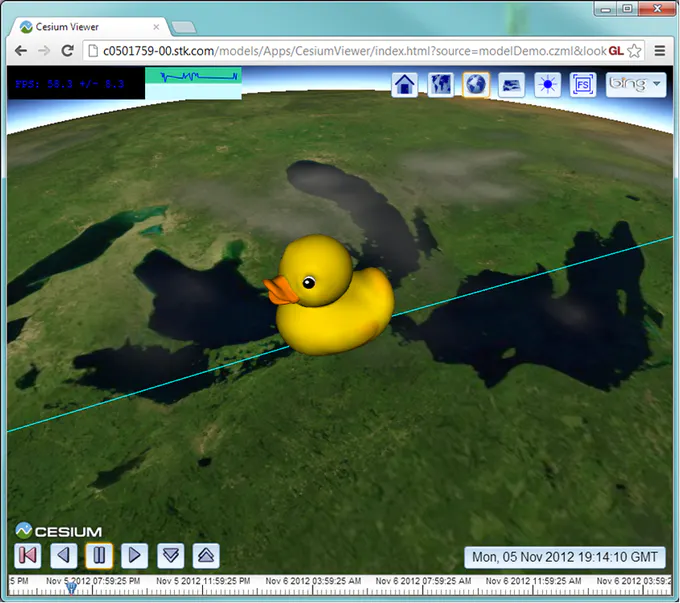
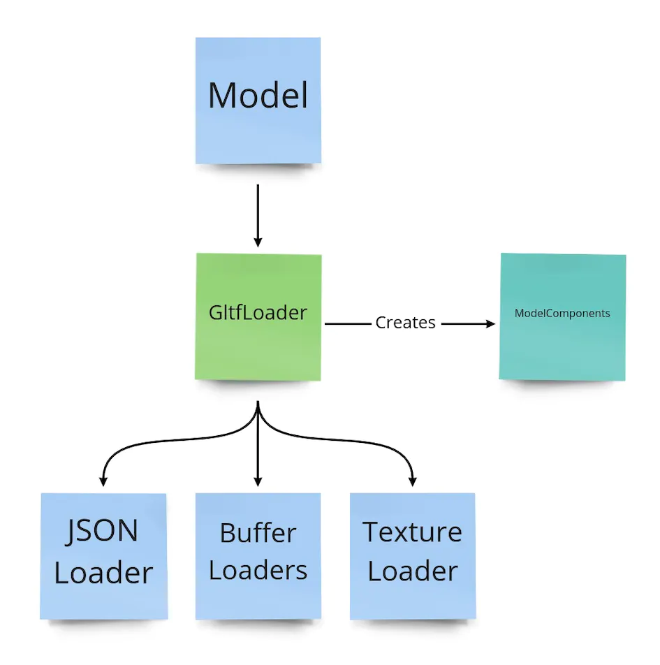
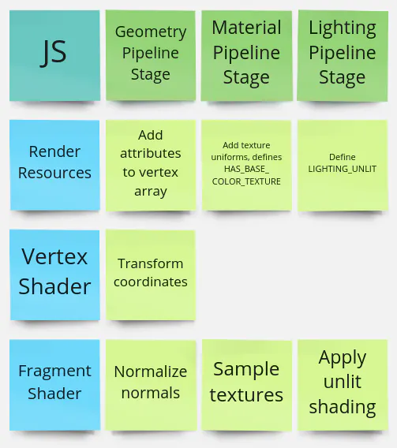
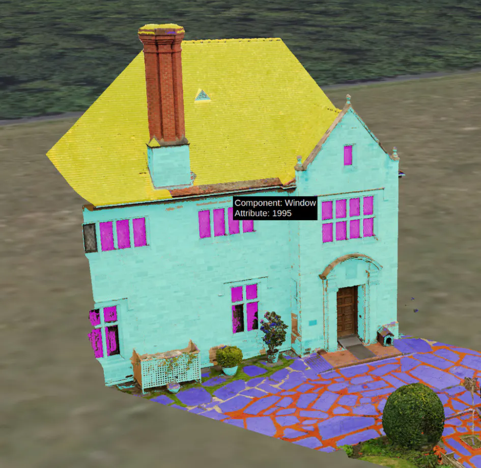
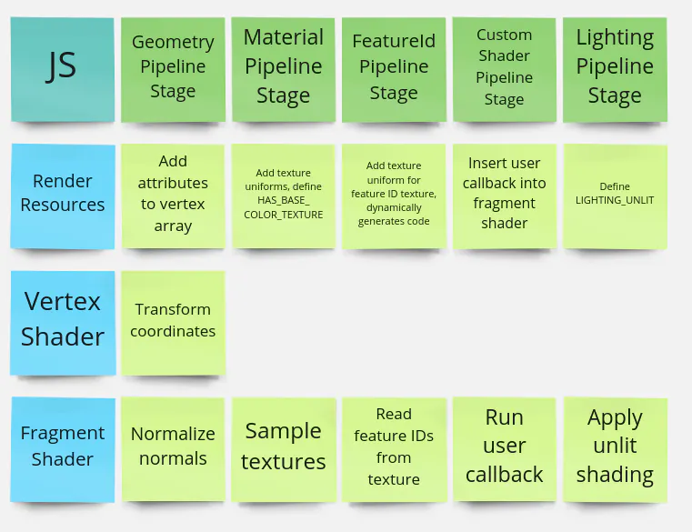
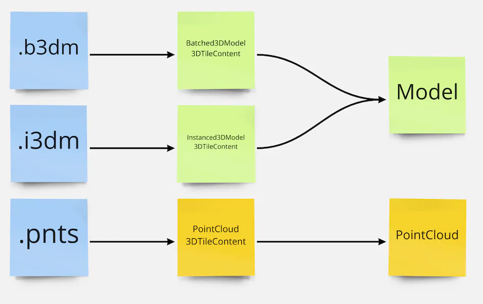
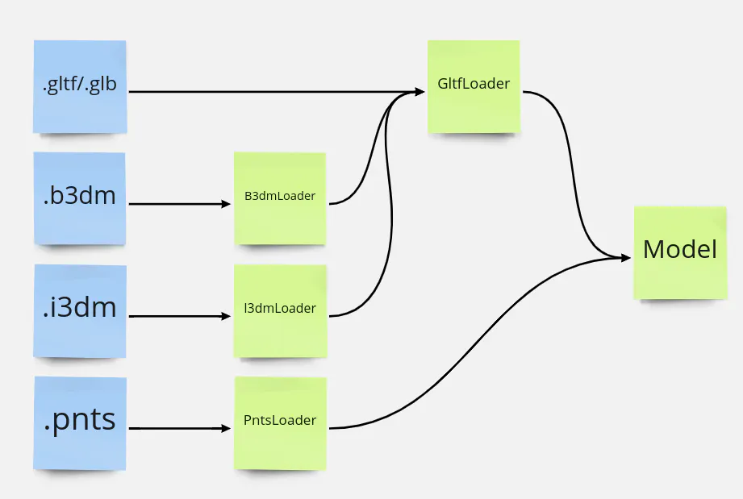

> 原文：https://cesium.com/blog/2022/10/05/tour-of-the-new-gltf-architecture-in-cesiumjs/

CesiumJS 和 glTF 之间有一段很长的合作关系。在 2012 年，CesiumJS 就实现了一个 glTF 加载器，是最早的一批加载器了，当时的 glTF 叫做“WebGLTF”。

这十年间，发生了很多事情。glTF 1.0 规范发布、glTF 1.0 的嵌入式着色器演进成 glTF 2.0 的 PBR 材质，glTF 的社区扩展也在蓬勃生长。最近发布的 [下一代 3DTiles](https://cesium.com/blog/2021/11/10/introducing-3d-tiles-next/) 直接使用了 glTF，并允许在顶点粒度上去编码属性元数据。

这么多年经验积累下来，官方团队已经知悉了社区在实践中是如何使用 glTF 和 3DTiles 的，现在是时候把积累变现规划未来了。

为了实现一个更强的加载器，需要有一套完整的设计，设计目标如下：

- 将 glTF 的 **加载** 和模型的 **渲染** 解耦
- 支持逐顶点粒度的属性元数据
- 支持自定义着色器，并且在着色器的拼接上要做到可扩展
- 缓存纹理对象，当纹理在不同的模型间共享时，降低内存占用
- 与 3DTiles 中的其它瓦片格式（例如 pnts）建立更明晰的结合点
- 提高或至少不能低于原有的加载、渲染性能

虽然在公共 API 的调用层面来说，几乎没有改变，但是底层付出的努力可以说是釜底抽薪了。



上图为著名的 COLLADA 鸭子模型，在 2012 年转换成 glTF 并加载的效果

# 1. 加载一个 glTF 模型

`Model` 类将模型的加载、解析职能分离到一些“资源加载类”。

首先是 `GltfLoader` 类，这个类负责获取 `.glb` 或 `.gltf` 文件，以及连带的任何外部资源，例如二进制文件、贴图图像文件等；glTF 的 JSON 部分经由一系列转换后，会生成一个 `ModelComponents` 对象，这个对象的结构和 glTF 自己的 JSON 部分很相似，但很多属性都由 CesiumJS 自己的对象来填充。例如，glTF 纹理对象被转换为 CesiumJS 的 `Texture` 实例，还有几个辅助函数和类用于解析来自下一代 3DTiles 引入的 `EXT_mesh_features`、`EXT_structural_metadata` 扩展，以获取更丰富的信息。



上图：`GltfLoader` 解析 glTF 文件，将其载入内存中，生成 `ModelComponents` 对象。`GltfLoader` 还会用到其它几个子 Loader 分解任务，例如加载纹理或上载顶点缓冲到 GPU

glTF 允许通过共享资源来降低存储空间、网络传输带宽压力、处理时间。这个机制可以发生在很多个抽象层之间。例如，两个 glTF 的 `primitive` 对象可以共享同一个几何缓冲区，但是用不同的材质对象。或者，两个不同的 glTF 文件引用相同的纹理贴图文件。在运行时，同一个 glTF 在场景中可能会渲染多处；在上述这些情况中，数据资源应当只需要加载一次，然后尽可能地重复利用。

现在，CesiumJS 的新 `Model` 架构（类）使用一个全局的 `ResourceCache` 类来存储那些需要被共享的资源，例如纹理、二进制缓冲、glTF 的 JSON 部分等。当加载程序代码需要一个资源的时候，首先就会检查缓存。一旦命中缓存，那么被缓存的资源就计数+1，并返回该资源。只有缓存中没有这份所需的资源时，才会加载它到内存中。无论某个资源是单个 glTF 内部、多个 glTF 共享或单个 glTF 的多份副本共享，它只加载一次到内存中。

这种缓存机制对加载 3DTiles 是有帮助的，这些瓦片有可能会共享纹理贴图。之前的 glTF 加载架构没有为纹理设置全局缓存，现在具备这个机制后可以大大减少内存的占用。


上图：在 *San Diego* 这个 3DTiles 数据集中，使用新的 `Model` 架构内存从原来的 564 MB 降至 344 MB

需要注意的是，即使具备全局资源缓存机制，巨大的场景仍需加载大量的外部资源，为了确保数据尽可能地高效传递，CesiumJS 使用了并行方式发出网络请求，逼近浏览器的极限。

# 2. 着色器优先的模型渲染设计

新的 `Model` 架构显示出了更强的灵活性，官方团队也希望在渲染上同样具备灵活性。**渲染一个 glTF 是一个复杂的任务。** glTF 规范允许多种多样的材质、特性，例如动画等。此外，CesiumJS 增加了许多运行时的功能，例如拾取、样式化、自定义着色器。所以，官方团队希望有一个可维护的设计来长期处理这些规范细节。

在准备一个模型的渲染中，最复杂的部分就是为其生成 GLSL 着色器代码，团队一开始就以这个为出发点，在 3D 图形开发中，有两种方式来生成复杂的着色器。

第一种，就是“超级着色器”，所有的情况尽可能地写在一个大大的 GLSL 文件中，并使用不同的预处理宏来选择代码，告诉编译器在运行时选择哪一部分来编译、执行。GLSL 代码可以分别存储在独立的 glsl 文本文件中，与 JavaScript 代码解耦。对于着色器内的算法、流程事先已经知道的情况，这种设计是很不错的。

例如，所有的 glTF 材质均遵循 PBR 渲染算法，根据 glTF 的材质对象来决定使用哪些纹理和唯一值（Uniform）。详细举例，设一些模型使用有纹理的材质，而另一些模型使用常量的漫反射颜色时，下面是 `MaterialStageFS.glsl` 着色器代码实现的简单摘要：

```glsl
vec4 baseColorWithAlpha = vec4(1.0);
#ifdef HAS_BASE_COLOR_TEXTURE
baseColorWithAlpha = texture2D(u_baseColorTexture, baseColorTexCoords).rgb;
#elif HAS_BASE_COLOR_FACTOR
baseColorWithAlpha = u_baseColorFactor.rgb;
#endif

float occlusion = 1.0;
#ifdef HAS_OCCLUSION_TEXTURE
occlusion = texture2D(u_occlusionTexture, occlusionTexCoords).r;
#endif
```

译者注：通过宏定义来覆盖 glTF 所用 PBR 材质算法的各种分支情况，例如这个代码片段中的基础漫反射颜色（`baseColorWithAlpha`）以及遮挡因子（`occlusion`）。

第二种，就是在运行时动态生成着色器代码。当影响的因素是不确定的时候（例如某些属性可能不存在，也可能存在），这种设计的优势就体现出来了。

例如，当一个模型在做蒙皮变换时，权重和关节矩阵的数量是 glTF 里面决定的，着色器并不会提前知道。动态生成代码比 `#ifdef` 宏能提供更好的逻辑，但是这种机制会出现 JavaScript 和 GLSL 代码的大量交错重叠，不利于代码阅读。

因此，动态着色器代码的生成都要谨慎地进行，以保持可维护性。下面代码片段是旧版的 `processPbrMaterials.js` 实现：

```glsl
if (hasNormals) {
  techniqueAttributes.a_normal = {
    semantic: "NORMAL",
  };
  vertexShader += "attribute vec3 a_normal;\n";
  if (!isUnlit) {
    vertexShader += "varying vec3 v_normal;\n";
    if (hasSkinning) {
      vertexShaderMain +=
        "    v_normal = u_normalMatrix * mat3(skinMatrix) * weightedNormal;\n";
    } else {
      vertexShaderMain += "    v_normal = u_normalMatrix * weightedNormal;\n";
    }
    fragmentShader += "varying vec3 v_normal;\n";
  }
  fragmentShader += "varying vec3 v_positionEC;\n";
}
```

在新的 `Model` 架构中，官方团队希望把这两种着色器设计的优点集中起来：将每个着色器划分为一连串的逻辑步骤，称之为“管线阶段（Pipeline Stages）”。每个管线阶段都是一个 GLSL 函数，可在 main 函数中调用。有一些阶段可以通过 `#define` 宏来启用/禁用，但是着色器中的步骤、顺序是固定的，这意味着 main 函数就是第一种“超级着色器”的升级版，下面是 `ModelFS.glsl` 着色器代码的简单摘录：

```glsl
void main() {
  // Material colors and other settings to pass through the pipelines
  czm_modelMaterial material = defaultModelMaterial();


  // Process varyings and store them in a struct for any stage that needs
  // attribute values.
  ProcessedAttributes attributes;
  geometryStage(attributes);

  // Sample textures and configure the material
  materialStage(material, attributes);

  // If a style was applied, apply the style color
  #ifdef HAS_CPU_STYLE
  cpuStylingStage(material, selectedFeature);
  #endif  

  // If the user provided a CustomShader, run this GLSL code.
  #ifdef HAS_CUSTOM_FRAGMENT_SHADER
  customShaderStage(material, attributes);
  #endif


  // The lighting stage always runs. It either does PBR shading when LIGHTING_PBR
  // is defined, or unlit shading when LIGHTING_UNLIT is defined.
  lightingStage(material);

  // Handle alpha blending
  gl_FragColor = handleAlpha(material.diffuse, material.alpha);
}
```

结果着色器的各个管线阶段函数，既可以提前内置写好（即“超级着色器”风格），也可以由 JavaScript 代码动态拼接，哪种合适用哪种。

例如，材质管线阶段就使用了一个“超级着色器”，因为 glTF 的材质使用一套固定的材质格式和唯一值（Uniform），参考 `MaterialStageFS.glsl`。其它的管线阶段，例如要素ID管线阶段，就必须根据 glTF 中提供的顶点属性或者纹理的数量大小来动态生成对应的 GLSL 函数体代码。沙盒中的例子 `3D Tiles Next Photogrammetry` 由 JavaScript 生成的 GLSL 代码片段如下：

```glsl
// This model has one set of texture coordinates. Other models may have 0 or more of them.
void setDynamicVaryings(inout ProcessedAttributes attributes) {
    attributes.texCoord_0 = v_texCoord_0;
}

// This model has 2 feature ID textures, so two lines of code are generated.
// Other models might store feature IDs in attributes rather than textures so different code
// would be generated.
void initializeFeatureIds(out FeatureIds featureIds, ProcessedAttributes attributes) {
    featureIds.featureId_0 = czm_unpackUint(texture2D(u_featureIdTexture_0, v_texCoord_0).r);
    featureIds.featureId_1 = czm_unpackUint(texture2D(u_featureIdTexture_1, v_texCoord_0).r);
}
```


上图：上面提及的倾斜摄影模型的截图

有了这套新的 GLSL 着色器代码设计，就可以适应各种用户的需求，使用 CesiumJS 扩展出不同的用法。而且新的设计更加模块化，因为每个管线阶段都是自己的功能，互不影响。所以可以轻而易举地定义出新的“着色阶段”来增加新的想要的效果。此外，内置的 GLSL 管线阶段代码被存储在独立的 glsl 文件中（在 `Shaders/Model` 文件夹下），与 JavaScript 代码解耦合。

# 3. 模型渲染管线

在 CesiumJS 中，准备渲染模型的 JS 代码就体现出模型的着色器管线结构。上一节提及的管线阶段，被命名为 `XXXPipelineStage`，作为一种 JavaScript 模块存在。管线的输入和输出是“渲染资源”，是 GPU 即将渲染的图元所需的一系列资源、设定值。渲染资源有很多属性，主要的是：

* 一个 `ShaderBuilder` 实例 - 辅助对象，可以逐步创建出 GLSL 着色器程序
* VertexAttribute 缓冲数组
* 一个唯一值对象（uniform map）- 一堆能返回唯一值的函数，集成在一个 JavaScript 对象中
* 一系列配置 WebGL 的状态值，例如深度检测或背面剔除等

大多数 JavaScript 管线阶段在顶点着色器（例如 `DequantizationPipelineStage.js`）、片段着色器（例如 `LightingPipelineStage.js`）或二者均有（例如 `GeometryPipelineStage.js`）中定义了一个对应的 GLSL 管线阶段函数。不过这并不是强制要求，一些管线阶段则会修改渲染资源的某些部分（例如 `AlphaPipelineStage.js`）。

管线的目标，是创建出可以发送给 CesiumJS 渲染引擎的绘制指令（DrawCommand）。

> 想了解更多 CesiumJS 的渲染帧的细节，可以参考这篇文章 [Cesium 博客 - CesiumJS 中的图形技术](https://cesium.com/blog/2015/05/14/graphics-tech-in-cesium/)

创建绘制指令的流程如下：

* 为图元配置管线。用到的管线阶段将组成一个数组，其它没用到的就跳过。参考 `ModelRuntimePrimitive.configurePipeline()` 方法；
* 创建一个空的渲染资源对象；
* 执行管线。将渲染资源对象传入管线阶段对象数组中的每个阶段，每个阶段对象将对渲染资源对象顺序作用；
* 此时渲染资源配置完毕，为图元创建一个 `ModelDrawCommand` 实例；
* 在每一帧，调用 `ModelDrawCommand.pushCommands()` 方法，将当时的绘图指令推送到 `frameState.commandList` 中；`ModelDrawCommand` 会自动处理 2D、半透明等指令。

关于构建和执行管线的完整代码，参考 `ModelSceneGraph.buildDrawCommands()` 方法。

## 3.1. 管线举例

让我们看一个例子来深入讨论管线阶段。首先，考虑一个没有灯光、有纹理的模型，这是比较简单的情况，所以管线只有几个阶段。


上图：一个倾斜摄影建筑物模型，基础颜色是预先烘焙的，所以没使用光照

* 几何管线阶段（GeometryPipelineStage）：
  * JavaScript 的任务：将 glTF Primitive 对象的 VertexAttribute 添加到 DrawCommand 对象的 VertexArray 属性中，并将 `geometryStage()` 函数添加到顶点着色器代码和片元着色器代码中；
  * 顶点着色器的任务：把顶点坐标（position）和法线（normal）从模型坐标系（或模型空间）转换至视坐标系（视空间），并作交换值（varying），最后还作了投影变换，将顶点坐标转换至裁剪坐标（裁剪空间）下，交予 `gl_Position`；
  * 片元着色器的任务：对插值后的法线进行归一化处理
* 材质管线阶段（MaterialPipelineStage）：
  * JavaScript 的任务：将 `materialStage()` 函数添加到片元着色器代码中，并为基础色纹理定义一个唯一值（uniform），设置 `HAS_BASE_COLOR_TEXTURE` 宏，以及设置光照模型为 `UNLIT`
  * 片元着色器的任务：从基础色纹理中采样，并将结果值存到材质结构体中，这个材质结构体会向下呈递给光照管线阶段
* 光照管线阶段（LightingPipelineStage）：
  * JavaScript 的任务：添加 `lightingStage()` 函数到片元着色器代码中，并给片元着色器代码中的 `LIGHTING_UNLIT` 宏一个定义；
  * 片元着色器的任务：从上一个阶段，也就是材质管线阶段中获得材质结构体，并应用光照。在这个例子中，无光照模式（UnlitLighting）会返回未经修改的漫反射颜色。如果模型使用 PBR 材质，那么这个阶段会应用 glTF 规范中对应的光照效果。



上图：上述例子的逻辑示意图，每个管线阶段都有 JavaScript 代码更新渲染资源，大部分管线阶段会向顶点着色器、片元着色器添加对应的代码

现在，我们来看一个使用新功能的例子。使用 glTF 的扩展 `EXT_mesh_features` 能为每个顶点附加分类信息，然后使用一个 `CustomShader` 来将顶点的分类信息（译者注：也就是要素样式化）可视化，代码见下：

```javascript
model.customShader = new Cesium.CustomShader({
  fragmentShaderText: `
  #define ROOF 0
  #define WALL 1
  void fragmentMain(FragmentInput fsInput, inout czm_modelMaterial material) {
    int featureId = fsInput.featureIds.featureId_0;
    if (featureId == ROOF) {
      material.diffuse *= vec3(1.0, 1.0, 0.0);
    } else if (featureId == WALL) {
      material.diffuse *= vec4(0.0, 1.0, 1.0);
    }
    // …and similar for other features.
  }
  `
});
```

可视化结果：



上图：为模型应用 CustomShader 来突出显示各个三维要素

将上面所有的功能都齐备，模型渲染管线的完整版即：

* 几何管线阶段（GeometryPipelineStage）：和前一个例子描述的一样
* 材质管线阶段（MaterialPipelineStage）：和前一个例子描述的一样
* 要素ID管线阶段（FeatureIdPipelineStage）：
  * JavaScript 的任务：动态生成片元着色器代码，此时 JS 的任务是把所有的要素 ID 集中至一个名为 FeatureIds 的结构体中；在这个例子，只有一个要素ID纹理需要处理，在其它的例子中要素ID可能存储在顶点属性（VertexAttribute）中；
  * 片元着色器的任务：动态生成的片元着色器会从要素ID纹理中读取要素ID的值，并存至 `FeatureIds` 结构体中；
* 自定义着色器管线阶段（CustomShaderPipelineStage）：
  * JavaScript 的任务：检验 `CustomShader` 并在运行时决定是否需要更新顶点着色器、片元着色器和唯一值对象（UniformMap）。在这个例子中，它（自定义着色器）把开发者传进来的 `fragmentMain()` 函数添加到片元着色器中；
  * 片元着色器的任务：`customShaderStage()` 是一个包装函数，它会收集输入参数和材质参数，并调用 `fragmentMain(fsInput, material)` 函数，所以这意味着材质在光照阶段之前就应用了自定义着色器；
* 光照管线阶段（LightingPipelineStage）：和前一个例子描述的一样



上图：具备自定义着色器的例子含两个额外的阶段，一个用于处理要素ID，一个用于添加自定义着色器代码

除了上述两个例子列出的管线阶段之外，还有其它的管线阶段，有的是对 glTF 五花八门扩展的实现，例如实例化、网格量化，有些则是对 CesiumJS 特有功能的实现，例如点云衰减、裁剪效果。这些模块化设计的管线阶段，使得在渲染管线添加新的效果更容易了。

# 4. 与 3DTiles 集成

这次新设计不仅让 glTF 在 CesiumJS 中的渲染变得更科学，还让 CesiumJS 的 3DTiles 规范与 glTF 的结合更加容易了。

在 3DTiles 中，每个瓦片数据集（tileset）包含一棵瓦片空间索引树，每个瓦片可能会引用一个瓦片文件。在 3DTiles 1.0 中，批次3D模型（Batched 3D Model，b3dm）格式就是 glTF 的一种封装，它主要添加了一个包含每个 3D 要素的属性的批次表（BatchTable）；而对于实例三维模型（Instanced 3D Model，i3dm）也包含了一个 glTF 模型以及一个实例变换表。

在 CesiumJS 中，这两个瓦片格式的代码实现由两个 `Cesium3DTileContent` 的子类完成，之前这两个类都基于旧版 Model 类实现。

对于点云类型（pnts），则不使用 glTF，它有自己的代码实现。



上图：在 3DTiles 1.0 中，glTF 文件没有直接被引用，而且点云文件格式的实现与其它两种不同

在下一代的 3DTiles 中（也就是未来的 3DTiles 1.1），瓦片数据集（tileset）将可以直接引用 glTF 格式的内容，即 glb/gltf 文件。旧版的瓦片格式现在被“视作” glTF 格式加一些扩展来解析成 `Model` 对象，例如：

* `.b3dm` 格式被视为 glTF + `EXT_structural_metadata` 扩展
* `.i3dm` 格式被视为 glTF + `EXT_mesh_gpu_instancing` 扩展
* `.pnts` 格式也可以直接当其为 glTF 的原生点格式。



上图：glTF 解析成 Model 对象的路线图，所有的 3DTiles 1.0 瓦片格式也都在运行时进行了升级、兼容转换为新版的 Model 对象

除了简化 Model 架构的代码外，这个新的架构在 3DTiles 的使用中得到了一个高度一致的开发体验，例如自定义着色器对所有的内容都是一致的。

# 5. 译者的话

早在 3DTiles Next 还在孵化阶段的时候，我就注意到官方在对 Model.js 模块动手脚，但是那时还不具备对 CesiumJS 整体框架了解的能力。

有时候就是那么灵光一现，突破自己，在翻译、阅读、学习完毕 `3DTiles 1.1` + `CesiumJS 2022` 系列后，加上早两年就熟悉的 glTF 规范，终于等到了这个全新的 Model 架构发布。

CesiumJS 团队对 glTF 规范是有推动作用的，早年的 glb 叫做 bgltf，最终在 glTF2.0 中才转正，这个就是 CesiumJS 的贡献，其余的贡献也还有，就不细说了。

这个 Model 架构也算是给 glTF、3DTiles 生态翻开了新的一页了，科学的体系，又不失强大的灵活扩展余地，便于后续升级改造，群里已经有小伙伴基于此套架构改出了更好看的 PBR 效果。

国内任重道远。
