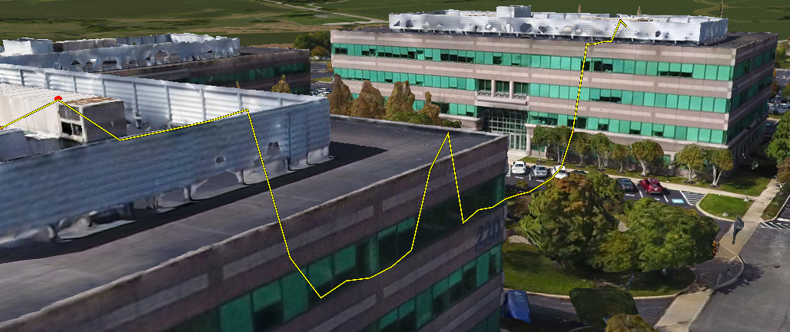
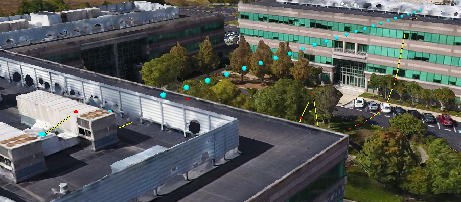

模型深度检测

# Entity 与 Cesium3DTileset 遮挡问题

起因：

已开启深度检测

``` JS
viewer.scene.globe.depthTestAgainstTerrain = true;
```

但是，在一个官方的例子 “Sample Height from 3D Tiles” 中发现 Polyline Entity 仍旧被 3DTiles 遮挡



# 解决方法

我观察到采样线的代码中添加了这个属性：

``` JS
depthFailMaterial: new Cesium.PolylineOutlineMaterialProperty(
  {
    color: Cesium.Color.YELLOW,
  }
),
```

把它去掉，深度检测就起作用了。

``` js
viewer.entities.add({
  polyline: {
    positions: clampedCartesians,
    arcType: Cesium.ArcType.NONE,
    width: 2,
    material: new Cesium.PolylineOutlineMaterialProperty({
      color: Cesium.Color.YELLOW,
    }),
    /* depthFailMaterial: new Cesium.PolylineOutlineMaterialProperty(
            {
              color: Cesium.Color.YELLOW,
            }
          ),*/ 
  },
});
```

如下图所示：



（我添加了采样点以便观察）