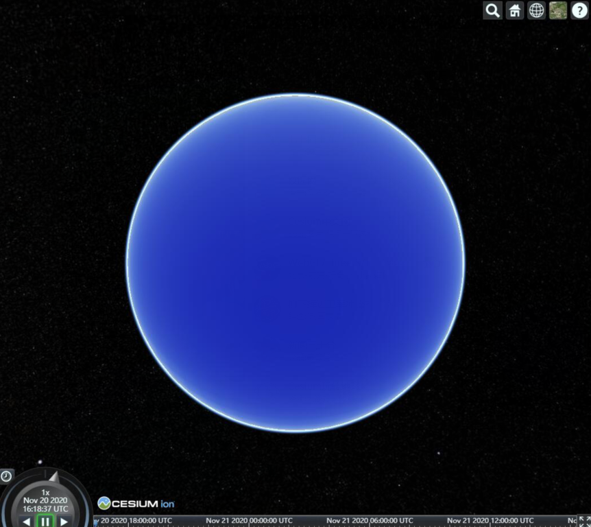
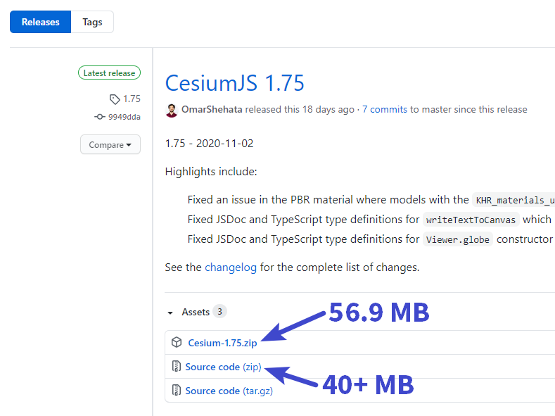
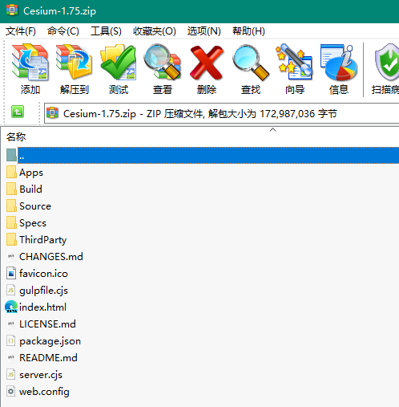
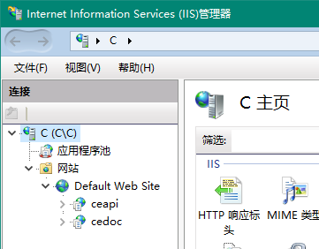

Cesium 入门

- 从启动一个地球说起
- 几个概念：Viewer、Scene、Camera、Globe、Ellipsoid、Provider、DataSource、Entity、Primitive
- 学科背景：线性代数（解析立体几何）、基本的地图学知识、计算机图形学概念
- 专题一 地球表面的数据：Provider和DataSource
- 专题二 空间中的数据：Entity和Primitive
- 专题三 互操作：与场景中的数据进行交互
- 专题四 高度灵活反而容易成脱缰之马的世界规模级别三位标准：3dTiles
- 专题五 最让入门的人感到迷惑的坐标转换之图解
- 专题六 领导最喜欢的特效：光、粒子系统，图形学硬骨头与着色器编程简介
- 专题七 Cesium提供的时间魔法：Property 机制
- 源代码的风格与对其不足的浅表性认识
- 尾声 物质基础决定上层建筑


# 1. 从启动一个地球说起

> 为了简便，全篇使用官方打包的版本，以简单的 script 标签引入。在前端框架里使用并不属于这个系列的初衷，请自己研究。

你只需要复制如下代码，保存到一个 html 文件，使用 http 环境打开就可以看到 Cesium 创建的三维地球了。前端基础自己提前准备。

``` html
<script src="https://cesium.com/downloads/cesiumjs/releases/1.75/Build/Cesium/Cesium.js"></script>
<link href="https://cesium.com/downloads/cesiumjs/releases/1.75/Build/Cesium/Widgets/widgets.css" rel="stylesheet">
<body onload="main()">
  <div id="container"></div>
  <script>
  	function main() {
      const viewer = new Cesium.Viewer('container')
    }
  </script>    
</body>
```


为了方便在调试窗口（F12快捷键可以呼出）查看这个最重要的 `viewer` 对象，我们可以这么写 main 函数：

``` JS
function main() {
  Object.defineProperty(window, 'viewer', {
      value: new Cesium.Viewer('container')
  })
}
```

或者使用简单的写法：

``` js
function main() {
  window.viewer = new Cesium.Viewer('container')
}
```

大概像这样子：


## 你可能遇到的问题

### ① 地球半天出不来乌黑的宇宙飘荡

Cesium 默认会调用 Cesium 官方提供的卫星底图，假设读者知道 OGC 的二维地图服务标准，以后就简述为 “Cesium官方影像服务” 或近似说法。

而 Cesium 的提供的影像服务服务器并不在国内，有可能是你的环境访问不通畅，或者压根儿就访问不到，自己想办法吧。

### ② 官网说要设置访问令牌（token）

喜欢看官网入门的读者或许会看到这么一行代码：

``` JS
Cesium.Ion.defaultAccessToken = 'your_access_token';
```

这是让你设置全局的默认访问令牌，用于访问官方提供的全球影像、全球高程服务。如果你有兴趣，可以到官方网站注册账号并获取一个访问令牌。

当然，网络环境不好的朋友想使用官方内置的令牌访问全球影像、全球地形，可能就得忍受一下了，我估计那个时候的地球椭球是一个蓝色的球，啥东西都没吧。



# 2. 你或许想用离线的库

上方引入的 Cesium.js、widgets.css 是官方网站的连接，其中 `1.75` 是版本号。

## 2.1. Cesium 的更新频率

通常，Cesium 会在月初前几天（一般是第一个工作日）发布最新版 Cesium，例如 2020 年 12 月将发布 1.76 版本。

从测试版到正式版，Cesium 已经发布了 100 多个版本了，算上之前不稳定的更新频率，估计也有 8 年的样子。

## 2.2. 下载 api（官方打包版）并使用

在 GitHub 上可以下载到未打包的源码，在官方网站和 GitHub 的发布页可以下载到官方使用 gulp 打包工具给你生成的打包版 api。

通常官方打包版会略大于源代码包（截图自 GitHub [发布页]([Releases · CesiumGS/cesium (github.com)](https://github.com/CesiumGS/cesium/releases))）：



使用最新或最近几个版本的官方打包版即可。

### ① 官方打包包的结构



熟悉 nodejs 和 npm 的读者应该不难看出，这个是一个 commonjs 规范的 nodejs 包。

其中，有几个重要的项需要说明：

- `Build`：内含 `Cesium`、`CesiumUnminified` 和 `Documentation` 三个目录，分别是 **适用于生产发布环境的去掉报错、警告且压缩后的版本（入口文件是其下的 Cesium.js）**、**适用于开发调试没有压缩的版本（入口文件是其下的 Cesium.js）**、**开发API参考手册**。
- `Source`：源代码目录，之后会简单介绍 Cesium 源代码的风格
- `ThirdParty`：第三方库
- `Apps`：官方给你提供的示例代码等，但是不是直接打开文件夹就能看的，待会会说怎么用
- `Specs`：我也不知道是干啥的
- `CHANGES.md`：更新日志
- `gulpfile.cjs`：gulp 打包配置文件
- `index.html`、`server.cjs`：后者是 nodejs 十分老牌的后端框架 express 的代码文件，用于架起本地开发环境，包括文档、示例程序等连接均会集中在 index.html 中。

其他的如果不是很懂，我的建议是不要动。

### ② 复制 `Build/CesiumUnminified` 目录至代码项目中

例如：


这样你就可以愉快地本地引用了：

``` HTML
<script src="https://cesium.com/downloads/cesiumjs/releases/1.75/Build/Cesium/Cesium.js"></script>
<link href="https://cesium.com/downloads/cesiumjs/releases/1.75/Build/Cesium/Widgets/widgets.css" rel="stylesheet">
```

当然，运行也是要使用 http 环境的。

# 3. 架起本地开发环境

这一步需要 nodejs 和 npm 前端工程的基础，不会的到处去学学。

定位到 package.json 所在的目录下，运行

```  BASH
npm i
npm run start
```

如果下载太慢请设置 npm 的淘宝源。

以上是为了使用 express 环境启动示例代码、在线文档罢了。

如果你不喜欢 `node_modules` 黑洞，那么可以把官方打包包解压到你喜欢的地方，并令根目录下的 index.html 为当前目录的主页发布出去即可，可以使用 nginx 或 iis。

例如我就在 IIS 上部署了文档和 api 本体：



应用程序 `ceapi` （也就是 `http://localhost/ceapi`）指向的是 `Build/CesiumUnminified` 目录，且设默认文档为 `Cesium.js`，这样就能访问 js api 了：


同理，`cedoc` （也就是 `http://localhost/cedoc` 指向的是解压后的根目录，默认文档是 `index.html`：


这跟用 `npm run start` 出来的是一样的，挂 IIS 还省事。不过为了开发学习，我仍旧建议使用 nginx，多学学怎么配置的。

如果你图省事，IIS 可以满足你了。

IIS 部署不再赘述。

# 4. 小结

你现在可以用鼠标左键变换看的方向，用鼠标中键滚动控制放大缩小，用鼠标中键拖动平移视角，用鼠标右键拖动无极缩放，好像什么都做不了。

你可能还想启动后飞跃到你喜欢的位置，比如你的城市，加载一些数据等等，但这都不重要：

本篇 Hello “World” 的目的已经达到了不是吗？