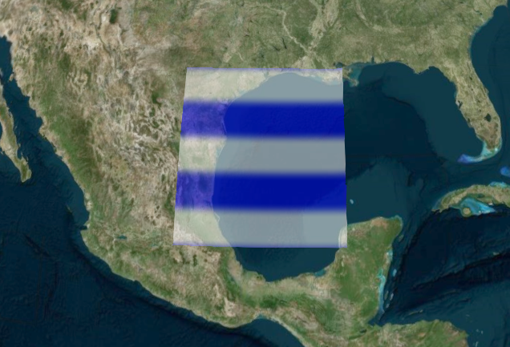
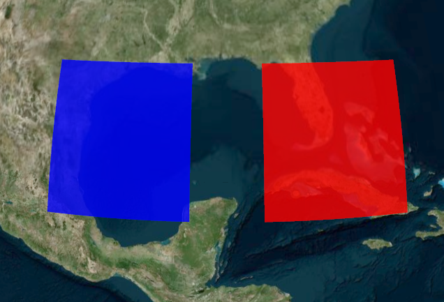
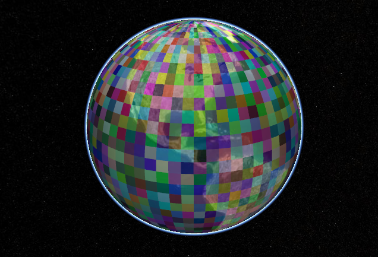
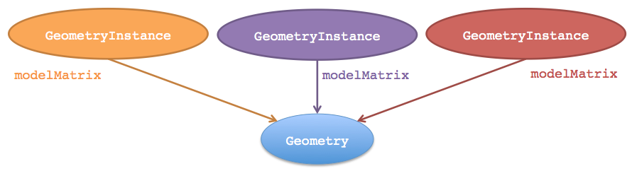
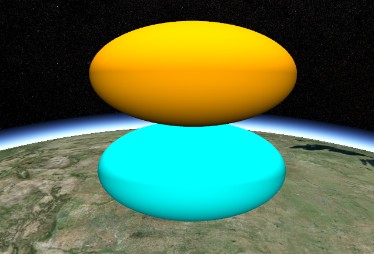
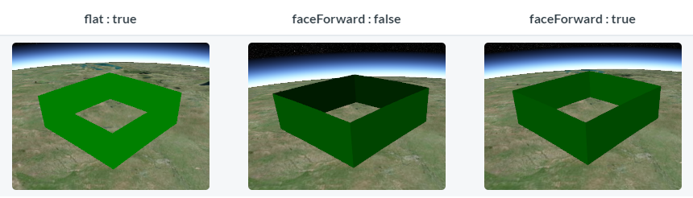

[自定义几何形状和外观](https://cesium.com/docs/tutorials/geometry-and-appearances)

这篇教程介绍的是 Primitive API 有关的资料，适合高级用户。想快速绘制各种形状，建议参考 Entity API。

# 1. 几何概述

Cesium 可以创建 Entity API 创建各种几何图形，例如绘制一个矩形：

``` JS
viewer.entities.add({
  rectangle : {
    coordinates : Cesium.Rectangle.fromDegrees(-100.0, 20.0, -90.0, 30.0),
    material : new Cesium.StripeMaterialProperty({
      evenColor: Cesium.Color.WHITE,
      oddColor: Cesium.Color.BLUE,
      repeat: 5
    })
  }
});
```



这是一个很常见的例子。

在本教程中，将深入研究 Primitive API：使用 Geometry 和 Appearance 来构造几何图形。

使用 Primitive API 中的 Geometry 和 Appearance 的好处是：

- **性能**：当需要绘制大量静态图形时，使用 Primitive API 可以将图形组合成一个大图形，减少 CPU 的开销，更充分利用 GPU；使用 WebWorker 性能更佳。
- **灵活性**：Primitive 主要是由 Geometry 和 Appearance 构成的。解耦它们，就可以分别修改它们。
- **更底层**：Appearance 提供了接近底层的编程风格，但是你又不需要考虑 WebGL 的细节，可以轻松达到：
  - 编写完整的 GLSL 顶点、片元着色器
  - 自定义渲染

缺点也是有的：

- 需要更复杂的代码，也需要额外的图形学知识。Primitive API 更接近传统三维引擎的编程。
- 组合图形对动态数据不一定有效。

使用 Primitive API 重写上面的代码：

``` JS
var instance = new Cesium.GeometryInstance({
  geometry : new Cesium.RectangleGeometry({
    rectangle : Cesium.Rectangle.fromDegrees(-100.0, 20.0, -90.0, 30.0),
    vertexFormat : Cesium.EllipsoidSurfaceAppearance.VERTEX_FORMAT
  })
});

scene.primitives.add(new Cesium.Primitive({
  geometryInstances : instance,
  appearance : new Cesium.EllipsoidSurfaceAppearance({
    material : Cesium.Material.fromType('Stripe')
  })
}));
```

GeometryInstance 是 Geometry 的容器，当前只有一个 Geometry。

为了创建矩形，使用 RectangleGeometry：


因为它是地面的矩形，所以使用 `EllipsoidSurfaceAppearance` 这种外观，

# 2. 几何有哪些种类

十几种（有对应的线框模式），简单列举如下：


在沙盒中可以找到对应的示例代码（Geometries And Appearance）：


# 3. 组合几何形状

当你需要绘制多个静态的几何图形时，Primitive API 就有性能优势了。例如，可以在一个 Primitive 中组合两个矩形：

``` JS
const instance = new Cesium.GeometryInstance({
  geometry : new Cesium.RectangleGeometry({
    rectangle : Cesium.Rectangle.fromDegrees(-100.0, 20.0, -90.0, 30.0),
    vertexFormat : Cesium.EllipsoidSurfaceAppearance.VERTEX_FORMAT
  })
});

const anotherInstance = new Cesium.GeometryInstance({
  geometry : new Cesium.RectangleGeometry({
    rectangle : Cesium.Rectangle.fromDegrees(-85.0, 20.0, -75.0, 30.0),
    vertexFormat : Cesium.EllipsoidSurfaceAppearance.VERTEX_FORMAT
  })
});

scene.primitives.add(new Cesium.Primitive({
  geometryInstances : [instance, anotherInstance],
  appearance : new Cesium.EllipsoidSurfaceAppearance({
    material : Cesium.Material.fromType('Stripe')
  })
}));
```


创建了两个 geometry instance，共用了一个 appearance。

有一些 Appearance 允许使用 GeometryInstance 自己的属性来着色：

``` JS
const instance = new Cesium.GeometryInstance({
  geometry : // 和上面一样
  attributes : {
    color : new Cesium.ColorGeometryInstanceAttribute(0.0, 0.0, 1.0, 0.8)
  }
});

const anotherInstance = new Cesium.GeometryInstance({
  geometry : // 和上面一样
  attributes : {
    color : new Cesium.ColorGeometryInstanceAttribute(1.0, 0.0, 0.0, 0.8)
  }
});

scene.primitives.add(new Cesium.Primitive({
  geometryInstances : [instance, anotherInstance],
  appearance : new Cesium.PerInstanceColorAppearance()
}));
```

出来的效果：



每个 GeometryInstance 都带了一个 color attribute。

组合图形让 Cesium 能绘制大量几何图形，下例是 2592 个独立颜色的矩形：

``` JS
const instances = [];

for (let lon = -180.0; lon < 180.0; lon += 5.0) {
  for (let lat = -85.0; lat < 85.0; lat += 5.0) {
    instances.push(new Cesium.GeometryInstance({
      geometry : new Cesium.RectangleGeometry({
        rectangle : Cesium.Rectangle.fromDegrees(lon, lat, lon + 5.0, lat + 5.0),
        vertexFormat: Cesium.PerInstanceColorAppearance.VERTEX_FORMAT
      }),
      attributes : {
        color : Cesium.ColorGeometryInstanceAttribute.fromColor(Cesium.Color.fromRandom({alpha : 0.5}))
      }
    }));
  }
}

scene.primitives.add(new Cesium.Primitive({
  geometryInstances : instances,
  appearance : new Cesium.PerInstanceColorAppearance()
}));
```



# 4. 点击拾取

GeometryInstance 绘制后仍然是可以独立访问的，只需分配一个 id 即可。

``` JS
const instance = new Cesium.GeometryInstance({
  geometry : new Cesium.RectangleGeometry({
    rectangle : Cesium.Rectangle.fromDegrees(-100.0, 30.0, -90.0, 40.0),
    vertexFormat: Cesium.PerInstanceColorAppearance.VERTEX_FORMAT
  }),
  // 加了个id
  id : 'my rectangle',
  attributes : {
    color : Cesium.ColorGeometryInstanceAttribute.fromColor(Cesium.Color.RED)
  }
});

scene.primitives.add(new Cesium.Primitive({
  geometryInstances : instance,
  appearance : new Cesium.PerInstanceColorAppearance()
}));

// 当你点击的时候 控制台就刷出一句提示
var handler = new Cesium.ScreenSpaceEventHandler(scene.canvas);
handler.setInputAction(function (movement) {
    var pick = scene.pick(movement.position);
	  // pick.id 即 GeometryInstance.id
    if (Cesium.defined(pick) && (pick.id === 'my rectangle')) {
      console.log('Mouse clicked rectangle.');
    }
  }, Cesium.ScreenSpaceEventType.LEFT_CLICK);
```


# 5. 几何实例：instance 技术

Geometry 允许使用不同的转换矩阵，构造不同位置的 GeometryInstance，这样顶点数据只存了一份：



下面这个实例只创建一个椭球几何体，但是用不同的矩阵来表示不同的位置。

``` JS
const ellipsoidGeometry = new Cesium.EllipsoidGeometry({
    vertexFormat : Cesium.PerInstanceColorAppearance.VERTEX_FORMAT,
    radii : new Cesium.Cartesian3(300000.0, 200000.0, 150000.0)
});

const cyanEllipsoidInstance = new Cesium.GeometryInstance({
    geometry : ellipsoidGeometry, // 同一个几何
    modelMatrix : Cesium.Matrix4.multiplyByTranslation(
        Cesium.Transforms.eastNorthUpToFixedFrame(Cesium.Cartesian3.fromDegrees(-100.0, 40.0)),
        new Cesium.Cartesian3(0.0, 0.0, 150000.0),
        new Cesium.Matrix4()
    ),
    attributes : {
        color : Cesium.ColorGeometryInstanceAttribute.fromColor(Cesium.Color.CYAN)
    }
});

const orangeEllipsoidInstance = new Cesium.GeometryInstance({
    geometry : ellipsoidGeometry, // 同一个几何
    modelMatrix : Cesium.Matrix4.multiplyByTranslation(
        Cesium.Transforms.eastNorthUpToFixedFrame(Cesium.Cartesian3.fromDegrees(-100.0, 40.0)),
        new Cesium.Cartesian3(0.0, 0.0, 450000.0),
        new Cesium.Matrix4()
    ),
    attributes : {
        color : Cesium.ColorGeometryInstanceAttribute.fromColor(Cesium.Color.ORANGE)
    }
});

scene.primitives.add(new Cesium.Primitive({
    geometryInstances : [cyanEllipsoidInstance, orangeEllipsoidInstance],
    appearance : new Cesium.PerInstanceColorAppearance({
        translucent : false,
        closed : true
    })
}));
```



# 6. 更新几何实例的属性

绘制几何完成后，可以更新 GeometryInstance 的属性，包括：

- Color：确定 GeometryInstance 颜色的 `ColorGeometryInstanceAttribute` 对象，使用此属性，Primitive 必须使用的是 `PerInstanceColorAppearance`
- Show：布尔值，表达 GeometryInstance 是否可视。

``` JS
const circleInstance = new Cesium.GeometryInstance({
    geometry : new Cesium.CircleGeometry({
        center : Cesium.Cartesian3.fromDegrees(-95.0, 43.0),
        radius : 250000.0,
        vertexFormat : Cesium.PerInstanceColorAppearance.VERTEX_FORMAT
    }),
    attributes : {
        color : Cesium.ColorGeometryInstanceAttribute.fromColor(new Cesium.Color(1.0, 0.0, 0.0, 0.5))
    },
    id: 'circle'
});
const primitive = new Cesium.Primitive({
    geometryInstances : circleInstance,
    appearance : new Cesium.PerInstanceColorAppearance({
        translucent : false,
        closed : true
    })
});
scene.primitives.add(primitive);

setInterval(function() {
    var attributes = primitive.getGeometryInstanceAttributes('circle');
    attributes.color = Cesium.ColorGeometryInstanceAttribute.toValue(Cesium.Color.fromRandom({alpha : 1.0}));
},2000);
```

这个例子每隔2秒，颜色就会变化一次。

使用 primitive.`getGeometryInstanceAttributes('id')`  可以获取某个 GeometryInstance 的属性，当然，它的返回值的属性可以直接修改，像代码中的 `attributes.color = ...` 一样。

# 7. 几何的外观

几何只定义了结构，外观负责颜值。Primitive 可以有若干图几何，但是只能有一种外观。

Cesium 自带的外观如下：

- MaterialAppearance：适用于任何几何的外观，支持描述阴影的材质
- EllipsoidSurface：MaterialAppearance 的另一个版本，它假设几何形状是贴地的，这样计算顶点属性的时候可以节约一些内存
- PerInstanceColorAppearance：每个 GeometryInstance 的颜色是独立控制的外观
- PolylineMaterialAppearance：支持对折线进行着色
- PolylingColorAppearance：可以控制折线的点或者线段的颜色进行着色的外观

可以定义渲染状态，或者使用更高级的属性 `closed`、`translucent`，例如：

``` JS
// 不透明
var appearance  = new Cesium.PerInstanceColorAppearance({
  translucent : false,
  closed : true
});

// 这是比较底层的写法，效果与上面一样
var anotherAppearance  = new Cesium.PerInstanceColorAppearance({
  renderState : {
    depthTest : {
      enabled : true
    },
    cull : {
      enabled : true,
      face : Cesium.CullFace.BACK
    }
  }
});
```

创建外观后，是没办法改变它的 renderState 的，但是可以修改材质。

可以更改图元的外观属性，大多数外观有 flat 和 faceForward 属性，这两个属性间接控制着 GLSL 着色器。

- flat - 不考虑照明阴影的平面着色
- faceForward：当照明一个图元时，反转三角面的法线（也就是顶点法线），使背面看起来像正面，比如墙的内面着色。



# 8. 几何与外观的兼容性

并不是所有的外观都适合所有的几何。比如，EllipsoidSurfaceAppearance 不适合 WallGeometry，因为墙面是垂直地面的，并不贴地。

为了使得外观与几何图形兼容，它们的顶点格式必须匹配。指定 Geometry 的 vertexFormat 属性即可。

下图可以说明这个问题，当外观需要有 st（即纹理坐标）而 Geometry 没有时，就会报错：


外观类有 `VertexFormat` 静态属性，或外观对象有 `vertexFormat` 属性可供使用。

几何的 `vertexFormat` 是组合几何图形的因素，几何的类型可以不同，但是顶点的格式必须是一样的。

``` js
const geometry = new Ceisum.RectangleGeometry({
  vertexFormat : Ceisum.EllipsoidSurfaceAppearance.VERTEX_FORMAT
  // ...
});

const geometry2 = new Ceisum.RectangleGeometry({
  vertexFormat : Ceisum.PerInstanceColorAppearance.VERTEX_FORMAT
  // ...
});

const appearance = new Ceisum.MaterialAppearance(/* ... */);
const geometry3 = new Ceisum.RectangleGeometry({
  vertexFormat : appearance.vertexFormat
  // ...
});
```

> 译者注：顶点格式，即顶点的坐标、法线、uv（即st）、颜色等组合情况

# 9. 个人补充 Entity API vs Primitive API

Entity 用的是 Graphic，参数化创建图形，并可以参数符号化，几何形状和外观耦合在一起

Primitive 用的是 Geometry + Appearance，可以分别修改几何形状和外观。虽然有预定义的 Geometry，但是 Primitive API 提供的是更接近 WebGL 的接口，构造 Geometry 完全可以使用与 WebGL 十分接近的逻辑，传入顶点、法线等素材创建难以想象的形状。

Entity 拥有 Property 进行时间插值，Primitive 没有时间插值，需要深入着色器。

除此之外，Entity 在数据量特别大的情况下性能比 Primitive 差。