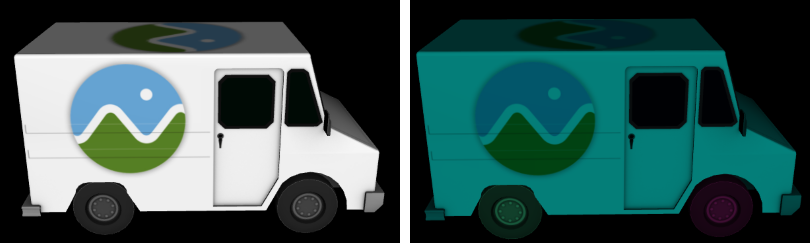
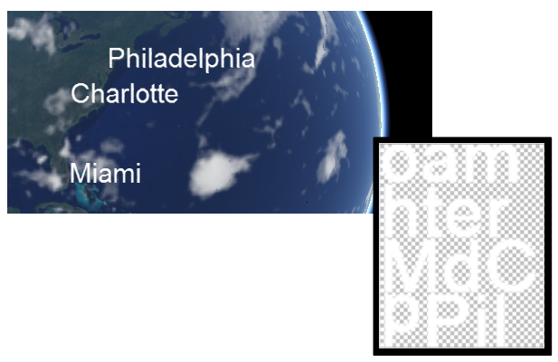

Cesium 和普通的图形引擎没什么区别，但是当对地球上事务抽象的逻辑层越来越多后，Cesium 中的类设计就越来越针对领域化了：虚拟地球。下面要介绍的是 Cesium 在图形技术栈的设计与普通图形引擎的不同之处。

像之前的文章说的一样，最底层是 `Renderer`，它是对 WebGL 层的封装，用来处理 WebGL 的资源调配以及**绘制命令**（Draw Command）的执行。**命令**（Command）一般是 **Draw Call** 以及其所需要的状态数据（例如着色器、顶点数据等）。

> 译者注：简而言之，Renderer 处理因数据和状态发生变化导致的 WebGL 绘制命令。

构建于 Renderer 层之上的是 Scene，即场景层。它负责将更高级的对象在场景中的改动分配、重排，最终将这些改变计算成 Renderer 层认识的指令，并交给 Renderer 层进行绘制。

最顶层是 Primitives （译名：图元层），构建于 Scene 层和 Renderer 层之上，代表的是真实世界的对象。


注意，此处的 Scene 特指 Scene.js 导出的 Scene 类。

Primitive 是一个具有自我更新功能的对象，这个函数将绘制命令添加到 Scene 的命令列表中。

> 译者注：在源代码中，命令列表似乎是 frameState 对象的属性，不过帧状态与 Scene 有很大关系。

# Globe

Globe 渲染了地球本体：地形、卫星影像和动态水面。

在游戏引擎中，这些就是环境因素。Cesium 的 Globe 是没有导航限制的，也就是说地图无限大。大多数游戏引擎是针对局部场景做了大量优化并整个加载进内存中进行运行。

Cesium 使用四叉树来组织层次细节模型。`QuadtreePrimitive` 在发布时不属于 API 的一部分，所以谨慎修改它。地形瓦片包括了几何图形，特定摄像机视角下的那些地形瓦片会非常逼近地球表面。

在 Cesium 运行的时候，多个影像图层的影像瓦片会映射到地形瓦片上，这样尽管在代码上有一些复杂（例如重投影等计算），换来的是对各种开放地图服务标准的支持。这与游戏引擎有很大的不同，游戏引擎会对地形和纹理进行组合优化成自定义的格式，但是缺少了灵活性和数据标准的通用性。

> 译者注：通用一般化和高性能往往是矛盾的

当 Scene 调用 Globe 的更新功能时，遍历四叉树，并返回关于地形瓦片更新的绘制命令。

每个绘制命令将影像瓦片的纹理引用过来，并由 Cesium 内部生成着色器。这些着色器基于重叠的影像瓦片的数量、光照、后处理操作、动态水面是否开启等信息而来。

调试模式查看绘制命令的代码如下：

``` JS
viewer.scene.debugShowCommands = true;
```

你可以在 Cesium Inspector 这个 widget 中查看绘制命令：


上图左边：使用了12个绘制命令渲染的地球；右边：每个命令可视化显示


上图左边：使用了186个命令来观察较大范围的 Crater Lake 的视野。右边：从不同的角度看的结果（显示了瓦片的坐标编号）。

地平线的视角难以优化，这也是3D比2D难得多的原因之一。

# Model

最复杂的图形应该算是 Model 了，它代表传统三维建模的模型，例如使用 Blender、Maya、3dmax 等的建模成果。在游戏引擎中，这些通常被称作模型，并且针对性地优化，制作特定的格式。

Cesium 使用的格式的 glTF，这是 Khronos 组织的一个标准，一个开放性的 WebGL 标准格式。Cesium 很早就注意到了这个格式，而不是选择自定义格式。

当 Scene 调用 Model 的更新功能时，模型会有针对性地遍历其层次结构，并令其所有新的变换（例如 glTF 的动画、模型的坐标转换、外观变化等）生效。有很多种方法能让这一个操作变得更快，例如快速裁剪技术和仅对目标子树设置动画。

> 译者注：以下两行文字已经过时，当时 Cesium 使用的 glTF 标准是 1.0，现在 2.0 已经没有这些了。

glTF 文件中可以直接获取着色器，对于拾取操作可以使用独立的着色器。glTF 的预定义规范（例如 `MODELVIEW`）被映射到 uniform 状态，并设置其为自动 uniform，例如 `czm_modelView`。

一个模型可能会在更新时返回一个或几百个命令，这取决于命令的编写方式、模型的材质有多少、动画物体的目标节点有多少。



上图左边：Cesium 奶牛车模型。右边：使用 5 个命令进行渲染（图中可以看到3个，车体亮绿色，两个车轮各一个颜色）

# Primitive

Cesium 的通用图元对象 —— Primitive，是 Cesium 有别于游戏引擎的最大特点之一。

游戏引擎通常使用尽可能少的图元，例如折线、球体、多边形，它们对调试和抬头显示（Head-Up Displays，HUDs）等极端显示比较有用。游戏引擎更专注环境、效果，例如光照、粒子系统和后处理操作。

在另一方面，Cesium 是一个大型的几何图形库，它能在地球上绘制常见的对象：折线、多边形、带拉伸成体块的形状等。大多数 Cesium 应用程序使用几何图形来绘制大部分它关注的内容。这就是跟游戏引擎大不一样的地方。

Cesium 的独特之处还在于，它的几何细分算法与椭球表面（WGS84椭球体）符合，而不是平面直角坐标系。

例如，多边形的三角化以及加面过程时，会加入椭球体的曲率计算。

这些中间计算使用 `Web Worker` 执行，从而支持 OGC 网络地图服务标准，和参数化几何形状的创建（而不是预先制作好的几何数据）。

为了最小化绘制命令数量，Cesium 将顶点数据格式相同的几何图形成批地推到单个顶点缓冲中，以便数据共享。

举个例子，（坐标+法线）的顶点数据组合不能和（坐标+法线+uv）合批，可能它们在外观上是一样的，但是它们所需要的顶点着色器、片元着色器是不一样的。

通过修改外观的顶点、片元着色器以生成最终的着色器，来支持相对于视角的高精度渲染、几何显示隐藏、单位向量压缩等功能。（这句话不知道讲什么）

几何图形流水线会对顶点属性进行相应的修改，例如法线压缩、高低坐标修改等。

# **Billboards、Labels、Points**

在游戏引擎中，Billboard 通常用于产生粒子效果，例如烟火。Cesium 的 billboard 更通用，它通常用于呈现运动的对象，例如下图所示的卫星和滑翔伞：


1.5w个卫星（SpaceBook应用，由 AGI 提供）


跳伞。

Cesium 的 billboard 比较灵活，例如显示、隐藏功能，像素偏移量、旋转等。这会产生一个结果：顶点数据比较大。所以 Cesium 会压缩顶点属性的个数。

着色器使用 GLSL 预处理器来关闭不必要的功能，例如如果 billboard 没有旋转，那么顶点着色器将不会进行任何旋转运算。Billboard 的顶点着色器非常复杂，但是它的片元着色器比较简单。这个在 Cesium 中很常见。大多数游戏引擎是反过来的，它们的 billboard 的顶点着色器比较简单，而片元着色器比较复杂。

Billboards 可以是静止的，也可以是动态的，也可以介于二者之间。例如 billboard 的 position 每帧都可能会变化，但是其他的属性则不会改变。为了有效解决这个问题，billboard 基于属性的具体用法，将顶点属性动态地分组到顶点缓存中，例如位置变化了其他顶点属性没变，则只更新顶点坐标。

为了减少绘制命令的数量，运行时将创建的和修改后的 billboard 成批地塞进一个集合中。这与游戏引擎是不同的，游戏引擎是创建的镜头纹理图集。

文本标签是用 billboard 实现的，每个字符都是一个 billboard。虽然每个字符都占内存，但是不会生成额外的绘制命令，因为使用了 “同纹理批处理技术”：



同纹理的批处理技术：有点类似于前端中的雪花图。

有时候 billboard 也能用来绘制点，例如上面提及的卫星图。从 Cesium 1.10 版本开始，绘制点用 Primitive API 可能效率更高。Primitive API 中的点对象不如 billboard 一样有普遍性，它的需求比较低，没有索引数据和纹理数据，所以性能较好。

# 其他

除了上面的 Primitive 外，还有：

- `ViewportQuad.js` 中的 ViewportQuad 类
- SkyBox、SkyAtmosphere、Sun、Moon
- Polyline：折线，起初实现起来并不容易（貌似是因为 WebGL 关于线的绘制问题？）

# 参考

[Bagnell13] Dan Bagnell. [Robust Polyline Rendering with WebGL](https://cesium.com/blog/2013/04/22/Robust-Polyline-Rendering-with-WebGL/). 2013.

[Bagnell15] Dan Bagnell. [Graphics Tech in Cesium - Vertex Compression](https://cesium.com/blog/2015/05/18/Vertex-Compression/). 2015.

[Ohlarik08] Deron Ohlarik. [Precisions, Precisions](http://help.agi.com/AGIComponents/html/BlogPrecisionsPrecisions.htm). 2008.

[Ring13] Kevin Ring. [Rendering the Whole Wide World on the World Wide Web](https://cesium.com/presentations/Rendering the Whole Wide World on the World Wide Web.pptx). 2013.

