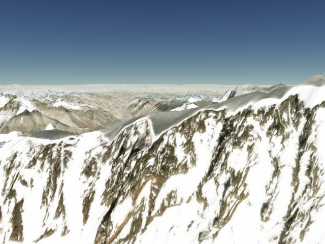
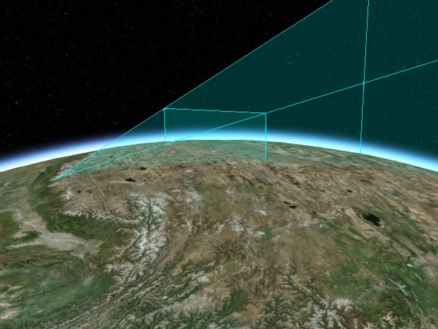
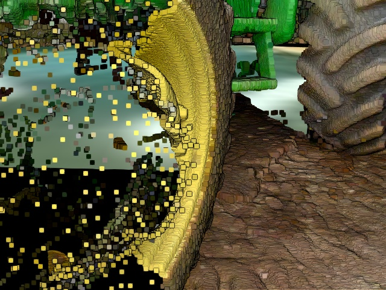

# 导语

Cesium 的渲染引擎是基于高精度渲染设计的。不过，就算是以米作为单位的常规游戏引擎，也会遇到精度问题，例如 z值冲突 和 抖动。

z值冲突是指两个三角形接近时，有重叠的像素，但是深度缓存的精度不足以确定哪一个三角形更接近相机，当视图发生变化时，这些重叠像素会闪烁。

之所以会发生 z值冲突，是因为深度缓存的精度 与 深度的倒数成正比，意味着越靠近截平面的三角形绘制精度越高，越远则越低。

这里有一个动图，显示了相机在 WGS84 椭球上方约 8000 米观察的地形发生的 z值冲突：

z值冲突的两种解决方法：使用多视锥体、使用对数深度缓存。

在 Cesium 1.45 版本中，Cesium 混合了这两种技术以替代原来单一的多视锥体技术。

这么做的好处显而易见：

- **更好的性能**：减少了 drawcall
- **更好的视觉效果**：可以在不影响性能的情况下将近平面尽可能移动得近一些

# 1. 多视锥渲染技术

Cesium 原来的多视锥体实现是使用 3 个视锥体，其分割距离分别是 [1, 1000]，[1000, 100w], [100w, 10e] 米。

这些视锥体从后到前（相对于相机）的顺序进行渲染，并且在每个视锥体中深度缓存被清除。

渲染开始时，根据绘制命令（DrawCommands）的包裹范围（boundingVolume），将绘制命令放置在一个或多个圆锥体中。

在两个视锥边界的绘制命令则两边都会绘制一次，为了优化这个重复绘制，Cesium 从视点触发，根据最近和最远的包裹范围计算合适的近平面和远平面距离，以最大程度减少视锥。（这句话翻译得不太好，专业名称比较多）。

下图是珠穆朗玛峰的近地视图：

将每个视锥分别着色后的样子（第一个视锥是红色，第二个视锥是绿色，黄色介于第一个和第二个视锥中，这里看不到第三个视锥）：

下图是一样的地形场景，只不过把视锥体显示了出来，第一个视锥（1~1000米）太小了这里看不到。

在这个场景下，有 137 个 drawcall，第一个视锥有 28 个，第二个视锥有 102 个，第三个视锥有 7 个。重复调用数有 26 个，第一个和第二个视锥之间的重复调用占 12 个；在所有视锥体中都重复的调用有 7 个。

# 2. 对数深度缓存

z值冲突的另一种解决方法是使用对数深度缓存技术。

将对数值输出到深度缓存，可以很好分配这些数值。Cesium 更新了顶点和片元着色器以支持对数深度缓存。

关于对数缓存技术，可以参考三篇博客（在国外国内访问不了）

- [Maximizing Depth Buffer Range and Precision (outerra.blogspot.com)](http://outerra.blogspot.com/2012/11/maximizing-depth-buffer-range-and.html)

- [Logarithmic Depth Buffer (outerra.blogspot.com)](http://outerra.blogspot.com/2009/08/logarithmic-z-buffer.html)

- [Logarithmic Depth Buffer Optimizations and Fixes (outerra.blogspot.com)](http://outerra.blogspot.com/2013/07/logarithmic-depth-buffer-optimizations.html)

对上述的场景使用对数深度缓存，近平面为 0.1，远平面为 1e8，只需一个视锥体，一共 111 个 drawcall。

这么做不仅可以减少 drawcall，而且默认情况下，近平面更接近相机，从而可以近距离查看。

对于多个视锥体，这并非不可实现，但是可能会有性能问题。只用一个视锥体，使用对数深度缓存，可以减少将绘制命令分配给每个视锥体的 CPU 计算量。

视锥上清除命令和全屏扫描命令可能比较少。对数深度缓存消除了视锥边界处的奇怪问题，对后续开发的新功能（后处理、贴地线）会有帮助。

这是一张拖拉机的轮子，近平面为 1 米。

当近平面距离为 0.1 米时，轮胎看起来就比较完整了。

简而言之，对于只有地形瓦片的视图，删除重复的 drawcall 为 10~30个。对于 3dTiles 或 BIM 模型来说，能减少 20~40 个 drawcall。

在片元着色器中，覆盖平面很大一部分的三角形的深度信息将被写入深度缓存，在顶点着色器中计算、插值得来的对数数值可能并不是对的。对数深度缓存的典型优化方法是仅修改顶点着色器、仅修改接近相机的三角形的片元着色器两种。

在片元着色器中写入片元深度值会导致 GPU 的深度检测被禁用。而在 Cesium 中是不可能的，因为存在一种情况：可能存在覆盖屏幕但是不靠近相机的三角形，例如覆盖整个陆地的超大多边形。所以，浏览器得支持 `EXT_frag_depth` 这个 WebGL 扩展，才能在片元着色器中写入片元深度，才能利用这个功能，否则 Cesium 仍会使用旧的多视锥体技术。

虽然 Cesium 中的大多数视图仅需要一个单个对数深度的视锥，但是也有例外。一个极端的例子是，在非常遥远的距离观察一个很大的三角面。

下例是一个极端情况，即这里有两个超级大平面，和地球切面差不多，它们尺寸是一样的，但是空间距离上只差 300 米，但是相机到观察目标的距离有 6400w 米。

对于上面的视图，可以预见，几何图形在三角面距离比较远时仍然可见（例如行星）。三角面比较靠近的，则看不到，例如卫星。为了解决这个问题，Cesium使用了一种混合技术，在多个视锥体中，每个视锥都使用对数深度缓存。减小 `Scene.logarithmicDepthFarToNearRatio` 的值，就会增加视锥体的个数，然后减少z值冲突。

# *译者注

简而言之，配合对数深度缓存技术和原来的多视锥体技术的灵活搭配使用，减少 drawcall，提升性能，提升显示效果。