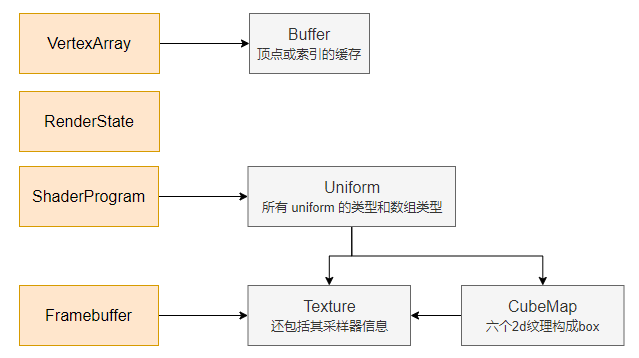
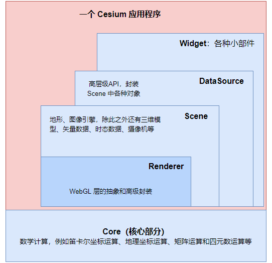

> 翻译有误请指出，规范性转载。@秋意正寒。
>
> 原文出处[Graphics Tech in Cesium - Renderer Architecture | cesium.com](https://cesium.com/blog/2015/05/15/graphics-tech-in-cesium-architecture/)

Cesium 是一个 WebGL 引擎，自 WebGL 1.0 在 2011 年 3 月发布后，官方就开始开发了。

官方将 Cesium 的 Renderer 视为他们自己的第四代渲染器，因为它基于他们的 OpenGlobe 的经验改进而来。除此之外，还有其他技术人员在 AGI 的 Insight 3D 和 STK 的经验。所以说，Cesium 的渲染器并不是凭空设计而来。

# 为什么需要一个渲染器？

当然，可以把 WebGL 的调度分散在各处，但是集中在一个渲染器对象中有很多好处：

- **便于使用**：渲染器提供了对 WebGL 的高级抽象，做了一层封装后，Cesium 的其他部分用起来就简单了，且不容易出问题。
- **着色器流水线**：Cesium 需要用到着色器流水线，这集成在渲染器中了。
- **性能**：缓存、最小化 WebGL 的调用全部集中在渲染器内，使得 Cesium 在其他地方调用的时候能获得不错的性能。
- **状态**：WebGL 是一个状态机器，渲染器就帮助 Cesium 在管理这些状态。
- **可移植性**：渲染器添加 WebGL 扩展、升级到 WebGL 2，或在特定的平台上工作是容易实现的。

# 为什么要自己动手？

推出 Cesium 的渲染器的主要原因是官方有丰富的经验，并且可以根据实际情况调整 Cesium 引擎以获得最佳性能。

Cesium 的着色器流水线远远超出了普通图形程序的概念范围。

还有一个原因是因为，官方推出这个其实是想通过此学习 JavaScript，而且 WebGL 在 2011 年的时候并不成熟（发文时是 2015年）。

# 渲染器长啥样？

在 Cesium 1.9 中，渲染器的主要组件（js对象）是：

VertexArray、RenderState、ShaderProgram、FrameBuffer



Renderer 类在 `Source/Renderer` 目录下。Renderer 的代码并不是公开的 api，所以谨慎使用。

左边一列的对象构成 Cesium 的绘制命令的基础，它们封装了 WebGL 的 drawcall 指令。为了渲染一帧，Cesium 在随处都会执行这些命令。

- **VertexArray（参考 VertexArray.js）**：顶点数据和索引数据。顶点属性和索引存储在 `Buffer` 对象中（参考 Buffer.js）。如果可行，顶点数组使用 `OES_vertex_array_object` 的扩展名以减少 WebGL 的调用次数（这句不太懂）。
- **RenderState（参考 RenderState.js）**：包括发出 drawcall 所需的 WebGL 状态数据，例如深度、混合和状态等。
- **ShaderProgram（参考 ShaderProgram.js）**：表示已编译、连接的 WebGLProgram。uniforms 可与 Cesium 的矩阵、笛卡尔变量、纹理、颜色等直接运作。
- **Framebuffer（参考 Framebuffer.js）**：帧缓存对象，包括纹理缓存、渲染缓存的容器，是 drawcall 所需要的素材。

# 着色器流水线（Shader Pipeline）

着色器保存在 `Source/Shader` 目录下的 `.glsl` 后缀名的文件中。

Cesium 会删除文件内的注释、无效空格，并转换为 js 代码（字符串）以便其他 Cesium 对象能调用，而无需重新请求文件。

Cesium 提供了一个庞大的 GLSL 函数库，包括函数、结构体、常量。如果你的代码需要用到自定义 glsl 代码，你完全可以不声明、不加入 `#include` 预编译指令，可以直接使用它们。

它们以 `czm_` 开头标识。例如，这是一个天空大气的片元着色器：

``` GLSL
czm_ellipsoid ellipsoid = czm_getWgs84EllipsoidEC();

vec3 direction = normalize(v_positionEC);
czm_ray ray = czm_ray(vec3(0.0), direction);

czm_raySegment intersection = czm_rayEllipsoidIntersectionInterval(ray, ellipsoid);
if (!czm_isEmpty(intersection)) {
    discard;
}
```

这些内置对象形成了有向无环图（DAG）。

在运行时，glsl 源代码将传递给 `ShaderSource` 对象，这个对象查找 `czm_` 字符串并遍历 `DAG` 以生成最终的着色器。

如果在拾取操作时用到了着色器，它还会输出 pick id，而不是真正的颜色（这句话没看太懂）。

以上均在 Cesium 程序运行的时候完成的，而不是写死在引擎内部。因为有的绘制直到它要进行绘制时才知道着色器的编码顺序等。

内置的 GLSL uniform 被称为 自动 uniform。它也不需要声明或引入 #include，遍历 DAG 会一样遍历到。

自动 uniform 通常代表与帧相关（或视锥体相关、命令相关）的值，例如变换矩阵。见 `AutomaticUniforms.js`。

例如，天空盒的顶点着色器使用到了自动 uniform 来转换一个 2x2x2 的立方体的坐标，这个立方体的中心在 True Equator Mean Equinox 框架，转换到裁剪坐标的中心：

``` GLSL
attribute vec3 position;
varying vec3 v_texCoord;

void main()
{
    vec3 p = czm_viewRotation * (czm_temeToPseudoFixed * (czm_entireFrustum.y * position));
    gl_Position = czm_projection * vec4(p, 1.0);
    v_texCoord = position.xyz;
}
```

使用原始的 GLSL 源代码作为 key 来缓存着色器程序，以减少初始化和使用着色器时的 WebGL 调用数。参考 `ShaderCache.js`。

# 执行（绘制）命令

熟悉 WebGL 的读者，应该知道绘制命令的执行是由 `WebGLContext` 对象的 `drawXXX` 函数执行的。它被封装在 Cesium 的 `Context.prototype.draw` 方法中，它做了这些事：

- 如果与前一个命令不一样，那么绑定帧缓存（framebuffer）
- 使当前渲染状态生效。由于渲染状态是不可变的，且能缓存，因此比较前一个状态和当前状态的差异，就能产生一个对已改变部分进行处理的函数进行下一步处理
- 绑定着色器程序（当然，如果有需要也会编译、连接）并设置 uniforms 变量（包括 Cesium 自动的）
- 绑定顶点数组并触发 drawElements 和 drawArrays

当一帧结束后，`Context.prototype.endFrame` 方法会解除着色器的 WebGLProgram 的绑定、解除对帧缓存、绘制缓存、纹理的绑定以清理状态。这样能减少每个绘制命令执行时渲染器的状态管理量。

# Cesium 中的渲染器结构

渲染器将被 Scene 对象给 Primitive 对象来创建 WebGL 资源。例如，Globe 本身和三维模型。并且，渲染器还将执行绘制命令，将这些资源绘制到一帧上。



# 未来的工作

WebGL 2.0 的出现，需要对渲染器进行很多改进。

## Uniform Buffers

与时下很多引擎一样，设置 uniform 变量是 Cesium 的瓶颈。Uniform buffers 在 WebGL 2 得到了性能上的提高。

## Instancing

支持实例的绘制使得 Cesium 能渲染大量对象，例如树，当然每棵树可以有不同的属性，例如位置、高度等。

# 致谢

感谢 Greg Beatty 和 Scott Hunter，他们编写了 glsl 着色器。

# 参考

[Cozzi11] Patrick Cozzi and Kevin Ring. [3D Engine Design for Virtual Globes](http://www.virtualglobebook.com/). CRC Press. 2011.