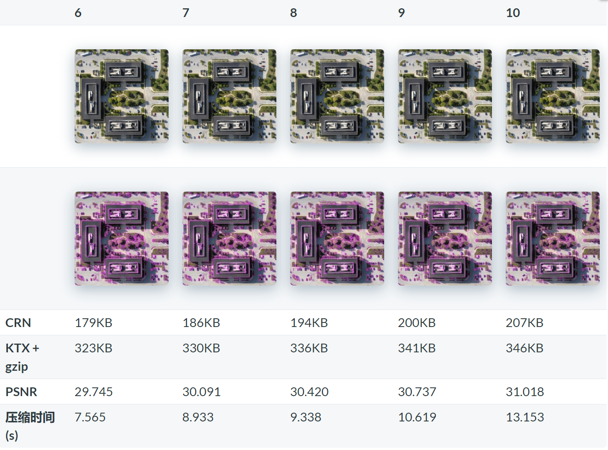
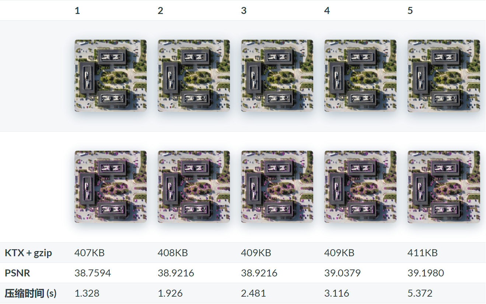
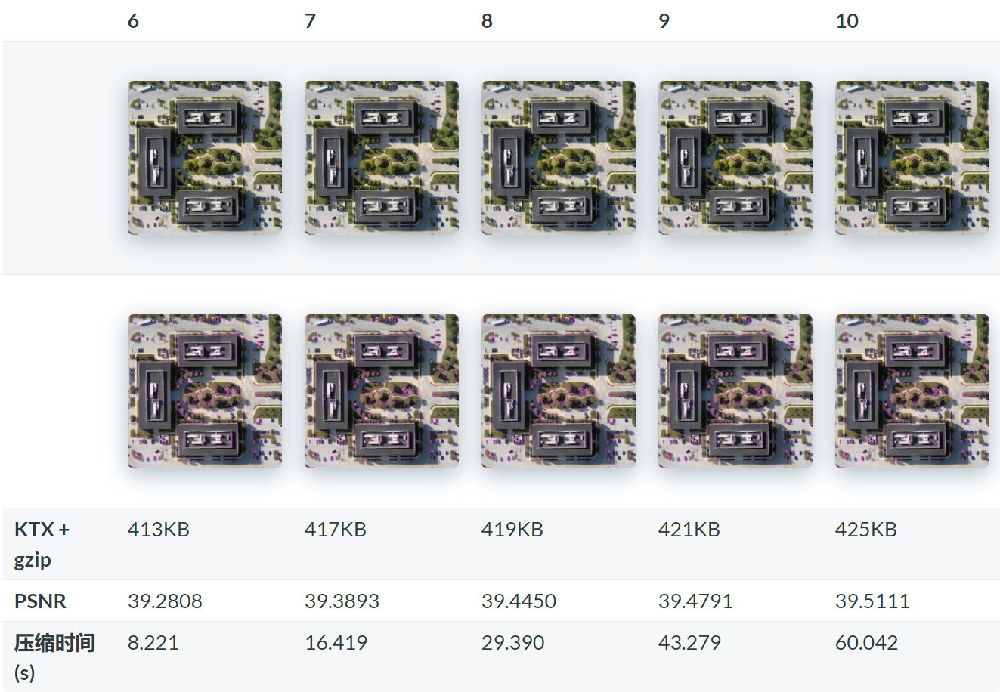
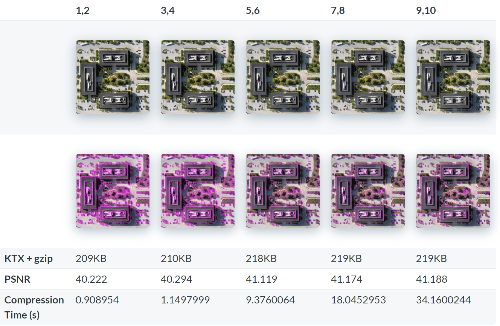
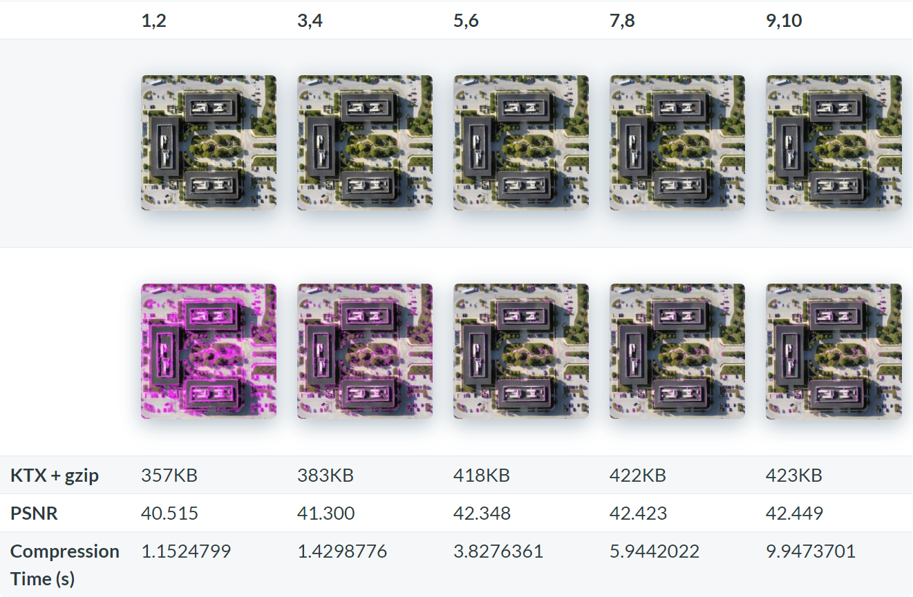

在 Cesium 1.31 中使用三个 WebGL 扩展 `WEBGL_compressed_texture_s3tc`、`WEBGL_compressed_texture_etc1`、`WEBGL_compressed_texture_pvrtc` 增加了对纹理压缩的支持。

将纹理压缩成这些格式，并常驻于 GPU 显存中，并且使用并行技术进行实时解压缩。压缩算法使用一个固定的压缩率，以至于解压缩这些随机纹理有较快的速度。为了便于网络传输，使用无损压缩算法（例如 gzip）进一步压缩纹理。传输的纹理大小与 jpg 图像相当。

GPU 压缩的纹理格式是有损的，意味着细节丢失。在压缩时间和压缩质量上要权衡。

不存在一种所有设备都支持的格式。

大多数桌面设备支持 `WEBGL_compressed_texture_s3tc`，大多数安卓机器支持 `WEBGL_compressed_texture_etc1`，而 iOS 机器支持 `WEBGL_compressed_texture_pvrtc`。

对于程序而言，必须先判断机器支持什么格式，再请求解码对应的数据。这意味着，如果要支持更多的设备，那么压缩的种类就要照顾周全。如果某种设备什么纹理压缩都不支持，那么可以使用未压缩的纹理，或者干脆使用 `WEBGL_compressed_texture_s3tc`，因为它可以转码成 RGB565 格式。

`gltf-pipeline` 工具项目已经更新了，支持了纹理压缩选项，使用 3dTiles 标准中的扩展项来引用 ktx 文件作为纹理。

在本文中， 作者将探讨一些压缩格式，比较不同质量值下的压缩输出。原始图像是经典的卫星影像或 3dTiles 纹理，是 1024 x 1024 的 rgb 图片。

注意到不是所有格式都支持透明通道的，好在大多数卫星影像和 3dTiles 瓦片的纹理均不需要透明通道。传输大小为 476 KB（jpg），内存中解压缩大小为 3MB.


最右边的有紫色差异的图片是使用 `Resemble.js` 生成的。

## ① crunch 紧凑压缩

在下表中，CRN 是使用 [crunch](https://github.com/BinomialLLC/crunch) 库输出的紧凑格式，它是一种高度压缩的有损格式，可以快速转码为 `WEBGL_compressed_texture_s3tc` 中的 DXT1 或 DXT5. 

## ② ktx + gzip 压缩

KTX 也是一个纹理格式，`KTX + gzip` 表示使用 gzip 压缩后 KTX 格式的大小。

## ③ psnr：信噪比

PSNR 是信噪比，**PSNR 越高代表越接近原图像**。PSNR 仅用于比较同种压缩格式的纹理图像。因此，不应将 ETC1 压缩的图像与 PVRTC 压缩的图像 的 PSNR 进行比较。


所有计算均在 Intel 至强 E5-1650 上的 Windows 10 运行。当然了，并行计算肯定能改善时间。

## 工具说明

gltf-pipeline 将

- 使用 crunch 库 压缩为 CRN 格式、DXTn/BCn 格式（即`WEBGL_compressed_texture_s3tc` ）
- 使用 PVRTexTool 工具压缩为 PVRTC 格式。


gltf-pipeline 使用下面的命令来压缩，为每种压缩设置压缩质量参数（即 `--texcomp.quality n`）。

``` shell
node ./bin/gltf-pipeline.js -i /path/to/gltf -o /path/to/output --texcomp.quality 9 --texcomp.format crunch-dxt1
node ./bin/gltf-pipeline.js -i /path/to/gltf -o /path/to/output --texcomp.quality 1 --texcomp.format etc1
```

# 第一种 DXT1

`DXT1` 压缩的纹理原始大小是 513KB，注意 DXT1 不支持透明通道。


> 译者注
>
> 最高压缩质量 10 耗时最大，文件体积越大，差异较小；最低质量 1 耗时最短，文件体积最小，差异较大。

# 第二种 DXT5

`DXT5` 效果不如 DXT1，但是它能存透明度通道。未压缩的 DXT5 纹理为 1025 KB。

> 还有一个 DXT3，但是 DXT3 对透明度的处理与 DXT5 不同。




# 第三种 ETC1

`ETC1` 和 `DXT1` 很相似，`ETC1` 的纹理原始大小为 513KB，且不支持透明通道。





> 观察得知，ETC1 的 1~10 级纹理压缩体积几乎没变，时间还增加了不少。

# 第四种 PVRTC 2bpp

`PVRTC2 2bpp` 的纹理大小是 257KB



> 可见，不管是高质量还是低质量，其变化不明显，低质量压缩的耗时还短一些。

# 第五种 PVRTC 4bpp

`PVRTC2 4bpp` 的纹理大小是 513KB



> 这个就比 2bpp 显著地体积减少了

# 推荐建议

对于桌面应用，最好用 `DXTn` 或 `BCn` 格式。对于想压缩纹理的情况，原作者建议用 `DXT1` 并将压缩质量从根瓦片到叶子瓦片按 1 ~ 10 来调整，即根瓦片压缩的小，叶子瓦片压缩到 10. 如上面的表格所示，比较散碎的纹理的质量会迅速下降，紧缩的好处的加载时间短，最大的纹理也不到 jpeg 格式的一半。

如果不想紧缩处理，建议把所有纹理的压缩质量设为 1。上面的对比表格里没有未压缩的 `DXTn` 或 `BCn` 的纹理。用 `DXT1` 和用 `ETC1` 的结果十分相似，最低质量压缩的 `DXT1` 比最高质量的 `DXT1` 压缩时间快一些。

对于安卓设备，你可能需要用 ETC1。原作者推荐将 `quality` 参数设为 1。将压缩质量拉到 9 没什么用，因为压缩比并不高而且压缩时间还剧烈增加了。

对于 iOS 设备，你可能需要用 PVRTC。原作者推荐用 `PVRTC 4bpp` 来压缩纹理，将压缩质量设在 3 ~ 6 即可。如果你的程序有内存限制，并且能忍受压缩带来的质量损失，可以使用 `PVRTC 2bpp` 来压缩，压缩质量设为 1 ~ 4.