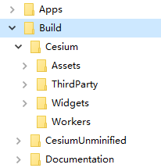

vite 开发 Cesium 程序最佳配置实践

---

- 缺点：必须安装 cesium 依赖和几个 vite 插件，起项目时略微麻烦，部署 cdn 较麻烦

- 优点：打包速度起飞，构建后的成果代码网络传输效率最佳

# 安装依赖

``` bash
yarn add cesium # 这个是给开发时 vite 的 esbuild 找模块用的
yarn add @types/cesium -D # 这个是给智能提示用的，例如 import { Viewer } from 'cesium'
```

# 安装 vite 插件配置 cdn

``` bash
yarn add vite-plugin-html-config vite-plugin-compression vite-plugin-externals -D
```

## 插件 `vite-plugin-html-config`

`vite-plugin-html-config` 这个插件可以在开发时（`dev` script）和构建时（`build` script）修改 `index.html`，注入一些 `<link>`、`<script>` 等 html 标签，支持加入 js 脚本。见下例，加入 cesium 的全局样式和主脚本：

``` js
import { defineConfig } from 'vite'
import { viteExternalsPlugin } from 'vite-plugin-externals'
import viteCompression from 'vite-plugin-compression'
import htmlPlugin from 'vite-plugin-html-config'

export default defineConfig({
  build: {
    minify: false
  },
  plugins: [
    viteCompression(),
    viteExternalsPlugin({
      cesium: 'Cesium'
    }),
    htmlPlugin({
      links: [
        {
          rel: 'stylesheet',
          href: 'http://localhost/ceapi/Widgets/widgets.css'
        }
      ],
      scripts: [
        `window['CESIUM_BASE_URL'] = 'http://localhost/ceapi/'`,
        {
          src: 'http://localhost/ceapi'
        }
      ]
    })
  ]
})
```

这样，打包后的 index.html 是这样的：

``` html
<!DOCTYPE html>
<html lang="zh-cn">
  <head>
    <meta charset="UTF-8" />
    <link rel="icon" type="image/svg+xml" href="/assets/favicon.17e50649.svg" />
    <meta name="viewport" content="width=device-width, initial-scale=1.0" />
    <title>Vite App</title>
    <script type="module" crossorigin src="/assets/index.168edc3e.js"></script>
    <link rel="stylesheet" href="/assets/index.70cc8697.css">
    <link rel="stylesheet" href="http://localhost/ceapi/Widgets/widgets.css">
  </head>
  <body>
    <div id="app"></div>
    
  
  <script>window['CESIUM_BASE_URL'] = 'http://localhost/ceapi/'</script>
    <script src="http://localhost/ceapi"></script>
</body>
</html>
```

虽然排版有一些诡异，但是看到 `CESIUM_BASE_URL` 已经正常引入了，`widgets.css` 主样式也正确引入了。

随后即配置 cesium cdn api 了，使用 `IIS` 或 `nginx` 配置是很合适的，或者买 cdn 资源加速。

## 插件 `vite-plugin-compression`

这个是对打包后的结果进行 gzip 压缩的，默认用最佳压缩比进行压缩。支持 brotil 压缩，细节见官方 repo.

## 插件 `vite-plugin-externals`

这个插件是告诉 vite，在构建时，告诉 rollup 不要对 `cesium` 这个包进行打包，而是在 index.html 中定义一个全局对象 `Cesium`，定义到 `window` 上。

在 vite 配置文件中配置构建的压缩为 false，很容易找到这样一句代码：

``` js
const Viewer = window["Cesium"].Viewer;
```

很显然。

如果不使用这个插件，cdn 就没有意义了。

# 细说 Cesium CDN 部署的一个问题

## `CESIUM_BASE_URL`

这个最好定义在全局（即 `window`），因为别处我没试过。

这个路径可以是相对路径，也可以是绝对 http/https URL，要指向四大金刚文件夹所在的目录，一般是 `/path/to/Build/Cesium`，`Build` 目录你可以在官方下载包中找到：



也就是说，你访问 `CESIUM_BASE_URL/Assets` 相当于访问磁盘上的 `Build/Cesium/Assets`。

这个路径下的资源是一些默认图片（按钮要用到的）、贴图（天空盒）、WebWorker、样式。

这个路径下也有一个 `Cesium.js`，是可以正常使用的，通过 `CESIUM_BASE_URL/Cesium.js` 即可使用。

我部署此目录到 `IIS` 默认网站的 `ceapi` 应用程序上，那么这个 `CESIUM_BASE_URL` 即 `http://localhost/ceapi`，再配置一个默认文件是 `Cesium.js` 加允许跨域即可。

# 推荐改进

`vite-plugin-html-config` 这个插件可以改为 `vite-plugin-html` 插件，这个插件更强大。当然，你也可以简单的用 `@rollup/plugin-html` 插件完成 cdn 地址的引入。

对于 常见库的 CDN 的引入，也可以用 `vite-plugin-cdn-import` 插件。