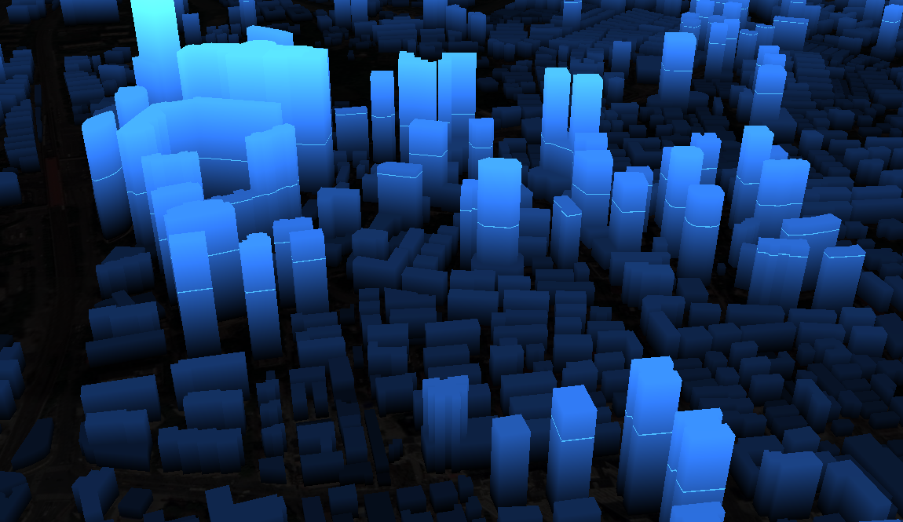

参考自 DC-SDK 中关于 shp白模生成 3dTiles 自定义着色器。

效果：



效果有关的着色器，必然要改动 **片元着色器**。

# 片元着色器

``` GLSL
varying vec3 v_positionEC; // 相机坐标系的模型坐标

void main() {
  /** 渐变效果 */
  vec4 position = czm_inverseModelView * vec4(v_positionEC, 1); // 解算出模型坐标
  float glowRange = 200.0; // 光环的移动范围(高度)，最高到200米
  gl_FragColor = vec4(0.2, 0.5, 1.0, 1.0); // 基础蓝色
  gl_FragColor *= vec4(vec3(position.z / 100.0), 1.0); // 按模型高度进行颜色变暗处理
  /** 扫描线 */
  float time = fract(czm_frameNumber / 360.0); // 计算当前着色器的时间，帧率/（6*60），即时间放慢6倍
  float diff = step(0.005, abs(clamp(position.z / glowRange, 0.0, 1.0) - time)); // 根据时间来计算颜色差异，比例
  gl_FragColor.rgb += gl_FragColor.rgb * (1.0 - diff); // 原有颜色加上颜色差异值提高亮度
}
```

其基本知识即根据高度来控制 rgb（值越小越暗淡，越大越亮）。

当扫描线达到建筑顶部时，顶面会有闪烁的 bug，读者可以自行思考如何修复。


# 着色器如何作用

作用链

``` 
Cesium3DTile
	Cesium3DTileContent -> (@private API) Batch3DModel3DTileContent/...
		Model
			._sourcePrograms、._rendererResources、
```

作用在每个 Cesium3DTileContent 的具体子类（例如 Batch3DModel3DTileContent）的 _model 字段上。

``` JS
const model = /*从content 中获取model*/
Object.keys(model._sourcePrograms).forEach(key => {
  // 对 model 的每个着色器程序
  let program = model._sourcePrograms[key]
  // 使用自己的片元着色器代码字符串**替代**原有片元着色器
  model._rendererResources.sourceShaders[
    program.fragmentShader
  ] = `你想加的顶点着色器完全代码，包含 main()函数`
})
// 让系统重新编译着色器
model._shouldRegenerateShaders = true
```

