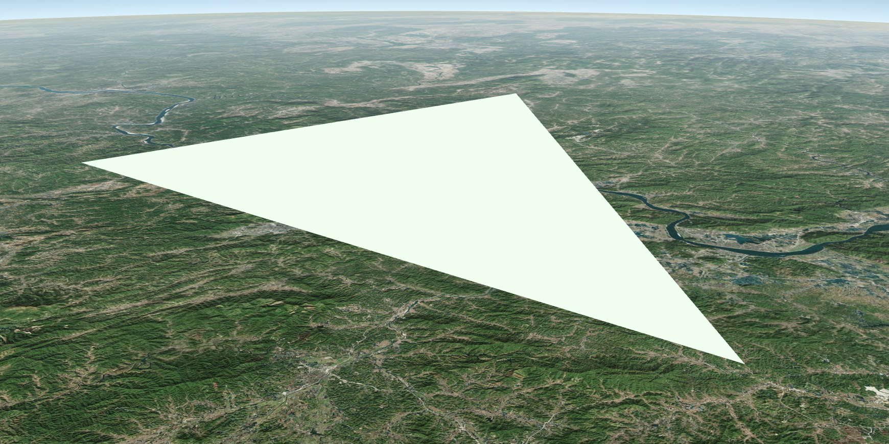

# 0. 前言

`Primitive API` 是公开的 API 的最底层了，它面向的场景是高性能、可自定义材质着色器（`Appearance API + FabricMaterial Specification`）、静态三维物体。

尽管如此，`Primitive API` 仍然封装了大量几何体类、材质类、WebWorker，而且目前开放自定义着色器 API 的只有三维模型类的新架构，还没下放到 `Primitive API`。

如果 API 包袱不想那么重，又希望可以使用自己的模型格式（必须是三角面），那么私有的 `DrawCommand + VertexArray` 接口就非常合适了，它的风格已经是最接近 CesiumJS WebGL 底层的一类 API 了。

`DrawCommand`，是 Cesium 封装 WebGL 的一个优秀设计，它把绘图数据（`VertexArray`）和绘图行为（`ShaderProgram`）作为一个对象，待时机合适，也就是 `Scene` 执行 `executeCommand` 函数时，帧状态对象上所有的指令对象就会使用 WebGL 函数执行，要什么就 bind 什么，做到了在绘图时的用法一致，上层应用接口只需生成指令对象。

## 0.1. 源码中的 DrawCommand

譬如在 `Primitive.js` 模块中的 `createCommands` 函数，它就是负责把 `Primitive` 对象的参数化数据或 WebWorker 计算来的数据合并生成 `DrawCommand` 的地方：

``` js
function createCommands(/* 参数省略 */) {
  // ...
  const length = colorCommands.length;
  let vaIndex = 0;
  for (let i = 0; i < length; ++i) {
    let colorCommand;

    // ...

    colorCommand = colorCommands[i];
    if (!defined(colorCommand)) {
      colorCommand = colorCommands[i] = new DrawCommand({
        owner: primitive, // 入参，即 Primitive 对象
        primitiveType: primitive._primitiveType,
      });
    }
    colorCommand.vertexArray = primitive._va[vaIndex]; // VertexArray
    colorCommand.renderState = primitive._frontFaceRS; // 渲染状态
    colorCommand.shaderProgram = primitive._sp; // ShaderProgram
    colorCommand.uniformMap = uniforms; // 统一值
    colorCommand.pass = pass; // 该指令的通道顺序
  }
  // ...
}
```


# 1. 创建

## 1.1. 构成要素 - VertexArray

Cesium 把 WebGL 的顶点缓冲和索引缓冲包装成了 `Buffer`，然后为了方便，将这些顶点相关的缓冲绑定在了一个对象里，叫做 `VertexArray`，内部会启用 WebGL 的 `VAO` 功能。

最快速创建 `VertexArray` 的办法，就是调用其静态方法 `VertexArray.fromGeometry()`，但是这需要 `Geometry API` 来帮忙。

这里想直接使用 `Buffer` 来说明，那么就得先创建 `Buffer`：

``` js
const positionBuffer = Buffer.createVertexBuffer({
  context: context,
  sizeInBytes: 12,
  usage: BufferUsage.STATIC_DRAW,
  typedArray: new Float32Array([/* ... */])
})
const attributes = [
  {
    index: 0,
    enabled: true,
    vertexBuffer: positionBuffer,
    componentsPerAttribute: 3,
    componentDatatype: ComponentDatatype.FLOAT,
    normalize: false,
    offsetInBytes: 0,
    strideInBytes: 0, // 紧密组合在一起，没有 byteStride
    instanceDivisor: 0 // 不实例化绘制
  }
]
```

调用 `Buffer` 私有类的静态方法 `createVertexBuffer()`，即可创建内置了 `WebGLBuffer` 的顶点缓冲对象 `positionBuffer`，然后使用普通的对象数组创建出 **顶点属性** `attributes`，每个对象就描述了一个顶点属性。接下来就可以拿这些简单的材料创建 `VertexArray` 了：

``` js
const va = new VertexArray({
  context: context,
  attributes: attributes
})
```

`Context` 封装了 WebGL 的各种函数调用，你可以从 `Scene` 中或直接从 `FrameState` 上获取到。

> 这一步创建的 `Buffer`，顶点坐标是直角坐标系下的，是最原始的坐标值，除非在着色器里做矩阵变换，或者这些直角坐标就在世界坐标系的地表附近。它是一堆没有具体语义的、纯粹数学几何的坐标，与渲染管线无关。所以，对于地表某处的坐标点，通常要配合 ENU 转换矩阵 + 内置的 MVP 转换矩阵来使用，见 1.6 的例子。

这里还有一个例子，使用了两个顶点属性（VertexAttribute）：

``` js
const positionBuffer = Buffer.createVertexBuffer({
  context: context,
  sizeInBytes: 12,
  usage: BufferUsage.STATIC_DRAW
})
const normalBuffer = Buffer.createVertexBuffer({
  context: context,
  sizeInBytes: 12,
  usage: BufferUsage.STATIC_DRAW
})
const attributes = [
  {
    index: 0,
    vertexBuffer: positionBuffer,
    componentsPerAttribute: 3,
    componentDatatype: ComponentDatatype.FLOAT
  },
  {
    index: 1,
    vertexBuffer: normalBuffer,
    componentsPerAttribute: 3,
    componentDatatype: ComponentDatatype.FLOAT
  }
]
const va = new VertexArray({
  context: context,
  attributes: attributes
})
```

这里把坐标缓冲和法线缓冲分开存到两个对象里了，其实 WebGL 可以用字节交错的格式，把全部顶点属性的缓冲都合并成一个的方式的，就不具体讲了，读者可以自行查阅 WebGL 中 WebGLBuffer 的用法。


## 1.2. 构成要素 - ShaderProgram

WebGL 的着色器也被 CesiumJS 封装了，自带缓存机制，并使用大量正则等手段做了着色器源码匹配、解析、管理。

着色器代码由 `ShaderSource` 管理，`ShaderProgram` 则管理起多个着色器源码，也就是着色器本身。使用 `ShaderCache` 作为着色器程序的缓存容器。它们的层级关系如下：

```
Context
  ┖ ShaderCache
    ┖ ShaderProgram
      ┖ ShaderSource
```

你可以自己创建 `ShaderSource`、`ShaderProgram`，并通过 `Context` 添加到 `ShaderCache` 中。

举例：

``` js
new ShaderSource({
  sources : [GlobeFS]
})

new ShaderProgram({
  gl: context._gl,
  logShaderCompilation: context.logShaderCompilation,
  debugShaders: context.debugShaders,
  vertexShaderSource: vertexShaderSource,
  vertexShaderText: vertexShaderText,
  fragmentShaderSource: fragmentShaderSource,
  fragmentShaderText: fragmentShaderText,
  attributeLocations: attributeLocations,
})
```

但是通常会选择更直接的方式：

``` js
const vertexShaderText = `attribute vec3 position;
void main() {
  gl_Position = czm_projection * czm_modelView * vec4(position, 1.0);
}`
const fragmentShaderText = `uniform vec3 color;
void main() {
  gl_FragColor=vec4( color , 1. );
}`

const program = ShaderProgram.fromCache({
  context: context,
  vertexShaderSource: vertexShaderText,
  fragmentShaderSource: fragmentShaderText,
  attributeLocations: attributeLocations
})
```

使用 `ShaderProgram.fromCache` 静态方法会自动帮你把着色器缓存到 `ShaderCache` 容器中。

> 着色器代码可以直接使用内置的常量和自动统一值，这是默认会加上去的。

`attributeLocation` 是什么？它是一个很普通的 JavaScript 对象：

``` json
{
  "position": 0,
  "normal": 1,
  "st": 2,
  "bitangent": 3,
  "tangent": 4,
  "color": 5
}
```

它指示顶点属性在着色器中的位置。


## 1.3. 构成要素 - WebGL 的统一值

这个比较简单：

``` js
const uniforms = {
  color() {
    return Cesium.Color.HONEYDEW 
  }
}
```

使用一个 JavaScript 对象即可，每个成员必须得是 **方法**，返回的值符合 Uniform 的要求即可：

- `Cesium.Matrix2/3/4` → `mat2/3/4`
- `Cesium.Cartesian2/3/4` → `vec2/3/4`
- `Cesium.Number` → `float`
- `Cesium.Color` → `vec4`
- `Cesium.Texture` → `sampler2D`
- ...

请查阅 `Renderer/createUniform.js` 中的代码，例如 `UniformFloatVec3` 就可以对应 `Color` 和 `Cartesian4` 等等。

这个 `uniforms` 对象最终会在 `Context` 执行绘制时，与系统的自动统一值（`AutomaticUniforms`）合并。

``` js
Context.prototype.draw = function (/*...*/) {
  // ...
  continueDraw(this, drawCommand, shaderProgram, uniformMap);
  // ...
}
```


## 1.4. 渲染状态对象 - RenderState

渲染状态对象是必须传递给 `DrawCommand` 的。渲染状态对象类型是 `RenderState`，它与 `ShaderProgram` 类似，都提供了静态方法来“缓存式”创建：

``` js
const renderState = RenderState.fromCache({
  depthTest: {
    enabled: true
  }
})
```

哪怕什么都不传递：`RenderState.fromCache()`，内部也会返回一个渲染状态。

它传递渲染数据之外一切参与 WebGL 渲染的状态值，在 `RenderState` 中有详细的默认列表参考，上述代码显式指定要进行深度测试。


## 1.5. 其它构成因子

创建绘图指令除了 1.1 ~ 1.3 成分之外，还有其它可选项。

### ① 绘制的通道类型 - Pass

CesiumJS 不是粗暴地把帧状态对象上的 Command 遍历一遍就绘制了的，在 Scene 的渲染过程中，除了生成三大 Command，还有一步要对 Command 进行通道排序。

通道，是一个枚举类型，保存在 `Pass.js` 模块中。不同通道有不同的优先级，譬如在 1.6 中指定的通道是 `Cesium.Pass.OPAQUE`，即不透明通道。在 1.93 版本，通道的顺序为枚举值：

```js
const Pass = {
  ENVIRONMENT: 0,
  COMPUTE: 1,
  GLOBE: 2,
  TERRAIN_CLASSIFICATION: 3,
  CESIUM_3D_TILE: 4,
  CESIUM_3D_TILE_CLASSIFICATION: 5,
  CESIUM_3D_TILE_CLASSIFICATION_IGNORE_SHOW: 6,
  OPAQUE: 7,
  TRANSLUCENT: 8,
  OVERLAY: 9,
  NUMBER_OF_PASSES: 10,
}
```

可见，`OPAQUE` （不透明通道）的优先级比 `TRANSLUCENT`（透明通道）高。

这个通道与其它图形 API 的通道可能略不一样，因为你只能使用这个值去指定顺序，而不是自己写一个通道来合成渲染（例如 ThreeJS 或 WebGPU）。


### ② 绘制的图元类型 - WebGL 绘制常数

即指定 `VertexArray` 中顶点的拓扑格式，在 WebGL 中是通过 `drawArrays` 指定的：

``` js
gl.drawArrays(gl.TRIANGLES, 0, 3)
```

这个 `gl.TRIANGLES` 就是图元类型，是一个常数。Cesium 全部封装在 `PrimitiveType.js` 模块导出的枚举中了：

``` js
console.log(PrimitiveType.TRIANGLES) // 4
```

默认就是 `PrimitiveType.TRIANGLES`，所以在 1.6 代码中我们并不需要传递。


### ③ 离屏绘制容器 - Framebuffer

CesiumJS 支持把结果画到 `Renderbuffer`，也就是 `RTR(Render to RenderBuffer)` 离屏绘制。绘制到渲染缓冲，是需要帧缓冲容器的，CesiumJS 把 WebGL 1/2 中帧缓冲相关的 API 都封装好了（严格来说，把 WebGL 中的 API 基本都封装了一遍）。

本文只简单提一提，关于帧缓冲离屏绘制，以后有机会再介绍，法克鸡丝的博客有比较系统的介绍（虽然比较旧，不过思路还是在的）。


### ④ 模型坐标变换矩阵 - Matrix4

将 `Matrix4` 类型的变量在创建 `DrawCommand` 时传递进去，它最终会传递到 CesiumJS 的内部统一值：`czm_model`（模型矩阵）上，而无需你在 `uniform` 中指定，你可以在顶点着色器中使用它来对 `VertexArray` 中的顶点进行模型矩阵变换。见 1.6 中的顶点着色器经典的 MVP 相乘。


### ⑤ 其它

- cull/occlude: 视锥剔除 + 地平线剔除组合技，Boolean
- orientedBoundingBox/boundingVolume: 范围框
- count: number，WebGL 绘制时要画多少个点
- offset: number，WebGL 绘制时从多少偏移量开始用顶点数据
- instanceCount: number，实例绘制有关
- castShadows/receiveShadows: Boolean，阴影相关
- pickId: string，若没定义，在 Pick 通道的绘制中将使用深度数据；若定义了将在 GLSL 中转化为 pick id
- ...

这些都可以在 `DrawCommand` 中找到对应的字段，按需设置即可。


## 1.6. 我们来实践一发纯色三角形

万事俱备，直接硬搓一个能产生三角形绘制指令的 `StaticTrianglePrimitive`，为了便于在官方沙盒中使用，我给官方 API 加上了命名空间：

``` js
const modelCenter = Cesium.Cartesian3.fromDegrees(112, 23, 250000 / 2)
const modelMatrix = Cesium.Transforms.eastNorthUpToFixedFrame(modelCenter)

const vertexShaderText = `attribute vec3 position;
void main() {
  gl_Position = czm_projection * czm_view * czm_model * vec4(position, 1.0);
}`
const fragmentShaderText = `uniform vec3 u_color;
void main(){
  gl_FragColor = vec4(u_color, 1.0);
}`

const createCommand = (frameState, matrix) => {
  const attributeLocations = {
    "position": 0,
  }
  const uniformMap = {
    u_color() {
      return Cesium.Color.HONEYDEW
    },
  }
  const positionBuffer = Cesium.Buffer.createVertexBuffer({
    usage: Cesium.BufferUsage.STATIC_DRAW,
    typedArray: new Float32Array([
      10000, 50000, 5000,
      -20000, -10000, 5000,
      50000, -30000, 5000,
    ]),
    context: frameState.context,
  })
  const vertexArray = new Cesium.VertexArray({
    context: frameState.context,
    attributes: [{
      index: 0, // 等于 attributeLocations['position']
      vertexBuffer: positionBuffer,
      componentsPerAttribute: 3,
      componentDatatype: Cesium.ComponentDatatype.FLOAT
    }]
  })
  const program = Cesium.ShaderProgram.fromCache({
    context: frameState.context,
    vertexShaderSource: vertexShaderText,
    fragmentShaderSource: fragmentShaderText,
    attributeLocations: attributeLocations,
  })
  const renderState = Cesium.RenderState.fromCache({
    depthTest: {
      enabled: true
    }
  })
  return new Cesium.DrawCommand({
    modelMatrix: matrix,
    vertexArray: vertexArray,
    shaderProgram: program,
    uniformMap: uniformMap,
    renderState: renderState,
    pass: Cesium.Pass.OPAQUE,
  })
}

/* ----- See Here ↓ ------ */

class StaticTrianglePrimitive {
  /**
   * @param {Matrix4} modelMatrix matrix to WorldCoordinateSystem
   */
  constructor(modelMatrix) {
    this._modelMatrix = modelMatrix
  }
  
  /**
   * @param {FrameState} frameState
   */
  update(frameState) {
    const command = createCommand(frameState, this._modelMatrix)
    frameState.commandList.push(command)
  }
}

// try!
const viewer = new Cesium.Viewer('cesiumContainer', {
  contextOptions: {
    requestWebgl2: true
  }
})
viewer.scene.globe.depthTestAgainstTerrain = true
viewer.scene.primitives.add(new StaticTrianglePrimitive(modelMatrix))
```

显示出来的效果就是一个白绿色的三角形：



图中为大湾区，因为我设的 ENU 坐标中心就是大湾区附近。三角形的高度被我设为了 5000 米。


# 2. 意义 - 自定义 Primitive（PrimitiveLike）

如果有一个对象或者一个函数，返回的是可绘制的 `DrawCommand`，那么只需把返回的指令对象传递给 `FrameState` 就可以在这一帧把上面的数据和绘图逻辑展示出来。

仔细想想，具备创建 `DrawCommand` 的对象其实不少。有 `Primitive`、`BillboardCollection`、`SkyAtmosphere`、`SkyBox`、`Sun`、`Model` 等（3DTiles 瓦片上的模型是通过 `Model` 绘制的）。

我这里就直接给结论了：

- 具备创建 `DrawCommand` 功能的，无论是函数，还是对象，都可以直接参与 Cesium 最底层的绘图；
- 原型链上具备 `update` 方法的类，且 `update` 方法接受一个 `FrameState` 对象，并在执行过程中向这个帧状态对象添加 `DrawCommand` 的，就能添加至 `scene.primitives` 这个 `PrimitiveCollection` 中。

前一种有具体的 API，即 `Globe` 下的 `GlobeSurfaceTileProvider`（由 `QuadtreePrimitive` 使用）创建 `DrawCommand`；后面的就多了。

能精确控制 `DrawCommand`，就可以在 Cesium 场景中做你想做的绘图。

## 点到为止

`DrawCommand` 是 CesiumJS 渲染器之前的最后一道数据封装，后面就是对这些指令对象上的资源进行分发、绑定、执行。读者有兴趣的话，还可以自行研究 `ClearCommand` 和 `ComputeCommand`，也许以后会写写，不过本篇点到为止~


# 3. 参考资料

- [博客园 - 法克鸡丝 - Cesium原理篇：6 Render模块(5: VAO&RenderState&Command) ](https://www.cnblogs.com/fuckgiser/p/6002210.html)
- [知乎 - 三维网格 - Cesium 高性能扩展之DrawCommand（一）：入门](https://zhuanlan.zhihu.com/p/453880906)