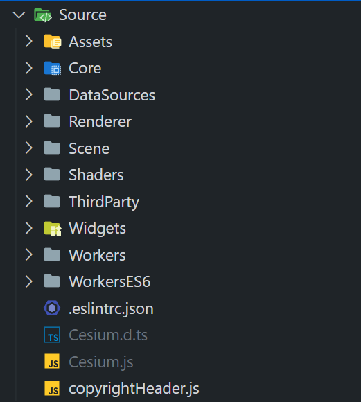
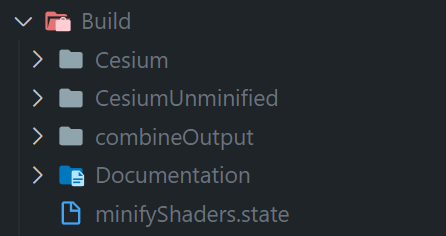

很高兴你能在浮躁的年代里还有兴趣阅读源代码，CesiumJS 至今已有十年以上，代码量也积累了三十多万行（未压缩状态）。

我也很荣幸自己的文章能被读者看到，如果对你有帮助、有启发，点个赞就是对我最大的鼓励，感激不尽。本系列文章写于 2022 年，梳理的是 CesiumJS 前端库中的主要源码结构，不涉及着色器原理、WebGL 效果原理剖析等内容较为专一、可以独立出文的内容。

如果想看文章目录，直接拉到本文最后一节即可。

# 1. 源代码工程目录详解

## 前置说明

- 当我在说“xx指令”时，指的是 `package.json` 下的 node-script（即 `scripts` 列表中的某一个），可以使用 npm、yarn 或者 pnpm 运行；
- 当我在说“开发者页面”时，指的是你将源码工程的依赖下载下来，启动 `start` 指令，启动本地开发服务器，打开的那个主页；
- `CesiumJS` 指的是 `Source` 文件夹下的前端库源代码 + 测试代码 + 前端静态资源 + 构建与源代码开发工具的统称，前端库即 `Cesium.js` 只是 `CesiumJS` 的主要构建产物。

## ① 根目录下

- `gulpfile.cjs`：gulp 的配置文件，有好几个 node-script 是与里面的 gulp 任务关联的；
- `CONTRIBUTORS.md`：所有参与过 CesiumJS 项目的贡献者名单；
- `CHANGES.md`：发布日志；
- `index.html` & `server.cjs`：CesiumJS 这个工程使用了 `express` 这个库，允许你使用 `start` 这个 node-script 启动本地 express 服务器，默认端口是 8080，打开开发者页面，也就是 index.html；
- `CONTRIBUTING.md`：如何参与贡献，也就是开发者或者 bug 发现者的指导书；
- `.husky`：CesiumJS 使用 husky + lint-staged + prettier 来管理代码风格；

## ② Source 目录

CesiumJS 的前端库部分，主要就是在 Source 目录下的。目前，Source 目录下的代码文件绝大多数已完成 ESModule 改造，含少量 css 文件。

虽然几乎所有的源码都是 ESModule 的，但是这个 `Source` 目录并没有 node 包经典的索引文件 `index.js`；`Source` 目录的入口索引文件，是要运行 `build` 指令后才会出现的，文件名是 `Cesium.js`；这个入口索引文件也没什么东西，主要是导出源码中的所有模块，无论公开私有，以及着色器字符串，以及当前 CesiumJS 的版本号。

下面对 Source 目录的各个子文件夹作说明：



- Assets，一些静态资源，例如默认天空盒、离线两级世界影像（TMS）等；
- Core，数学 API、`Geometry API`、高频辅助函数、资源与请求 API、`Terrain API` 等；
- DataSources，基于 Scene 模块中较为底层的三维 API 再次封装出来的上层 API，包括 `Entity API`、`Property API` 和 `DataSource API`，旨在更易接入人类友好型数据格式，例如 Gpx、KML、GeoJson 以及 CesiumJS 官方设计的 Czml，熟读之后可以自行创建，这三个 API 要结合 `Viewer` 使用，单独的 Scene 模块无法运行；
- Renderer，笼统地称这个文件夹下的代码为 Renderer 模块，封装并扩展了 WebGL 原生接口，例如 `Framebuffer` 对应 `WebGLFramebuffer` 等；
- Scene，场景模块，基于 Core 模块和 Renderer 模块，CesiumJS 的三维世界由此模块创建，包括 `Primitive API`、`Model API`、`Globe/QuadtreePrimitive API`、`GPUPicking API`、`3DTiles API` 等重要 API，通常称之为 Scene 模块，是 CesiumJS 的基石；含 `ModelExperimental` 新架构和 `GltfPipeline` 子模块；
- Shaders，后缀名是 `.glsl` 的着色器代码文件，`build` 指令运行后生成同名的 ESModule js 模块文件，导出着色器代码的字符串；
- ThirdParty，第三方库，例如 draco 解码库以及相关的 worker 等；
- Widgets，带 UI 的一些功能型类，例如大家熟悉的 `Viewer`、`Timeline`、`BaseLayerPicker`，样式文件也在此目录下；
- Worker & WorkerES6，WebWorker 文件，后者是源码，前者是根据后者在运行 `build` 指令后生成的 requirejs 版本。


## ③ Specs 目录

这个是测试代码目录。子目录结构与 `Source` 下的基本一样，要测试某个模块，则测试文件以那个模块的文件名 + `Spec` 尾缀，例如想测试 `Core/Matrix4.js` 模块下的四阶方阵类，那么就创建一个 `Specs/Core/Matrix4Spec.js`（官方有了，你可以打开学习）。

测试框架是 `jasmine-core`。

## ④ App 目录

使用 Source 目录下的源码直接创建出来的现成应用程序，包括我们熟悉的 `Sandcastle`（沙盒）程序，还有两个简单的，有兴趣自行打开查看（使用 start 这个命令启动开发服务器，从主页进）。含少量测试数据。

## ⑤ [构建后] Build 目录

运行 `build`/`combine`/`minify` 等指令，这个文件夹才会出现。它主要是发布出来 CesiumJS 的 iife 库版本，以及附带必须要用的四大静态资源文件夹 - `Assets`、`ThirdParty`、`Widgets`、`Workers`。

根据指令的不同，发布的 iife 库版本不一样，也影响是不是有 TypeScript 类型定义文件、SourceMap 映射文件。

`combine` 指令发布的是 `CesiumUnminified` 未压缩版本，也就是主库文件有 37 万行的版本；`minify` 指令发布的是 `Cesium` 文件夹下的压缩版本，代码经过简化。

如下图所示：




## ⑥ Documentation 目录

文档目录，使用 `generateDocumentation` 指令生成的 API 手册，从开发者主页可以进去。

## ⑦ ThirdParty 目录

第三方依赖库，CesiumJS 不希望安装在 node-package-dependencies 列表中的就放在这里，手动升级，并将依赖列表写入根目录下的 `ThirdParty.extra.json` 文件内。

每当执行 `prepare` 这个 node-script 后，gulp 就会把这个目录里面的一些资源（测试框架、Draco 库等）复制到指定位置。

## ⑧ Tools 目录

gulp 部分任务需要用到的工具库或配置，例如 rollup 额外配置、jsdoc 配置等。


## 未来可能的改进

官方论坛中有讨论过 monorepo 技术的接入，也就是一工程多子库的结构，见：[Is there interest in a compact Cesium math library?](https://community.cesium.com/t/is-there-interest-in-a-compact-cesium-math-library/18366)

但是我认为在 3DTiles 1.1 推广完毕、构建工具大换血之前，这个可能并不会有什么实质性的推动，毕竟 CesiumJS 已经是 ESModule 格式的了，而且内部各种逻辑随时可能按需求变动会改进，把 CesiumJS 本身拆成 monorepo 可能不太现实。


# 2. 构建命令

既然 CesiumJS 是作为一个 NodeJS 包存在的，那么它就支持 node-script，也就是 `package.json` 里的 “scripts”列表。

先介绍如果用到源码开发用到的常用指令：

- `prepare`，在你安装依赖（`npm install`）后会自动拉起的一个命令，会执行 gulp 同名任务，并安装 husky 库；
- `build`，最初始的一个指令，将 `Source` 下的源代码合并出一个 `Source/Cesium.js`，也就是 CesiumJS 源码的 ESModule 入口文件，同时会把 `Source/Shaders` 下所有 glsl 文件复制并改写成导出着色器字符串的 js 文件；另外，只有这个指令运行后在沙盒中才能看到开发者示例代码；
- `start` 和 `startPublic`，启动开发服务器，后者允许公开访问本机，默认 8080 端口
- `release`，一个复合指令，先后运行 build → build-ts → combine → minifyRelease → generateDocumentation 指令；
- `generateDocumentation`，使用 jsdoc 根据 Source 下的源码注释生成 API 帮助文档；
- `makeZipFile`，一个复合指令，先运行 release 指令后将指定的文件压缩成一个 zip 文件，也就是每个月月初你在 GitHub 发布页面下载的那一个稍大的压缩包；
- `combine`，也是工程中 gulp 的默认任务，它会连着 build 指令一起执行，将 `Source` 下的源码使用 rollup 转译成 iife 库，输出到 `Build/CesiumUnminified` 目录下，是未压缩版本库，37万行，主文件 12.3 MB；`combienRelease` 不输出 sourcemap 文件；
- `minify`，与 `combine` 目的一样，只不过告诉 rollup 要生成压缩版本的库，输出到 `Build/Cesium` 目录下；也有 `minifyRelease` 姐妹命令；
- `clean`，清理 build/release/combine 等指令生成的产出文件，恢复未构建时的干净工程状态

然后是其它可能用到的：

- `prettier` 和 `prettier-check`，统一代码风格
- `test` 等一系列 test 指令：运行 `Specs` 目录下的测试代码

最后有一个隐藏的指令，这个允许你把 `jsdoc` 注释为私有的 API，即 `@private` 注释的，也在开发者文档中展示出来，但是这个指令并没有在 node-script 列表中。

```sh
npm run generateDocumentation -- --private
```

这个功能来自 PR [CesiumGS/cesium#10261](https://github.com/CesiumGS/cesium/pull/10261)


## 未来可能的改进

官方正在内测使用 `esbuild` 改进 gulp 和 rollup 的构建性能和质量，参考：[CesiumGS/cesium#10399](https://github.com/CesiumGS/cesium/pull/10399)，目前已知使用 esbuild 构建后的主库体积、SourceMap 文件体积都有明显的下降。

笔者也在官方论坛发起这项议题时参与了讨论：[CesiumJS Build Tooling Revamp](https://community.cesium.com/t/cesiumjs-build-tooling-revamp/17757)

希望在不久的将来能用上文件体积更小的库。


# 3. 文章目录

本篇即源码工程结构。

- [篇1 - 使用 requestAnimationFrame 循环触发帧动画](./源码解读[1] 使用 requestAnimationFrame 循环触发帧动画.md)
- [篇2 - 渲染架构之 Primitive - 创建并执行指令](./源码解读[2] 渲染架构之 Primitive - 创建并执行指令.md)
- [篇3 - 渲染原理之从 Entity 看 DataSource 架构 - 生成 Primitive 的过程](./源码解读[3] 渲染原理之从 Entity 看 DataSource 架构 - 生成 Primitive 的过程.md)
- [篇4 - 最复杂的的确批发 影像与地形的渲染与下载过程](./源码解读[4] 最复杂的地球皮肤 影像与地形的渲染与下载过程.md)
- [篇5 - 着色器的封装设计 - Renderer 模块](./源码解读[5] 着色器的封装设计 - Renderer 模块.md)
- [篇6 - 三维模型（ModelExperimental）新架构](./源码解读[6] 三维模型（ModelExperimental）新架构.md)
- [篇7 - 3DTiles 的请求加载处理与调度](./源码解读[7] 3DTiles 的请求加载处理与调度.md)
- [篇8 - 资源封装与多线程](./源码解读[8] 资源封装与多线程.md)

