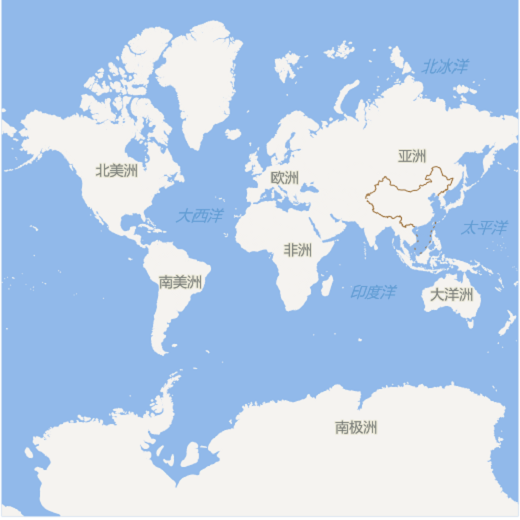
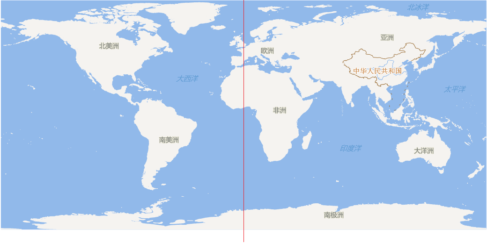
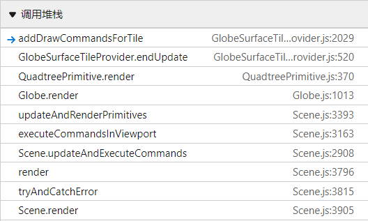

# API 回顾

在创建 `Viewer` 时可以直接指定 **影像供给器**（`ImageryProvider`），官方提供了一个非常简单的例子，即离屏例子（搜 offline）：

``` js
new Cesium.Viewer("cesiumContainer", {
  imageryProvider: new Cesium.TileMapServiceImageryProvider({
    url: Cesium.buildModuleUrl("Assets/Textures/NaturalEarthII"),
  })
})
```

这个例子的影像供给器是 `TMS` 瓦片服务，也就是预制瓦片地图，资源位于 `Source/Assets/Textures/NaturalEarthII` 文件夹下。

若没有指定 **地形供给器（TerrainProvider）**，Cesium 也有默认策略：

``` js
// Globe.js 构造函数内
const terrainProvider = new EllipsoidTerrainProvider({
  ellipsoid: ellipsoid,
})
```

这就是说，使用 `EllipsoidTerrainProvider` 来作为默认地形，也就是把椭球面当作地形（因为没有）。

> 小提示：`TileMapServiceImageryProvider` 其实是 `UrlTemplateImageryProvider` 的一个子类，在文章最后一节请求瓦片时会再次提及。

本篇要解决的两大疑问：

- 椭球体是如何构成的
- 瓦片是如何从创建到请求，最终到渲染的

这篇比较长，不计代码也有 8000 多字，而且涉及的数据类比较多，但是我觉得能完成上述两个过程的大致讲解，就能沿着思路细化研究下去了。


# 1. 对象层级关系

其上层下层的主要类从属关系（从 `Scene` 开始算起）大致是：

```
Scene
┖ Globe
  ┠ Ellipsoid
  ┖ QuatreePrimitive 
    ┠ GlobeSurfaceTileProvider
    ┖ QuadtreeTile
      ┖ GlobeSurfaceTile
        ┠ TileImagery[]
        ┃ ┖ Imagery
        ┖ TerrainData
```

我简化了 `ImageryLayer`、`ImageryProvider`、`ImageryLayerCollection`、`TerrainProvider` 与上面这些类的关系，也就没让他们出现在图中。

## 1.1. Scene 中特殊的物体 - Globe

`Scene` 下辖的主要三维容器是 `PrimitiveCollection`，能继续往里套 `PrimitiveCollection`，也可以单独放类 `Primitive`。

但是 `Scene` 中有一个三维物体是独立于 `Scene` 构造函数之外才创建的对象，也就是地球对象 `Globe`（准确的说是地表），这意味着 `Scene` 可以脱离 `Globe`，单独作一个普通三维场景容器使用也没有问题。事实上 `Scene` 渲染单帧的流程中，也的确如此，会判断 `scene.globe` 是否存在才继续 `Globe` 的更新、渲染。

`Globe` 是伴随着 `CesiumWidget` 的创建而创建的，优先级仅次于 `Scene`、`Ellipsoid`。

`Globe` 被 `Scene` 对象管理，伴随着 `Scene` 的单帧渲染而渲染、请求。本文中最关心的，就是地球表面的影像+地形的瓦片，它是一种稍微做了修改的四叉树数据结构。

这棵四叉树是本文的几乎全部内容，在下下小节会讲。

不过也不能忘了 `Globe` 的其它作用，这里提一下便带过：

- 控制地表水面效果；
- 拥有影像图层容器（`ImageryLayerCollection`），进而拥有各个影像图层（`ImageryLayer`），每个图层又收纳着影像供给器（`ImageryProvider`）；
- 拥有地形供给器（`TerrainProvider`）；
- 控制地球椭球体的裸色（基础色）；
- 能显示隐藏；
- 控制瓦片显示精度；
- 控制是否接收光照；
- 控制部分大气着色效果；
- **控制深度检测**；
- 控制阴影效果；
- 控制地形夸张效果；
- 控制瓦片缓存数量；
- 最重要的一个：**控制瓦片四叉树**


## 1.2. 地球 Globe 与椭球 Ellipsoid

`Globe` 既然作为地表，支撑起地表的骨架则由 `Ellipsoid` 定义。

`Ellipsoid` 定义了地球的形状，也就是数学表面 —— 旋转椭球面，是一个纯粹的数学定义，默认值是 WGS84 椭球。创建一个椭球也很简单：

``` js
// WGS84 椭球，Cesium 的默认值
new Ellipsoid(6378137.0, 6378137.0, 6356752.3142451793)
```

你甚至都可以传递一个其它的星球的参数（假如你有），譬如月球。

CGCS2000 椭球与 WGS84 椭球在参数上极其相似，一般无需修改椭球体定义。


## 1.3. 瓦片四叉树 - QuadtreePrimitive 及其成员

`Globe` 特殊就特殊在它维护着一棵状态极其复杂的瓦片四叉树 `QuadtreePrimitive`，每一帧，这个四叉树对象都要决定：

- 瓦片下载好了吗？
- 下载好的瓦片解析了吗？解析时要不要重投影？
- 瓦片是否当前摄像机可见？解析的瓦片能渲染了吗？
- 不能渲染的瓦片做好回退方案了吗？

多个异步同步的状态混合起来判断，就显得比单一三维物体的 Primitive、Entity 复杂得多了。

这个瓦片四叉树，严格来说可能有一棵，也可能有两棵，取决于瓦片的细化规则。

如果用的是 Web 墨卡托投影来做四叉树递归划分，那么只需一棵，因为 Web 墨卡托投影的坐标范围是一个正方形：



如果 **直接使用经纬度范围** 作为坐标值域来做四叉树递归划分瓦片，那么就需要左右两棵。



如何统一表示这两个状态呢？只需在 `QuadtreePrimitive` 上用个数组存 **根瓦片** 就好了。它的私有属性 `_levelZeroTiles` 就是这么一个数组，这个数组只有 0、1、2 三个长度，即 0 代表当前没有根瓦片，1 代表使用 Web 墨卡托投影的范围做四叉树，2 代表使用地理经纬度来做四叉树。

```
QuadtreeTile
┖ GlobeSurfaceTile
  ┠ TileImagery[]
  ┃ ┖ Imagery
  ┖ *TerrainData
```

根瓦片乃至任意瓦片都是 `QuadtreeTile` 类型的。

每个 `QuadtreeTile` 都有一个 `data` 成员，代表这棵抽象空间四叉树的任意瓦片上的 **数据**，类型为 `GlobeSurfaceTile`；作为一个瓦片的数据，必然有多层影像和单个地形数据构成，瓦片的多层影像数据交由 `TileImagery` 和 `Imagery` 完成管理，地形数据则由 `HeatmapTerrainData` 完成管理。

当然，地形供给器有多种类型，自然就还有其它的地形数据类，譬如 `QuantizedMeshTerrainData`、`GoogleEarthEnterpriseTerrainData` 等。

`GlobeSurfaceTileProvider` 则是抽象瓦片对象 `QuadtreeTile` 和具体瓦片数据，或者叫数据瓦片 `GlobeSurfaceTile` 的中间人，负责一系列计算。

> 这些对象的创建，分散在第 2、3、4、5 节中。


# 2. 瓦片四叉树单帧四个流程

在 `Scene` 原型链上的 `render` 函数中不难找到 `Globe` 在一帧内的更新、渲染步骤：

```
// 步骤：
update ~ beginFrame ~ render ~ endFrame

[Module Scene.js]
Scene.prototype.render()
  fn prePassesUpdate()
    [Module Globe.js]
    Globe.prototype.update() // ①
  fn render()
    Globe.prototype.beginFrame() // ②
    fn updateAndExecuteCommands()
      fn executeCommandsInViewport()
        fn updateAndRenderPrimitives()
          [Module Globe.js]
          Globe.prototype.render() // ③
    [Module Globe.js]
    Globe.prototype.endFrame() // ④
```

Globe 的这 4 个步骤，实际上都是由 `QuadtreePrimitive` 同名的方法完成的：

```
Globe.prototype.update()
  [Module QuadtreePrimitive.js]
  QuadtreePrimitive.prototype.update()
  
Globe.prototype.beginFrame()
  [Module QuadtreePrimitive.js]
  QuadtreePrimitive.prototype.beginFrame()

Globe.prototype.render()
  [Module QuadtreePrimitive.js]
  QuadtreePrimitive.prototype.render()
  
Globe.prototype.endFrame()
  [Module QuadtreePrimitive.js]
  QuadtreePrimitive.prototype.endFrame()
```

接下来就是对这 4 个步骤分步解析。


# 3. 更新与起帧

更新和起帧比较简单，主要是控制图层可见、初始化各种对象的状态的，没什么复杂的行为，所以在第 3 节中一起讲了。

## 3.1. 更新过程 - Globe 的 update

从 `Globe` 原型链上的 `update` 函数开始看，它是 `Scene` 渲染单帧时，对 `Globe` 作的第一个大操作。

```
Globe.prototype.update()
  [Module QuadtreePrimitive.js]
  QuadtreePrimitive.prototype.update()
    [Module GlobeSurfaceTileProvider.js]
    GlobeSurfaceTileProvider.prototype.update()
      [Module ImageryLayerCollection.js]
      ImageryLayerCollection.prototype._update()
```

抽离主干，发现主要线索指向的是 `ImageryLayerCollection` 原型链上的私有方法 `_update`，这个瓦片图层容器，就是创建 `Globe` 时实例化的那一个：

``` js
function Globe(ellipsoid) {
  // ...
  const imageryLayerCollection = new ImageryLayerCollection();
  this._imageryLayerCollection = imageryLayerCollection;
  // ...
  this._surface = new QuadtreePrimitive({
    tileProvider: new GlobeSurfaceTileProvider({
      terrainProvider: terrainProvider,
      imageryLayers: imageryLayerCollection,
      surfaceShaderSet: this._surfaceShaderSet,
    }),
  });
}
```

它会直接传递给 `GlobeSurfaceTileProvider`，并在其被 `QuadtreePrimitive` 更新时，一同更新，也就是直接执行 `ImageryLayerCollection` 原型链上的私有更新函数：

``` js
GlobeSurfaceTileProvider.prototype.update = function (frameState) {
  this._imageryLayers._update();
};
```

影像图层容器的私有更新函数 `_update` 做了什么呢？这个函数只有三十多行，更新容器内所有 `ImageryLayer` 的可见状态，顺便触发相关事件，就这么简单。

所以说，第一道过程“更新”，实际上只是：

<div style="display: grid; place-items: center;">
  <p style="font-size: 2rem;">
    ① update - 更新影像图层的 <code style="font-size: 2rem !important;">show</code> 状态
  </p>
</div>


## 3.2. 起帧过程 - Globe 的 beginFrame

起帧的大致流程，几乎就是发生在 `QuadtreePrimitive.js` 模块内的：

```
Globe.prototype.beginFrame()
  [Module QuadtreePrimitive.js]
  QuadtreePrimitive.prototype.beginFrame()
    fn invalidateAllTiles()
    [Module GlobeSurfaceTileProvider.js]
    GlobeSurfaceTileProvider.prototype.initialize()
    fn clearTileLoadQueue()
```

解读上面这个流程。

起帧是由 `Globe` 原型链上的 `beginFrame` 方法出发，会先判断是否有水面效果，有的话继续判断是否有水面法线贴图的相关资源，没有则会创建纹理对象。判断水面这里不涉及太多复杂的作用域跳转，不过多介绍了。该方法会作通道判断，若为渲染通道，才设置 `GlobeSurfaceTileProvider` 的一系列状态。

接下来才是起帧的重点：

- 无效化全部瓦片（跟重置状态一个意思）
- 重新初始化 `GlobeSurfaceTileProvider`
- 清除瓦片四叉树内的加载队列

这 3 个分步骤，由 `QuadtreePrimitive.js` 模块内的两个函数 `invalidateAllTiles()`、`clearTileLoadQueue()` 以及 `GlobeSurfaceTileProvider` 原型链上的 `initialize` 方法按上述流程中的顺序依次执行。

下面是文字版解析。

- 函数 `invalidateAllTiles` 调用条件及作用
  - 条件：当 `GlobeSurfaceTileProvider` 改变了它的 `TerrainProvider` 时，会要求下一次起帧时 `QuadtreePrimitive` 重设全部的瓦片
  - 作用：先调用 `clearTileLoadQueue` 函数（`QuadtreePrimitive.js` 模块内函数），清除瓦片加载队列；随后，若存在零级根瓦片（数组成员 `_levelZeroTiles`），那么就调用它们的 `freeResources` 方法（`QuadtreeTile` 类型），释放掉所有瓦片上的数据以及子瓦片递归释放
- 方法 `GlobeSurfaceTileProvider.prototype.initialize` 的作用：
  - 作用①是判断影像图层是否顺序有变化，有则对瓦片四叉树的每个 `QuadtreeTile` 的 data 成员上的数据瓦片重排列
  - 作用②是释放掉 `GlobeSurfaceTileProvider` 上上一帧遗留下来待销毁的 `VertexArray`
- 函数 `clearTileLoadQueue` 作用更简单，清空了 `QuadtreePrimitive` 对象上三个私有数组成员，即在第 5 部分要介绍的三个优先级瓦片加载队列，并把一部分调试状态重置。

简单的说，起帧之前：

<div style="display: grid; place-items: center;">
<p style="font-size: 2rem;">② beginFrame - 打扫干净屋子好请客</p>  
</div>


# 4. 瓦片的渲染 - Globe 的 render

这个阶段做两件事：

- 选择要渲染的瓦片
- 创建绘制指令

瓦片四叉树的类名是 `QuadtreePrimitive`，其实它也有普通 `Primitive` 类似的功能。

`Primitive` 在它原型链的 `update` 方法中创建了绘图指令（`DrawCommand`），添加到帧状态对象中。

`QuadtreePrimitive` 则把创建指令并添加到帧状态对象的过程拉得很长，而且作为一个在场景中非常特殊、复杂的对象，这么做是合理的；不过，它创建绘图指令的过程不是 `update` 方法了，而是源自上层 `Globe` 对象的 `render` 方法。

大致流程：

```
Globe.prototype.render()
  [Module QuadtreePrimitive.js]
  QuadtreePrimitive.prototype.render()
    [Module GlobeSurfaceTileProvider.js]
    GlobeSurfaceTileProvider.prototype.beginUpdate()
    fn selectTilesForRendering()
      fn visitIfVisible()
        [Module GlobeSurfaceTileProvider.js]
        GlobeSurfaceTileProvider.prototype.computeTileVisibility()
        fn visitTile()
    fn createRenderCommandsForSelectedTiles()
      [Module GlobeSurfaceTileProvider.js]
      GlobeSurfaceTileProvider.prototype.showTileThisFrame()
    [Module GlobeSurfaceTileProvider.js]
    GlobeSurfaceTileProvider.prototype.endUpdate()
      fn addDrawCommandsForTile()
```

在 Chrome 开发者工具中也能截到类似的过程（断点设在 `GlobeSurfaceTileProvider.js` 模块的 `addDrawCommandsForTile` 函数中）：



比较长，有两个 `QuadtreePrimitive.js` 模块内的函数比较重要：

- `selectTilesForRendering()` 
- `createRenderCommandsForSelectedTiles()`

对应就是刚刚提到的两件事：选择瓦片、创建指令。

这两个函数是夹在 `GlobeSurfaceTileProvider` 原型链上 `beginUpdate()` 和 `endUpdate()` 方法之间的，其中，`endUpdate()` 方法将创建好的 **绘图指令** 添加到帧状态对象（`FrameState`）中。


## 4.1. 选择要被渲染的瓦片 - selectTilesForRendering

由 `QuadtreePrimitive` 原型链上的 `render` 方法开始，我们直接进入渲染通道的分支（拾取通道给需要调试学习的人研究吧）：

``` js
// QuadtreePrimitive.prototype.render 中
if (passes.render) {
  tileProvider.beginUpdate(frameState);

  selectTilesForRendering(this, frameState);
  createRenderCommandsForSelectedTiles(this, frameState);

  tileProvider.endUpdate(frameState); // 4.2 小节介绍
}
```

首先是 `GlobeSurfaceTileProvider` 对象的 `beginUpdate` 方法被调用，它会清空这个对象上的已经被渲染过的 `QuadtreeTile` 数组 `_tilesToRenderByTextureCount`，并更新裁剪平面（`_clippingPlanes`），然后才是重中之重的瓦片对象选择函数 `selectTilesForRendering()`。

一进入 `selectTilesForRendering()` 函数，复杂且漫长的瓦片可见性、是否被选择的计算就开始了。这些瓦片就像是养殖场待选的鱼一样，浮出来的，也许就被捞走了。

下面用三个小节简单介绍这个选择函数的步骤，不涉及具体算法实现。

### 步骤① 清除待渲染瓦片的数组容器 - _tilesToRender

`selectTilesForRendering()` 函数会立即清除瓦片四叉树类（`QuadtreePrimitive`）上的 **待渲染瓦片数组** `_tileToRender`（每个元素是 `QuadtreeTile`）：

``` js
const tilesToRender = primitive._tilesToRender;
tilesToRender.length = 0;
```

这一步不难理解。它这个行为，侧面反映出 Scene 渲染一帧会完全清空上一帧要渲染的四叉树瓦片。

### 步骤② 判断零级瓦片的状态 - _levelZeroTiles

上一步结束后立刻会判断瓦片四叉树上的零级瓦片是否存在，不存在则要创建出来。零级瓦片在上文 1.3 小节提过，是一个数组对象 `_levelZeroTiles`。

若 `GlobeSurfaceTileProvider` 不存在是无法创建零级瓦片的。

``` js
const tileProvider = primitive._tileProvider;
if (!defined(primitive._levelZeroTiles)) {
  if (tileProvider.ready) {
    const tilingScheme = tileProvider.tilingScheme;
    primitive._levelZeroTiles = QuadtreeTile.createLevelZeroTiles(
      tilingScheme
    );
    // ...
  } else {
    return;
  }
}
```

`QuadtreeTile` 的静态方法`createLevelZeroTiles()` 使用瓦片四叉树上的瓦片分割模式（`tilingScheme`）来创建零级瓦片。其实就是判断是 `WebMercator` 的正方形区域还是经纬度长方形区域，用一个简单的两层循环创建 `QuadtreeTile`。

### 步骤③ 递归遍历零级瓦片 - visitTile

上一步若能进一步向下执行，那零级瓦片数组必定存在零级瓦片，在 `selectTilesForRender()` 函数中的最后使用一个 for 循环来遍历它们，会执行深度优先遍历。

> 这个循环之前还有一些简单的相机运算，状态、数据运算，比较简单，就不展开了

``` js
for (i = 0, len = levelZeroTiles.length; i < len; ++i) {
  // ...忽略分支逻辑层级
  visitIfVisible(/* ... */);
  // ...
}
```

循环内先判断瓦片对象是否可以渲染，不能则代表此四叉树瓦片还没下载完数据，将它放入高优先加载数组等第 5 节的终帧过程下载；

循环这一步，还能向下延伸两层函数，第一个就是 `visitIfVisible()` 函数，第二个是 `visitTile()` 函数：

``` js
function visitIfVisible(/* ... */) {
  if (
    tileProvider.computeTileVisibility(tile, frameState, occluders) !==
    Visibility.NONE
  ) {
    return visitTile(
      primitive,
      frameState,
      tile,
      ancestorMeetsSse,
      traversalDetails
    );
  }
    
  // ...
}
```

`GlobeSurfaceTileProvider` 原型链上的 `computeTileVisibility` 方法会计算瓦片的可见性（`Visibility`），对于不是不可见的瓦片，立即进入递归访问瓦片的函数 `visitTile()`。

`visitTile` 函数的计算量比较大，接近 300 行的数学计算量，这就是 CesiumJS 剔除瓦片，甚至是瓦片调度的核心算法。

算法以后有兴趣可以展开细讲，但是这篇文章介绍的并不是算法，就省略这些算法实现了。

既然是四叉树结构，本级瓦片与子一级的四个瓦片的判断就需要慎重设计。因此，在 `visitTile` 函数内有一个比较长的分支，是判断到本级瓦片可被细分的状态时要进行的：

``` js
if (tileProvider.canRefine(tile)) {
  // ... 140+ 行
}
```

在 `visitTile` 函数中，涉及对本级、子一级瓦片各种状态（屏幕空间误差、瓦片数据加载情况、父子替代性优化等）的判断，剩下的活儿就是把合适的瓦片添加至瓦片四叉树上的 `_tilesToRender` 数组，并再次发起加载级别高优先的瓦片数组的加载行为：

``` js
addTileToRenderList(primitive, tile);
queueTileLoad(primitive, primitive._tileLoadQueueHigh, tile, frameState);
```

`queueTileLoad` 函数比较简单，省略细节；那么 `addTileToRenderList` 函数就是下一节要重点介绍的了，它把经过是否可见、数据是否加载完毕、父子判断后还存活的 `QuadtreeTile` 生成 `DrawCommand`，相当于 `Primitive` 中的 `update`  方法，会向帧状态添加绘图指令（也叫绘制指令）。

> 有人可能会好奇，数据都没通过 HTTP 请求下载下来，这怎么就到生成 `DrawCommand` 了呢？是这样的，CesiumJS 是一个 WebGL 可视化运行时，渲染当然是第一任务。所以在 4.1 这一节中会有大量的“瓦片是否加载好”的判断，能拿去创建绘制指令的瓦片，必须数据是已经准备好的，而没准备好的，在第 5 小节会请求、下载、创建瓦片等动作。


## 4.2. 创建指令前的准备操作 - showTileThisFrame

瓦片经过复杂的选择后，`QuadtreePrimitive` 类就开始为这些摆放到 `_tilesToRender` 数组中的 `QuadtreeTile` 生成当前帧的 **绘图指令（DrawCommand）**。不过，在创建绘图指令之前，还需要对数组内的 `QuadtreeTile` 对象们做一下是否真的能被填充到瓦片上的判断，也就是 `createRenderCommandsForSelectedTiles` 函数的调用：

``` js
// QuadtreePrimitive.js 中
function createRenderCommandsForSelectedTiles(primitive, frameState) {
  const tileProvider = primitive._tileProvider;
  const tilesToRender = primitive._tilesToRender;

  for (let i = 0, len = tilesToRender.length; i < len; ++i) {
    const tile = tilesToRender[i];
    tileProvider.showTileThisFrame(tile, frameState);
  }
}
```

这个函数比较短。它遍历的是瓦片四叉树对象上的 `_tilesToRender` 数组，这个数组是什么？上一小节第 ③ 步的 `visitTile` 函数最后会把选到的瓦片通过 `addTileToRenderList` 函数，把选出来的瓦片添加到这个数组中。

遍历这个数组干嘛呢？做创建 `DrawCommand` 前的最后一道判断，调用 `GlobeSurfaceTileProvider` 原型链上的 `showTileThisFrame` 方法。

这个 `showTileThisFrame` 方法会统计传进来的 `QuadtreeTile` 的 `data` 成员（ `TileImagery` 类型） 上的 `imagery` 成员（`Imagery[]` 类型）有多少个是准备好的，条件有二：

- `Imagery` 数据对象是准备好的
- `Imagery` 对象对应的 `ImageryLayer` 不是全透明的

然后，使用这个“准备好的瓦片的个数”作为键，在 `GlobeSurfaceTileProvider` 上重新初始化待渲染瓦片的数组：

```js
let tileSet = this._tilesToRenderByTextureCount[readyTextureCount];
if (!defined(tileSet)) {
  tileSet = [];
  this._tilesToRenderByTextureCount[readyTextureCount] = tileSet;
}
```

并将这个 QuadtreeTile 添加到这个 `tileSet`：

``` js
tileSet.push(tile);
```

这个 `showTileThisFrame` 方法还要判断一下 `GlobeSurfaceTile` 对象上的 `VertexArray` 是否准备好了，如果准备好了，那么就标记 `GlobeSurfaceTileProvider` 的 `_hasFillTilesThisFrame` 为 true，即当前帧已被填充数据；否则就标记 `_hasLoadedTilesThisFrame` 为 true，即当前帧已加载数据但未生成 `VertexArray`。

事已至此，终于完成了一个瓦片的判断，上战场的时刻到了。


## 4.3. 为选择的瓦片创建绘制指令 - addDrawCommandsForTile

最后的 `GlobeSurfaceTileProvider` 对象的 `endUpdate` 方法才会真正完成指令的创建。

`GlobeSurfaceTileProvider.prototype.endUpdate` 方法有三个行为：

- 混合可填充瓦片和已加载但未填充的瓦片，使用 `TerrainFillMesh.updateFillTiles` 静态方法
- 更新地形夸大效果
- 使用双层循环遍历上一步判断已准备好的 `QuadtreeTile`，调用 `addDrawCommandsForTile` 创建 `DrawCommand`

重点也就是最后一个行为，创建绘图指令才是真正的终点，也就是 `addDrawCommandsForTile` 函数的调用。

它综合了 `Globe` 上所有的行为、数据对象的效果，主要责任就是把 QuadtreeTile 上的各种资料转换为 `DrawCommand`，细分一下责任：

- 判断 `VertexArray`
- 判断 TerrainData
- 判断水面纹理
- 创建 `DrawCommand` 所需的各种资源（`ShaderProgram`、UniformMap、`RenderState` 等），并最终创建 `DrawCommand`

这个函数相当长，接近 700 行，但是创建指令的代码（`new DrawCommand`）在这个模块文件中也只有一处，不过如此：

```js
// GlobeSurfaceTileProvider.js 模块内函数
function addDrawCommandsForTile(tileProvider, tile, frameState) {
  // ...省略层级
  if (tileProvider._drawCommands.length <= tileProvider._usedDrawCommands)   {
    command = new DrawCommand()
    command.owner = tile
    command.cull = false
    command.boundingVolume = new BoundingSphere()
    command.orientedBoundingBox = undefined
  } else {
    /* ... */
  }
  
  // ...
  pushCommand(command, frameState) // 将指令对象添加到帧状态上
  // ...
}
```

其中，`pushCommand` 这个模块内的函数就是把指令经过简单判断后就添加到帧状态对象中，大功告成。

绘图指令创建完毕，并移交给帧状态对象后，地球渲染地表瓦片的全程，就结束了。但是你一定会有一个问题：

`QuadtreeTile` 上的数据哪来的？

这就不得不说到第四个过程了，也就是后置在渲染过程后的终帧过程，它就负责把待加载（下载、解析）的瓦片完成网络数据请求、解析。

劳烦看下一节：


# 5. 瓦片数据的请求与处理 - Globe 的 endFrame

终帧其实发生了很多事情，包括数据的下载、解析成纹理等对象，甚至瓦片的重投影。

``` 
Globe.prototype.endFrame()
  [Module QuadtreePrimitive.js]
  QuadtreePrimitive.prototype.endFrame()
    fn processTileLoadQueue()
    fn updateHeights()
    fn updateTileLoadProgress()
```

这一道流程做了优化，在相机飞行等过程中是不会进行的，以保证动画性能。


## 5.1. 回顾瓦片对象层级关系

``` 
QuadtreeTile
┖ GlobeSurfaceTile
  ┠ TileImagery[]
  ┃ ┖ Imagery → ImageryLayer → *ImageryProvider
  ┖ (Heightmap|QuantizedMesh|GoogleEarthEnterprise)TerrainData
```

瓦片四叉树，从抽象的角度来看，必然有一个四叉树对象，也就是 `QuadtreePrimitive`，它每一个节点即 `QuadtreeTile`，也就是树结构上的一个元素。

`QuadtreePrimitive` 和 `QuadtreeTile` 并不负责数据管理，它们的作用是数据结构方面的调度，比如根据四叉树瓦片的索引计算其空间范围、可见性、渲染状态等，兢兢业业地提供着四叉树这种数据结构带来的索引性能提升。

四叉树瓦片对象有一个 `data` 成员属性，类型是 `GlobeSurfaceTile`，这个才是瓦片的数据本身。`GlobeSurfaceTile` 对象收纳着影像服务在该四叉树瓦片位置上的影像，以及地形数据。`GlobeSurfaceTile` 对象有一个 `imagery` 成员，它是 `TileImagery` 类型的数组，每一个 `TileImagery` 就代表一个影像图层在该瓦片处的瓦片图像。

由于 `TileImagery` 是与瓦片四叉树这一脉相关联的，属于数据模型一层，而真正对服务端的影像服务发起请求的是 `ImageryLayer` 拥有的各种 `ImageryProvider`，所以 `TileImagery` 就用 `readyImagery` 和 `loadingImagery` 两个类型均为 `Imagery` 的成员负责与 `ImageryLayer` 相关联。这个 `Imagery` 就是由 `ImageryLayer` 中的某种 `ImageryProvider` 在下载数据之后创建的 **单个影像瓦片**，在 `Imagery` 上就有用瓦片图像生成的 `Texture` 对象。

关于 `GlobeSurfaceTile` 的形状，也就是地形数据，在 CesiumJS 中有多种地形数据可供选择，这里不细细展开了，常用的有高度图（`HeightmapTerrainData`）、STK（`QuantizedMeshTerrainData`）等，取决于使用的地形提供器（如 `EllipsoidTerrainProvider`）。有兴趣的可以去学习一下 fuckgiser 的相关博客。


## 5.2. 地形瓦片（TerrainData）的下载

瓦片的外观是由影像部分负责的，瓦片的形状则由地形服务负责。在本节最开始的代码简易流程中，`QuadtreePrimitive` 的 `endFrame` 函数首先会执行 `processTileLoadQueue` 函数，这个函数实际上就是取 `QuadtreePrimitive` 这棵四叉树对象上的三个瓦片加载队列，按顺序进行瓦片加载：

```js
// QuadtreePrimitive.js 中
function processTileLoadQueue(primitive, frameState) {
  const tileLoadQueueHigh = primitive._tileLoadQueueHigh;
  const tileLoadQueueMedium = primitive._tileLoadQueueMedium;
  const tileLoadQueueLow = primitive._tileLoadQueueLow;
  
  // ...
  
  let didSomeLoading = processSinglePriorityLoadQueue(/* ... */);
  didSomeLoading = processSinglePriorityLoadQueue(/* ... */);
  processSinglePriorityLoadQueue(/* ... */);
}
```

`processSinglePriorityLoadQueue` 这个模块内的函数会处理单个加载队列，一个一个来，高优先级的 `_tileLoadQueueHigh` 数组先被这个函数处理，然后是中优先级、低优先级，按顺序。它的代码主要就是一个 for 循环，使用 `tileProvider` 这个传入的参数（`GlobeSurfaceTileProvider` 类型）的 `loadTile` 方法，加载每个被遍历到的 `QuadtreeTile`：

```
GlobeSurfaceTileProvider.prototype.loadTile
  GlobeSurfaceTile.processStateMachine
    fn processTerrainStateMachine
      GlobeSurfaceTile 地形状态判断
```

这个被遍历到的 `QuadtreeTile` 经过层层传递，到 `GlobeSurfaceTile` 的静态方法 `processStateMachine` 之后，交由模块内函数 `processTerrainStateMachine` 先进行了地形数据的处理（这个函数先处理地形数据，然后才处理影像数据）。

你可以在这个 `processTerrainStateMachine` 函数内看到并列的几个 `if` 分支，它们对这个层层传下来的 `QuadtreeTile` 的数据本体，也就是它的 `data` 成员（`GlobeSurfaceTile` 类型）的状态进行判断，满足哪个状态，就进行哪一种处理：

``` js
function processTerrainStateMachine(/* 参数 */) {
  const surfaceTile = tile.data;
  // ...
  if (
    surfaceTile.terrainState === TerrainState.FAILED &&
    parent !== undefined
  ) { /* ... */ }
  if (surfaceTile.terrainState === TerrainState.FAILED) { /* ... */ }
  if (surfaceTile.terrainState === TerrainState.UNLOADED) { /* ... */ }
  if (surfaceTile.terrainState === TerrainState.RECEIVED) { /* ... */ }
  if (surfaceTile.terrainState === TerrainState.TRANSFORMED) { /* ... */ }
  if (
    surfaceTile.terrainState >= TerrainState.RECEIVED &&
    surfaceTile.waterMaskTexture === undefined &&
    terrainProvider.hasWaterMask
  ) { /* ... */ }
}
```

从这 6 个状态判断分支中，可以看到 CesiumJS 是如何设计瓦片地形数据加载的优先级的：

- 若没加载成功当前瓦片的地形且上级瓦片存在，则判断父级瓦片是否准备好，没准备好则让它继续走 `GlobeSurfaceTile.processStateMachine` 这个静态函数；
- 紧随上一步，用父级瓦片向上采样（当前 Tile 没准备好，就用父级的地形）
- 紧随上一步，若 `GlobeSurfaceTile` 的地形状态是未加载，那么调用 `requestTileGeometry` 这个模块内函数，使用对应的地形供给器发起网络数据请求；
- 若在当前帧中已经接收到了网络请求下来的数据，那么第 4 个分支就去创建网格对象；
- 若已经处理成网格对象，那么第 5 个分支就会创建 WebGL 所需的资源，即顶点缓冲，这一步会使用 `GlobeSurfaceTile` 更新瓦片的地形夸张效果状态；
- 最后一个分支，处理水面效果。

`processTerrainStateMachine` 函数执行完毕后，紧接着流程作用域会返回到 `GlobeSurfaceTile.processStateMachine` 静态函数，继续下载影像瓦片。


## 5.3. 影像瓦片（Imagery）的下载

上一小节（5.2）结束了地形数据的战斗，又立马开始了影像的运作。

这一个过程是由 `GlobeSurfaceTile` 对象的 `processImagery` 方法执行的，大致流程如下：

```
// 上级作用链是 QuadtreePrimitive 对象的 endFrame 方法，一直到 GlobeSurfaceTile 类的 processStateMachine 静态方法

GlobeSurfaceTile.prototype.processImagery
  ImageryLayer.prototype._createTileImagerySkeletons
    new Imagery
    new TileImagery
  TileImagery.prototype.processStateMachine
    Imagery.prototype.processStateMachine
      | ImageryLayer.prototype._requestImagery
          *ImageryProvider.prototype.requestImage
      | ImageryLayer.prototype._createTexture
      | ImageryLayer.prototype._reprojectTexture
```

首先，先由 `ImageryLayer` 给 `GlobeSurfaceTile` 创建 `TileImagery & Imagery`，并将 `Imagery` 送入缓存池，这一步参考 `ImageryLayer` 原型链上的 `_createTileImagerySkeletons` 方法，这个方法比较长，你可以直接拉到方法末尾找到 `new TileImagery`，简单的说，就是先要确定装数据篮子存在，没有就创建出来。

待确定篮子存在后，才调用 `TileImagery` 对象的 `processStateMachine` 方法，进而调用 `Imagery` 对象的 `processStateMachine` 方法，去根据 `Imagery` 的状态选择不同的处理方法：

``` js
Imagery.prototype.processStateMachine = function (
  frameState,
  needGeographicProjection,
  skipLoading
) {
  if (this.state === ImageryState.UNLOADED && !skipLoading) {
    this.state = ImageryState.TRANSITIONING;
    this.imageryLayer._requestImagery(this);
  }

  if (this.state === ImageryState.RECEIVED) {
    this.state = ImageryState.TRANSITIONING;
    this.imageryLayer._createTexture(frameState.context, this);
  }

  const needsReprojection =
    this.state === ImageryState.READY &&
    needGeographicProjection &&
    !this.texture;

  if (this.state === ImageryState.TEXTURE_LOADED || needsReprojection) {
    this.state = ImageryState.TRANSITIONING;
    this.imageryLayer._reprojectTexture(
      frameState,
      this,
      needGeographicProjection
    );
  }
};
```

其实，就三个状态：

- 没加载且不忽略加载时，由 `ImageryLayer` 对象发起网络请求
- 数据接收后，由 `ImageryLayer` 对象创建 `Texture` 对象
- 纹理创建好后，由 `ImageryLayer` 进行重投影

我们这篇文章就不展开纹理对象的介绍和重投影的介绍了，重点还是影像瓦片的下载：调用 `ImageryLayer` 的数据请求方法 `_requestImagery`，进而调用 `ImageryProvider` 的 `requestImage` 方法请求瓦片。

> `ImageryLayer` 来自 `ImageryLayerCollection`，这个容器对象由 `Globe` 对外暴露以供开发者添加图层，对内则从 `GlobeSurfaceTileProvider` 一直向下传递到需要的类上

那么，瓦片的影像部分就完成了下载、生成纹理。


## 5.4. 小结

第四道过程，也就是终帧过程结束后，`Scene` 中渲染地球对象的全部任务才算完成。

在这一道过程中，主要还是为下一帧准备好地形和影像瓦片数据，期间会使用 WebWorker 技术进行地形数据的处理，还会发起影像瓦片的网络请求。

我个人认为，这一步理清各种对象之间的关系非常重要。后期考虑画一下对象关系图，`Globe` 这一支上的类还是蛮多蛮杂的。

数据最终都会记录在 `QuadtreeTile` 的 `data` 字段（`GlobeSurfaceTile` 类型）上，等待 `Globe` 下一帧渲染时（也就是回到本文第 3 节）取用。


# 6. 总结

我预料到地球的渲染会比较复杂，但是没想到这个会比 `Primitive API`、比 `Entity API` 更复杂，所以花了较长时间去研究源码，是 `Entity API` 耗时的两倍多。

实话说，我写这篇很粗糙，甚至有可能出现前后表述不相接，还请读者谅解。

`Globe` 作为 `Scene` 中较为特殊的一个三维物体，不像 `Entity API` 那样用事件机制完成渲染循环的挂载、`Primitive` 的生成，最重要的就是它维护的瓦片四叉树对象，负责渲染（直接创建 `DrawCommand`、`ComputeCommand` 等）、网络请求瓦片数据并解析，计算瓦片可见、可渲染、多效果叠加（也就是所谓的瓦片调度），这就比 `Entity API`、`Primitive API` 要复杂得多。

> 我本以为，一个四叉树对象，每个节点对象在渲染时用相机视锥体判断一下可不可见，数据有没有，就算全部了，没想到真正由 CesiumJS 实现起来竟然有这么复杂，数据模型、数据容器、网络请求等均被各种类分解了，并没有糅杂在一起

CesiumJS 在瓦片的可见、父子替换计算、地表效果叠加等方面做了很多功夫，因为 3D 的瓦片并不是 2D 瓦片多了一个高度那么简单的。基于各种对象的状态设计，伴随着每一个请求帧流逝，真正做到了“处于什么状态就做什么事情”。


## 6.1. 好基友 QuadtreePrimitive 和 GlobeSurfaceTileProvider

这俩都有自己的小弟，前者是 `QuadtreeTile`，后者是 `GlobeSurfaceTile`，一度让我很好奇为什么要在数据模型和数据处理上做这两个类。

后来我想了想，用这两个角色思考就很容易理解了：项目经理和技术经理。

`QuadtreePrimitive` 大多数时候负责 `QuadtreeTile` 的空间算法调度，是一种“调度角色”，而 `GlobeSurfaceTileProvider` 则负责与各种数据发生器交流，具备创建数据对象的能力，它需要来自 `QuadtreePrimitive` 的选择结果，最后交给 `GlobeSurfaceTile` 完成每个瓦片的数据生成任务。

这两个好基友就这么一左一右搭配，扛起了地球的绝大多数职责，`Globe` 更多时候是对外的一个状态窗口，也就是“大老板”。


## 6.2. 不能顾及的其它细节

`Globe` 除了瓦片四叉树这一脉之外，还有用于效果方面的对象，譬如海水动态法线纹理、地球拾取、深度问题、切片规则、裁剪和限定显示、大气层效果、特定材质等，不能一一列举，但是这些都会随着 `GlobeSurfaceTileProvider` 的 `addDrawCommandsForTile` 函数一并创建出绘图指令，并交给帧状态的，而且相对这棵四叉树来说没那么复杂，所以建议有余力的读者深入研究。

关于地形瓦片，CesiumJS 使用 ①高度值瓦片、②STK瓦片 两种格式来表达瓦片的形状；关于影像瓦片，CesiumJS 则使用使用 `TileImagery` 管理起多个影像图层的瓦片。这两处数据的差异、生成过程，我并没有介绍，fuckgiser 的博客已经介绍得很详细了，数据格式这方面这几年来很稳定，没怎么变化，以后有机会的话也可以写一写。

影像瓦片的重投影，我也没有深入，以后或许考虑单独写一个系列，关于影像瓦片的坐标纠正之类的吧。

着色器方面，整套源码中着色器代码大小最大的就是 `GlobeVS` 和 `GlobeFS` 这一对了，精力有限，以后继续讨论（实际上，CesiumJS 的着色器是一套整体，可能专门找时间学习效果会好些）。
