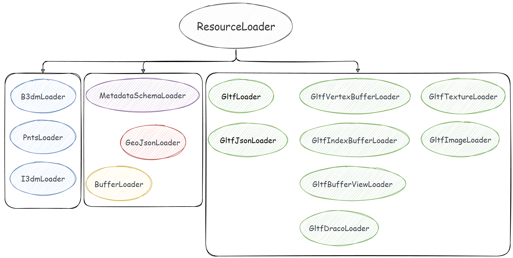
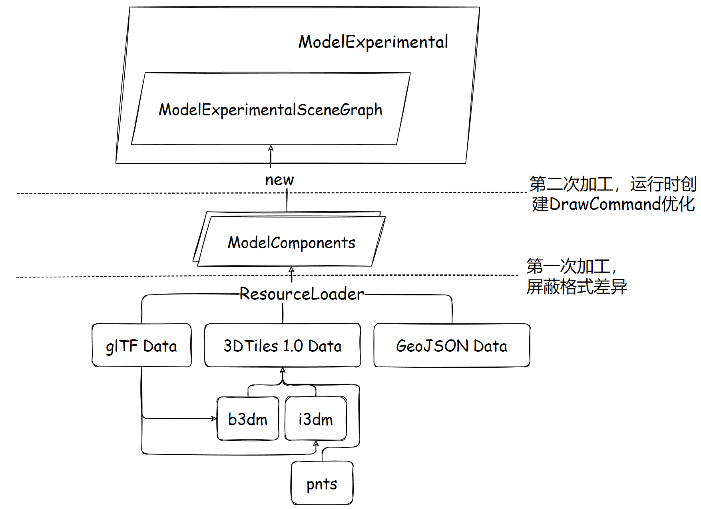

三维模型架构（即 `Scene/ModelExperimental` 目录下的模块）有别于旧版模型 API（即 `Scene/Model.js` 模块为主的一系列处理 glTF 以及处理 3DTiles 点云文件的源码），它重新设计了 CesiumJS 中的场景模型加载、解析、渲染、调度架构，更合理，更强大。

这套新架构专门为 **下一代 3DTiles（1.1版本，当前暂时作为 1.0 版本的扩展）**设计，接入了更强大的 **glTF 2.0** 生态，还向外暴露了 **CustomShader API**。

`ModelExperimental` 的尾缀 `Experimental` 单词即“实验性的”，等待这套架构完善，就会去掉这个尾缀词（截至发文，CesiumJS 版本为 1.95）。

接下来，我想先从这套架构的缓存机制说起。

# 1. ModelExperimental 的缓存机制

## 1.1. 缓存池 ResourceCache

缓存机制由两个主管理类 `ResourceCache` 和 `ResourceCacheKey` 负责，缓存的可不是 `Resource` 类实例，而是由 `ResourceLoader` 这个基类派生出来的 N 多个子类：



`ResourceCache` 类被设计成一个类似于“静态类”的存在，很多方法都是在这个类身上使用的，而不是 new 一个 `ResourceCache` 实例，用实例去调用。例如：

``` js
ResourceCache.get("somecachekey...") // 使用键名获取缓存的资源
ResourceCache.loadGltfJson({
  /* . */
}) // 根据配置对象加载 glTF 的 json
```

上面提到，`ResourceCache` 缓存的是各种 `ResourceLoader`，实际上为了统计这些 loader 被使用的次数，Cesium 团队还做了一个简单的装饰器模式封装，即使用 `CacheEntry` 这个在 `ResourceCache.js` 模块内的私有类：

``` js
function CacheEntry(resourceLoader) {
  this.referenceCount = 1;
  this.resourceLoader = resourceLoader;
}
```

你可以在 `ResourceLoader.js` 源码中找到一个静态成员 `cacheEntries`：

``` js
function ResourceCache() {}
ResourceCache.cacheEntries = {};
```

它只是一个简单的 JavaScript 对象，key 是字符串，也就是等会要讲的 `ResourceCacheKey` 部分，值即 `CacheEntry` 的实例。

在 `ResourceCache.load` 这个静态方法中可以看到是如何缓存的：

``` js
ResourceCache.load = function (options) {
  // ...
  const cacheKey = resourceLoader.cacheKey;
  // ...

  if (defined(ResourceCache.cacheEntries[cacheKey])) {
    throw new DeveloperError(
      `Resource with this cacheKey is already in the cache: ${cacheKey}`
    );
  }

  ResourceCache.cacheEntries[cacheKey] = new CacheEntry(resourceLoader);
  resourceLoader.load();
}
```

设计上，缓存的 loader 只允许 load 一次，之后在取的时候都是使用 `ResourceCache.get` 方法获得。

## 1.2. 缓存对象的键设计 ResourceCacheKey

Cesium 团队在键的设计上充分利用了待缓存资源的自身信息，或唯一信息，或 JSON 字符串本身，但是我觉得这有些不妥，较长的字符串会带来较大的内存占用。

`ResourceCacheKey` 也是一个类似静态类的设计，它有很多个 `getXXXKey` 的静态方法：

``` js
ResourceCacheKey.getSchemaCacheKey // return "external-schema:..."
ResourceCacheKey.getExternalBufferCacheKey // return "external-buffer:..."
ResourceCacheKey.getEmbeddedBufferCacheKey // return "embedded-buffer:..."
ResourceCacheKey.getGltfCacheKey // return "gltf:..."
ResourceCacheKey.getBufferViewCacheKey // return "buffer-view:..."
ResourceCacheKey.getDracoCacheKey // return "draco:..."
ResourceCacheKey.getVertexBufferCacheKey // return "vertex-buffer:..."
ResourceCacheKey.getIndexBufferCacheKey // return "index-buffer:..."
ResourceCacheKey.getImageCacheKey // return "image:..."
ResourceCacheKey.getTextureCacheKey // return "texture:...-sampler-..."
```

这些方法均返回一个字符串，有兴趣的读者可以自己跟进源码了解它是如何从资源本身的信息“计算”出 key 的。

我认为这里存在优化的可能性，三维场景的资源会非常多，对内存容量是一个不小的要求，减小 key 的内存大小或许能提升内存消耗表现，这需要优秀的软件设计，等待官方团队优化或者大手子提交 PR。（2022年6月）

# 2. 三维模型的加载与解析

`ModelExperimental API` 的主要入口就是 `ModelExperimental` 类，它有几个静态方法可供加载不同的模型资源（glTF/b3dm/i3dm/pnts...）：

```js
ModelExperimental.fromGltf = function (options) { /* ... */ }
ModelExperimental.fromB3dm = function (options) { /* ... */ }
ModelExperimental.fromPnts = function (options) { /* ... */ }
ModelExperimental.fromI3dm = function (options) { /* ... */ }
ModelExperimental.fromGeoJson = function (options) { /* ... */ }
```

均返回一个 `ModelExperimental` 实例。从这几个方法可以看出，还是兼容了 3DTiles 1.0 中的三个主要瓦片格式的。其中，`fromGeoJson` 方法是一个尚未完全实现的规范，允许使用 geojson 作为瓦片的内容，有兴趣可以看 [CesiumGS/3d-tiles](https://github.com/CesiumGS/3d-tiles) 仓库中的一个提案。

以 glTF 为例，先看示例代码：

```js
import {
  ModelExperimental,
  Transforms,
  Cartesian3
} from 'cesium'

const origin = Cartesian3.fromDegrees(113.5, 22.4)
const modelPrimitive = ModelExperimental.fromGltf({
  gltf: "path/to/glb_or_gltf_file",
  modelMatrix: Transforms.eastNorthUpToFixedFrame(origin)
})
viewer.scene.primitives.add(modelPrimitive)
```

以 glTF 模型（文件格式 glb 或 gltf）为例，从流程上来看，创建 `ModelExperimental` 实例的过程是这样的：

```
ModelExperimental.fromGltf
  new GltfLoader()
  new ModelExperimental()
    fn initialize
      GltfLoader.prototype.load
        ~promise.then → new ModelExperimentalSceneGraph
```

大部分的初始化工作是由 `GltfLoader` 去完成的，现在就进入 `GltfLoader` 中看看吧。

## 2.1. GltfLoader 的初步加载

`GltfLoader` 的 load 方法本身是同步的，但是它里面的过程却是一些异步的写法，使用了 ES6 的 Promise。

`GltfLoader` 把加载结果允诺给 Promise 成员变量 `promise`，可以看到在 `ModelExperimental.js` 模块内的 `initialize` 函数中，then 链接收初步加载完毕的各种 glTF 组件：

``` js
// ModelExperimental.js

function initialize(model) {
  const loader = model._loader;
  const resource = model._resource;

  loader.load();

  loader.promise
    .then(function (loader) {
      const components = loader.components;
      const structuralMetadata = components.structuralMetadata;
      /* ... */
    })
    .catch(/* ... */);

  /* ... */
}
```

从而创建一个叫“模型场景图结构”（`ModelExperimentalSceneGraph`）的对象，这个对象待会会讲。

进入到 `GltfLoader.prototype.load` 方法中，会发现它实际上创建了一个 `GltfJsonLoader`，这个时候第 1 节中介绍的缓存机制就上场了：

``` js
GltfLoader.prototype.load = function () {
  const gltfJsonLoader = ResourceCache.loadGltfJson(/* ... */);

  /* ... */

  gltfJsonLoader.promise
    .then(/* ... */)
    .catch(/* ... */);
}
```

`ResourceCache.loadGltfJson` 这个方法中缓存器就派上用场了，首先使用 `ResourceCache.get` 方法获取缓存池中是否有这个 `GltfJsonLoader`，有则直接返回，无则 new 一个新的，并调用 `ResourceCache.load` 方法作缓存并加载。

熟悉 glTF 格式规范的人应该都清楚，glTF 格式有一个 JSON 部分作为某个 glTF 模型文件的描述信息，`GltfJsonLoader` 其实就是加载这部分 JSON 并简单处理成 Cesium 所需的信息的。

 `ResourceCache.load` 实际上是直接调用传进来的某个 `ResourceLoader`（此处即 `GltfJsonLoader`）的 `load` 方法，并作了一次缓存。

## 2.2. GltfJsonLoader 请求并解析 glTF 的 JSON 部分

从 2.2 得知，`ResourceCache.load` 执行的是 `ResourceLoader`，也即本节关心的 `GltfJsonLoader` 原型链上的 `load` 方法，这个方法的作用就是分情况去处理传进来的参数，在异步的 Promise 链中保存处理的结果，这个结果也就是 glTF 模型的 JSON 部分。

``` js
GltfJsonLoader.prototype.load = function () {
  this._state = ResourceLoaderState.LOADING;

  let processPromise;
  if (defined(this._gltfJson)) {
    processPromise = processGltfJson(this, this._gltfJson);
  } else if (defined(this._typedArray)) {
    processPromise = processGltfTypedArray(this, this._typedArray);
  } else {
    processPromise = loadFromUri(this);
  }

  const that = this;

  return processPromise
    .then(function (gltf) {
      if (that.isDestroyed()) {
        return;
      }
      that._gltf = gltf;
      that._state = ResourceLoaderState.READY;
      that._promise.resolve(that);
    })
    .catch(/* ... */);
}
```

函数体中间的三个逻辑分支，分别处理了传参为 glTF JavaScript 对象、glb 或 glTF JSON 文件二进制数组、网络地址三种类型的 glTF。

对应的 5 种情况如下：

``` js
ModelExperimental.fromGltf({
  url: {
    // glTF JSON 本体
  },
  url: new Uint8Array(glTFJsonArrayBuffer),
  url: new Uint8Array(glbArrayBuffer),
  url: "path/to/model.glb",
  url: "path/to/model.gltf"
})
```

5 种情况均可，但是一般比较常规的还是给网络路径，5 种情况由几个 `GltfJsonLoader.js` 模块内的函数来处理。

- 第 1 种情况，由 `processGltfJson` 处理；
- 第 2、3 种情况，由 `processGltfTypedArray` 处理；
- 第 4、5 种情况，由 `loadFromUri` 处理。

这三个函数均为异步函数，返回一个 Promise。而 glTF 的处理过程，Cesium 团队还官方设计了一个 `GltfPipeline` 目录，位于 `Source/Scene` 目录下。

`loadFromUri` 会继续执行 `processGltfTypedArray`，进而继续执行 `processGltfJson`，`processGltfJson` 函数就会调用 `GltfPipeline` 目录下的各种处理函数来应付灵活多变的 glTF 数据。

我简单地看了一下，大概就是升级 glTF 1.0 版本的数据、补全 glTF 规范中的默认值、加载内嵌为 base64 编码的缓冲数据等操作，返回一个统一的 glTF JSON 对象。

到 processPromise 的 then 为止，glTF 的初步解析就算完成了，相当于买来的食材摘掉了发黄的菜叶，烧洗了五花肉的猪毛，清洁了瓜果的表皮，切掉了不需要的枝干，本身对食材（glTF）还没有开始做任何处理。

## 2.3. 状态判断

根据 glTF 设计的灵活性，glTF 数据可能存在二级加载的过程，也就是要先获取 glTF JSON，然后才获取这个 JSON 上定义的 Buffer、Image 等信息，所以异步是不可避免的。（甚至有三级加载过程，也就是二级加载到 Buffer、Image 后，仍需异步解码 Draco 缓冲或者压缩纹理数据等）

但是 CesiumJS 又是一个渲染循环程序，所以使用枚举状态值来辅助判断当前帧下，各种 loader 的状态是怎么样的，资源处理到哪一步，就分支去调用哪一步的处理函数。

譬如，`GltfLoader.prototype.load` 方法中，会对 `GltfJsonLoader` 的 `promise` 成员字段（ES6 `Promise` 类型）进行 `then` 链式操作，修改 `GltfLoader` 的状态：

``` js
GltfLoader.prototype.load = function () {
  /* ... */
  const that = this;
  this._promise = gltfJsonLoader.promise
    .then(function () {
      /* ... */
      that._state = GltfLoaderState.LOADED;
      that._textureState = GltfLoaderState.LOADED;
      /* ... */
    })
    .catch(/* ... */)
  /* ... */
}
```

上面这段简化后的代码，意思就是在 `gltfJsonLoader.promise` 的 `then` 中，glTF JSON 部分已经加载完毕，那么此时就可以标记 `GltfLoader` 的 `_state` 和 `_textureState` 为“已加载（但未处理）”，也就是 `GltfLoaderState.LOADED`。

你还可以在 `Scene/ResourceLoaderState.js` 模块中找到 `ResourceLoaderState` 这个适用于全部 `ResourceLoader` 的状态枚举。


## 2.4. glTF 的延迟处理机制 - 使用 ES6 Promise

根据 2.3 小节的内容，glTF 有多级加载、处理的过程，Cesium 团队在 ES6 发布之前，用的是 `when.js` 库提供的 `Promise`，现在 1.9x 版本早已换成了原生的 `Promise API`，也就是用 Promise 来处理这些异步过程。

注意到 `ModelExperimental.js` 模块内的 `initialize` 函数有一段 Promise then 链，是 `GltfLoader`（仍以 `ModelExperimental.fromGltf` 为例）的一个 promise，then 链内接收 `GltfLoader` 上的各种组件，从而创建出 `ModelExperimentalSceneGraph`：

``` js
function initialize(model) {
  const loader = model._loader;
  /* ... */
  
  loader.load();
  const loaderPromise = loader.promise.then(function (loader) {
    const components = loader.components;
    /* ... */
    model._sceneGraph = new ModelExperimentalSceneGraph(/* ... */);
    /* ... */
  });
  /* ... */
}
```

那么，`loader.promise` 是何方神圣呢？

代码定位到 `GltfLoader.prototype.load` 方法，它返回的是一个 Promise：

```js
GltfLoader.prototype.load = function () {
  /* ... */
  const that = this;
  let textureProcessPromise;
  const processPromise = new Promise(function (resolve, reject) {
    textureProcessPromise = new Promise(function (
      resolveTextures,
      rejectTextures
    ) {
      that._process = function (loader, frameState) { /* ... */ };
      that._processTextures = function (loader, frameState) { /* ... */ };
    };
  }); // endof processPromise
  
  this._promise = gltfJsonLoader.promise
    .then(function () {
      if (that.isDestroyed()) {
        return;
      }
      that._state = GltfLoaderState.LOADED;
      that._textureState = GltfLoaderState.LOADED;

      return processPromise;
    })
    .catch(/* ... */)
  
  /* ... */
  return this._promise;
}
```

`this._promise` 是 `gltfJsonLoader.promise` 的 `then` 链返回的 `processPromise`，是一个位于代码稍上方的另一个 `Promise`。我觉得，为了逻辑上不那么混乱，暂到这一步为止，可以先下一个结论：

> ModelExperimental 创建模型场景图的 `then` 链所在的 Promise 对象，追根溯源，其实是 `GltfLoader.prototype.load` 方法内部 new 的一个名为 `processPromise` 的 Promise 对象。便于讨论，不妨设创建场景图这个 Promise 为“A”。

我们在 `ModelExperimental.js` 模块内的 `initialize` 函数内，对“A”这个 Promise 进行 `then` 链式操作，`then` 链内收到的 `loader` 在本小节的背景下，就是 `GltfLoader`，所以才能获取到 `GltfLoader` 上的 `components`，这意味着“A”肯定能找到一个 `resolve()` 语句，把 `GltfLoader` 给 resolve 出去。

果不其然，在 `GltfLoader.prototype.load` 方法内，`processPromise` 内，new 了一个 `textureProcessPromise`，在这个 `textureProcessPromise` 内，就找到了 `processPromise` 的 resolve 语句：

``` js
GltfLoader.prototype.load = function () {
  /* ... */
  const that = this;
  let textureProcessPromise;
  const processPromise = new Promise(function (resolve, reject) {
    textureProcessPromise = new Promise(function (
      resolveTextures,
      rejectTextures
    ) {
      that._process = function (loader, frameState) {
        /* ... */
        if (loader._state === GltfLoaderState.PROCESSED) {
          /* ... */
          resolve(loader); // 在这儿
        }
      };
      that._processTextures = function (loader, frameState) { /* ... */ };
    };
  });
  
  /* ... */
}
```

可以看到，它是在 `that._process` 这个方法上的 `GltfLoaderState.PROCESSED`（处理完毕）状态分支上 `resolve` 的。

> `that` 就是 `GltfLoader` 本身，`_process` 是一个初始化 `GltfLoader` 时定义的空函数，直到在此时才会完全定义。这个方法，实际上是下一小节（2.5）的内容，也即处理由 `GltfJsonLoader` 初步处理的 glTF JSON，产出用于创建 `ModelExperimentalSceneGraph` 的组件。

为什么要层层封装呢？这对于阅读源码的人来说心智负担略大。

原因就是 glTF 规范的定义，很灵活，有多级加载的可能性。Cesium 团队在逻辑上是这样顺序组织 Promise 代码的：

- 先由 `GltfJsonLoader` 加载、解析 glTF 的 JSON 部分，升级 glTF 版本、补全默认值、解析内嵌缓冲数据后，向下传递这个初步解析的 glTF JSON 对象；
- 向下传递是借助 `GltfJsonLoader` 的一个 `promise` 字段成员，接收者位于 `GltfLoader.prototype.load` 方法中，`then` 链首先会标记 `GltfLoader` 的两个状态为“已加载”，然后返回 load 方法中创建的一个用于下一步加工操作的 `processPromise`，这个 Promise 最终 resolve 的值即 `GltfLoader` 本身；而这个 `processPromise`，是处理 glTF 的 JSON 的，要把 JSON 转换为组件 - 也就是创建 `ModelExperimentalSceneGraph` 的原材料，基于 glTF 数据的特征，这一步处理又要分两步：先处理纹理，再处理其余的数据；
- 由此，`processPromise` 内只有一个操作，那就是 new 一个 `textureProcessPromise`，确保材质纹理的处理优先级最高；
- `textureProcessPromise` 中补全了 `GltfLoader` 的两个处理方法的定义，即 `_process` 和 `_processTextures`，前者将会 resolve `processPromise`，后者将会 resolve `textuerProcessPromise`

请注意，此时还未正式执行处理函数，也就是 `GltfLoader` 的 `_process` 和 `_processTextures` 方法。

在同步操作上来说，最外层的 `ModelExperimental` 已经由模块内的函数 `initialize` 走完了，也就是 `ModelExperimental` 已经创建出来了，但是由于 glTF 只初步加载了 JSON 部分，所有的资源都还没准备齐全，还没加工成组件，也就创建不了 `ModelExperimentalSceneGraph`，没有这个模型场景图结构对象，也就创建不出 DrawCommand。

但是，到现在为止，`GltfJsonLoader` 的使命已经完成，下一步将由 `GltfLoader` 使用处理好的 glTF JSON 创建模型组件，即 2.5 小节的内容。

这里讲的有点超前，但是这些都是下文的内容，请耐心往下看，我承认这部分使用 Promise 确实有点麻烦。

一旦 `GltfLoader` 的 `_process` 流程走到了 `GltfLoaderState.PROCESSED`，也就是glTF JSON 全部处理完毕，就意味着组件已创建完毕，可以创建 `ModelExperimentalSceneGraph` 了；而纹理一边则由 `_processTextures` 方法来完成。

所以说为什么 glTF 使用了延迟处理机制呢？是因为根自 `ModelExperimental.js` 模块内的 `initialize` 函数已经执行完毕，只完成了第一步：实例化了一个 `ModelExperimental`，就算随着时间推向前，最多能达到的状态也只是 `GltfJsonLoader` 初步加载解析完毕 glTF JSON，不会发起下一步。

那么下一步的 `GltfLoader` 的 `_process` 和 `_processTextures` 由谁执行呢？这里先漏一点，是由 `scene.primitives.update()`，也就是场景的更新过程触发的 `ModelExperimental.prototype.update` 过程来执行的，见本文第 3 节。


## 2.5. 模型组件创建

恭喜你，2.4 小节算是一个头脑风暴，如果你成功地看下来了。

这一步在 2.4 小节尾已经透露了，实际上就是 `GltfLoader` 接过了 `GltfJsonLoader` 的大旗，进一步随场景的更新过程执行 `_process`、`_processTextures` 的过程。

这个过程，将创建出模型组件，也就是 `ModelExperimentalSceneGraph` 的原材料。

还记得我在前面是怎么描述 `GltfJsonLoader` 的行为的吗？

> 本文 2.2 小节
>
> 相当于买来的食材摘掉了发黄的菜叶，烧洗了五花肉的猪毛，清洁了瓜果的表皮，切掉了不需要的枝干，本身对食材（glTF）还没有开始做任何处理。

这一步由 `GltfLoader` 加工出来的模型组件，相当于是把初步处理的食材进行了切割、吸干血水，乃至焯水等正式炒菜前的“前置步骤”。

模型组件，由 `Scene/ModelComponents.js` 模块定义，组件有如下数种：

```
Quantization
Attribute
Indices
FeatureIdAttribute
FeatureIdTexture
FeatureIdImplicitRange
MorphTarget
Primitive
Instances
Skin
Node
Scene
AnimatedPropertyType
AnimationSampler
AnimationTarget
AnimationChannel
Animation
Asset
Components
TextureReader
MetallicRoughness
SpecularGlossiness
Material
```

实际上很接近 glTF JSON 的各个对象，毕竟只是简单的切割、去血水、焯水。这一步没什么太特殊的操作，由于之前的文章讲过 Scene 是如何更新 Primitive 的，就省去这个前置流程，直接看到 `ModelExperimental.prototype.update` 方法：

```js
ModelExperimental.prototype.update = function (frameState) {
  processLoader(this, frameState);
  
  /* ... */
}

function processLoader(model, frameState) {
  if (!model._resourcesLoaded || !model._texturesLoaded) {
    model._loader.process(frameState);
  }
}
```

上来第一步就是调用 ResourceLoader 原型上的 process 函数，这里仍以 `ModelExperimental.fromGltf` 为例，那么应该执行的就是 `GltfLoader.prototype.process`：

``` js
GltfLoader.prototype.process = function (frameState) {
  /* ... */

  this._process(this, frameState);
  this._processTextures(this, frameState);
};
```

由于 2.4 小节已经介绍了这两个处理方法的具体定义位置，我们直接转到 `GltfLoader.prototype.load` 方法，找到他们的定义。不难发现，他们内部还是做了状态判断，进行不同状态的逻辑分叉：

``` js
that._process = function (loader, frameState) {
  if (!FeatureDetection.supportsWebP.initialized) { /**/ }
  if (loader._state === GltfLoaderState.LOADED) { /**/ }
  if (loader._state === GltfLoaderState.PROCESSING) { /**/ }
  if (loader._state === GltfLoaderState.PROCESSED)  { /**/ }
}

that._processTextures = function (loader, frameState) {
  if (loader._textureState === GltfLoaderState.LOADED) { /**/ }
  if (loader._textureState === GltfLoaderState.PROCESSING) { /**/ }
  if (loader._textureState === GltfLoaderState.PROCESSED) { /**/ }
}
```

对 `GltfLoader` 不同的状态走不同的路线。

生成模型组件的分叉位于 `if (loader._state === GltfLoaderState.LOADED)` 分支下的 `parse` 函数调用内。这个 `parse` 函数，定义在 `GltfLoader.js` 模块内。

简单过一下这个函数，大部分的解析逻辑分散在 `loadNodes`、`loadSkins`、`loadAnimations`、`loadScene` 这几个模块内的函数中，其中 `loadNodes` 是从 glTF JSON 中的 `nodes` 成员开始的，经过 `meshes`、`primitives`，然后是 `loadMaterial`、`loadVertexAttribute` 等齐上阵，把 glTF JSON 中关于几何图形的信息全部拆解出来，生成 `ModelComponents` 命名空间下的各种组件对象。

在 `parse` 函数的下半部分，有对额外数据的异步处理 promise 进行并发执行的语句：

``` js
Promise.all(readyPromises)
  .then(function () {
    if (loader.isDestroyed()) {
      return;
    }
    loader._state = GltfLoaderState.PROCESSED;
  })
  .catch(rejectPromise);

Promise.all(loader._texturesPromises)
  .then(function () {
    if (loader.isDestroyed()) {
      return;
    }
    loader._textureState = GltfLoaderState.PROCESSED;
  })
  .catch(rejectTexturesPromise);
```

是这两个并发操作决定了 `GltfLoader` 的状态为“处理完毕”的。

而一旦被设为 `GltfLoaderState.PROCESSED`，那么在 `_process` 和 `_processTextures` 这两个函数中，就会执行 2.4 小节中提及的两个 Promise —— `processPromise` 和 `processTexturesPromise` 给 resolve 掉，进行下一步创建场景图结构，也就是 2.6 小节。


## 2.6. 模型场景图结构的创建

有了 `GltfLoader.prototype.process` 方法处理出来的各种组件后，就可以进一步创建模型场景图结构对象了，也就是 `ModelExperimentalSceneGraph` 实例。

相关代码位于 `ModelExperimental.js` 模块内的 `initialize` 函数中：

``` js
function initialize(model) {
  const loader = model._loader;
  /* ... */
  const loaderPromise = loader.promise.then(function (loader) {
    const components = loader.components;
    /* ... */

    model._sceneGraph = new ModelExperimentalSceneGraph({
      model: model,
      modelComponents: components,
    });
    model._resourcesLoaded = true;
  });
  /* ... */
}
```

`ModelExperimentalSceneGraph` 的创建其实比较简单，`GltfLoader` 已经把最繁重的处理和解析任务完成了，剩下的工作，就是把食材放进锅里炒熟，出菜即 `ModelExperimentalSceneGraph`，它的初始化函数只是把模型组件做了一些简单的处理。

glTF 模型有静态的模型，也有带骨骼、蒙皮动画的模型，恰恰是这些动态的模型还需要再一次根据“运行时”来获得当前帧的静态数值，才能交给 WebGL 绘图，负责这部分任务的，就是这个 `ModelExperimentalSceneGraph`。这部分在第 3 节中会简单提及，此处省略 `ModelExperimental` 的更新过程。


## 2.7. 本节小结

多种格式拼装成组件，这是一次加工的结果。然后组件创建场景图结构，这是二级加工的结果。本节以 glTF 模型为例，穿过层层 Promise 交叉调用，理清了 Cesium 为了兼容性做出的新逻辑。简单的说，可以顺次为如下流程（以 glTF 为例）：

- `ModelExperimental.fromGltf` 入场，创建 `ModelExperimental`，执行初始化，创建 `GltfLoader`、`GltfJsonLoader`
- `GltfJsonLoader` 先行，初步加载并清洁了 glTF JSON
- `GltfLoader` 接过初步处理的 glTF JSON，创建模型组件
- 在 Promise 链的终点，创建出 `ModelExperimentalSceneGraph`

别忘了状态机制和缓存机制的功劳！


# 3. 模型的更新与 DrawCommand 创建

CesiumJS 没有选用 ES6 的类继承，也没有用原型链继承，`ModelExperimental` 是一种“似 Primitive（PrimitiveLike）”，它与原生 `Primitive` 类似，有 `update` 方法来创建 `DrawCommand`。

Scene 的更新过程不赘述，可以参考系列的第 2 篇。此处直接跳转至更新方法：

``` js
ModelExperimental.prototype.update = function (frameState) {
  /* 长长的更新状态过程 */
  buildDrawCommands(this, frameState);
  /* ... */
  submitDrawCommands(this, frameState);
}
```

这个过程非常复杂，但 Cesium 团队封装地还挺清晰的，这套模型新架构既要兼容非 glTF 格式的 pnts，还要考虑到时间相关的 glTF 骨骼、蒙皮内置动画。

> 别忘了，这个 update 方法第一步是调用 `GltfLoader.prototype.process` 方法，见 2.5 小节。

简单的说，在更新的过程中，绘图指令（`DrawCommand`）由 `ModelExperimentalSceneGraph.prototype.buildDrawCommands` 方法创建，这个方法会遍历场景图结构对象下所有 `ModelComponents.Primitive` 的状态，最终是由 `buildDrawCommands.js` 模块使用这些状态创建出 DrawCommand 的。

> 着色器也有专门的新设计，有兴趣的可以去看 `Source/Shaders/ModelExperimental` 下面为这套模型新架构设计的着色器，你会发现好多“XXXStage.glsl”代码，这是一种可扩展的设计，即为完整的模型着色器添加中间阶段，实现多种效果。待会在 3.1 小节中还会介绍这些阶段哪来的。

具体一点来说，`ModelExperimental.prototype.update` 还包括了如下项目：

- 自定义着色器更新
- 更新光照贴图
- 点云相关更新
- 有要素表的模型则更新要素表
- 有裁剪面的则更新裁剪面信息
- 创建绘图指令（DrawCommand）
- 更新模型矩阵
- 更新场景图结构对象
- 提交绘图指令到 frameState，结束战斗

详细的过程便不再深入讨论，还是建议 **有 glTF 规范基础** 去阅读这部分源码，会更容易一些。


## 3.1. 创建 DrawCommand 及一些有趣的设计

既然创建 DrawCommand 是场景图结构对象最重要的使命，那么就看看这个过程有什么有趣的东西：

``` js
ModelExperimental.prototype.update = function (frameState) {
  /* 长长的更新状态过程 */
  buildDrawCommands(this, frameState);
  /* ... */
  submitDrawCommands(this, frameState);
}

function buildDrawCommands(model, frameState) {
  if (!model._drawCommandsBuilt) {
    model.destroyResources();
    model._sceneGraph.buildDrawCommands(frameState);
    model._drawCommandsBuilt = true;
  }
}

function submitDrawCommands(model, frameState) {
  /* ... */
  if (showModel) {
    /* ... */
    const drawCommands = model._sceneGraph.getDrawCommands(frameState);
    frameState.commandList.push.apply(frameState.commandList, drawCommands);
  }
}
```

也就这些，主要的任务还是在场景图对象上的。

实际上，静态资源可以不考虑那么多“场景图对象中的设计”，这些额外的设计主要还是为动态模型考虑的。

一个是“模型组件运行时再次封装对象”，另一个是“分阶段”。

前者有好几个类，和几何图形相关的是 `ModelExperimentalNode`、`ModelExperimentalPrimitive`、`ModelExperimentalSkin` 等，很显然，这些就是对应模型组件的动态化封装，例如 `ModelExperimentalNode` 对应的是 `ModelComponents.Node`。它们与模型组件对象是共存的：

``` js
function ModelExperimentalSceneGraph(options) {
  /* ... */
  
  this._components = components;
  this._runtimeNodes = [];
  this._runtimeSkins = [];
  
  /* ... */
}
```

这些运行时对象由模块内的初始化函数 `initialize` 递归遍历创建而来。

“阶段”是什么？你在 `Scene/ModelExperimental` 目录下可以找到挺多“Stage”类的，它们的作用相当于给“模型组件运行时再次封装对象”增加一些可选的功能，每个“阶段”对象都会随着 `buildDrawCommands` 函数触发一次处理方法，这样就能影响最终创建出来的 `DrawCommand`。

不仅“模型组件运行时再次封装对象”允许有“阶段”，场景图结构对象自己也有：

``` js
function ModelExperimentalSceneGraph(options) {
  /* ... */
  
  this._pipelineStages = [];
  this._updateStages = [];
  this.modelPipelineStages = [];
  
  /* ... */
}
```

在调用 `ModelExperimentalSceneGraph.prototype.buildDrawCommands` 方法创建 DrawCommand 时，这些“运行时对象”会调用自己原型上的 `configurePipeline` 方法（如果有），决定当前帧要选用那些阶段影响生成的绘制指令。

以 `ModelExperimentalPrimitive` 为例，它的可配置的阶段就很多了：

``` js
ModelExperimentalPrimitive.prototype.configurePipeline = function (frameState) {
  const pipelineStages = this.pipelineStages;
  pipelineStages.length = 0;
  /* ... */
  
  // Start of pipeline --------------------------------
  if (use2D) {
    pipelineStages.push(SceneMode2DPipelineStage);
  }
  
  pipelineStages.push(GeometryPipelineStage);
  
  /* 很长，很长... */
  
  pipelineStages.push(AlphaPipelineStage);
  pipelineStages.push(PrimitiveStatisticsPipelineStage);

  return;
};
```

阶段的具体执行，就请读者自行阅读 `ModelExperimental.js` 模块内的 `buildDrawCommands` 函数了。

这就是场景图对象的一些辅助设计，不难，目的只是更好地降低耦合，增强这套 API 的可扩展性。


## 3.2. 可能有帮助的切入点

这里就长话短说了，有了上述提纲挈领的主干代码，我想这些更适合有特定优化或学习需求的读者，自行研究：

- 剔除优化：可以通过设定 `ModelExperimental` 的颜色透明度为全透明，或者直接设置 `show` 属性为 `false`，就可以粗暴地不创建 DrawCommand 了；DrawCommand 本身是会被 `View` 筛选的，参考本系列文章的第 2 篇；
- 渲染顺序调度：即最终传递给 DrawCommand 的 `Pass` 枚举值，这些受 3.1 小节中各种阶段处理器的影响，见 `ModelExperimentalSceneGraph.prototype.buildDrawCommands` 方法内的 `ModelRenderResources`、`NodeRenderResources`、`PrimitiveRenderResources` 的传递处理过程；
- 要素表、属性元数据与样式：要素表由属性元数据创建而来，参考 `ModelExperimental.js` 模块内的 `createModelFeatureTables` 函数（初始化时会判断是否需要调用），会根据属性元数据创建 `ModelFeatureTable`，属性元数据参考 3DTiles 规范中的属性元数据（Metadata）部分；`ModelExperimental` 对象是可以应用 `Cesium3DTileStyle` 的，但是样式不能与 `CustomShader` 共存；
- 模型渲染统计信息：定义在 `ModelExperimental` 对象的 `statistics` 成员上，类型是 `ModelExperimentalStatistics`；
- 自定义着色器：随 `ModelExperimental` 的更新而更新，主要是更新纹理资源。

属性元数据、自定义着色器、光影渲染、裁剪平面、GPUPicking 这些可以成为专题的内容，以后考虑再写，本篇主要介绍的是三维模型架构的主线脉络。


# 4. 本文总结

模型架构的革新，使得源码在处理 3D 格式上具备更强大的可扩展性、可维护性。CesiumJS 选择了 glTF 生态，为兼容 glTF 1.0、2.0 做出了许多封装。当然，还保留了 3DTiles 1.0 原生的几种瓦片格式的解析，并正在设计 GeoJSON 为瓦片的解析途径。

整个模型架构，单从各种类的封装角度看，为了统一能在更新时生成 DrawCommand，势必有一个统一的内置数据类封装，也就是 `ModelExperimentalSceneGraph`，模型场景图，它由某个 ResourceLoader 异步加载完成的 **组件** 创建而来，这些组件是各种格式（glTF 1.0/2.0、3DTiles 1.0 瓦片格式、GeoJSON）使用不同的 loader 解析而来，大致分层如下：



缓存池 + ResourceLoader + 运行时场景图多阶段 的设计使得未来扩展其它格式有了可扩展、高性能的可能，但是其中的一些仓促未优化的部分仍待解决。

> 也许有人会拿 ThreeJS 来比较，但是我认为要在同等条件下才能比较。ThreeJS 也能加载 glTF，但是它的主库并没有加载、解析的功能，这部分功能拆到 Loader 里去了，满血版的 ThreeJS 估计代码量也挺可观的。CesiumJS 的侧重点与 ThreeJS 不一样，鱼是新鲜，熊掌是硬核，看你怎么选，二者得兼，必然付出巨大的代价。

如果说 `ModelExperimental` 这套架构是 `Primitive API` 的特定数据格式具象化上层封装，那么下一篇 3DTiles 将是 Cesium 团队对 Web3DGIS 的最大贡献，也是 CesiumJS 中三维数据技术的集大成者。


