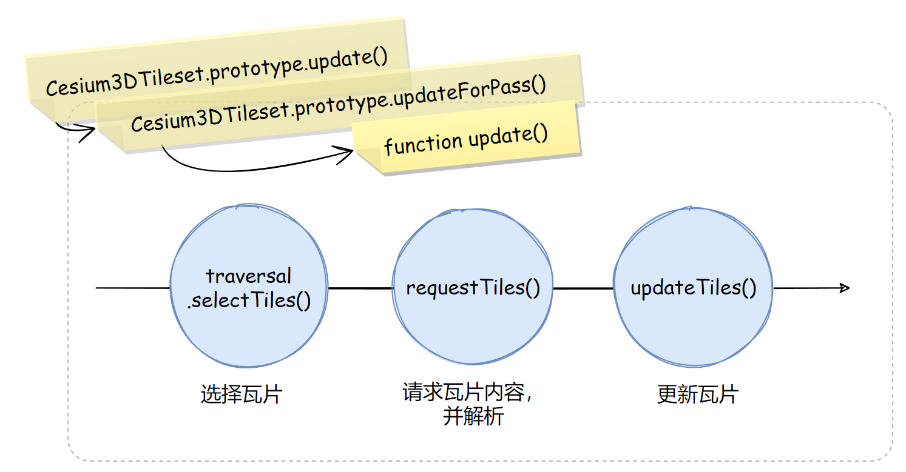
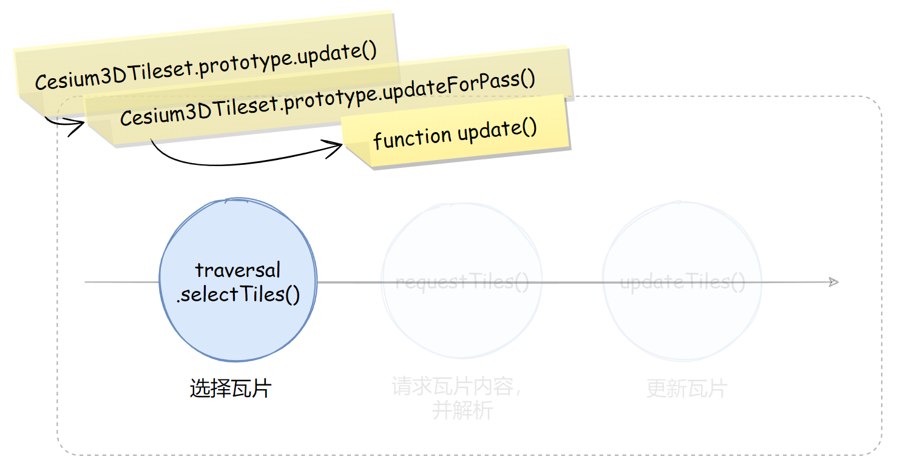
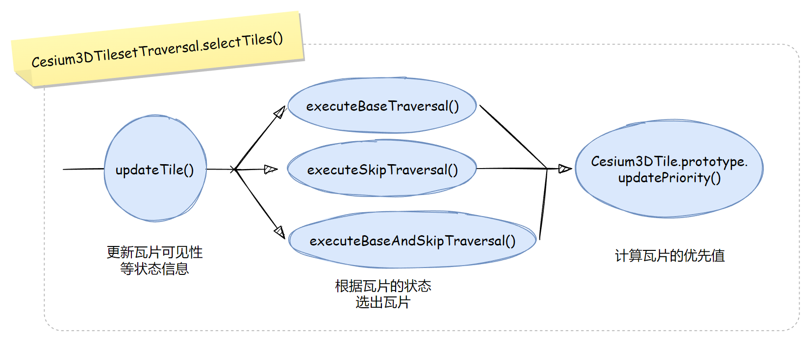
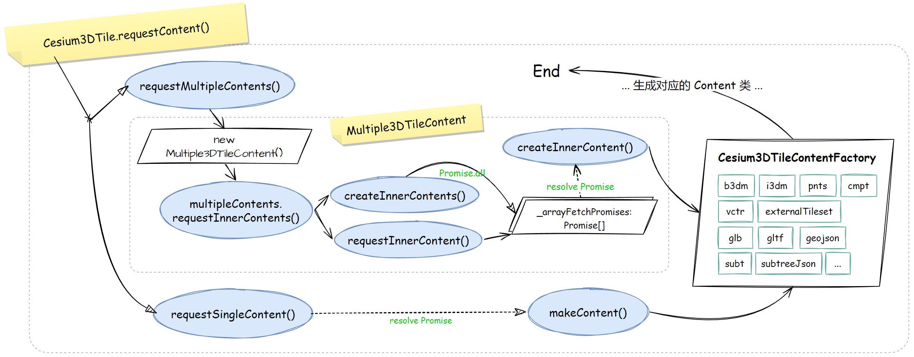

3DTiles 与 I3S 是竞争关系，可是比起生态开放性、数据定义的灵活性与易读性来说，3DTiles 比 I3S 好太多了。由于数据生产工具的开发者水平参差不齐，且数据并不存在极致的、万能的优化方法，故 3DTiles 1.0 时代的一些工具可能导致的数据渲染质量问题，让 3DTiles 的性能、显示效果颇受争议。

随着 CesiumJS 模型新架构的逐渐成型，下一代的 3DTiles 首先以 1.0 的扩展项测试使用，待日后时机成熟，会将 1.0 的规范标记为过时，甚至直接废弃，直接将这些扩展项作为 1.1 版本的核心定义使用（估计还挺久的）。

下一代 3DTiles 明确了这套规范的职能，即 **更自由的显示效果可能性**、**更专注地三维空间索引性能**、**更强大的信息融合能力**。

唠叨有点长，开始讲解，本文着重介绍的是“3DTiles”在 CesiumJS 中运作流程本身，而不是瓦片文件的解析（解析有兴趣的可以看本系列文章的上一篇，或者看旧版实现）、瓦片的空间调度算法、3DTiles 着色器设计。

# 1. 3DTiles 数据集的类型

3DTiles 1.0 规范允许异构数据共存于一个数据集上。3D 瓦片只是空间划分的单元，并不是该块三维空域内的具体三维物体。这些三维物体被称作“瓦片内容”。

1.0 允许存在 7 种瓦片内容，它们的文件后缀名是：

- b3dm，批次三维模型，该瓦片文件内置一个 glTF 模型文件，应尽可能在数据生产时优化此 glTF 的绘制批次
- i3dm，实例三维模型，允许内嵌在 i3dm 文件内的 glTF 模型在 WebGL 种绘制多实例
- pnts，点云
- cmpt，复合格式，即前三者的混合体，合并细碎瓦片内容文件成一个，减少网络请求
- vctr，矢量瓦片，未正式发布，本篇不讨论
- json，这种叫做扩展数据集（`ExternalTileset`），即允许瓦片空域内再嵌套一个子 3DTiles
- 空瓦片，即瓦片无内容

而 1.0 的扩展项，也就是下一代标准增加了一种瓦片格式：

- glb/gltf，也就是直接将 glTF 模型文件作为瓦片内容文件

值得注意的是，社区提案中，延申了 geojson 为瓦片内容文件，也就是说，在未来也许有可能引入更多的瓦片格式，但是能不能成为官方标准还不一定，暂且以 1.0 + 下一代的 glTF 格式为主要解说点。

而 3DTiles 一切的入口，都是从一个 json 文件开始的，这个文件名称是随意的。

# 2. 创建瓦片树

`Cesium3DTileset` 类代表了一个 3DTiles 数据集，每个数据集总是有一个根瓦片（`Cesium3DTile`）。

`Cesium3DTileset` 同旧版 `Model`、新的 `ModelExperimental` 类一样，也是一种“似 `Primitive`（PrimitiveLike）”类，所以允许直接加入 `scene.primitives` 容器中。

下面给出一些简单的代码：

``` js
import {
  Cesium3DTileset
} from 'cesium'

// 最常规的加载
const t1 = viewer.scene.primitives.add(new Cesium3DTileset({
  url: 'http://localhost/static/tilesets/t1/tileset.json'
}))

// 使用新模型架构加载具备下一代数据标准的数据集
const t2 = viewer.scene.primitives.add(new Cesium3DTileset({
  url: 'http://localhost/static/tilesets/t2/entry.json',
  enableModelExperimental: true
}))
```


## 2.1. 请求入口文件

一旦 new 了 `Cesium3DTileset`，那么就会穿过接近 1000 行的构造函数（未压缩），走到最后的异步请求：

``` js
function Cesium3DTileset(options) {
  const that = this;
  let resource;
  this._readyPromise = Promise.resolve(options.url)
    .then(function (url) {
      /* ... */
      resource = Resource.createIfNeeded(url);
      /* ... */
      return Cesium3DTileset.loadJson(resource);
    })
    .then(function (tilesetJson) {
      /* ... */
      return processMetadataExtension(that, tilesetJson);
    })
    .then(function (tilesetJson) {
      /* ... */
      that._root = that.loadTileset(resource, tilesetJson);
      /* ... */
      return that;
    })
}
```

在第 1 个 then 中，调用 `Resource` 类相关静态方法，发起网络请求，得到的结果就是 `tileset.json` 的对象，然后向下传递；

第 2 个 then 是处理 `3DTILES_metadata` 扩展用的，这个不是本文的核心内容：3DTiles 在 CesiumJS 中的运作流程，所以略过。

第 3 个 then，调用 `Cesium3DTileset` 实例的 `loadTileset` 方法，加载整棵 3DTiles 树，也就是下一小节的内容。


## 2.2. 创建树结构

接上一小节，请求到入口文件并反序列化为 JavaScript 对象后，就由 `Cesium3DTileset.prototype.loadTileset` 方法开始创建整棵树了。

我一开始纳闷为什么这种加载方法要作为实例方法，而不是静态方法，后来看到 `ExternalTileset` 的加载过程时才知道这样设计的意图。

先看代码吧：

``` js
Cesium3DTileset.prototype.loadTileset = function (/**/) {
  const asset = tilesetJson.asset;
  if (!defined(asset)) {
    throw new RuntimeError("Tileset must have an asset property.");
  }
  if (
    asset.version !== "0.0" &&
    asset.version !== "1.0" &&
    asset.version !== "1.1"
  ) {
    throw new RuntimeError(
      "The tileset must be 3D Tiles version 0.0, 1.0, or 1.1"
    );
  }
  if (defined(tilesetJson.extensionsRequired)) {
    Cesium3DTileset.checkSupportedExtensions(
      tilesetJson.extensionsRequired
    );
  }
  
  /* ... */
  const rootTile = makeTile(this, resource, tilesetJson.root, parentTile);
  
  if (defined(parentTile)) {
    parentTile.children.push(rootTile);
    rootTile._depth = parentTile._depth + 1;
  }
  
  const stack = [];
  stack.push(rootTile);
  while (stack.length > 0) {
    /* ... */
    const children = tile._header.children;
    if (defined(children)) {
      const length = children.length;
      for (let i = 0; i < length; ++i) {
        /* ... */
        const childTile = makeTile(this, resource, childHeader, tile);
        tile.children.push(childTile);
        stack.push(childTile);
      }
    }
    /* ... */
  }
  
  return rootTile;
}
```

创建树结构主要有三块内容：

- 检验数据合法性
- 创建根瓦片对象
- 从根瓦片开始广度优先搜索整个数据集，创建出所有的 `Cesium3DTile`

检验数据合法性是近一年来加强的，对版本号、扩展项做了严格的要求。

> 老实说，这就是 1.0 的性能隐患，如果不使用 `ExternalTileset`，而把大量的瓦片定义在 `tileset.json` 上，那么这个广度优先搜索就非常消耗 CPU 的计算资源。下一代的 3DTiles 使用隐式瓦片扩展解决了这个性能弱点。

无论是创建根瓦片，还是创建子瓦片对象，都要经过模块内的 `makeTile` 函数：

``` js
function makeTile(tileset, baseResource, tileHeader, parentTile) {
  const hasImplicitTiling =
    defined(tileHeader.implicitTiling) ||
    hasExtension(tileHeader, "3DTILES_implicit_tiling");
  
  if (hasImplicitTiling) {
    /* ... */
  }
  
  return new Cesium3DTile(tileset, baseResource, tileHeader, parentTile);
}
```

其实这个函数的主要作用还是分辨下一代 3DTiles 的隐式瓦片用的，也就是判断是否有 `3DTILES_implicit_tiling` 扩展，如果没有，直接返回 new 出来的 `Cesium3DTile` 对象即可。

来看看隐式瓦片这个逻辑分支做了什么：

``` js
if (hasImplicitTiling) {
  const implicitTileset = new ImplicitTileset(/* ... */);
  const rootCoordinates = new ImplicitTileCoordinates({/* ... */});
  const contentUri = implicitTileset.subtreeUriTemplate.getDerivedResource(
    templateValues: rootCoordinates.getTemplateValues(),
  ).url;
  
  const deepCopy = true;
  const tileJson = clone(tileHeader, deepCopy);
  tileJson.contents = [
    {
      uri: contentUri,
    },
  ];

  delete tileJson.content;
  delete tileJson.extensions;
  
  const tile = new Cesium3DTile(
    tileset, baseResource, tileJson, parentTile
  );
  tile.implicitTileset = implicitTileset;
  tile.implicitCoordinates = rootCoordinates;
  return tile;
}
```

其实也是返回一个 `Cesium3DTile`，但是它多了俩专门用于隐式瓦片扩展的字段，分别是 `ImplicitTileset` 和 `ImplicitCoordinates`。

待所有瓦片对象创建完毕后，那么 `Cesium3DTileset` 对象也就算创建完成了，此时也只有这棵树的结构，没有瓦片内容。瓦片内容是根据当前视图状态，随 `Scene` 的单帧更新过程去选取、下载、解析，进而创建 DrawCommand 的。


## 2.3. 瓦片缓存机制带来的能力

3DTiles 也是有缓存功能的，由 `Cesium3DTilesetCache` 类完成缓存，它的实例是 `Cesium3DTileset` 的一个成员字段 `_cache`。

在本文下一节将会讲到 3DTiles 的更新过程，有三大步骤，其中有一个叫做“请求瓦片”的步骤，这一步是异步的，用到了 ES6 Promise API，当瓦片内容文件请求、解析完成后，在 `tile.contentReadyPromise` 的 then 链中就使用下面这个函数将瓦片对象添加到缓存池中：

``` js
function handleTileSuccess(tileset, tile) {
  return function (content) {
    /* ... */
    if (!tile.hasTilesetContent && !tile.hasImplicitContent) {
      /* ... */
      tileset._cache.add(tile);
    }
  }
}
```

这个缓存机制有什么用呢？

翻遍源代码，能在即将在下面介绍的遍历器中、卸载瓦片的过程中用到这个缓存池，这样就能免于再次搜索哪些瓦片需要被卸载了。

> 此处的缓存机制只是缓存瓦片对象的引用。对于在内存中瓦片文件的缓存，请看本系列文章的上一篇，我介绍了 `ModelExperimental` 新架构中的缓存机制，那里缓存的 ResourceLoader 上才会有资源数据。


# 3. 瓦片树的遍历更新

## 3.1. 三个大步骤

伴随着 `Scene` 的帧更新过程，`Cesium3DTileset` 也一起进入更新、创建 DrawCommand 的队伍中。

很快就从 `Cesium3DTileset.prototype.update` 方法进入到 `Cesium3DTileset.prototype.updateForPass` 方法。先点题，`updateForPass` 方法会进入到模块内的函数 `update` 内，由如下三个大步骤完成 3DTiles 树上的瓦片的选择、请求解析、更新：



方法 `updateForPass` 里头有一个值得注意的变量，那就是传进来的参数：来自 frameState 的 `tilesetPassState`，类型是 `Cesium3DTilePassState`，它身上携带了一个字段：

- pass，是 `Cesium3DTilePass` 枚举，指示 3DTiles 更新时是哪一道通道的

这个字段用于在更新时获取 `passOptions`：

```js
Cesium3DTileset.prototype.updateForPass = function (
  frameState,
  tilesetPassState
) {
  const pass = tilesetPassState.pass;
  /* ... */
  const passOptions = Cesium3DTilePass.getPassOptions(pass);
  /* ... */
}
```

在普通渲染更新过程中，字段 `pass` 的值就是 `Cesium3DTilePass.RENDER`，此时 `passOptions` 根据源码可以得知：

``` js
const Cesium3DTilePass = {
  RENDER: 0,
  PICK: 1,
  SHADOW: 2,
  PRELOAD: 3,
  PRELOAD_FLIGHT: 4,
  REQUEST_RENDER_MODE_DEFER_CHECK: 5,
  MOST_DETAILED_PRELOAD: 6,
  MOST_DETAILED_PICK: 7,
  NUMBER_OF_PASSES: 8,
};

const passOptions = new Array(Cesium3DTilePass.NUMBER_OF_PASSES);

passOptions[Cesium3DTilePass.RENDER] = Object.freeze({
  traversal: Cesium3DTilesetTraversal,
  isRender: true,
  requestTiles: true,
  ignoreCommands: false,
});

/* 其他 passOptions */

Cesium3DTilePass.getPassOptions = function (pass) {
  return passOptions[pass];
};
```

`passOptions` 会透过 `Cesium3DTileset.js` 模块内的函数 `update`，一直传递到瓦片内容的选择、请求、更新这几个流程：

``` js
// Cesium3DTileset.prototype.updateForPass 中
if (this.show || ignoreCommands) {
  this._pass = pass;
  tilesetPassState.ready = update(
    this,
    frameState,
    passStatistics,
    passOptions
  );
}
```

这个 `update` 函数大致可以分这 3 个流程，图已经在本小节开头给到了：

``` js
function update(tileset, frameState, passStatistics, passOptions) {
  /* ... */
  const ready = passOptions.traversal.selectTiles(tileset, frameState);
  if (passOptions.requestTiles) {
    requestTiles(tileset);
  }

  updateTiles(tileset, frameState, passOptions);
  /* ... */
  return ready;
}
```

不过，在讲这 3 个流程进行讲解之前，还得提一下 `passOptions` 上的 `traversal` 成员。


## 3.2. 遍历器

上一小节的 `passOptions` 来自 `Cesium3DTilePass.js` 模块，内部定义的若干个 passOption 中，只有两种 `traversal` 的值，即：

- `Cesium3DTilesetTraversal`
- `Cesium3DTilesetMostDetailedTraversal`

这两个静态类作用于 `update` 函数的第一个重要步骤，也就是选择瓦片。



`passOptions` 上这个 `traveral` 被称作“遍历器”。设计这两个类，是因为 3DTiles 瓦片的空间调度选择较为复杂，独立到一个类中。

我对全代码进行了搜索，发现用到 `Cesium3DTilesetMostDetailedTraversal` 的逻辑分支条件是使用射线求交拾取相关的 API 时，才会用到这个“详尽遍历器”，大多数时候用的还是普通的遍历器 `Cesium3DTilesetTraversal`。


## 3.3. 选择瓦片

现在，把视线从遍历器上返回 `Cesium3DTileset.js` 模块内的 `update` 函数中，一句简单的代码就启动了瓦片的选择：

``` js
// Cesium3DTileset.js
function update(/* ... */) {
  /* ... */
  const ready = passOptions.traversal.selectTiles(tileset, frameState);
  /* ... */
  return ready;
}
```

现在明确瓦片选择的目的：把符合当前 3DTiles 数据集上各种优化参数的前提下，选出当前视角下要用于加载、解析（如果未加载和未解析），并继续沿着更新流程创建 DrawCommand 的 **Cesium3DTile**，挂载到 `Cesium3DTileset` 对象的 `_requestTiles` 这个数组成员上。

3.2 小节指出了大多数时候 `passOptions.traversal` 是 `Cesium3DTilesetTraversal`。调用 `traversal.selectTiles()` 方法的主要流程可由下面的流程示意图给出：



更新瓦片信息是第一步，此更新非“更新瓦片的内容数据”，只是更新瓦片对象（`Cesium3DTile`）的状态信息，主要是可见性计算。

第二步是依据前一步更新的状态，进行从根瓦片到底的遍历（此处有三个逻辑分岔，见源码），这一步就是最核心的调度算法；

第三步就是为选出来的瓦片计算其优先值，优先值越高的，越先被加载、渲染。

> 由于调度算法并不是本文的目的，所以止步到这一层我认为已足够，感兴趣如何计算 Tile 的可见性、如何被选择，优先顺序如何计算的读者，可以按这一层继续往下追踪源码。


## 3.4. 请求并解析瓦片内容

接上一步，被选中的瓦片已经存至 `Cesium3DTileset` 对象的 `_requestTiles` 数组成员上了，并计算了优先值，即 `Cesium3DTile` 对象的 `_priority` 私有成员上，是一个普通的数字。

紧接着，作用域回到 `Cesium3DTileset.js` 模块内的 `update` 函数里头，继续执行模块内的 `requestTiles` 函数：

```js
// Cesium3DTileset.js -> function update()
if (passOptions.requestTiles) {
  requestTiles(tileset);
}
```

这个 `requestTiles` 函数只做了两件事：根据优先值排序，并请求瓦片内容：

``` js
function requestTiles(tileset, isAsync) {
  const requestedTiles = tileset._requestedTiles;
  const length = requestedTiles.length;
  requestedTiles.sort(sortRequestByPriority);
  for (let i = 0; i < length; ++i) {
    requestContent(tileset, requestedTiles[i]);
  }
}
```

那么进入到 `requestContent` 函数中，主要的代码就这几个：

``` js
function requestContent(tileset, tile) {
  /* ... */
  
  const attemptedRequests = tile.requestContent();
  
  /* ... */
  
  tile.contentReadyToProcessPromise
    .then(addToProcessingQueue(tileset, tile))
    .catch(/* ... */);
  tile.contentReadyPromise
    .then(handleTileSuccess(tileset, tile))
    .catch(/* ... */);
}
```

即发起内容请求，并为瓦片对象上的 `contentReadyToProcessPromise` 和 `contentReadyPromise` 这两个 Promise 注册 resolve 和 reject 的回调函数。

至此，当前帧的大流程已经基本完成，即选择瓦片、发出请求瓦片内容。有人说请求完了应该要解析啊？是要解析没错，ES6 Promise API 又派上了用场。

从上面的两个 Promise 可以看出，瓦片内容 - 也就是 `glTF` 瓦片、`b3dm/i3dm/pnts/cmpt` 等瓦片数据文件请求下来后，还要经过 `contentReadyToProcessPromise` 中的代码进行处理的。

那么 `contentReadyToProcessPromise` 又是什么时候，由谁创建的呢？顺着 `Cesium3DTile.js` 模块中的 `requestSingleContent` 函数或者 `requestMultipleContents` 函数，你可以看到这个 Promise 的创建（以其一举例）：

``` js
function requestSingleContent(tile) {
  const resource = tile._contentResource.clone();
  /* ... */
  const promise = resource.fetchArrayBuffer();
  const contentReadyToProcessPromise = promise.then(function (arrayBuffer) {
    /* ... */
    const content = makeContent(tile, arrayBuffer);
    /* ... */
    tile._content = content;
    tile._contentState = Cesium3DTileContentState.PROCESSING;
    return content;
  });
  tile._contentReadyToProcessPromise = contentReadyToProcessPromise;
  tile._contentReadyPromise = contentReadyToProcessPromise
    .then(function (content) {/**/})
    .then(function (content) {/**/})
    .catch(/**/);
  
  return 0;
}
```

可见，请求到 ArrayBuffer 后，进入 `makeContent` 函数进一步处理瓦片内容，生成对应的 Content 类实例。`requestMultipleContents` 函数就稍微复杂一些。

用代码流程图来说明，比代码文字好一些：



可见，CesiumJS 对下一代 3DTiles 中“多内容瓦片（1.0 版本中即 `3DTILES_multiple_contents` 扩展）”还是做了分叉的，对每一个 content 发起请求，留下其请求 Promise，然后使用 `Promise.all` 并发处理；当每个 Promise resolve 后，调用 `createInnerContent` 函数，对请求下来的 `ArrayBuffer` 数据，进入简单工厂 `Cesium3DTileContentFactory` 分支，创建具体的瓦片内容对象。

如果是单个瓦片内容，如上文所述，走的是 `requestSingleContent` 函数，当内容文件的请求 Promise resolve 后，调用 `makeContent` 方法，同样进入 `Cesium3DTileContentFactory` 工厂中对应的分支，创建具体的瓦片内容对象。

如果是 `glb/gltf`，且开启了 `tileset.enableModelExperimental` 为 `true`，那么就能看到上一篇熟悉的 `ModelExperimental` 的创建了。`b3dm`、`i3dm` 等也同理。

> `subt`、`subtreeJson` 是下一代 3DTiles 中隐式瓦片（1.0 版本中的 `3DTILES_implicit_tiling` 扩展）中子树的可见性数据，详见 3DTiles 相关资料。

别忘了，不管是单内容瓦片执行 `makeContent` 后，还是多内容瓦片执行 `createInnerContent` 后，也就是请求到瓦片内容文件、解析成具体内容类后，都会留下  `contentReadyToProcessPromise`、`contentReadyPromise` 两个 Promise，供进一步处理。

进一步处理什么呢？此时该选择的瓦片选好了，该请求的瓦片请求到了，也解析了，当然就是要 **处理成 DrawCommand**，供 Renderer 模块去渲染。在说创建 DrawCommand 之前，我先把本节讲解的“三大步骤”中最后一个步骤，也就是 `updateTiles` 函数讲完，随后再说是如何创建每个被选中的瓦片的 DrawCommand 的。


## 3.5. 更新瓦片并创建 DrawCommand

三大步骤中的最后一个步骤：

``` js
// Cesium3DTileset.js

function update(tileset, frameState, passStatistics, passOptions) {
  /* ... */
  updateTiles(tileset, frameState, passOptions);
  /* ... */
}

function updateTiles(tileset, frameState, passOptions) {
  /* ... */
  const selectedTiles = tileset._selectedTiles;
  const selectedLength = selectedTiles.length;
  /* ... */
  
  let i;
  let tile;
  
  for (i = 0; i < selectedLength; ++i) {
    /* ... */
    tile.update(tileset, frameState, passOptions);
    /* ... */
  }
  
  /* ... */
}
```

这个步骤没有太多很关键的行为，只是更新一些状态信息、可有可无的效果（例如裁剪面、调试信息等），最终调用 `tile._content` 的 `update` 方法，进而创建 DrawCommand 或其它的 Command，总之很常规。

至此，3DTiles 三大步骤，从选择瓦片，到发起请求解析瓦片内容，到更新瓦片状态并随之创建内容在当前帧的 DrawCommand，一切都顺利。期间，ES6 Promise API 配合各个数据对象上的状态机制，来判断在当前帧是否该做什么 —— 譬如某个数据状态得是 `READY`，才有资格创建 DrawCommand。


## 3.6. prePassesUpdate 也能创建 DrawCommand

承 3.4 小节，瓦片内容文件请求下来、解析后，相关 Promise 的 then 链最终扔给 `Cesium3DTile` 对象的 `_contentReadyToProcessPromise` 成员，随后继续第三个大步骤，更新瓦片的状态后创建 DrawCommand，结束当前帧的战斗。

但是，我发现 `Cesium3DTileset` 这货有那么一丢丢不一样，它有两条路线可以创建 DrawCommand。

回忆本系列文章第二篇的内容，也就是 Scene 渲染 Primitive、创建出 DrawCommand 的内容，创建 DrawCommand 是在 下面这段函数调用中执行的：

```js
function updateAndRenderPrimitives(scene) {
  const frameState = scene._frameState;
  /* ... */
  scene._primitives.update(frameState);
  /* ... */
}
```

也就是 `PrimitiveCollection` 会触发 `Primitive` 或似 Primitive（例如 `Cesium3DTileset`、`Model` 等）的更新，进而创建出 DrawCommand。

注意，Scene 会在 render 之前走一遍 `prePassesUpdate`：

``` js
Scene.prototype.render = function (time) {
  /* ... */
  tryAndCatchError(this, prePassesUpdate);
  if (shouldRender) {
    /* ... */
    tryAndCatchError(this, render);
  }
  /* ... */
}

function prePassesUpdate(scene) {
  /* ... */
  const primitives = scene.primitives;
  primitives.prePassesUpdate(frameState);
  /* ... */
}
```

也就是会调用 `Cesium3DTileset.prototype.prePassesUpdate`，最终会调用 `Cesium3DTile.prototype.process` 方法：

``` js
Cesium3DTile.prototype.process = function (tileset, frameState) {
  /* ... */
  this._content.update(tileset, frameState);
  /* ... */
};
```

这时，对 Tile 上的 content 进行 `update`，也就是继续进入创建 DrawCommand 的过程，与 3.5 小节的最终目的一致了。

> 创建 DrawCommand 并不一定是 Primitive.prototype.update 发起的。更新 Primitive 可能是 Scene.js 模块下的 render 函数发起的，也有可能是 prePassesUpdate 函数发起的。所以，似 Primitive 的 postPassesUpdate 方法也有可能创建 DrawCommand。当然，目前也只有 Cesium3DTileset 拥有 postPassesUpdate，可见 3DTiles 的渲染优先级之高。


## 3.7. 自定义着色器

自定义着色器是 `ModelExperimental` 新架构带来的 API，即 `CustomShader API`，在发文时，Cesium 1.95 还是需要显式指定使用新架构，才能使用这个自定义着色器，官方沙盒中也有相关的代码。

这里简单提一下它的作用过程。

自定义着色器虽然定义在 `Cesium3DTileset` 实例上，但是作用却是在 `ModelExperimental` 上，见 `ModelExperimental3DTileContent`：

```js
ModelExperimental3DTileContent.prototype.update = function (
  tileset,
  frameState
) {
  const model = this._model;
  /* ... */
  model.customShader = tileset.customShader;
  model.update(frameState);
};
```

于是，你就能在 `ModelExperimental.prototype.update` 方法中看到自定义着色器是如何更新场景图结构对象的了：

```js
function updateCustomShader(model, frameState) {
  if (defined(model._customShader)) {
    model._customShader.update(frameState);
  }
}

ModelExperimental.prototype.update = function (frameState) {
  /* ... */
  // A custom shader may have to load texture uniforms.
  updateCustomShader(this, frameState);
  /* ... */
};
```

具体的内容还是得到 `CustomShader.prototype.update` 方法里看。在着色器方面的实现上，用的就是上一篇提到的“阶段”技术，选择性地在着色器代码中增加的。

``` glsl
// ModelExperimentalVS.glsl
void main() 
{
    // ...
    Metadata metadata;
    metadataStage(metadata, attributes);

    #ifdef HAS_CUSTOM_VERTEX_SHADER
    czm_modelVertexOutput vsOutput = defaultVertexOutput(attributes.positionMC);
    customShaderStage(vsOutput, attributes, featureIds, metadata);
    #endif
  
    // ...
}
```

 片元着色器上也有类似的，`customShaderStage` 函数在 `CustomShaderStageVS/FS.glsl` 文件中。


## 3.8. 样式引擎

CesiumJS 使用 `Cesium3DTileStyle` 相关 API 来实现 3DTiles 的样式化。用法不赘述，有专门的文档：[点我](https://github.com/CesiumGS/3d-tiles/tree/main/specification/Styling|3D Tiles Styling language)

在这里列出，主要是明确它的作用方式：

```js
// Cesium3DTileset.js

function updateTiles(tileset, frameState, passOptions) {
  tileset._styleEngine.applyStyle(tileset);
  /* ... */
}
```

显然，是在三大步骤的最后一个步骤应用的样式。

``` js
Cesium3DTileStyleEngine.prototype.applyStyle = function (tileset) {
  const tiles = styleDirty
    ? tileset._selectedTiles
    : tileset._selectedTilesToStyle;
  const length = tiles.length;
  for (let i = 0; i < length; ++i) {
    const tile = tiles[i];
    if (tile.lastStyleTime !== lastStyleTime) {
      const content = tile.content;
      /* ... */
      content.applyStyle(this._style);
      /* ... */
    }
  }
};
```

`content.applyStyle` 只是简单地将 `_style` 传递给 content 实例，最终还是随 content 实例的 `update` 方法应用到 DrawCommand 上的。

> `Cesium3DTileStyle` 既可以应用于 3DTiles，也可以应用于 `ModelExperimental`。它条件样式语言的作用前提是，在 3DTiles /模型中存在 3D 要素表，这是在制作数据时就必须写入的。


## 3.9. 其它

篇幅原因，有一些相对简单又零碎，或者不属于本文关注的内容，例如事件机制、裁剪平面、几何误差等就不再展开了，以后可以出一些单文来讲。


# 4. 本文总结

其实本文没写什么很深入的内容，只把创建树、处理瓦片的全流程，以及一些零碎点提炼了出来，希望对读者有帮助。

截至发文，3DTiles 已经应用了有六七年了，也看到了 Cesium 团队为此付出的努力。

不好看？卡顿？确实有点，但是已经在努力了。下一代的 3DTiles 真的值得期待！

我认为，3DTiles 规范只是一种大规模空间三维数据的组织指导资料。它本身没有指导你怎么制作 LOD，也没有告诉你该如何把你的业务需求（分层分户、单体化、点击查询）如何塞到瓦片里，这都需要数据生产开发者的不懈努力，把 GPUPicking、Batch、数据调优手段都用起来，那么 3DTiles 与 glTF 才能焕发出强大的能力，CesiumJS 作为一个前端运行时，它在调优上已经做得很不错了。

简单总结如下：

- 亮点：缓存机制
- 难点：选择调度算法
- 架构设计优点：平稳的接入了下一代 3DTiles 的同时还兼容了 1.0 版本

至此，CesiumJS 源码解读系列已经接近尾声，还有一篇关于资源处理和网络请求、多线程的文章，下篇见。