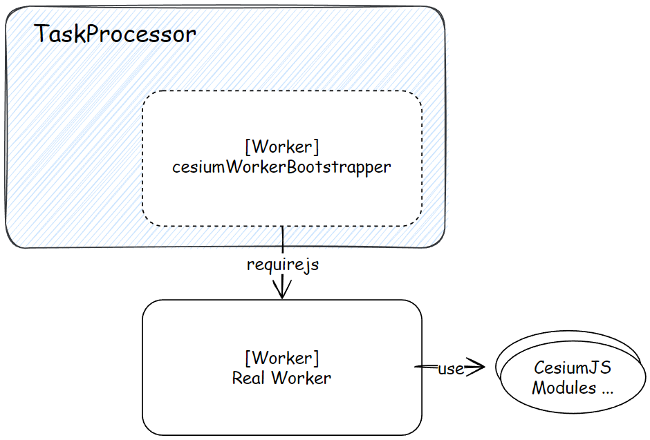

CesiumJS 对需要网络请求的一切资源都进行了统一的封装，也就是 `Resource` 类。

在 XHR 技术横行的年代，就出现过 ajax 这种神器，但是 Cesium 团队选择了自己封装 XHR。后来 ES6 出现了 Promise API，axios 再次封装了 XHR，但是 Cesium 团队对这种底层的改动非常敏感，也是最近一年（2021~2022年）才把 `var` 改为了 `const/let`，把 `when.js` 改为了原生 Promise，把 `""/''` 字符串部分改为了 \`\` 这种反引号字符串，因此自封装的 XHR 就没有改动。

所以，虽然可能不太常用，我认为还是可以了解了解这套 `Resource API` 的。 

# 1. 资源封装与请求封装

`Resource` 集成了一些通用的请求方法，以及一些辅助的函数，譬如判断 blob 的支持、处理 Url（修改QueryString、获取基地址等）等。不过，真正发起请求，还是得从 `Request` 和 `RequestScheduler` 这两个类说起。

## 1.1. 请求的封装 - Request 与其调度器

`Request` 代表一个具体的请求，`RequestScheduler` 则是调度器。有人说为什么要整个调度类和调度器类，直接让 `Resource` 发起 XHR 请求不就行了吗？

这与 CesiumJS 的数据调度算法有关，有的请求并不是马上随更新过程就发出的，有的是需要延迟请求的（优先级不同），这时候请求调度器 `RequestScheduler` 就凸显了作用。

`Request` 类一般以 `Resource` 对象字段存在：

``` js
function Resource(options) {
  /* ... */
  this.request = defaultValue(options.request, new Request());
  /* ... */
}
```

在需要使用的时候，会把 `Resource` 对象上的信息交给 `Request` 对象：

``` js
Resource.prototype.fetch = function (options) {
  options = defaultClone(options, {});
  options.method = "GET";

  return this._makeRequest(options);
};

Resource.prototype._makeRequest = function (options) {
  /* ... */
  request.url = resource.url;
  request.requestFunction = function () {/* ... */};
  const promise = RequestScheduler.request(request);
  /* ...返回请求的数据... */
};
```


## 1.2. 资源类 - Resource

你可以用很多东西来实例化一个 `Resource`，你也可以在公开的文档中看到很多参数是“Resource”类型的，例如几个很常见的数据类：

```js
/**
 * @param {Resource|String|Promise<Resource>|Promise<String>} options.url The url to a tileset JSON file.
 */
function Cesium3DTileset(options) {/* ... */}

/**
 * @param {String|Resource} options.url The url to the .gltf or .glb file.
 */
ModelExperimental.fromGltf = function (options) {/* ... */}

/**
 * @param {Resource|String|Object} data A url, GeoJSON object, or TopoJSON object to be loaded.
 */
GeoJsonDataSource.load = function (data, options) {/* ... */}
```

你用这些信息实例化一个 `Resource`：

- 资源的网络相对/绝对路径
- `Resource` 实例本身
- base64 字符串（DataUri） / blob 字符串

在各种数据的 API 中也允许你传入不同的参数，例如 glTF 数据允许你传递文件路径、glTF JSON 本身甚至是自己请求下来的 gltf/glb 文件的二进制流，详见本系列文章的第 6 篇。

`Resource` 类有很多个发起请求的方法，有实例上的，也有静态的，在 1.4 小节会列举。静态方法会 new 一个 `Resource` 实例，然后调用其对应的实例方法：

``` js
Resource.fetchJson = function (options) {
  const resource = new Resource(options);
  return resource.fetchJson(); // 返回 Promise<object>
};
```

在现在 axios 或浏览器原生 `Fetch API` 已经如此通用的环境下，已经很少有需要创建 `Resource` 对象的需求了。源码中一般会使用 `Resource.createIfNeeded()` 来创建资源对象，在测试用例中，创建 ktx2 文件资源的代码如下：

``` js
const resource = Resource.createIfNeeded("./Data/Images/Green4x4.ktx2");
```

最后说说触发请求后的调用链。

以请求 JSON 为例：

```
Resource.prototype.fetchJson
  ┕ Resource.prototype.fetch
     ┕ Resource.prototype._makeRequest
       [Module RequestScheduler.js]
       ┕ RequestScheduler.request
         ┕ fn startRequest
           [Module Request.js]
           ┕ Request.prototype.requestFunction
             [Module Resource.js]
             ┕ Resource._Implementations.loadWithXhr
```

`_makeRequest` 方法会为 `Resource` 对象的 `request` 成员注册请求方法 `requestFunction`，随后让 `RequestScheduler` 发起请求，一波周转后，还是会执行这个注册了的 `requestFunction` 的，内部会调用 `Resource._Implementations.loadWithXhr` 这个方法，也就是发起 XHR 请求，返回一个 Promise。


## 1.3. 延迟请求与最大请求个数限制

按理说，一般是不需要去修改 `Request` 或 `RequestScheduler` 上的信息的，这两个在 CesiumJS 封装的请求功能中属于底层，用 `Resource` 暴露出来的请求 API 即可。不过，我仍然觉得有两个地方值得分享。

> 虽然 `RequestScheduler` 是公开的 API，在 2019 年一个 PR [CesiumGS/cesium#8549](https://github.com/CesiumGS/cesium/issues/8549) 中被公开出来了

一个是 `RequestScheduler` 上的静态参数 `maximumRequests` 和 `maximumRequestsPerServer`，这两个数值代表的意义是允许开发者设置的最大并发请求数量、每个服务器允许的最大请求数量，默认分别是 50、6。

如果你的服务器允许，那么你可以稍微把这个数值改大一些（譬如并发用户数不多的时候，私网环境），在请求 3DTiles 瓦片、地球瓦片时能同时多请求一些资源。

另一个是 `RequestScheduler` 上的延迟请求机制，允许创建 `Request` 时指定 `throttle` 参数为 `true`，在使用 `RequestScheduler.request` 发出请求时，先暂存起来：

``` js
RequestScheduler.request = function (request) {
  /* 前面的代码是非延迟请求的处理 */
  const removedRequest = requestHeap.insert(request);
  return issueRequest(request);
};
```

此处 `requestHeap` 是 CesiumJS 自己制作的一个堆数据结构。

然后在 Scene 的渲染函数执行完毕后，在 `postPassesUpdate` 函数中调用 `RequestScheduler.update` 将延迟的请求统一再发出：

``` js
// Scene.js
function postPassesUpdate(scene) {
  /* ... */
  RequestScheduler.update();
}

Scene.prototype.render = function (time) {
  /* ... */
  if (shouldRender) {
    /* ... */
    tryAndCatchError(this, render);
  }
  /* ... */
  tryAndCatchError(this, postPassesUpdate);
  /* ... */
};
```

这样就实现了延迟请求，减轻大量请求可能造成的主线程压力 —— 这也就是 `RequestScheduler` 的职能所在。

想知道哪些数据类具备延迟请求行为？只需在 `Source` 文件夹下全代码搜索 `throttle: true` 即可，例如 `Multiple3DTileContent` 在请求内部瓦片内容时，就用了延迟请求；有几个影像、地形供给器类也用了延迟请求。


## 1.4. 常用请求方法

Cesium 封装了 HTTP 常用的请求方法：

- Resource.fetch（这个对应 GET 请求）
- Resource.head
- Resource.patch
- Resource.post
- Resource.delete
- Resource.options
- Resource.put

同时，对常用的文件/数据格式也做了简易的封装，如果你不想用 axios 或 `Fetch API`，而且能用 `async/await` 语法，那么直接 `await` 它们的执行结果也是不错的，返回的就是你所需要的数据结果：

- Resource.fetchJson
- Resource.fetchXML
- Resource.fetchImage
- Resource.fetchJsonp
- Resource.fetchText
- Resource.fetchBlob


## 1.5. 举例

这里就不再赘述，给出两个源代码中的资源创建、请求例子。

一个是 3DTiles 的 `tileset.json` 入口文件，用到了 `Resource.prototype.fetchJson` 方法：

``` js
// Cesium3DTileset.js
function Cesium3DTileset(options) {
  this._readyPromise = Promise.resolve(options.url)
    .then(function (url) {
      /* ... */
      resource = Resource.createIfNeeded(url);
      /* ... */
      return Cesium3DTileset.loadJson(resource);
  })
  /* ... */
}

Cesium3DTileset.loadJson = function (tilesetUrl) {
  const resource = Resource.createIfNeeded(tilesetUrl);
  return resource.fetchJson();
};
```

另一个是 `ImageryProvider` 的静态函数，请求影像瓦片图片，用到了 `Resource.prototype.loadImage` 方法：

``` js
ImageryProvider.loadImage = function (imageryProvider, url) {
  /* ... */

  const resource = Resource.createIfNeeded(url);

  if (ktx2Regex.test(resource.url)) {
    return loadKTX2(resource);
  } else if (
    defined(imageryProvider) &&
    defined(imageryProvider.tileDiscardPolicy)
  ) {
    return resource.fetchImage({
      preferBlob: true,
      preferImageBitmap: true,
      flipY: true,
    });
  }

  return resource.fetchImage({
    preferImageBitmap: true,
    flipY: true,
  });
};
```

其余的请读者自行研究学习。


# 2. 多线程技术

CesiumJS 使用了 WebWorker 多线程技术。

什么功能要用到 WebWorker 多线程呢？毕竟子线程与主线程的通信成本、能传递的数据类型都是对程序有影响的。WebWorker 技术发布之后，在实践中发现比较合适的任务是**数据编解码或有阻碍你主线程效率的任务**（尤其是数据解码，使用 WASM 辅助更佳）。

CesiumJS 有两类任务需要剥离主线程，不影响主线程的逻辑判断：数据解码、几何数据的处理。数据解码主要是 basisu 纹理的文件解码、draco 几何压缩缓冲数据的解码；几何数据的处理主要是少量在 `Primitive API` 中用到的部分 `Geometry` 合并操作。

而管理起这些 WebWorker 的管理器是 `TaskProcessor` 类。


## 2.1. 跳转器

在介绍 TaskProcessor 类之前，要先介绍一个 叫做 `cesiumWorkerBootstrapper` 的东西，你可能打开浏览器看报错、网络抓包时，在源代码页面看到过这个东西：


它是 `TaskProcessor` 创建的一个最基本的子线程（子 Worker）：

```js
// TaskProcessor.js

function getBootstrapperUrl() {
  if (!defined(bootstrapperUrlResult)) {
    bootstrapperUrlResult = getWorkerUrl("Workers/cesiumWorkerBootstrapper.js");
  }
  return bootstrapperUrlResult;
}

function createWorker(processor) {
  const worker = new Worker(getBootstrapperUrl());
  /* ... */

  const bootstrapMessage = {
    loaderConfig: {
      paths: {
        Workers: buildModuleUrl("Workers"),
      },
      baseUrl: buildModuleUrl.getCesiumBaseUrl().url,
    },
    workerModule: processor._workerPath,
  };

  worker.postMessage(bootstrapMessage);
  worker.onmessage = function (event) {
    completeTask(processor, event.data);
  };

  return worker;
}
```

而这个 `Workers/cesiumWorkerBootstrapper.js` 文件中的 Worker，直接封装了一个 `RequireJS` 库，使用 `require` 函数去异步请求了当前 TaskProcessor 需要的真正 Worker，真正的 Worker 的 onmessage 就会替换掉 `cesiumWorkerBootstapper` 的 onmessage。

> RequireJS 是 ESModule 尚未完全定稿前社区提供的一种模块化方案，即著名的“异步模块定义”的一种实现，有更高级的封装库（如 dojo.js），dojo.js 是 ArcGIS JsAPI 的底层依赖。

简而言之，这个就是个跳转器，方便接入 CesiumJS 其它模块，做个简单的桥梁。




## 2.2. 基本用法

在需要使用多线程的地方，需要实例化一个 `TaskProcessor`：

``` js
const processor = new TaskProcessor(
  "path/to/your-worker.js", // worker 的路径
  4 // 你希望这个 taskProcessor 最多激活多少个 WebWorker 在运行
);

// 当你需要用的时候，以传递 ArrayBuffer 的所有权情况为例
const needToDecodeData = new Float32Array(/* ... */)
processor
  .scheduleTask(
    needToDecodeData,
    [needToDecodeData.buffer]
  )
  .then(result => {
    // result 上就有 taskProcessor 处理后的数据
  })
```

路径如果相对于 `Cesium` 运行时的 Worker 目录，如果你所处的环境能用 `async/await` 会更直观：

``` js
const result = await processor.scheduleTask(
  typedArrayData, [typedArrayData.buffer]
)
```

`TaskProcessor.prototype.scheduleTask` 就是触发 Worker 执行的方法。


## 2.3. 使用 WebAssembly

`TaskProcessor` 有一个方法用来初始化 WebAssembly 模块：

``` js
processor.initWebAssemblyModule({
  modulePath: "ThirdParty/Workers/basis_transcoder.js",
  wasmBinaryFile: "ThirdParty/basis_transcoder.wasm",
}) // 返回	
```

有一些任务，例如 draco 压缩数据的解码或者 basisu 纹理的解码，需要依赖 wasm 模块，必须等待 wasm 解析、创建完成才能执行 WebWorker，所以一般 `TaskProcessor.prototype.initWebAssemblyModule` 方法执行之后，才会调用 `TaskProcessor.prototype.scheduleTask`，见下面 Draco 解析的例子。

实际上，现在要使用 wasm 解析的数据也不过是 basisu 纹理与 draco 压缩几何数据而已。


## ① 例：解码 draco 压缩的几何数据

Draco 压缩几何数据是一片以字符串 `"DRACO"` 起头的二进制数据，Draco 则是由 Google 开源的一套使用 C++ 开发的几何数据压缩库，利用了熵编码相关的算法。

glTF 2.0 允许使用 Draco 扩展，3DTiles 的点云格式也允许使用这个扩展。

解码 Draco 数据是由 `DracoLoader.js` 模块导出的“静态类”`DracoLoader` 完成的。`DracoLoader` 上有几个 `decode` 方法供使用。

如果是 glTF 中的 draco 数据，那么是由 `ResourceCache.loadDraco` 触发的：

```js
ResourceCache.loadDraco = function (options) {
  let dracoLoader = ResourceCache.get(cacheKey);
  
  dracoLoader = new GltfDracoLoader(/* ... */);

  ResourceCache.load({
    resourceLoader: dracoLoader,
  });
  /* ... */
};

// ========= 

GltfDracoLoader.prototype.load = function () {
  /* ... */
  
  // 层级较深，多重 Promise，见源码，这行不代表真实缩进
  const decodePromise = DracoLoader.decodeBufferView(decodeOptions);
  
  /* ... */
};
```

如果是 3DTiles 的点云格式，则是由 `PntsLoader.prototype.load` 方法触发的：

```js
function decodeDraco(loader, context) {
  const parsedContent = loader._parsedContent;
  const draco = parsedContent.draco;
  
  let decodePromise;
  /* ... */
  decodePromise = DracoLoader.decodePointCloud(draco, context);
  /* ... */
  
  /* ...后续处理... */
}

PntsLoader.prototype.load = function () {
  /* ... */
  const loader = this;
  this._promise = new Promise(function (resolve, reject) {
    /* ... */
    decodeDraco(loader, frameState.context).then(resolve).catch(reject);
    /* ... */
  });
};
```

以常见的 glTF 解析为例，也就是从 glTF 的 bufferView 中获取的 draco 压缩数据：

```js
DracoLoader.decodeBufferView = function (options) {
  const decoderTaskProcessor = DracoLoader._getDecoderTaskProcessor();
  if (!DracoLoader._taskProcessorReady) {
    // The task processor is not ready to schedule tasks
    return;
  }

  return decoderTaskProcessor.scheduleTask(options, [options.array.buffer]);
};

DracoLoader._getDecoderTaskProcessor = function () {
  if (!defined(DracoLoader._decoderTaskProcessor)) {
    const processor = new TaskProcessor(
      "decodeDraco",
      DracoLoader._maxDecodingConcurrency
    );
    processor
      .initWebAssemblyModule({
        modulePath: "ThirdParty/Workers/draco_decoder_nodejs.js",
        wasmBinaryFile: "ThirdParty/draco_decoder.wasm",
      })
      .then(function () {
        DracoLoader._taskProcessorReady = true;
      });
    DracoLoader._decoderTaskProcessor = processor;
  }
  return DracoLoader._decoderTaskProcessor;
};
```

总会有那么一帧，`DracoLoader` 的静态字段 `_taskProcessorReady` 会在 wasm 模块创建完成后被标记为 `true`，进而触发 `decoderTaskProcessor.scheduleTask` 方法，启动 `draco_decoder_nodejs.js` Worker 的解码任务。


## ② 例：处理几何数据

`Primitive API` 中的几何体与 `Globe/QuadtreePrimitive API` 用到的地形网格（由高程瓦片采样计算成几何网格）都用到了 `TaskProcessor` 进行多线程处理几何数据。

在几个地形数据模块中，可以看到 `TaskProcessor` 的使用，例如经典的 `QuantizedMeshTerrainData`：

```js
// 模块作用域下
const createMeshTaskName = "createVerticesFromQuantizedTerrainMesh";
const createMeshTaskProcessorNoThrottle = new TaskProcessor(createMeshTaskName);
const createMeshTaskProcessorThrottle = new TaskProcessor(
  createMeshTaskName,
  TerrainData.maximumAsynchronousTasks
);

QuantizedMeshTerrainData.prototype.createMesh = function (options) {
  /* ... */
  
  const createMeshTaskProcessor = throttle
    ? createMeshTaskProcessorThrottle
    : createMeshTaskProcessorNoThrottle;
  const verticesPromise = createMeshTaskProcessor.scheduleTask(/* ... */)
  /* ...进一步处理多线程处理后的数据... */
};
```

`Primitive API` 的更新过程也用到了：

``` js
Primitive.prototype.update = function (frameState) {
  /* ... */
  if (this.asynchronous) {
    loadAsynchronous(this, frameState);
  } else { /* ... */ }
  /* ... */
};

let createGeometryTaskProcessors;
const combineGeometryTaskProcessor = new TaskProcessor("combineGeometry");
  
function loadAsynchronous(primitive, frameState) {
  if (primitive._state === PrimitiveState.READY) {
    if (!defined(createGeometryTaskProcessors)) {
      createGeometryTaskProcessors = new Array(numberOfCreationWorkers);
      for (i = 0; i < numberOfCreationWorkers; i++) {
        createGeometryTaskProcessors[i] = new TaskProcessor("createGeometry");
      }
    }
    /* ...进一步调用 taskProcessor 的 scheduleTask 方法... */
  } else if (primitive._state === PrimitiveState.CREATED) {
    /* ... */
    const promise = combineGeometryTaskProcessor.scheduleTask(/* ... */);
    /* ... */
  }
};
```

在 `loadAsynchronous` 这个函数中，会调用 `Geometry` 所需的 `_workerName` 创建 `TaskProcessor`：

``` js
function loadAsynchronous(primitive, frameState) {
  /* ... */
  if (primitive._state === PrimitiveState.READY) {
    /* ... */
    let subTasks = [];
    for (i = 0; i < length; ++i) {
      /* ... */
      subTasks.push({
        moduleName: geometry._workerName,
        geometry: geometry,
      });
    }
    /* ...之后就会使用 subTasks 数组并发启动 TaskProcessor...  */
  } /* ... */
}
```

每一种 Geometry 都有一个自己的私有字段 `_workerName`，指向运行时 `WebWorker` 目录下的 `${_workerName}.js` 文件，例如：

``` js
function PolygonGeometry(options) {
  /* ... */
  this._workerName = "createPolygonGeometry";
  /* ... */
}
```

这里对多线程的介绍仅此一斑，但是差不多也讲到了应用的大致方面，希望对读者有所指引。