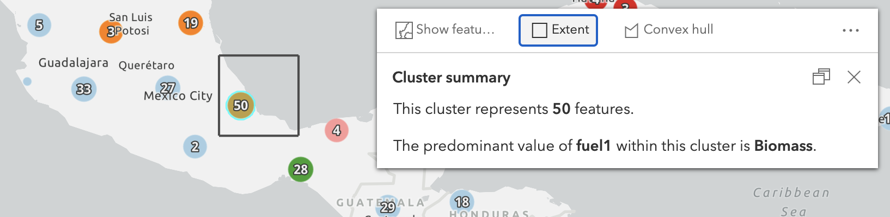
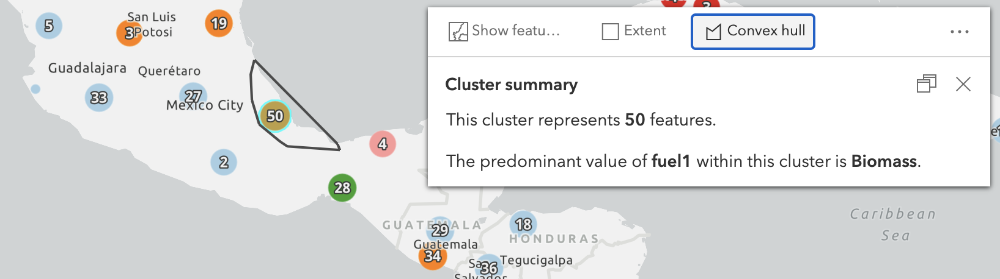
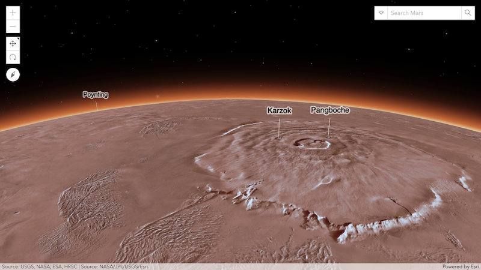

4.18 发布日志 https://developers.arcgis.com/javascript/latest/guide/release-notes

> 4.18开始，旧版 Edge 和 IE11 不再支持。

# 1. ESM（ES6 模块化）(测试版)

官方发布了一个 ES模块化（测试版）的版本，使得与现代第三方框架、开发工具更容易结合。使用新的 npm 包 [@arcgis/core](https://www.npmjs.com/package/@arcgis/core) 即可。安装后，你就能这样导入了：

``` js
import WebMap from '@arcgis/core/WebMap';
import MapView from '@arcgis/core/views/MapView';
```

好处显而易见：

- 简单的代码
- 浏览器原生支持
- 配置简洁化
- 无缝与现代开发框架集成

参阅 [工具介绍](https://developers.arcgis.com/javascript/latest/guide/tooling-intro/) 来学习如何使用新的模块化、如何集成。官方还提供了 [例子](https://github.com/Esri/jsapi-resources/tree/master/esm-samples) 来介绍这些基础概念。

# 2. 高程剖面分析小部件（测试版）

在 MapView 和 SceneView 中均可使用 `ElevationProfile` 小部件来创建高程剖面图。可以交互式地绘制剖面线，也可以手动选择已有的线，以比较地形、建筑等三维物体的高度。该图表使用地表海拔高度来量算，并提供统计信息。


上图例子见：https://developers.arcgis.com/javascript/latest/sample-code/widgets-elevation-profile/index.html

# 3. 查询聚类要素 [例子](https://developers.arcgis.com/javascript/latest/sample-code/featurereduction-cluster-query/index.html)

可以用 `Query` 对象的 `aggregateIds` 属性来从聚类要素中查询空间数据。

① 显示聚类的外边框



② 计算聚类要素的凸壳



③ 显示属于该聚类的所有要素


④ 查询并统计聚类要素的信息


# 4. 三维更新

## 4.1. 上下文感知导航

在地下场景或者相机倾角很大的时候，交互式缩放、平移、旋转通常很难受，会缩放、旋转过度，现在已经大大改善。这个功能的更新改善了交互体验，以更好地预测地下的区域内的物体。尤其是在移动或缩放地下管线、地震点数据时（特别是这些要素的符号通常很细很小）。


## 4.2. 场景图层属性编辑

使用现有的 Editor 小部件或者新的方法 `applyEdits()` 来更新 `SceneLayer` 的属性数据（SceneLayer的种类是 3dObject）。所作的修改会作用于关联的要素图层，但是官方更进一步，会顺便更新 i3s 服务。


## 4.3. 自吸附功能

最新版本的 arcgis jsapi 提供了这个功能的测试版。可以在创建 3d 要素时 自我平行、自我垂直、自我捕捉吸附。

交互式创建具有平行线或者垂直角的几何图形，这对建筑物轮廓描绘或者道路网尤其重要。设置 `SketchViewModel.snappingOptions` 属性来启用此功能。


在 [3D草图](https://developers.arcgis.com/javascript/latest/sample-code/sketch-3d/index.html) 和 [3D要素编辑](https://developers.arcgis.com/javascript/latest/sample-code/widgets-editor-3d/index.html) 例子中尝试这个功能。

## 4.4. 顺序无关透明度

多个具有半透明材质的要素重叠显示时，在旧版本有后者被裁剪掉的问题，现已修复。OIT （order-independent-transparency）技术将所有透明的物体叠在一起，看起来真实。

不仅仅是大型3d半透明要素有效，对使用了 WebStyle 的要素或者透明图标符号的样式也有用，见下图的树木。


## 4.5. 支持火星和月球

最新版的 SceneView 增加了月球、火星两个天体的坐标系统的支持，包括影像图层和高程图层，也可以包括跟天文物体或者影像有关的图层。加载火星或月球坐标系的图层时，globe 的直径和大气层都会自动调整。



## 4.6. 自定义坐标系

现在支持由 WKT 定义的任意坐标系，以在局部场景加载和可视化更多数据集。

# 5. 图层更新

## 5.1. 图层效果

现在，可以对 MapView 下的所有图层应用 `Effects`。这是一个很nb的功能，允许你像 css 的 filter 一样来增强图层效果的显示。通过设置图层的 `effect` 属性来达到这个目的。

现在，支持三种效果：`bloom`（泛光）、`drop-shadow`（阴影）、`blur`（毛边）

下图是毛边效果：


右图中，蓝色区域的边界会模糊掉，以表示不确定性。


## 5.2. 图层过渡效果


## 5.3. 矢量瓦片图层


## 5.4. 流图层


## 5.5. 影像图层


# 6. 小部件更新

## 6.1. 草图（Sketch）小部件


## 6.2. 要素表单（FeatureForm）小部件


## 6.3. 弹窗（Popup）小部件


## 6.4. 打印（Print）小部件


## 6.5. 搜索（Search）小部件


# 7. CIM符号创建器


# 8. 智能制图尺寸主题


# 9. 迭代式遍历集合


# 10. 国际化


# 11. IdentityManager（身份验证器）

略。


# 12. 结束对 IE11和旧版 Edge 的支持


# 13. 新增类、属性、方法、事件


# 14. 废弃类、属性、方法、事件


# 15. 大改进


# 16. bug修复


# 17. 附属的包

使用了 [ArcGIS Arcade 1.12](https://developers.arcgis.com/arcade/guide/release-notes/#version-1.12)


