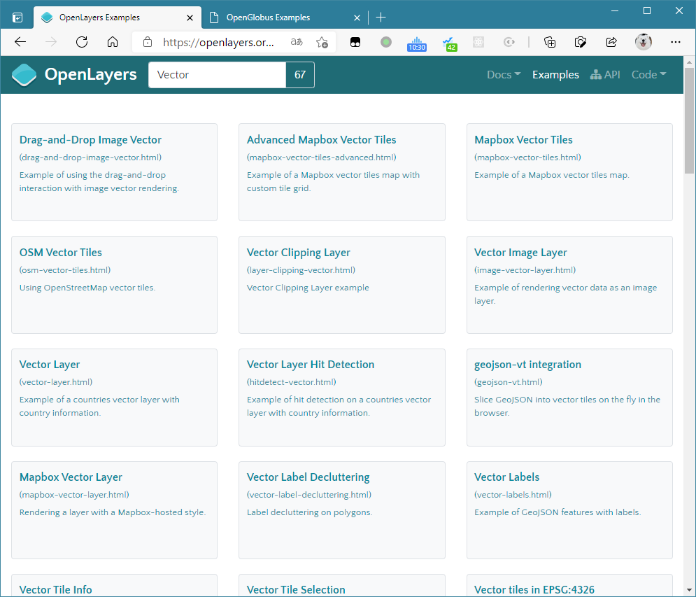

> 代码仓库地址：`https://github.com/openglobus/openglobus`

# 1 简介

`OpenGlobus` 是一个设计用于显示可交互性三维地图、影像瓦片、矢量数据、标注、三维对象的 JavaScript 库。它所用的技术是纯 `WebGL`，完全开源免费。

它的目标是：让三维地图要素更快、更好看，用户友好度拉满并且在有关项目中容易编码实现。

> 笔者注：`OpenGlobus` 的起名，颇有三维界的 `OpenLayers` 意味

# 2 HelloGlobus

很容易能通过 `npm scripts` 中的 `build` 命令打包到一个生产模式的 umd 包，包括两个文件，一个 js 文件，一个 css 文件，写这篇文章时，库版本是 `0.8.5`，所以上最简单的示例代码：

```html
<link rel="stylesheet" href="og-0.8.5.css">
<script src="og-0.8.5.js"></script>

<div id="viewport"></div>
<script>
  const globus = new og.Globe({
    target: 'viewport'
  })
</script>
```

在控制台，键入 `og` 可输出全局对象。

出图大概是这样的效果：


观察控制台的网络请求，不难发现在不添加任何图层、高程数据的时候，它不会发生任何网络图层的请求，也就是说，这个夜光图和背景完全是内置在代码中的静态资源。

# 3 在 Vite 中与 vue3 集成

经测试，`Globe` 对象暂不支持直接传入 `HTMLDivElement`，只能传递一个 id 字符串，所以绑定 DOM ref 的方法行不通。

习惯性把属性作为 vue 组件的 props 的开发者请注意，下列写法虽然可以正确出现地球，但是这样会增加监听负载，一旦将来 globe 上的东西越来越多，WebGL 的帧率将不能保证：

```vue
<template>
  <div id="viewport"></div>
</template>

<script setup>
import * as og from '@openglobus/og' // 发文时，还没有类型定义库 `*.d.ts`，所以暂时只能整体导入，而不能用解构语法
import { onMounted, defineProps, ref } from 'vue'
import '/node_modules/@openglobus/og/css/og.css'

let globe = ref()
onMounted(() => {
  globe = new og.Globe({
    target: 'viewport'
  })
})

defineProps([
  'globe'
])
</script>
```

所以，我建议改成这样：

```vue
<template>
  <div id="viewport"></div>
</template>

<script setup>
import * as og from '@openglobus/og' // 发文时，还没有类型定义库 `*.d.ts`，所以暂时只能整体导入，而不能用解构语法
import { onMounted } from 'vue'
import '/node_modules/@openglobus/og/css/og.css'

let globe = null
onMounted(() => {
  globe = new og.Globe({
    target: 'viewport'
  })
})
</script>
```


# 4 在 Vite 中与 react 集成

这个就简单了：

```jsx
import React, { useEffect } from 'react'
import * as og from '@openglobus/og' // 发文时，还没有类型定义库 `*.d.ts`，所以暂时只能整体导入，而不能用解构语法
import '/node_modules/@openglobus/og/css/og.css'

function App() {
  useEffect(() => {
    const globe = new og.Globe({
      target: 'viewport'
    })
  }, [])
  return <div id="viewport"></div>
}

export default App
```


# 5 示例代码

官网（www.openglobus.org）提供了一些示例代码，足够学习使用，只要知道入口对象是 `Globe` 类即可。


# 6 API风格

不仅库的名字类似 `OpenLayers`，它还在很多 API 命名上“暂时”接近 ol。拿创建 XYZ 图层来说：

```js
const osm = new og.layer.XYZ("OpenStreetMap", {
  isBaseLayer: true, // 是否是底图
  url: "//{s}.tile.openstreetmap.org/{z}/{x}/{y}.png", // url
  visibility: true, // 可见性
  attribution: 'Data @ OpenStreetMap contributors, ODbL' // 声明之类的字符串
});
```

和 `OpenLayers` 的比较：

```js
const xyzSource = new ol.source.XYZ({
  url: `https://{a-c}.tile.thunderforest.com/cycle/{z}/{x}/{y}.png?apikey=Your API key from http://www.thunderforest.com/docs/apikeys/ here`,
})
```

以及 Vector 图层：

```js
const markerLayer = new og.layer.Vector("Markers", {
  clampToGround: true
})
```

在 ol 也有类似的 API 名称。

更有趣的是，当前的示例代码页面和 `ol 6.5` 的示例代码页面极为相似：

|                              og                              |                              ol                              |
| :----------------------------------------------------------: | :----------------------------------------------------------: |
|  |  |

更别提 API 帮助文档了，我怀疑是用的同一个母模板。

# 7 目前已完成的功能（截至发文时）

## 基本数据加载功能

- GeoJson 数据加载
- 静态图片加载（并支持拖拽调整其四个角的位置）
- 地形服务加载（Mapbox的地形服务、GeoServer的Bil格式地形服务等），支持垂直夸大
- GeoServer WMS 加载
- Canvas瓦片加载（Canvas作为一层直接贴到地球表面）
- 广告牌加载（类似于精灵？），支持贴地
- 视频纹理
- 基本矢量图形绘制（polylines、marker、circle、ray等），marker支持交互式拖拽移动


## 界面定制与交互功能

- 支持自定义控件（类继承形式实现，且暂时只能用原生 DOM）
- 支持 Popup（弹窗），弹窗样式比较丑，虽然支持背面剔除，但是它的更新坐标的机制感觉和 Cesium 自定义气泡差不多... 都是监听事件改变 DOM 的坐标
- 支持图层切换控件（尽管现在还很丑）
- 支持鼠标滑过（mousemove）、左键单击（lclick）等基本事件，也支持禁用事件
- 支持相机飞行动画


## 渲染器及渲染效果相关功能

- 提供时钟（儒略日期、UTC等均支持）
- 内置简单的数学库
- 图层透明度设置
- 支持简易太阳光
- 支持假性半透明颜色覆盖


复杂的需求肯定达不到（例如将视频完整地贴合复杂模型等），毕竟才发布不久。


# 8 提供原生 WebGL 接口

在 `GeoTexture2d` 例子中，就出现了与底层 WebGL 几乎完全一致的代码，例如 fbo、program、uniforms、attributes 等，也支持自定义的着色器代码，意味着应该是有底层的能力的。


# 9 展望未来

它创建于 2018 年，但是在 GitHub 上是今年 3 月才活跃起来的，官网列举此库的特点如下：

## 图层支持

- WMS、WMTS
- 标签和广告牌
- 矢量图层：线与面类型
- 静态覆盖图层：支持静态图片、视频、WebGL FBO
- 自定义 canvas 瓦片图层
- GeoJSON图层
- 其他

## 默认控件

- 缩放按钮
- 经纬度坐标提示
- 图层切换
- 太阳位置控件
- 指北针
- 交互式导航（即鼠标键盘控制）

## 引擎的性能表现

- 纯 WebGL 实现渲染器
- 支持多地球实例
- 单 WebGlProgram（不太确定）
- 内置时钟，即时渲染
- 支持事件：draw、click、mouseenter等
- 支持图层、对象的拾取
- LOD控制
- 舒适的交互体验
- 无依赖！

## 三维可视化

- 支持多种高程数据源
- 柔和的灯光
- 自定义天空盒
- 图层外观支持自定义：光参数、高度调整、透明度、可见范围等
- 轴对齐的广告牌和标签
- 即将支持：3dTiles、大气散射效果、glTF模型


若再迭代十几个版本，那是非常值得期待的，毕竟它的 API 更接近 GIS 风格。

但是，现在国内的需求更接近局部展示而不是全球范围展示，能不能被国内的piao客们青睐，还要再等等。