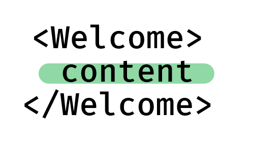

# 使用装饰器模式实现一般组件特殊化


这里，其实就是把  `Dialog` 套进 `WelcomeDialog` 里面，修改 `Dialog` 的 props，以达成 `Dialog` 的特殊化。

# 使用类似 vue 的插槽机制填充组件的 content

组件的 content 实际上是这样的：



每一个组件的 props 都有一个特殊的属性：`props.children`，它是一个数组，每个数组元素是该组件 content 内的子组件。

如果 content 里包括文字，那么每一行文字作为字符串存在于 children 中。

如果 content 里包括 React 大括号表达式，则计算结果作为元素存于 children 中。

如果 content 里包括原生的 HTML 标签或 React 组件，则会生成一个 React Element。

**那么，只需在定义组件的时候，展开这个数组即可完成提前占坑操作：**

```JSX
function Welcome(props) {
    return <div>
        {...props.children}
    </div>
}
```

## 当然，也可以不通过children，直接把组件对象挂在 props 上

``` JSX
function Root(props) {
    return <Welcome leftDom={<h2>hi</h2>}>
    </Welcome>
}
```

这里，Welcome 组件的 props 就有了一个 `leftDom` 组件，可以直接当组件使用。

