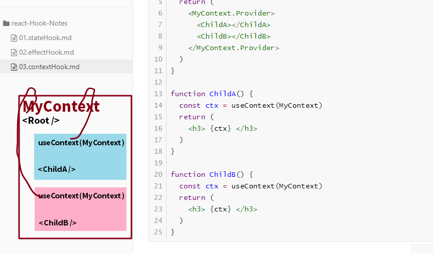

当你使用类组件的 Context：

``` JSX
import React, { Component } from 'react'

const MyContext = React.createContext('context-default-value')
class App extends Component {
	render() {
    return (
      <MyContext.Provider>
	    	<ChildA></ChildA> 
	    	<ChildB></ChildB> 
      </MyContext.Provider>
    )
  }
}

class ChildA extends Component {
  static contextType = MyContext
	render() {
    return (
    	<h3> {this.context} </h3>
    )
  }
}

class ChildB extends Component {
  static contextType = MyContext
	render() {
    return (
    	<h3> {this.context} </h3>
    )
  }
}

/*
乍看在 ChildA 和 ChildB 之间共享状态，用 props 传值也可以实现
但是如果还要继续往 ChildA 或 ChildB 的子组件共享，即并不是兄弟组件也不是嫡系组件共享时
Context 就有用了，凡是被 Context 包裹住的，都能拿到 Context 的值
*/
```

当你使用 context Hook 完成状态共享（注意，不是状态传递，Context主要的任务并不是传递状态）

``` JSX
import React, { Component, useContext } from 'react'

const MyContext = React.createContext('context-default-value')
function App() {
  return (
    <MyContext.Provider>
    	<ChildA></ChildA>
    	<ChildB></ChildB>
    </MyContext.Provider>
  )
}

function ChildA() {
  const ctx = useContext(MyContext)
  return (
    <h3> {ctx} </h3>
  )
}

function ChildB() {
  const ctx = useContext(MyContext)
  return (
    <h3> {ctx} </h3>
  )
}
```

# 图解 Context 的作用

