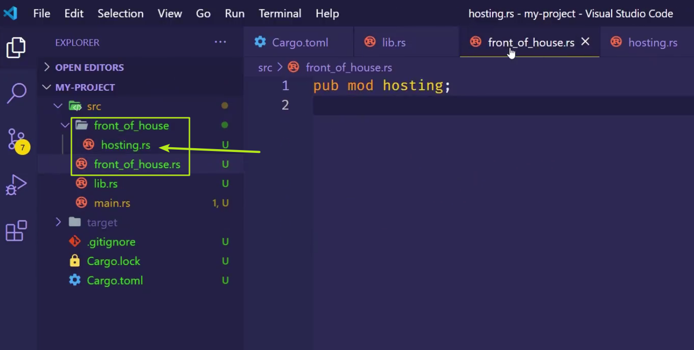

绝对路径：从 `crate` 这个东西开始一级一级往下 `::`

相对路径：使用 super 和 self 开始找。

# `src/lib.rs`

``` rust
mod front_of_house {
  pub mod hosting {
    pub fn add_to_waitlist() {}
  }
}

pub fn eat_at_restaurant() {
  // 绝对路径，从 crate 开始向下找
  crate::front_of_house::hosting::add_to_waitlist();
  // 相对路径
  front_of_house::hosting::add_to_waitlist();
}
```

此处兄弟是可以互见的，即 `mod front_of_house` 和 `fn eat_at_restaurant()`

# super关键字


# 外部文件写mod

