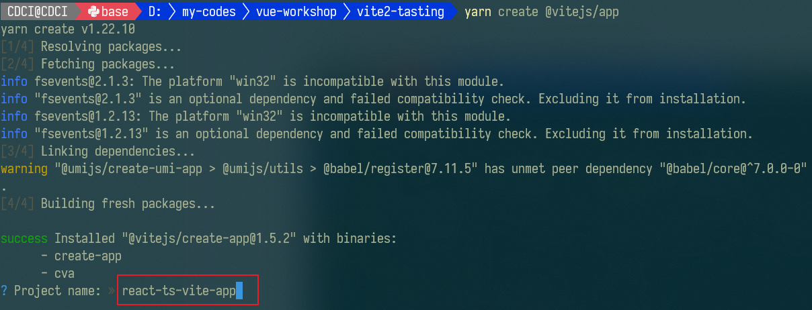
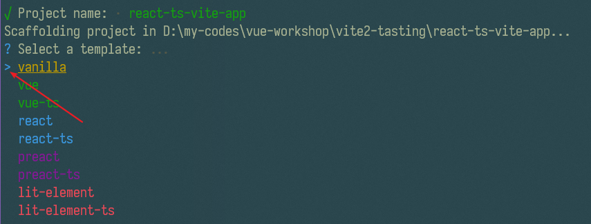

# 控制台引导交互式项目创建

使用 yarn 或 npm 均可，在这用 yarn 来创建。

``` shell
npm init @vitejs/app
```

``` shell
yarn create @vitejs/app
```

## 输入项目名

如下图所示：




## 上下键选择项目模板




## 安装依赖

``` shell
cd ./<你刚刚填的项目名> # 进入项目目录
yarn # 或 npm install
```

react-ts 的依赖下载也是非常的快，只用了 4.77 秒（可能跟我的 yarn 提前缓存有关）。

## 启动项目（开发热更新模式）

``` SHELL
yarn dev # 或 npm run dev
```


# 依赖

模板是标准的 react，2021年2月5日 使用 vite2.0 创建 react-ts 项目用的是 `"react": "^17.0.0"` 版本。


# vite.config.ts

依旧很短很精炼：

``` ts
import reactRefresh from '@vitejs/plugin-react-refresh'
import { defineConfig } from 'vite'

// https://vitejs.dev/config/
export default defineConfig({
  plugins: [reactRefresh()]
})
```

# npm script 命令

与 vue-ts 大体相同


# typescript 配置

和 vue 明显不同的是，jsx 项的值是 "react"


# 程序入口文件：`./src/main.tsx`

从名字上就一股 react 味了

看代码：

``` tsx
import React from 'react'
import ReactDOM from 'react-dom'
import './index.css'
import App from './App'

ReactDOM.render(
  <React.StrictMode>
    <App />
  </React.StrictMode>,
  document.getElementById('root')
)
```

