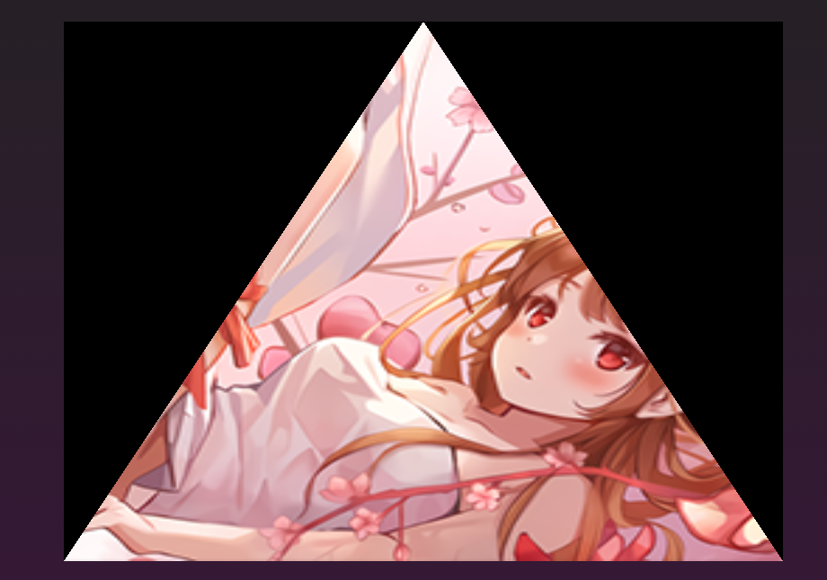

> 代码见：https://github.com/onsummer/my-dev-notes/tree/master/webgpu-Notes/04-texture-triangle
> 原创，发布日 2021年4月5日，更新日 2021年5月6日，@秋意正寒。若代码失效请留言，或自行到官网根据最新 API 修改。



# 数据预览

NDC 坐标和 纹理坐标（原点、朝向、值域）基础不再补充。

## 0.1 VBO

``` js
const vbodata = new Float32Array([
  -1.0, -1.0, 0.0, 1.0,
  0.0, 1.0, 0.5, 0.0,
  1.0, -1.0, 1.0, 1.0
])
```

## 0.2 贴图

一张 256 x 256 的 webp 贴图。


# 1 纹理与采样器

使用采样器在纹理贴图上，通过纹理坐标取顶点的颜色值，这是一个很常规的操作。

## 1.1 创建采样器、纹理

``` js
/* create sampler */
const sampler = device.createSampler({
  minFilter: "linear",
  magFilter: "linear"
})

/* --- create img source --- */
const img = document.createElement('img')
img.src = 'texture.png'
// 用 await 代表这个操作必须在 async 函数中，或者在 html 中提前做好 img 标签并加载纹理贴图
await img.decode()
const imageBitmap = await createImageBitmap(img)

/* create texture */
const texture = device.createTexture({
  size: [img.width, img.height], // 256, 256 -> 2d的纹理
  format: "rgba8unorm",
  usage: GPUTextureUsage.SAMPLED | GPUTextureUsage.COPY_DST
})
```

## 1.2 将纹理贴图数据 填入 纹理对象

我在文档中看到有两个方法，一个是 `GPUQueue.prototype.writeToTexture()`，另一个是下面这个 `GPUQueue.prototype.copyImageBitmapToTexture()`：

``` js
device.queue.copyImageBitmapToTexture(
  { imageBitmap: imageBitmap },
  { texture: texture },
  [img.width, img.height, 1]
)
```

至此，采样器、纹理对象都准备好了，纹理数据也写入纹理对象中了。

# 2 将纹理对象、采样器对象传进流水线（Pipeline）

要向渲染通道传递纹理和采样器，必须创建一个 “Pipeline布局” 对象。
这个布局对象要对纹理对象、采样器对象进行绑定。在 WebGPU 中，将诸如 uniform变量、采样器、纹理对象 等资源统一打组，这个组叫 `GPUBindGroup`。
它们的关系图大概是这样的：


上代码：

``` js
/* 创建绑定组的布局对象 */
const bindGroupLayout = device.createBindGroupLayout({
  entries: [
    {
      /* use for sampler */
      binding: 0,
      visibility: GPUShaderStage.FRAGMENT,
      sampler: {
        type: 'filtering',
      },
    },
    {
      /* use for texture view */
      binding: 1,
      visibility: GPUShaderStage.FRAGMENT,
      texture: {
        sampleType: 'float'
      }
    }
  ]
})
/* 创建 Pipeline 的布局对象 */
const pipelineLayout = device.createPipelineLayout({
  bindGroupLayouts: [bindGroupLayout],
})
```

``` js
/* 创建 pipeline 时，传递 Pipeline 的布局对象 */
const pipeline = device.createRenderPipeline({
  layout: pipelineLayout, // <- 传递布局对象
  // ... 其他
})
```

``` js
/* 创建绑定组：GPUBindGroup，一组资源 */
const uniformBindGroup = device.createBindGroup({
  layout: pipeline.getBindGroupLayout(0), // <- 指定绑定组的布局对象
  entries: [
    {
      binding: 0,
      resource: sampler, // <- 传入采样器对象
    },
    {
      binding: 1,
      resource: texture.createView() // <- 传入纹理对象的视图
    }
  ]
})
```

# 3 修改着色器

光将采样器、纹理对象传入流水线还是不够的，在顶点着色器阶段、片元着色器阶段，仍需要把颜色给弄到。

## 3.1 顶点着色器
``` wgsl
[[builtin(position)]] var<out> out_position: vec4<f32>;
[[location(0)]] var<out> out_st: vec2<f32>; // <- 输出纹理坐标到下一阶段，即片元着色器

[[location(0)]] var<in> in_position_2d: vec2<f32>;
[[location(1)]] var<in> in_st: vec2<f32>; // <- 从 GPUBuffer 中获取的纹理坐标

[[stage(vertex)]]
// 注意这个主函数被改为 vertex_main，在创建流水线时，要改 entryPoint 属性为 'frag_main'
fn vertex_main() -> void {
  out_position = vec4<f32>(in_position_2d, 0.0, 1.0);
  out_uv = in_st;
  return;
}
```

## 3.2 片元着色器

``` wgsl
// 从绑定组i里取绑定的资源j的语法是 [[binding(j), group(i)]]
[[binding(0), group(0)]] var mySampler: sampler; // <- 采样器对象
[[binding(1), group(0)]] var myTexture: texture_2d<f32>; // <- 纹理对象

[[location(0)]] var<out> outColor: vec4<f32>;

[[location(0)]] var<in> in_st: vec2<f32>; // 从顶点着色器里传递进来的纹理坐标

[[stage(fragment)]]
// 注意这个主函数被改为 frag_main，在创建流水线时，要改 entryPoint 属性为 'frag_main'
fn frag_main() -> void {
  outColor = textureSample(myTexture, mySampler, in_st); // 使用 textureSample 内置函数获取对应纹理坐标的颜色
  return;
}
```

# 4 渲染通道编码器传入资源

即把绑定组传入对象传入即可。

``` js
passEncoder.setBindGroup(0, uniformBindGroup)
```

# 踩坑点

不要设置流水线中 `primitive` 属性的 `cullMode` 属性值为 `"back"`，否则会背面剔除。

``` js
const pipeline = device.createRenderPipeline({
  // ...
  primitive: {
    topology: 'triangle-list',
    cullMode: 'back', // <- 如果设为 back 三角形就不见了
  }
  // ...
})
```